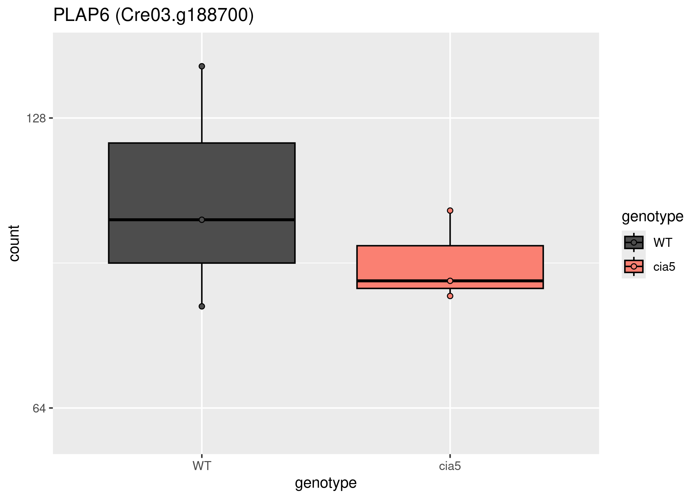
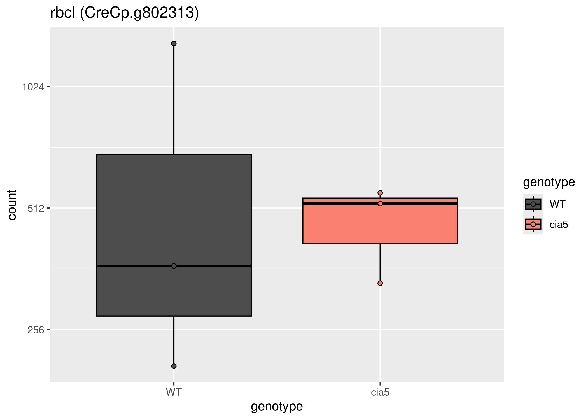

RNAseq cia5 results
================
Kelterborn
2024-04-16

- [0. Prepare System](#0-prepare-system)
  - [-R_libraries](#-r_libraries)
  - [-R_folders](#-r_folders)
- [1. Load data](#1-load-data)
  - [- Plot counts](#--plot-counts)
- [2. Results](#2-results)

# 0. Prepare System

BiocManager::install()

## -R_libraries

``` r
library(stringr)
library(R.utils)
library(RColorBrewer)
library(sessioninfo)
library(data.table)
library(plyr)
library(tidyverse)
library(tximeta)
library(tximport)
library(curl)
library(AnnotationHub)
library(DESeq2)
library(EnhancedVolcano)
library(pheatmap)
library(writexl)
library(biomaRt)
library(ape)
library(kableExtra)
library(knitr)

library(stringr)
library(R.utils)
library(RColorBrewer)

library(sessioninfo)
library(data.table)
library(plyr)
library(tidyverse)
library(tximeta)
library(tximport)
library(curl)
library(DESeq2)

library(SummarizedExperiment)
library(GenomicRanges)
library(ape)

library(viridis)
library(patchwork)
library("ggpubr")
library(vsn)
library(stringr)
library(R.utils)
library(RColorBrewer)
library(PCAtools)

# library(wget)
```

## -R_folders

``` r
ifelse(Sys.info()["sysname"]== "Linux",
       s <- "/mnt/s",
       s <- "S:")
```

    ##  sysname 
    ## "/mnt/s"

``` r
dir <- paste(s,"AG/AG-Scholz-NGS/Daten/Simon/Chlamy_RNASeq_aCRY",sep="/")
list.files(dir) %>% head()
```

    ## [1] "anno.RDS"               "dds_acry.RDS"           "dds_cia5.RDS"          
    ## [4] "dds.RDS"                "fastq"                  "git_Chlamy_RNAseq_aCRY"

``` r
gitdir <- paste(dir,"git_Chlamy_RNAseq_aCRY",sep="/")
list.files(gitdir) %>% head()
```

    ## [1] "1_data_processing"            "2_A_Results_cia5"            
    ## [3] "git_Chlamy_RNAseq_aCRY.Rproj" "graphs"                      
    ## [5] "README.md"                    "Rplot.pdf"

``` r
fastqdir <- paste(dir,"fastq",sep="/")
list.files(fastqdir) %>% tail()
```

    ## [1] "Unknown_BU327-002T0029_1.fq.gz" "Unknown_BU327-002T0029_2.fq.gz"
    ## [3] "Unknown_BU327-002T0030_1.fq.gz" "Unknown_BU327-002T0030_2.fq.gz"
    ## [5] "Unknown_BU327-002T0031_1.fq.gz" "Unknown_BU327-002T0031_2.fq.gz"

``` r
fastqdir2 <- paste(s,"AG/AG-Scholz-NGS/Daten/Simon/P3044/fastq/",sep="/")
list.files(fastqdir2) %>% head()
```

    ## [1] "P3044_RNA_01_S20_L005_R1_001.fastq.gz"    
    ## [2] "P3044_RNA_01_S20_L005_R1_001.fastq.gz.md5"
    ## [3] "P3044_RNA_01_S20_L005_R2_001.fastq.gz"    
    ## [4] "P3044_RNA_01_S20_L005_R2_001.fastq.gz.md5"
    ## [5] "P3044_RNA_02_S21_L005_R1_001.fastq.gz"    
    ## [6] "P3044_RNA_02_S21_L005_R1_001.fastq.gz.md5"

``` r
indexDir <- paste(s,"AG/AG-Scholz-NGS/Daten/Simon/linux-ngs/salmon/salmon_index_chlamy/chlamy_index_v6.1",sep="/")

fastaPath <- file.path(s,"AG/AG-Scholz-NGS/Daten/Simon/linux-ngs/salmon/salmon_index_chlamy/Phytozone_v6.1/CreinhardtiiCC_4532_707_v6.0.hardmasked.fa.gz")
head(readLines(fastaPath,n=10))
```

    ## [1] ">chromosome_01"                                              
    ## [2] "NNNNNNNNNNNNNNNNNNNNNNNNNNNNNNNNNNNNNNNNNNNNNNNNNNNNNNNNNNNN"
    ## [3] "NNNNNNNNNNNNNNNNNNNNNNNNNNNNNNNNNNNNNNNNNNNNNNNNNNNNNNNNNNNN"
    ## [4] "NNNNNNNNNNNNNNNNNNNNNNNNNNNNNNNNNNNNNNNNNNNNNNNNNNNNNNNNNNNN"
    ## [5] "NNNNNNNNNNNNNNNNNNNNNNNNNNNNNNNNNNNNNNNNNNNNNNNNNNNNNNNNNNNN"
    ## [6] "NNNNNNNNNNNNNNNNNNNNNNNNNNNNNNNNNNNNNNNNNNNNNNNNNNNNNNNNNNNN"

``` r
gtfPath <- file.path(s,"AG/AG-Scholz-NGS/Daten/Simon/linux-ngs/salmon/salmon_index_chlamy/Phytozone_v6.1/CreinhardtiiCC_4532_707_v6.1.gene.gff3.gz")
readLines(gtfPath,n=10)
```

    ##  [1] "##gff-version 3"                                                                                                                                                                        
    ##  [2] "##assembly-version v6.0"                                                                                                                                                                
    ##  [3] "##assembly-site JGI"                                                                                                                                                                    
    ##  [4] "##annot-version v6.1"                                                                                                                                                                   
    ##  [5] "##annot-site JGI"                                                                                                                                                                       
    ##  [6] "##species Chlamydomonas reinhardtii CC-4532"                                                                                                                                            
    ##  [7] "chromosome_01\tphytozomev13\tgene\t27912\t34257\t.\t+\t.\tID=Cre01.g000050_4532.v6.1;Name=Cre01.g000050_4532;associated_locus=4532_01_00005"                                            
    ##  [8] "chromosome_01\tphytozomev13\tmRNA\t27912\t34257\t.\t+\t.\tID=Cre01.g000050_4532.1.v6.1;Name=Cre01.g000050_4532.1;pacid=52525454;longest=1;geneName=RWP14;Parent=Cre01.g000050_4532.v6.1"
    ##  [9] "chromosome_01\tphytozomev13\tfive_prime_UTR\t27912\t28050\t.\t+\t.\tID=Cre01.g000050_4532.1.v6.1.five_prime_UTR.1;Parent=Cre01.g000050_4532.1.v6.1;pacid=52525454"                      
    ## [10] "chromosome_01\tphytozomev13\tCDS\t28051\t32030\t.\t+\t0\tID=Cre01.g000050_4532.1.v6.1.CDS.1;Parent=Cre01.g000050_4532.1.v6.1;pacid=52525454"

``` r
quantdir <- paste(dir,"quants",sep="/")
```

# 1. Load data

``` r
load(file=paste(dir,"dds_cia5.RDS", sep="/"))
load(paste(dir,"anno.RDS",sep="/"))
```

### - Plot counts

#### – cia5 & rbcs

    ##                   locusName_4532 initial_v6_locus_ID action
    ## Cre01.g030350 Cre01.g030350_4532         Cr_01_03240       
    ## Cre01.g049000 Cre01.g049000_4532         Cr_01_05123       
    ## Cre04.g229300 Cre04.g229300_4532         Cr_04_22809       
    ## Cre06.g261750 Cre06.g261750_4532         Cr_06_26494       
    ## Cre06.g308450 Cre06.g308450_4532         Cr_06_32342       
    ## Cre07.g339000 Cre07.g339000_4532         Cr_07_35683       
    ## Cre17.g718950 Cre17.g718950_4532         Cr_17_79564       
    ## CreCp.g802313 CreCp.g802313_4532         Cr_Cp_91926    ADD
    ##               Replacement_v5.v6._model geneSymbol strainLocusId
    ## Cre01.g030350                              RBCX2A 4532_01_03576
    ## Cre01.g049000                                RAF2 4532_01_05651
    ## Cre04.g229300                                RCA1 4532_04_25231
    ## Cre06.g261750                               RBMP1 4532_06_29305
    ## Cre06.g308450                                RAF1 4532_06_35755
    ## Cre07.g339000                              RBCX2B 4532_07_39421
    ## Cre17.g718950                                RCA2 4532_17_88015
    ## CreCp.g802313                                rbcL 4532_Cp_91926
    ##                                     PMID             previousIdentifiers
    ## Cre01.g030350          26305355#21515685         CGL41#CrRbcXIIa#g688.t1
    ## Cre01.g049000                   21515685            PTD1#CGL31#g1087.t1#
    ## Cre04.g229300          14605215#16667924                        g5019.t1
    ## Cre06.g261750          28938113#28781053                   BES3#g5882.t1
    ## Cre06.g308450 33625514#32636267#32451445                       g7140.t1#
    ## Cre07.g339000                   26305355              CrRbcXIIb#g7885.t1
    ## Cre17.g718950                                                 #g17398.t1
    ## CreCp.g802313  6302265#29172250#28985404 CreCp.g007100#2717040#ChreCp049
    ##                                             Description
    ## Cre01.g030350                         RuBisCO chaperone
    ## Cre01.g049000 RuBisCO assembly chaperone, chloroplastic
    ## Cre04.g229300         RuBisCO activase 1, chloroplastic
    ## Cre06.g261750        RuBisCO binding membrane protein 1
    ## Cre06.g308450             RuBisCO accumulation factor 1
    ## Cre07.g339000                         RuBisCO chaperone
    ## Cre17.g718950             RuBisCO activase-like protein
    ## CreCp.g802313                    RuBisCO large subunit



# 2. Results

``` r
resultsNames(dds)
```

    ## [1] "Intercept"           "genotype_cia5_vs_WT"

``` r
res <- results(dds,contrast = c("genotype","cia5","WT"))
res["Cre03.g188700",]
```

    ## log2 fold change (MLE): genotype cia5 vs WT 
    ## Wald test p-value: genotype cia5 vs WT 
    ## DataFrame with 1 row and 6 columns
    ##                baseMean log2FoldChange     lfcSE      stat    pvalue      padj
    ##               <numeric>      <numeric> <numeric> <numeric> <numeric> <numeric>
    ## Cre03.g188700   99.4652      -0.258431  0.272107 -0.949742  0.342244  0.445166

``` r
sessionInfo()
```

    ## R version 4.3.3 (2024-02-29)
    ## Platform: x86_64-pc-linux-gnu (64-bit)
    ## Running under: Ubuntu 22.04.4 LTS
    ## 
    ## Matrix products: default
    ## BLAS/LAPACK: /opt/intel/oneapi/mkl/2024.0/lib/libmkl_rt.so.2;  LAPACK version 3.10.1
    ## 
    ## locale:
    ##  [1] LC_CTYPE=de_DE.UTF-8       LC_NUMERIC=C              
    ##  [3] LC_TIME=de_DE.UTF-8        LC_COLLATE=de_DE.UTF-8    
    ##  [5] LC_MONETARY=de_DE.UTF-8    LC_MESSAGES=de_DE.UTF-8   
    ##  [7] LC_PAPER=de_DE.UTF-8       LC_NAME=C                 
    ##  [9] LC_ADDRESS=C               LC_TELEPHONE=C            
    ## [11] LC_MEASUREMENT=de_DE.UTF-8 LC_IDENTIFICATION=C       
    ## 
    ## time zone: Europe/Berlin
    ## tzcode source: system (glibc)
    ## 
    ## attached base packages:
    ## [1] stats4    stats     graphics  grDevices utils     datasets  methods  
    ## [8] base     
    ## 
    ## other attached packages:
    ##  [1] PCAtools_2.14.0             vsn_3.70.0                 
    ##  [3] ggpubr_0.6.0                patchwork_1.2.0            
    ##  [5] viridis_0.6.5               viridisLite_0.4.2          
    ##  [7] knitr_1.46                  kableExtra_1.4.0           
    ##  [9] ape_5.7-1                   biomaRt_2.58.2             
    ## [11] writexl_1.5.0               pheatmap_1.0.12            
    ## [13] EnhancedVolcano_1.20.0      ggrepel_0.9.5              
    ## [15] DESeq2_1.42.1               SummarizedExperiment_1.32.0
    ## [17] Biobase_2.62.0              MatrixGenerics_1.14.0      
    ## [19] matrixStats_1.2.0           GenomicRanges_1.54.1       
    ## [21] GenomeInfoDb_1.38.8         IRanges_2.36.0             
    ## [23] S4Vectors_0.40.2            AnnotationHub_3.10.1       
    ## [25] BiocFileCache_2.10.2        dbplyr_2.5.0               
    ## [27] BiocGenerics_0.48.1         curl_5.2.1                 
    ## [29] tximport_1.30.0             tximeta_1.20.3             
    ## [31] lubridate_1.9.3             forcats_1.0.0              
    ## [33] dplyr_1.1.4                 purrr_1.0.2                
    ## [35] readr_2.1.5                 tidyr_1.3.1                
    ## [37] tibble_3.2.1                ggplot2_3.5.0              
    ## [39] tidyverse_2.0.0             plyr_1.8.9                 
    ## [41] data.table_1.15.4           sessioninfo_1.2.2          
    ## [43] RColorBrewer_1.1-3          R.utils_2.12.3             
    ## [45] R.oo_1.26.0                 R.methodsS3_1.8.2          
    ## [47] stringr_1.5.1              
    ## 
    ## loaded via a namespace (and not attached):
    ##   [1] later_1.3.2                   BiocIO_1.12.0                
    ##   [3] bitops_1.0-7                  filelock_1.0.3               
    ##   [5] preprocessCore_1.64.0         XML_3.99-0.16.1              
    ##   [7] lifecycle_1.0.4               rstatix_0.7.2                
    ##   [9] lattice_0.22-5                ensembldb_2.26.0             
    ##  [11] backports_1.4.1               magrittr_2.0.3               
    ##  [13] limma_3.58.1                  rmarkdown_2.26               
    ##  [15] yaml_2.3.8                    httpuv_1.6.15                
    ##  [17] cowplot_1.1.3                 DBI_1.2.2                    
    ##  [19] abind_1.4-5                   zlibbioc_1.48.2              
    ##  [21] AnnotationFilter_1.26.0       RCurl_1.98-1.14              
    ##  [23] rappdirs_0.3.3                GenomeInfoDbData_1.2.11      
    ##  [25] irlba_2.3.5.1                 dqrng_0.3.2                  
    ##  [27] DelayedMatrixStats_1.24.0     svglite_2.1.3                
    ##  [29] codetools_0.2-19              DelayedArray_0.28.0          
    ##  [31] xml2_1.3.6                    tidyselect_1.2.1             
    ##  [33] farver_2.1.1                  ScaledMatrix_1.10.0          
    ##  [35] GenomicAlignments_1.38.2      jsonlite_1.8.8               
    ##  [37] systemfonts_1.0.6             tools_4.3.3                  
    ##  [39] progress_1.2.3                Rcpp_1.0.12                  
    ##  [41] glue_1.7.0                    gridExtra_2.3                
    ##  [43] SparseArray_1.2.4             xfun_0.43                    
    ##  [45] withr_3.0.0                   BiocManager_1.30.22          
    ##  [47] fastmap_1.1.1                 fansi_1.0.6                  
    ##  [49] rsvd_1.0.5                    digest_0.6.35                
    ##  [51] timechange_0.3.0              R6_2.5.1                     
    ##  [53] mime_0.12                     colorspace_2.1-0             
    ##  [55] RSQLite_2.3.6                 utf8_1.2.4                   
    ##  [57] generics_0.1.3                rtracklayer_1.62.0           
    ##  [59] prettyunits_1.2.0             httr_1.4.7                   
    ##  [61] S4Arrays_1.2.1                pkgconfig_2.0.3              
    ##  [63] gtable_0.3.4                  blob_1.2.4                   
    ##  [65] XVector_0.42.0                htmltools_0.5.8.1            
    ##  [67] carData_3.0-5                 ProtGenerics_1.34.0          
    ##  [69] scales_1.3.0                  png_0.1-8                    
    ##  [71] rstudioapi_0.16.0             reshape2_1.4.4               
    ##  [73] tzdb_0.4.0                    rjson_0.2.21                 
    ##  [75] nlme_3.1-163                  cachem_1.0.8                 
    ##  [77] BiocVersion_3.18.1            parallel_4.3.3               
    ##  [79] AnnotationDbi_1.64.1          restfulr_0.0.15              
    ##  [81] pillar_1.9.0                  grid_4.3.3                   
    ##  [83] vctrs_0.6.5                   promises_1.3.0               
    ##  [85] car_3.1-2                     BiocSingular_1.18.0          
    ##  [87] beachmat_2.18.1               xtable_1.8-4                 
    ##  [89] evaluate_0.23                 GenomicFeatures_1.54.4       
    ##  [91] cli_3.6.2                     locfit_1.5-9.9               
    ##  [93] compiler_4.3.3                Rsamtools_2.18.0             
    ##  [95] rlang_1.1.3                   crayon_1.5.2                 
    ##  [97] ggsignif_0.6.4                affy_1.80.0                  
    ##  [99] stringi_1.8.3                 BiocParallel_1.36.0          
    ## [101] munsell_0.5.1                 Biostrings_2.70.3            
    ## [103] lazyeval_0.2.2                Matrix_1.6-5                 
    ## [105] hms_1.1.3                     sparseMatrixStats_1.14.0     
    ## [107] bit64_4.0.5                   KEGGREST_1.42.0              
    ## [109] statmod_1.5.0                 shiny_1.8.1.1                
    ## [111] highr_0.10                    interactiveDisplayBase_1.40.0
    ## [113] broom_1.0.5                   memoise_2.0.1                
    ## [115] affyio_1.72.0                 bit_4.0.5
