RNAseq aCRY pCRY data dive
================
Kelterborn
2024-04-19

- [Load System](#load-system)
  - [-R_libraries](#-r_libraries)
  - [-R_folders](#-r_folders)
- [1. Load aCRY & pCRY](#1-load-acry--pcry)
  - [- Tximeta files](#--tximeta-files)
  - [Run Deseq2](#run-deseq2)
- [2. Pre-Analysis](#2-pre-analysis)
  - [- Data transformations](#--data-transformations)
  - [- Check sample distance](#--check-sample-distance)
  - [- Perform principal component
    analysis](#--perform-principal-component-analysis)
- [3. Results](#3-results)
  - [Colors](#colors)
  - [Plot Counts](#plot-counts)
- [—————————](#section)
- [COPY & PASTE from pCRY](#copy--paste-from-pcry)
  - [Make results](#make-results)
    - [combine L2FC with padj](#combine-l2fc-with-padj)
  - [Colours](#colours)
  - [PCA (Panel B)](#pca-panel-b)
  - [Counts](#counts)
  - [Volcanos](#volcanos)
    - [dark](#dark)
    - [blue](#blue)
    - [red](#red)
    - [all](#all)
  - [Heatmap](#heatmap)
    - [plot heatmap](#plot-heatmap)
    - [Complex Heatmap](#complex-heatmap)
- [Export](#export)

BiocManager::install(“ggalt”) \# , type=“source”

# Load System

## -R_libraries

``` r
library(PCAtools)
library(stringr)
library(R.utils)
library(RColorBrewer)
library(sessioninfo)
library(data.table)
library(plyr)
library(tidyverse)
library(tximeta)
library(tximport)
library(curl)
library(AnnotationHub)
library(DESeq2)
library(EnhancedVolcano)
library(pheatmap)
library(writexl)
library(biomaRt)
library(ape)
library(kableExtra)
library(knitr)

library(stringr)
library(R.utils)
library(RColorBrewer)

library(sessioninfo)
library(data.table)
library(plyr)
library(tidyverse)
library(tximeta)
library(tximport)
library(curl)
library(DESeq2)

library(SummarizedExperiment)
library(GenomicRanges)
library(ape)

library(viridis)
library(patchwork)
library(ggpubr)
library(vsn)
library(stringr)
library(R.utils)
library(RColorBrewer)


# library(wget)
```

## -R_folders

``` r
# Linux Workstation
ifelse(Sys.info()["sysname"]== "Linux",
       s <- "/mnt/s",
    ifelse(Sys.info()["sysname"]== "Darwin",
       s <- "/mnt/s",
       s <- "S:"))
```

    ##  sysname 
    ## "/mnt/s"

``` r
dir <- paste(s,"AG/AG-Scholz-NGS/Daten/Simon/Chlamy_RNASeq_aCRY",sep="/")
# list.files(dir) %>% head()
gitdir <- paste(dir,"git_Chlamy_RNAseq_aCRY",sep="/")
# list.files(gitdir) %>% head()

# Macbook
scriptdir <- rstudioapi::getSourceEditorContext()$path
gitdir <- scriptdir %>% dirname() %>% dirname()
dir <- "/Users/simonkelterborn/Library/CloudStorage/OneDrive-Charité-UniversitätsmedizinBerlin/NGS (RNA-Seq & CRISPR)/Chlamy RNA-Seq aCRY"
```

# 1. Load aCRY & pCRY

## - Tximeta files

``` r
# Annotation file
load(file=paste(dir,"anno.RDS", sep="/"))

# Seq 1
tximeta_pcry_file <- "/Users/simonkelterborn/Library/CloudStorage/OneDrive-Charité-UniversitätsmedizinBerlin/NGS (RNA-Seq & CRISPR)/Chlamy RNA-Seq P3044/tximeta.txm"
load(file=tximeta_pcry_file)
gse_pcry <- gse

# Seq 2 (acry + cia5)
load(file=paste(dir,"tximeta.RDS", sep="/"))
gse_acry <- gse[,colData(gse)$experiment=="acry"]
colData(gse_acry) <- colData(gse_acry) %>% droplevels()
colData(gse_acry)$genotype <- colData(gse_acry)$genotype %>% relevel(ref="WT")

# combine
( mcols(gse_acry) == mcols(gse_pcry) ) %>% summary()
```

    ##    Mode    TRUE 
    ## logical   17616

``` r
# (( colData(gse_acry) %>% names() ) == ( colData(gse_pcry) %>% names() ) ) %>% summary()
names(colData(gse_pcry)) <- c("names","clientId","filename","clientName","genotype","treatment","condition","replicate","lane","RNA_conc","mappingrates")
colData(gse_acry) <- colData(gse_acry)[,c(1:4,7:12)]
colData(gse_pcry)$experiment <- "pcry"
colData(gse_pcry) <- colData(gse_pcry)[,c(1,3,2,4:6,8,12,7,11)]  
# (( colData(gse_acry) %>% names() ) == ( colData(gse_pcry) %>% names() ) ) %>% summary()

# now same metadata
gse <- cbind(gse_acry,gse_pcry)

colData(gse)$genotype
```

    ##  [1] acry acry acry WT   WT   WT   acry acry acry WT   WT   WT   WT   WT   WT  
    ## [16] acry acry WT   WT   WT   WT   WT   WT   WT   WT   WT   pcry pcry pcry pcry
    ## [31] pcry pcry pcry pcry pcry
    ## Levels: WT acry pcry

``` r
colData(gse)$treatment <- colData(gse)$treatment %>% str_replace(pattern="D", replacement = "dark") %>%
  str_replace(pattern="BL", replacement = "blue") %>%
  str_replace(pattern="R", replacement = "red") %>% factor(levels = c("dark","blue","red"))

colData(gse)$condition <- paste(colData(gse)$genotype,colData(gse)$treatment,sep="_") %>% factor(levels=c("WT_dark","acry_dark","pcry_dark","WT_blue","acry_blue","pcry_blue","WT_red","acry_red","pcry_red"))

colData(gse)$experiment
```

    ##  [1] acry acry acry acry acry acry acry acry acry acry acry acry acry acry acry
    ## [16] acry acry pcry pcry pcry pcry pcry pcry pcry pcry pcry pcry pcry pcry pcry
    ## [31] pcry pcry pcry pcry pcry
    ## Levels: acry pcry

## Run Deseq2

``` r
# design <- ~condition
design <- ~genotype+treatment+genotype:treatment

dds <- DESeqDataSet(gse, design=design)
colData(dds) %>% head() %>% kable()
```

|          | names                        | filename               | clientId | clientName | genotype | treatment | replicate | experiment | condition | mappingrates |
|:---------|:-----------------------------|:-----------------------|:---------|:-----------|:---------|:----------|:----------|:-----------|:----------|-------------:|
| aCRYred1 | Unknown_BU327-002T0001_quant | Unknown_BU327-002T0001 | 1.1      | aCRYred1   | acry     | red       | 1         | acry       | acry_red  |        69.74 |
| aCRYred2 | Unknown_BU327-002T0002_quant | Unknown_BU327-002T0002 | 1.2      | aCRYred2   | acry     | red       | 2         | acry       | acry_red  |        67.08 |
| aCRYred3 | Unknown_BU327-002T0003_quant | Unknown_BU327-002T0003 | 1.3      | aCRYred3   | acry     | red       | 3         | acry       | acry_red  |        69.49 |
| WTred1   | Unknown_BU327-002T0004_quant | Unknown_BU327-002T0004 | 2.1      | WTred1     | WT       | red       | 1         | acry       | WT_red    |        73.55 |
| WTred2   | Unknown_BU327-002T0005_quant | Unknown_BU327-002T0005 | 2.2      | WTred2     | WT       | red       | 2         | acry       | WT_red    |        75.63 |
| WTred3   | Unknown_BU327-002T0006_quant | Unknown_BU327-002T0006 | 2.3      | WTred3     | WT       | red       | 3         | acry       | WT_red    |        77.41 |

``` r
##########################################\n
# filter all rows with rowsum = 0 ####\n
par(mfrow=c(1,2))
hist(log(counts(dds)), breaks=100, ylim = c(0,11000), xlim = c(0,10))
hist(counts(dds), breaks=1000000, ylim = c(0,100000), xlim = c(0,10))
```

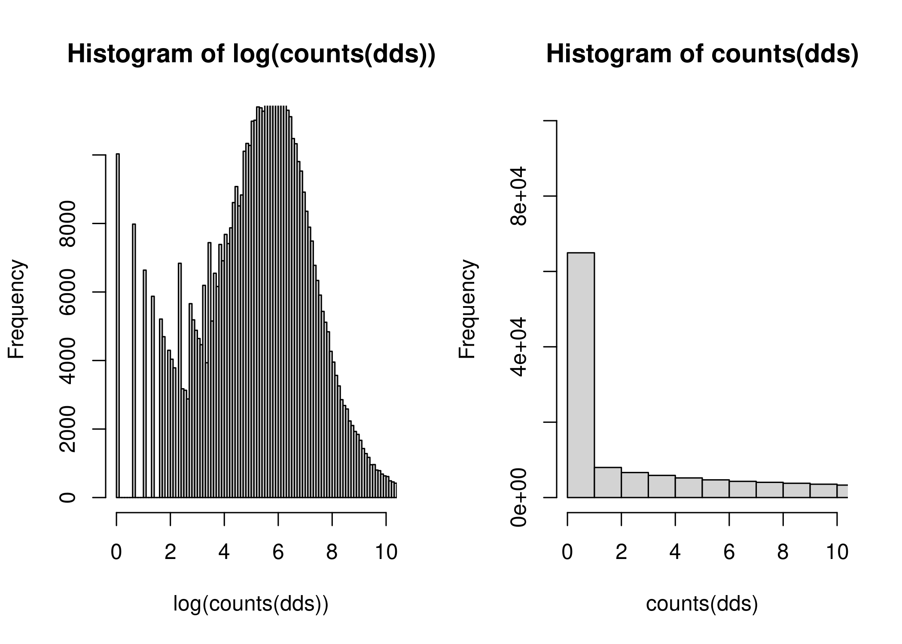<!-- -->

``` r
# -> dip at log(counts(dds)=2-3)
par(mfrow=c(1,1))

# min counts
# at least 5 counts in 3 samples
keep.sn <- rowSums(counts(dds) >= 5) >= 3
keep.sn %>% summary()
```

    ##    Mode   FALSE    TRUE 
    ## logical    1267   16349

``` r
dds <- dds[keep.sn,]

dds <- estimateSizeFactors(dds)
dds
```

    ## class: DESeqDataSet 
    ## dim: 16349 35 
    ## metadata(14): tximetaInfo quantInfo ... txdbInfo version
    ## assays(4): counts abundance avgTxLength normalizationFactors
    ## rownames(16349): Cre01.g000050 Cre01.g000100 ... CreMt.g802343
    ##   CreMt.g802344
    ## rowData names(14): gene_id tx_ids ... Predalgo symbol
    ## colnames(35): aCRYred1 aCRYred2 ... RNA_17_S36 RNA_18_S37
    ## colData names(10): names filename ... condition mappingrates

``` r
head(assays(dds)[["counts"]])[1:5,1:5]
```

    ##               aCRYred1 aCRYred2 aCRYred3 WTred1 WTred2
    ## Cre01.g000050      354      285      333    279    350
    ## Cre01.g000100       26       14       38     37     40
    ## Cre01.g000150      985      978      918    469    626
    ## Cre01.g000200      396      372      273    266    363
    ## Cre01.g000250      727      562      885    259    357

``` r
length(rownames(counts(dds)))
```

    ## [1] 16349

``` r
# colData(dds) %>% head() %>% kable()
# add metadata
# colData(dds)$strain <- factor(colData(dds)$strain)

# ## combine technical replicates #####\n
# colData(dds)
# dds <- collapseReplicates(dds, dds$sampleid,dds$lane)
# colData(dds)
# dds$runsCollapsed
# colnames(dds)
# matchFirstLevel <- dds$sampleid == levels(factor(dds$sampleid))[1]
# all(rowSums(counts(dds[,matchFirstLevel])) == counts(dds[,1]))

###########\n
# run DESeq
dds <- DESeq(dds)

plotDispEsts(dds)
```

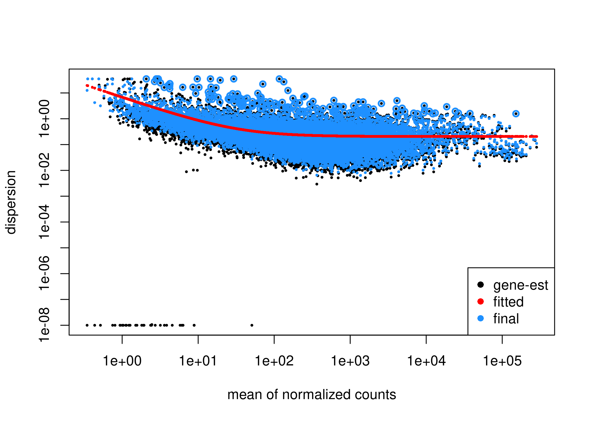<!-- -->

``` r
resultsNames(dds)
```

    ## [1] "Intercept"                  "genotype_acry_vs_WT"       
    ## [3] "genotype_pcry_vs_WT"        "treatment_blue_vs_dark"    
    ## [5] "treatment_red_vs_dark"      "genotypeacry.treatmentblue"
    ## [7] "genotypepcry.treatmentblue" "genotypeacry.treatmentred" 
    ## [9] "genotypepcry.treatmentred"

``` r
DESeq2::plotMA(dds)
```

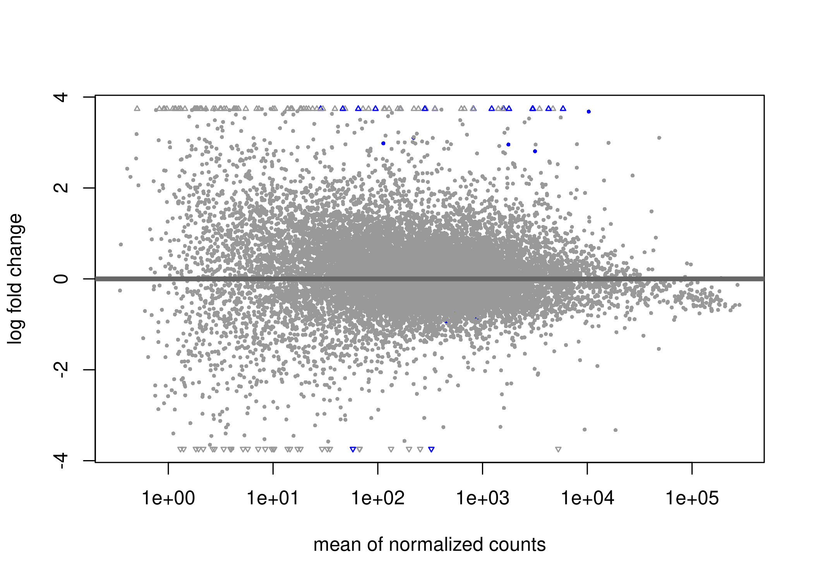<!-- -->

``` r
plotCounts(dds, gene = "Cre01.g000150", intgroup = "condition", col=colData(dds)$experiment)
```

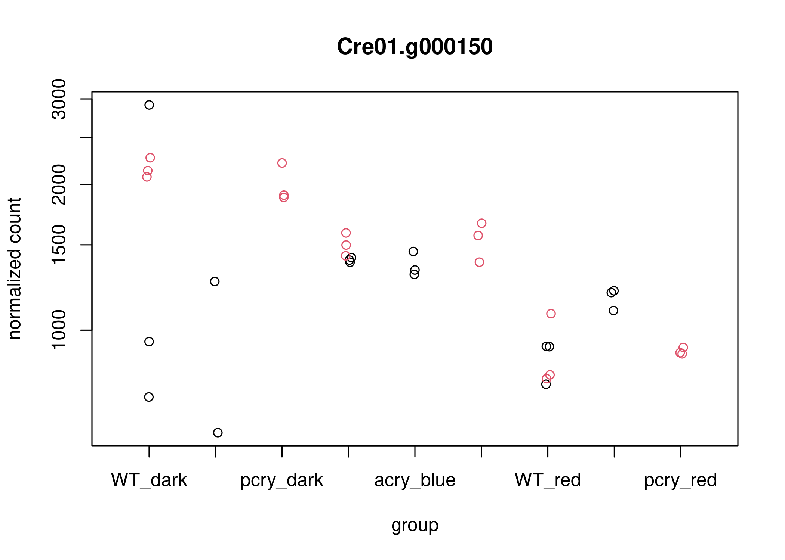<!-- -->

``` r
head(mcols(dds)$geneSymbol)
```

    ## [1] "RWP14" ""      "ZRT2"  ""      ""      "CGI58"

``` r
###############\n
# save dds #####

# save(dds, file = paste(dir,"dds_acry_pcry.RDS",sep="/"), compress = FALSE)
# save(dds, file = paste(dir,"dds_acry.RDS",sep="/"), compress = FALSE)
# load(paste(dir,"dds.RDS",sep="/"))
# dds
```

# 2. Pre-Analysis

### - Data transformations

``` r
# load(file=paste(data,"rlog.rld", sep="/"))
meanSdPlot(counts(dds, normalized =TRUE))
meanSdPlot(assay(ntd))
meanSdPlot(assay(vsd))
meanSdPlot(assay(rld))
```


### - Check sample distance

    ##  [1] red  red  red  red  red  red  blue blue blue blue blue blue dark dark dark
    ## [16] dark dark dark dark dark blue blue blue red  red  red  dark dark dark blue
    ## [31] blue blue red  red  red 
    ## Levels: dark blue red

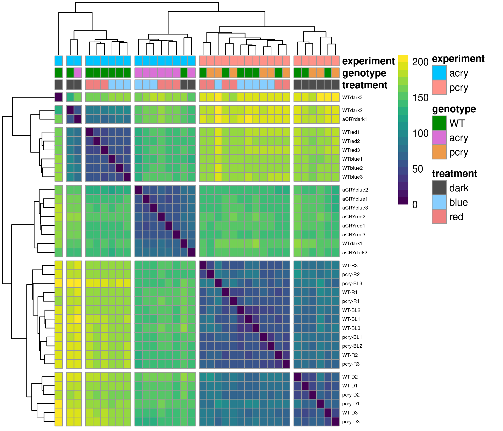

### - Perform principal component analysis

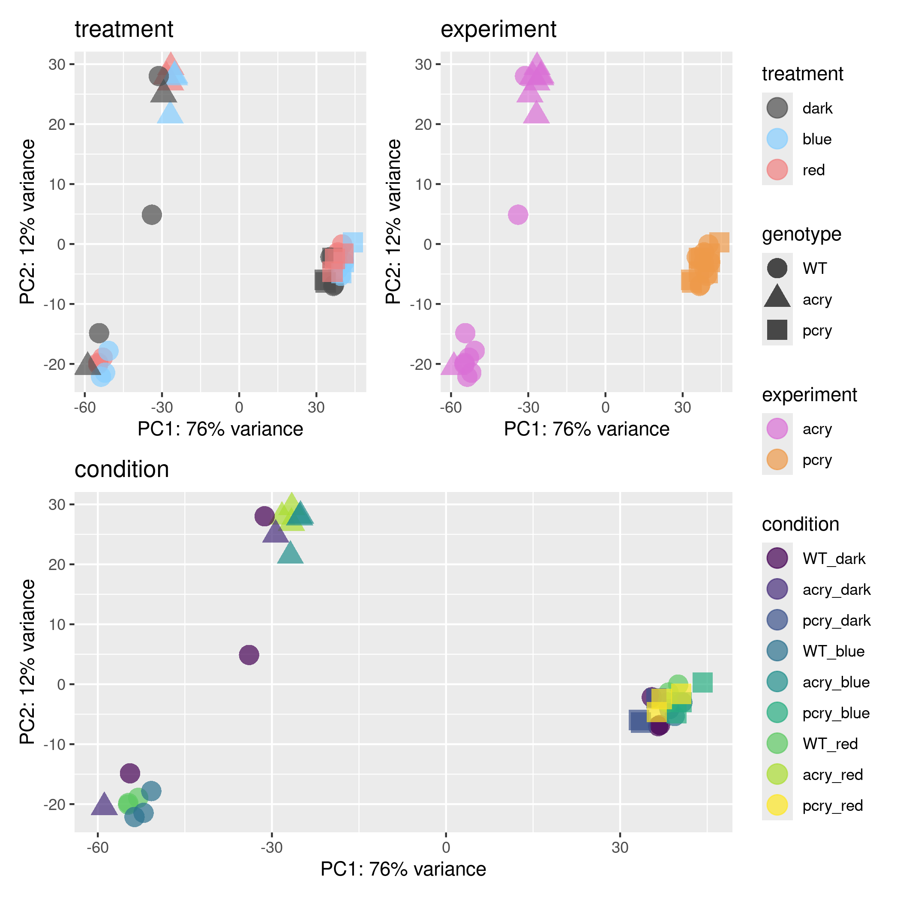

###### – Advanced PCA

    ## PC4 
    ##   4

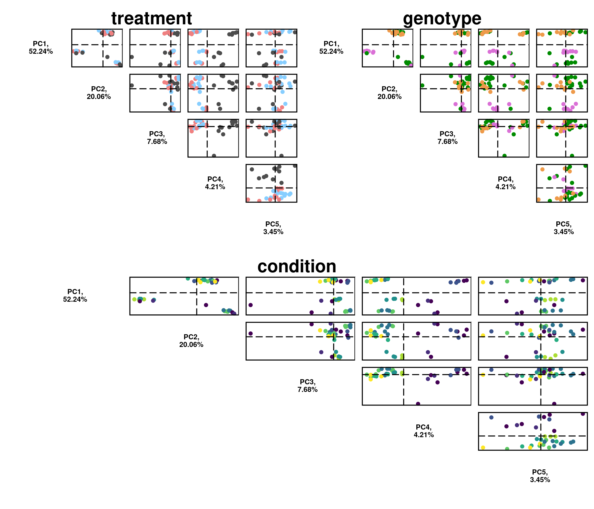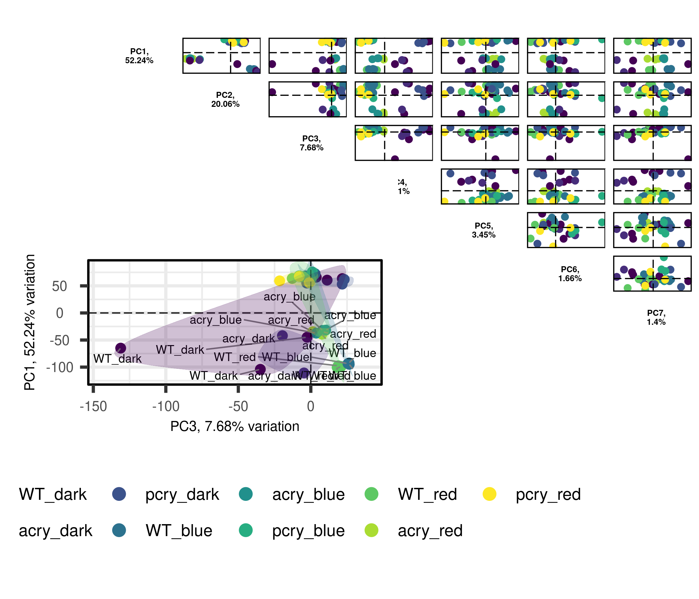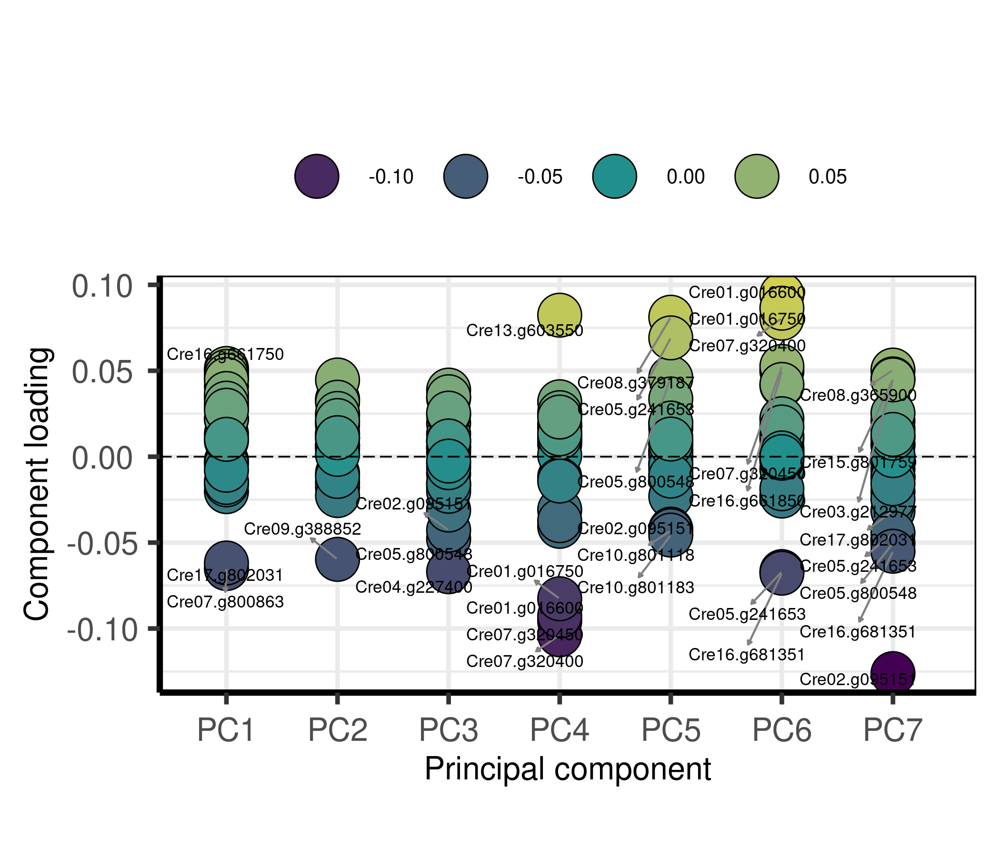

# 3. Results

## Colors

``` r
# colours
Greys <- brewer.pal(9, name="Greys")[c(7,5)]
Paired <- brewer.pal(12, name="Paired")[c(2,1,6,5)]
colours <- c(Greys,Paired)
group.colors <- colours
group.colors <- c("#525252", "#969696", "#1F78B4", "#A6CEE3", "#E31A1C", "#FB9A99")
group.colors <- c("grey10","grey40","grey80","royalblue4","royalblue2", "lightblue2",  "darkred","brown2","salmon1")

anno_colors <- list(treatment = c("grey30","skyblue1","lightcoral"), #,"ivory","yellow1","gold"
                    genotype = c("green4","orchid","tan2"))


group.colours2 <- c("#00B500","#007E56","#805B00","#FF00AB","#8024AB","#FF0056","tan2","brown","orangered")
```

## Plot Counts

``` r
# TF genes

goi_tf <- c("CCM1","LCR1", "HY5", "QER7", "QER4", "QER6", "ROC15", "ROC40", "ROC66", "ROC75", "ROC114", "ROC55", "CON1", "CRB1")
anno[c("Cre17.g745697","Cre13.g567250","Cre01.g043550","Cre02.g079550"),"geneSymbol"] <- c("QER4","QER6","QER7","ROC110")
anno_tf <- subset(anno,geneSymbol %in% goi_tf | gene_id %in% c("Cre17.g745697","Cre13.g567250","Cre01.g043550","Cre02.g079550"))
anno_tf[,c("gene_id", "geneSymbol","id.symbol")]
```

    ##                     gene_id geneSymbol     id.symbol
    ## Cre01.g043550 Cre01.g043550       QER7 Cre01.g043550
    ## Cre02.g079550 Cre02.g079550     ROC110          DRP2
    ## Cre02.g083750 Cre02.g083750      ROC75         ROC75
    ## Cre02.g095900 Cre02.g095900     ROC114        ROC114
    ## Cre02.g096300 Cre02.g096300       CCM1          CCM1
    ## Cre06.g250800 Cre06.g250800       CRB1          CRB1
    ## Cre06.g275350 Cre06.g275350      ROC40         ROC40
    ## Cre06.g278159 Cre06.g278159       CON1          CON1
    ## Cre06.g278200 Cre06.g278200      ROC66         ROC66
    ## Cre06.g310550 Cre06.g310550        HY5           HY5
    ## Cre09.g399552 Cre09.g399552       LCR1          LCR1
    ## Cre09.g410450 Cre09.g410450      ROC15         ROC15
    ## Cre12.g545800 Cre12.g545800      ROC55         ROC55
    ## Cre13.g567250 Cre13.g567250       QER6 Cre13.g567250
    ## Cre17.g745697 Cre17.g745697       QER4 Cre17.g745697

``` r
summary(anno_tf$gene_id %in% rownames(dds))
```

    ##    Mode   FALSE    TRUE 
    ## logical       1      14

``` r
anno_tf[!anno_tf$gene_id %in% rownames(dds),]
```

    ##                   locusName_4532 initial_v6_locus_ID action
    ## Cre06.g310550 Cre06.g310550_4532      Cr_06_32541_EX       
    ##               Replacement_v5.v6._model geneSymbol    strainLocusId PMID
    ## Cre06.g310550                                 HY5 4532_06_35976_EX     
    ##               previousIdentifiers                        Description
    ## Cre06.g310550       BLZ3#g7186.t1 putative bZIP transcription factor
    ##                                                                                                                                                                                                                                                                                                                                                                          Comments
    ## Cre06.g310550 def HY5 (ELONGATED HYPOCOTYL 5)# DNA binding / transcription factor  / HY5-like protein (HYH), nearly identical to HY5-like protein (Arabidopsis thaliana) GI:18042111# similar to TGACG-motif binding factor GI:2934884 from (Glycine max)# contains Pfam profile: PF00170 bZIP transcription factor The similarity is strong but only in this small domain region
    ##               Polycistronic TMHMM_transmembrane                    TargetP
    ## Cre06.g310550                  TMHMM: 0 helices Other (RC 1 on #1 protein)
    ##                                    Predalgo interactions
    ## Cre06.g310550 Other (score - on #1 protein)             
    ##               experimental_localization
    ## Cre06.g310550                          
    ##                                                                      CLiP_library
    ## Cre06.g310550 https://www.chlamylibrary.org/showGene?geneIdentifier=Cre06.g310550
    ##                   mutant_phenotypes Plastid.ribosome_pulldown
    ## Cre06.g310550 no phenotype detected                          
    ##               TF_database..PMID.27067009. Flagellar_Proteome
    ## Cre06.g310550                                               
    ##               Co.expression.cluster..PMID.28710131.
    ## Cre06.g310550                                      
    ##               GEnome.scale.Metabolic.Model       gene_id
    ## Cre06.g310550                              Cre06.g310550
    ##               previousIdentifiers_list prev.symbols id.symbol
    ## Cre06.g310550             BLZ3, g7....         BLZ3       HY5

``` r
anno_tf <- anno_tf[anno_tf$gene_id %in% rownames(dds),]

# Combined counts table TFs

goi <- anno_tf
l <- nrow(goi)
all_counts <- {}
for (i in 1:l){
  d <-  plotCounts(dds, gene=goi[i,"gene_id"], intgroup=c("condition","experiment","treatment","genotype"), col=col,main=res$SYMBOL[i],returnData=TRUE)
  d$Gene <- rep(goi[i,"geneSymbol"],length(rownames(d)))
  d$sample <- rownames(d)
  rownames(d) <- {}
  all_counts <- bind_rows(all_counts,d)
  }

all_counts$Gene
```

    ##   [1] "QER7"   "QER7"   "QER7"   "QER7"   "QER7"   "QER7"   "QER7"   "QER7"  
    ##   [9] "QER7"   "QER7"   "QER7"   "QER7"   "QER7"   "QER7"   "QER7"   "QER7"  
    ##  [17] "QER7"   "QER7"   "QER7"   "QER7"   "QER7"   "QER7"   "QER7"   "QER7"  
    ##  [25] "QER7"   "QER7"   "QER7"   "QER7"   "QER7"   "QER7"   "QER7"   "QER7"  
    ##  [33] "QER7"   "QER7"   "QER7"   "ROC110" "ROC110" "ROC110" "ROC110" "ROC110"
    ##  [41] "ROC110" "ROC110" "ROC110" "ROC110" "ROC110" "ROC110" "ROC110" "ROC110"
    ##  [49] "ROC110" "ROC110" "ROC110" "ROC110" "ROC110" "ROC110" "ROC110" "ROC110"
    ##  [57] "ROC110" "ROC110" "ROC110" "ROC110" "ROC110" "ROC110" "ROC110" "ROC110"
    ##  [65] "ROC110" "ROC110" "ROC110" "ROC110" "ROC110" "ROC110" "ROC75"  "ROC75" 
    ##  [73] "ROC75"  "ROC75"  "ROC75"  "ROC75"  "ROC75"  "ROC75"  "ROC75"  "ROC75" 
    ##  [81] "ROC75"  "ROC75"  "ROC75"  "ROC75"  "ROC75"  "ROC75"  "ROC75"  "ROC75" 
    ##  [89] "ROC75"  "ROC75"  "ROC75"  "ROC75"  "ROC75"  "ROC75"  "ROC75"  "ROC75" 
    ##  [97] "ROC75"  "ROC75"  "ROC75"  "ROC75"  "ROC75"  "ROC75"  "ROC75"  "ROC75" 
    ## [105] "ROC75"  "ROC114" "ROC114" "ROC114" "ROC114" "ROC114" "ROC114" "ROC114"
    ## [113] "ROC114" "ROC114" "ROC114" "ROC114" "ROC114" "ROC114" "ROC114" "ROC114"
    ## [121] "ROC114" "ROC114" "ROC114" "ROC114" "ROC114" "ROC114" "ROC114" "ROC114"
    ## [129] "ROC114" "ROC114" "ROC114" "ROC114" "ROC114" "ROC114" "ROC114" "ROC114"
    ## [137] "ROC114" "ROC114" "ROC114" "ROC114" "CCM1"   "CCM1"   "CCM1"   "CCM1"  
    ## [145] "CCM1"   "CCM1"   "CCM1"   "CCM1"   "CCM1"   "CCM1"   "CCM1"   "CCM1"  
    ## [153] "CCM1"   "CCM1"   "CCM1"   "CCM1"   "CCM1"   "CCM1"   "CCM1"   "CCM1"  
    ## [161] "CCM1"   "CCM1"   "CCM1"   "CCM1"   "CCM1"   "CCM1"   "CCM1"   "CCM1"  
    ## [169] "CCM1"   "CCM1"   "CCM1"   "CCM1"   "CCM1"   "CCM1"   "CCM1"   "CRB1"  
    ## [177] "CRB1"   "CRB1"   "CRB1"   "CRB1"   "CRB1"   "CRB1"   "CRB1"   "CRB1"  
    ## [185] "CRB1"   "CRB1"   "CRB1"   "CRB1"   "CRB1"   "CRB1"   "CRB1"   "CRB1"  
    ## [193] "CRB1"   "CRB1"   "CRB1"   "CRB1"   "CRB1"   "CRB1"   "CRB1"   "CRB1"  
    ## [201] "CRB1"   "CRB1"   "CRB1"   "CRB1"   "CRB1"   "CRB1"   "CRB1"   "CRB1"  
    ## [209] "CRB1"   "CRB1"   "ROC40"  "ROC40"  "ROC40"  "ROC40"  "ROC40"  "ROC40" 
    ## [217] "ROC40"  "ROC40"  "ROC40"  "ROC40"  "ROC40"  "ROC40"  "ROC40"  "ROC40" 
    ## [225] "ROC40"  "ROC40"  "ROC40"  "ROC40"  "ROC40"  "ROC40"  "ROC40"  "ROC40" 
    ## [233] "ROC40"  "ROC40"  "ROC40"  "ROC40"  "ROC40"  "ROC40"  "ROC40"  "ROC40" 
    ## [241] "ROC40"  "ROC40"  "ROC40"  "ROC40"  "ROC40"  "CON1"   "CON1"   "CON1"  
    ## [249] "CON1"   "CON1"   "CON1"   "CON1"   "CON1"   "CON1"   "CON1"   "CON1"  
    ## [257] "CON1"   "CON1"   "CON1"   "CON1"   "CON1"   "CON1"   "CON1"   "CON1"  
    ## [265] "CON1"   "CON1"   "CON1"   "CON1"   "CON1"   "CON1"   "CON1"   "CON1"  
    ## [273] "CON1"   "CON1"   "CON1"   "CON1"   "CON1"   "CON1"   "CON1"   "CON1"  
    ## [281] "ROC66"  "ROC66"  "ROC66"  "ROC66"  "ROC66"  "ROC66"  "ROC66"  "ROC66" 
    ## [289] "ROC66"  "ROC66"  "ROC66"  "ROC66"  "ROC66"  "ROC66"  "ROC66"  "ROC66" 
    ## [297] "ROC66"  "ROC66"  "ROC66"  "ROC66"  "ROC66"  "ROC66"  "ROC66"  "ROC66" 
    ## [305] "ROC66"  "ROC66"  "ROC66"  "ROC66"  "ROC66"  "ROC66"  "ROC66"  "ROC66" 
    ## [313] "ROC66"  "ROC66"  "ROC66"  "LCR1"   "LCR1"   "LCR1"   "LCR1"   "LCR1"  
    ## [321] "LCR1"   "LCR1"   "LCR1"   "LCR1"   "LCR1"   "LCR1"   "LCR1"   "LCR1"  
    ## [329] "LCR1"   "LCR1"   "LCR1"   "LCR1"   "LCR1"   "LCR1"   "LCR1"   "LCR1"  
    ## [337] "LCR1"   "LCR1"   "LCR1"   "LCR1"   "LCR1"   "LCR1"   "LCR1"   "LCR1"  
    ## [345] "LCR1"   "LCR1"   "LCR1"   "LCR1"   "LCR1"   "LCR1"   "ROC15"  "ROC15" 
    ## [353] "ROC15"  "ROC15"  "ROC15"  "ROC15"  "ROC15"  "ROC15"  "ROC15"  "ROC15" 
    ## [361] "ROC15"  "ROC15"  "ROC15"  "ROC15"  "ROC15"  "ROC15"  "ROC15"  "ROC15" 
    ## [369] "ROC15"  "ROC15"  "ROC15"  "ROC15"  "ROC15"  "ROC15"  "ROC15"  "ROC15" 
    ## [377] "ROC15"  "ROC15"  "ROC15"  "ROC15"  "ROC15"  "ROC15"  "ROC15"  "ROC15" 
    ## [385] "ROC15"  "ROC55"  "ROC55"  "ROC55"  "ROC55"  "ROC55"  "ROC55"  "ROC55" 
    ## [393] "ROC55"  "ROC55"  "ROC55"  "ROC55"  "ROC55"  "ROC55"  "ROC55"  "ROC55" 
    ## [401] "ROC55"  "ROC55"  "ROC55"  "ROC55"  "ROC55"  "ROC55"  "ROC55"  "ROC55" 
    ## [409] "ROC55"  "ROC55"  "ROC55"  "ROC55"  "ROC55"  "ROC55"  "ROC55"  "ROC55" 
    ## [417] "ROC55"  "ROC55"  "ROC55"  "ROC55"  "QER6"   "QER6"   "QER6"   "QER6"  
    ## [425] "QER6"   "QER6"   "QER6"   "QER6"   "QER6"   "QER6"   "QER6"   "QER6"  
    ## [433] "QER6"   "QER6"   "QER6"   "QER6"   "QER6"   "QER6"   "QER6"   "QER6"  
    ## [441] "QER6"   "QER6"   "QER6"   "QER6"   "QER6"   "QER6"   "QER6"   "QER6"  
    ## [449] "QER6"   "QER6"   "QER6"   "QER6"   "QER6"   "QER6"   "QER6"   "QER4"  
    ## [457] "QER4"   "QER4"   "QER4"   "QER4"   "QER4"   "QER4"   "QER4"   "QER4"  
    ## [465] "QER4"   "QER4"   "QER4"   "QER4"   "QER4"   "QER4"   "QER4"   "QER4"  
    ## [473] "QER4"   "QER4"   "QER4"   "QER4"   "QER4"   "QER4"   "QER4"   "QER4"  
    ## [481] "QER4"   "QER4"   "QER4"   "QER4"   "QER4"   "QER4"   "QER4"   "QER4"  
    ## [489] "QER4"   "QER4"

``` r
levels(all_counts$condition)
```

    ## [1] "WT_dark"   "acry_dark" "pcry_dark" "WT_blue"   "acry_blue" "pcry_blue"
    ## [7] "WT_red"    "acry_red"  "pcry_red"

``` r
all_counts$Gene <- factor(all_counts$Gene)
levels(all_counts$Gene)
```

    ##  [1] "CCM1"   "CON1"   "CRB1"   "LCR1"   "QER4"   "QER6"   "QER7"   "ROC110"
    ##  [9] "ROC114" "ROC15"  "ROC40"  "ROC55"  "ROC66"  "ROC75"

``` r
all_counts$Gene <- factor(all_counts$Gene, levels = c("CON1", "ROC40", "CRB1" ,  "QER4" , "ROC110",  "QER7" ,"ROC114" , "ROC75", "CCM1" , "ROC55" , "LCR1",  "QER6" , "ROC66",    "ROC15")  )
levels(all_counts$Gene)
```

    ##  [1] "CON1"   "ROC40"  "CRB1"   "QER4"   "ROC110" "QER7"   "ROC114" "ROC75" 
    ##  [9] "CCM1"   "ROC55"  "LCR1"   "QER6"   "ROC66"  "ROC15"

``` r
max_val <- 1.0*max(all_counts$count)

# Plot
gcounts1 <- ggplot(all_counts, aes(x = Gene, y = count, fill=condition)) +
  geom_boxplot(fatten = 1) +
  scale_fill_manual(values = group.colors) +
  scale_y_continuous(trans = "log2")
gcounts1
```

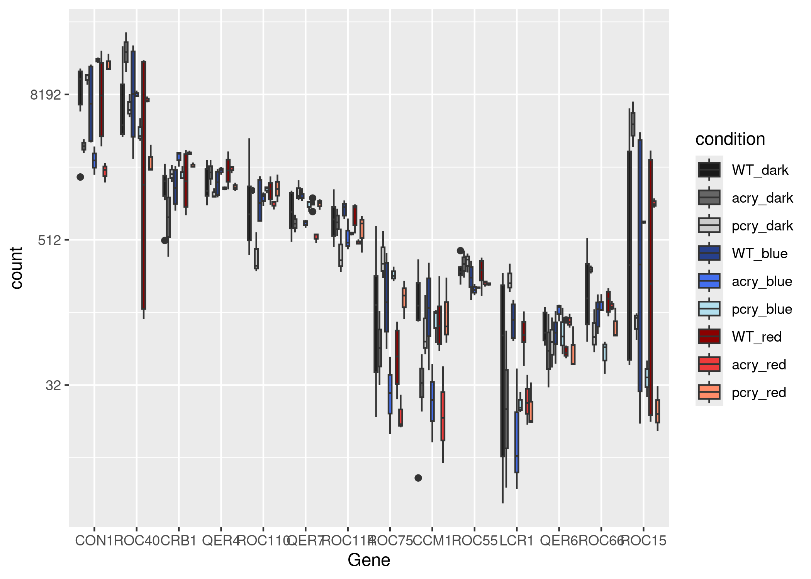<!-- -->

``` r
gcounts2 <- ggplot(all_counts, aes(x = Gene, y = count, fill=genotype)) +
  geom_boxplot(fatten = 1) +
  scale_fill_manual(values = anno_colors$genotype) +
  scale_y_continuous(trans = "log2")
gcounts2
```

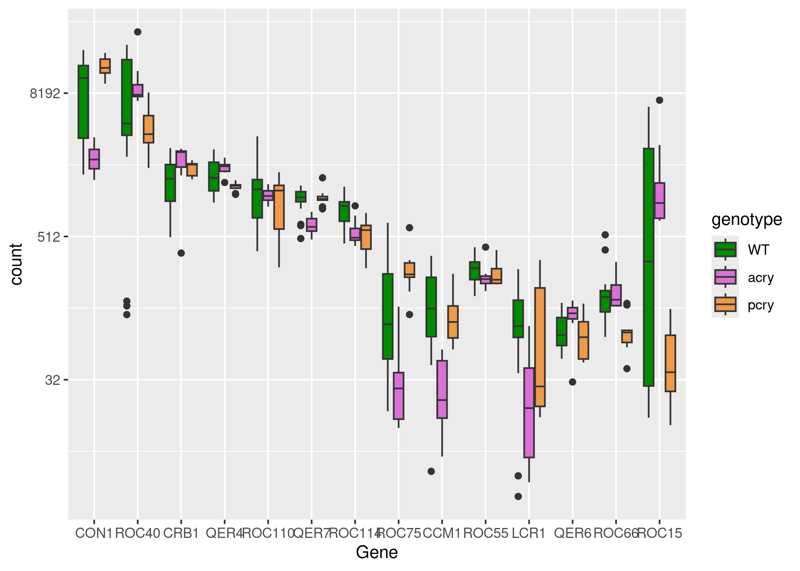<!-- -->

``` r
gcounts1 / gcounts2
```

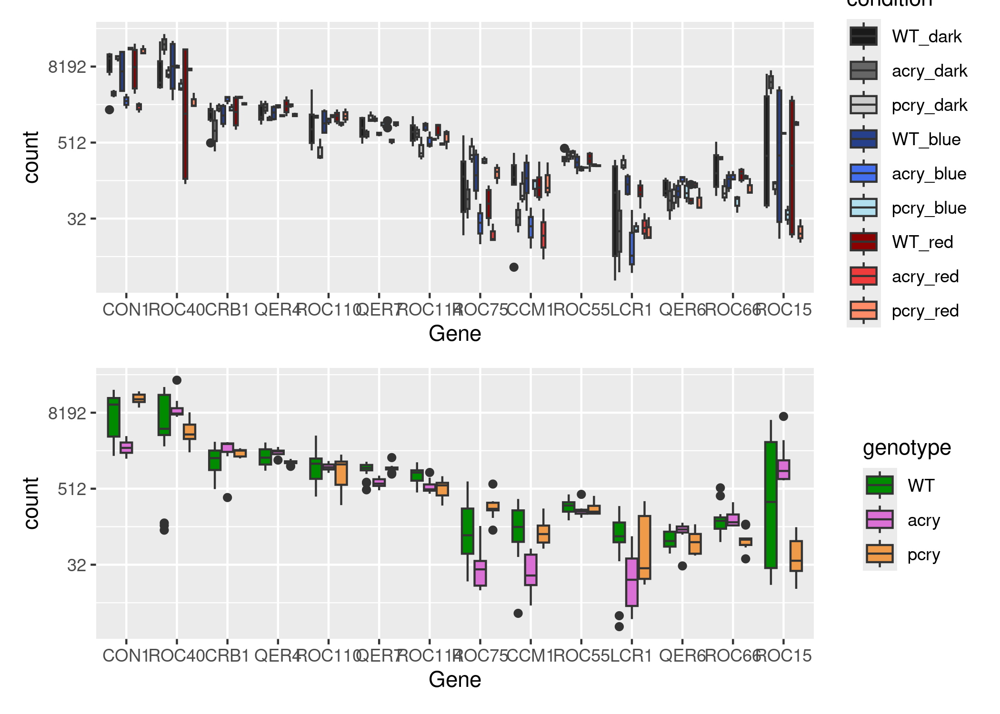<!-- -->

``` r
# ggsave(paste(figures,"2023_12_counts_tfs_aio_log2.pdf",sep="/"), plot = gcounts,
# width = 12,
# height = 8)


## Phot genes all-in-one
goi_phot <- c("CHR1", "CHR2", "PCRY1", "ACRY1", "DCRY1", "PHOT1", "UVR8", "HKR1") #"HKR2" "DCRY2", 

anno_phot <- subset(anno,geneSymbol %in% goi_phot, drop = FALSE)
rownames(anno_phot) <- anno_phot$geneSymbol
anno_phot <- anno_phot[goi_phot,]

# Combined counts table TFs

goi <- anno_phot
l <- nrow(goi)
all_counts <- {}
for (i in 1:l){
  d <-  plotCounts(dds, gene=goi[i,"gene_id"], intgroup=c("condition","experiment","treatment","genotype"), col=col,main=res$SYMBOL[i],returnData=TRUE)
  d$Gene <- rep(goi[i,"geneSymbol"],length(rownames(d)))
  d$sample <- rownames(d)
  rownames(d) <- {}
  all_counts <- bind_rows(all_counts,d)
  }

all_counts$Gene
```

    ##   [1] "CHR1"  "CHR1"  "CHR1"  "CHR1"  "CHR1"  "CHR1"  "CHR1"  "CHR1"  "CHR1" 
    ##  [10] "CHR1"  "CHR1"  "CHR1"  "CHR1"  "CHR1"  "CHR1"  "CHR1"  "CHR1"  "CHR1" 
    ##  [19] "CHR1"  "CHR1"  "CHR1"  "CHR1"  "CHR1"  "CHR1"  "CHR1"  "CHR1"  "CHR1" 
    ##  [28] "CHR1"  "CHR1"  "CHR1"  "CHR1"  "CHR1"  "CHR1"  "CHR1"  "CHR1"  "CHR2" 
    ##  [37] "CHR2"  "CHR2"  "CHR2"  "CHR2"  "CHR2"  "CHR2"  "CHR2"  "CHR2"  "CHR2" 
    ##  [46] "CHR2"  "CHR2"  "CHR2"  "CHR2"  "CHR2"  "CHR2"  "CHR2"  "CHR2"  "CHR2" 
    ##  [55] "CHR2"  "CHR2"  "CHR2"  "CHR2"  "CHR2"  "CHR2"  "CHR2"  "CHR2"  "CHR2" 
    ##  [64] "CHR2"  "CHR2"  "CHR2"  "CHR2"  "CHR2"  "CHR2"  "CHR2"  "PCRY1" "PCRY1"
    ##  [73] "PCRY1" "PCRY1" "PCRY1" "PCRY1" "PCRY1" "PCRY1" "PCRY1" "PCRY1" "PCRY1"
    ##  [82] "PCRY1" "PCRY1" "PCRY1" "PCRY1" "PCRY1" "PCRY1" "PCRY1" "PCRY1" "PCRY1"
    ##  [91] "PCRY1" "PCRY1" "PCRY1" "PCRY1" "PCRY1" "PCRY1" "PCRY1" "PCRY1" "PCRY1"
    ## [100] "PCRY1" "PCRY1" "PCRY1" "PCRY1" "PCRY1" "PCRY1" "ACRY1" "ACRY1" "ACRY1"
    ## [109] "ACRY1" "ACRY1" "ACRY1" "ACRY1" "ACRY1" "ACRY1" "ACRY1" "ACRY1" "ACRY1"
    ## [118] "ACRY1" "ACRY1" "ACRY1" "ACRY1" "ACRY1" "ACRY1" "ACRY1" "ACRY1" "ACRY1"
    ## [127] "ACRY1" "ACRY1" "ACRY1" "ACRY1" "ACRY1" "ACRY1" "ACRY1" "ACRY1" "ACRY1"
    ## [136] "ACRY1" "ACRY1" "ACRY1" "ACRY1" "ACRY1" "DCRY1" "DCRY1" "DCRY1" "DCRY1"
    ## [145] "DCRY1" "DCRY1" "DCRY1" "DCRY1" "DCRY1" "DCRY1" "DCRY1" "DCRY1" "DCRY1"
    ## [154] "DCRY1" "DCRY1" "DCRY1" "DCRY1" "DCRY1" "DCRY1" "DCRY1" "DCRY1" "DCRY1"
    ## [163] "DCRY1" "DCRY1" "DCRY1" "DCRY1" "DCRY1" "DCRY1" "DCRY1" "DCRY1" "DCRY1"
    ## [172] "DCRY1" "DCRY1" "DCRY1" "DCRY1" "PHOT1" "PHOT1" "PHOT1" "PHOT1" "PHOT1"
    ## [181] "PHOT1" "PHOT1" "PHOT1" "PHOT1" "PHOT1" "PHOT1" "PHOT1" "PHOT1" "PHOT1"
    ## [190] "PHOT1" "PHOT1" "PHOT1" "PHOT1" "PHOT1" "PHOT1" "PHOT1" "PHOT1" "PHOT1"
    ## [199] "PHOT1" "PHOT1" "PHOT1" "PHOT1" "PHOT1" "PHOT1" "PHOT1" "PHOT1" "PHOT1"
    ## [208] "PHOT1" "PHOT1" "PHOT1" "UVR8"  "UVR8"  "UVR8"  "UVR8"  "UVR8"  "UVR8" 
    ## [217] "UVR8"  "UVR8"  "UVR8"  "UVR8"  "UVR8"  "UVR8"  "UVR8"  "UVR8"  "UVR8" 
    ## [226] "UVR8"  "UVR8"  "UVR8"  "UVR8"  "UVR8"  "UVR8"  "UVR8"  "UVR8"  "UVR8" 
    ## [235] "UVR8"  "UVR8"  "UVR8"  "UVR8"  "UVR8"  "UVR8"  "UVR8"  "UVR8"  "UVR8" 
    ## [244] "UVR8"  "UVR8"  "HKR1"  "HKR1"  "HKR1"  "HKR1"  "HKR1"  "HKR1"  "HKR1" 
    ## [253] "HKR1"  "HKR1"  "HKR1"  "HKR1"  "HKR1"  "HKR1"  "HKR1"  "HKR1"  "HKR1" 
    ## [262] "HKR1"  "HKR1"  "HKR1"  "HKR1"  "HKR1"  "HKR1"  "HKR1"  "HKR1"  "HKR1" 
    ## [271] "HKR1"  "HKR1"  "HKR1"  "HKR1"  "HKR1"  "HKR1"  "HKR1"  "HKR1"  "HKR1" 
    ## [280] "HKR1"

``` r
levels(all_counts$condition)
```

    ## [1] "WT_dark"   "acry_dark" "pcry_dark" "WT_blue"   "acry_blue" "pcry_blue"
    ## [7] "WT_red"    "acry_red"  "pcry_red"

``` r
levels(all_counts$Gene)
```

    ## NULL

``` r
all_counts$Gene <- factor(all_counts$Gene)
levels(all_counts$Gene)
```

    ## [1] "ACRY1" "CHR1"  "CHR2"  "DCRY1" "HKR1"  "PCRY1" "PHOT1" "UVR8"

``` r
all_counts$Gene <- factor(all_counts$Gene, levels = c("PHOT1","CHR1","CHR2","HKR1","UVR8","DCRY1","PCRY1","ACRY1")) # "DCRY2", 
levels(all_counts$Gene)
```

    ## [1] "PHOT1" "CHR1"  "CHR2"  "HKR1"  "UVR8"  "DCRY1" "PCRY1" "ACRY1"

``` r
# Plot
max_val <- 1.0*max(all_counts$count)
gcounts1 <- ggplot(all_counts, aes(x = Gene, y = count, fill=condition)) +
  geom_boxplot(fatten = 1) +
  scale_fill_manual(values = group.colors) +
  scale_y_continuous(trans = "log2")
gcounts1
```

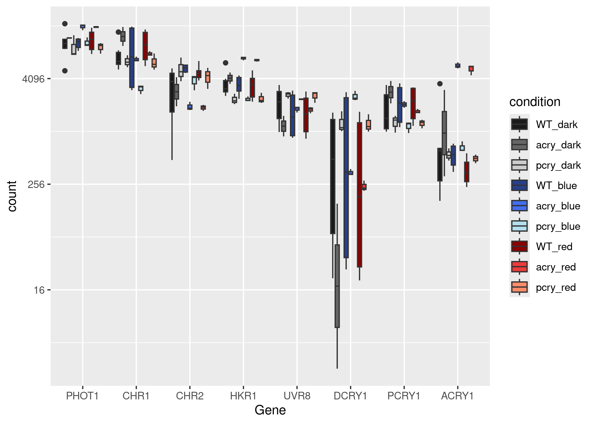<!-- -->

``` r
gcounts2 <- ggplot(all_counts, aes(x = Gene, y = count, fill=genotype)) +
  geom_boxplot(fatten = 1) +
  scale_fill_manual(values = anno_colors$genotype) +
  scale_y_continuous(trans = "log2")
gcounts2
```

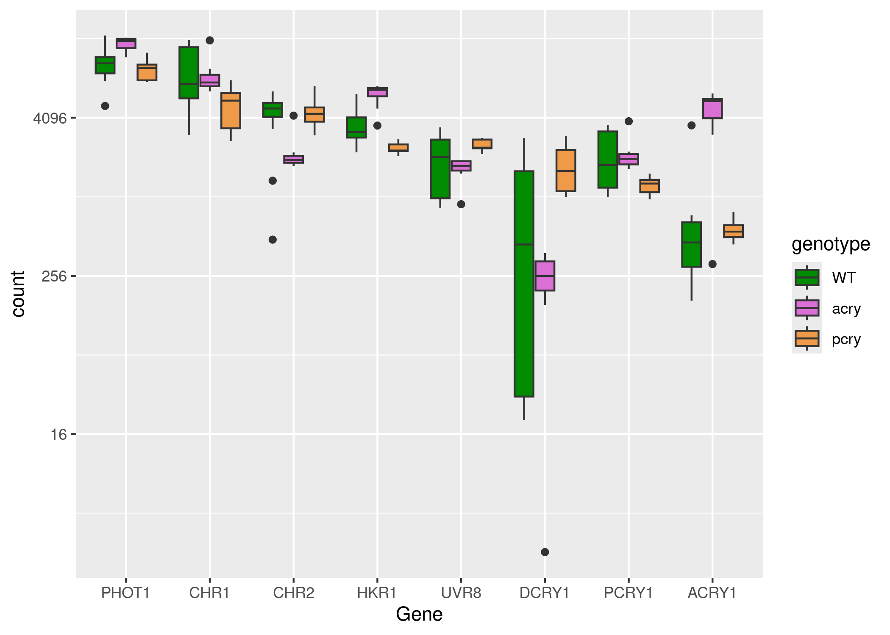<!-- -->

``` r
gcounts3 <- ggplot(all_counts, aes(x = Gene, y = count, fill=condition)) +
  geom_boxplot(fatten = 1) +
  scale_fill_manual(values = group.colours2) +
  scale_y_continuous(trans = "log2")
gcounts3
```

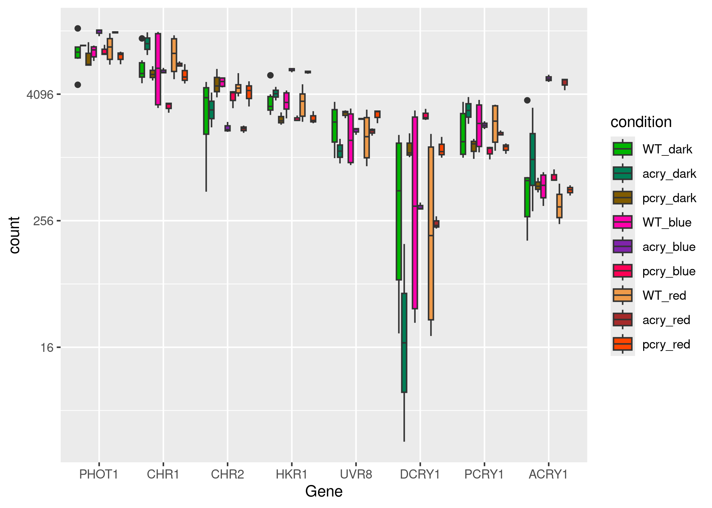<!-- -->

``` r
gcounts1 / gcounts2 / gcounts3
```

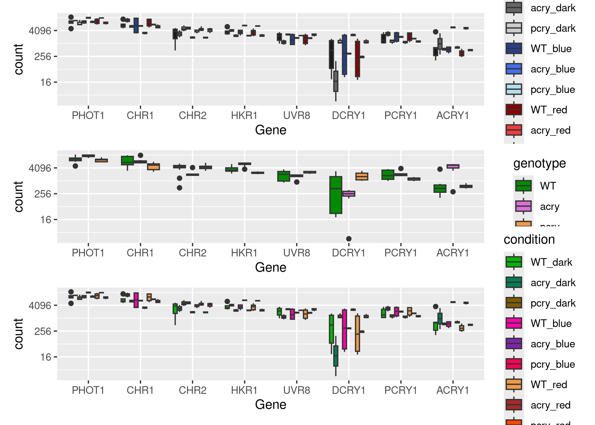<!-- -->

``` r
# ggsave(paste(figures,"2023_12_counts_phots_aio_log2.pdf",sep="/"), plot = gcounts,
#   width = 12,
#   height = 8)
```

# —————————

# COPY & PASTE from pCRY

## Make results

### combine L2FC with padj

``` r
res3_shrink
subset(mcols(dds), id.symbol =="SELU1") %>% rownames()
res3_shrink["Cre06.g263550",]

# DataFrame with 1 row and 5 columns
#                baseMean log2FoldChange     lfcSE      pvalue        padj
#               <numeric>      <numeric> <numeric>   <numeric>   <numeric>
# Cre06.g263550   3566.14        2.90397  0.167321 1.72033e-71 1.97322e-68

plot(res3_shrink$log2FoldChange,-log(res3_shrink$padj))
res3_shrink$logpadj <- -log(res3_shrink$padj, base=10)

-log(1.38379e-06,base = 10)

x=-2.5
60/(3^2)

y=-8*x^2 + 50
y

res3_shrink$ishs <- ifelse((-20/3*(res3_shrink$log2FoldChange^2) + 60) < res3_shrink$logpadj,TRUE,FALSE)
summary(res3_shrink$ishs)
subset(res3_shrink,ishs==TRUE & logpadj< 50 & abs(log2FoldChange)<2.5)
subset(res3_shrink,ishs==TRUE & logpadj< 50)

# for log2 -/+ 5 and padj 100 
res1_shrink$ishs <- ifelse((-20/3*(res1_shrink$log2FoldChange^2) + 60) < -log(res1_shrink$padj, base=10),TRUE,FALSE)
res2_shrink$ishs <- ifelse((-20/3*(res2_shrink$log2FoldChange^2) + 60) < -log(res2_shrink$padj, base=10),TRUE,FALSE)
res3_shrink$ishs <- ifelse((-20/3*(res3_shrink$log2FoldChange^2) + 60) < -log(res3_shrink$padj, base=10),TRUE,FALSE)
res4_shrink$ishs <- ifelse((-20/3*(res4_shrink$log2FoldChange^2) + 60) < -log(res4_shrink$padj, base=10),TRUE,FALSE)
res5_shrink$ishs <- ifelse((-20/3*(res5_shrink$log2FoldChange^2) + 60) < -log(res5_shrink$padj, base=10),TRUE,FALSE)
res6_shrink$ishs <- ifelse((-20/3*(res6_shrink$log2FoldChange^2) + 60) < -log(res6_shrink$padj, base=10),TRUE,FALSE)
res7_shrink$ishs <- ifelse((-20/3*(res7_shrink$log2FoldChange^2) + 60) < -log(res7_shrink$padj, base=10),TRUE,FALSE)
```

``` r
outdir
figures <- paste(outdir,"figures",sep="/")
dir.create(figures)
```

## Colours

``` r
Greys <- brewer.pal(9, name="Greys")[c(7,5)]
Paired <- brewer.pal(12, name="Paired")[c(2,1,6,5)]
colours <- c(Greys,Paired)
```

## PCA (Panel B)

``` r
library("PCAtools")
library(ggalt)

vsd <- vst(dds, blind=FALSE)
length(vsd)

dubs <- duplicated(mcols(vsd)$id.symbol)
length(dubs)

unique <- unique(mcols(vsd)$id.symbol)
length(unique)

vsd2 <- vsd[!duplicated(mcols(vsd)$id.symbol)]
rownames(vsd2) <- mcols(vsd2)$id.symbol

# colours
Greys <- brewer.pal(9, name="Greys")[c(7,5)]
Paired <- brewer.pal(12, name="Paired")[c(2,1,6,5)]
colours <- c(Greys,Paired)
group.colors <- colours
group.colors <- c("#525252", "#969696", "#1F78B4", "#A6CEE3", "#E31A1C", "#FB9A99")
names(group.colors) <- levels(colData(dds)$condition)
group.colors      

plotPCA(vsd2, intgroup="condition")
vst <- assay(vsd2)
p <- pca(vst, metadata = colData(dds), removeVar = 0.1)
screeplot(p, axisLabSize = 18, titleLabSize = 22)
biplot(p, colby = "condition")
biplot(p, showLoadings = TRUE,labSize = 5, pointSize = 5, sizeLoadingsNames = 5)

biplot(p,x= "PC1", y="PC3",
       lab = p$metadata$sample,
    colby = 'condition', colkey = group.colors,
    encircle = TRUE,
    encircleFill = TRUE,
    legendPosition = 'right',
    labSize = 4)
ggsave(paste(figures,"2023_12_PCA1-3.png",sep="/"),
  width = 6,
  height = 6)

biplot(p,x= "PC3", y="PC4",
       lab = p$metadata$sample,
    colby = 'condition', colkey = group.colors,
    encircle = TRUE,
    encircleFill = TRUE,
    legendPosition = 'right')
ggsave(paste(figures,"2023_12_PCA3-4.pdf",sep="/"),
  width = 12,
  height = 12)

pairsplot(p,colby = 'condition', colkey = group.colors)
ggsave(paste(figures,"2023_12_pairsplot.pdf",sep="/"),
  width = 12,
  height = 12)


plotloadings(p,
    rangeRetain = 0.01,
    labSize = 2.0,
    title = 'Loadings plot',
    subtitle = 'PC1, PC2, PC3, PC4, PC5',
    caption = 'Top 1% variables',
    drawConnectors = TRUE)
ggsave(paste(figures,"2023_12_loadings.pdf",sep="/"),
  width = 12,
  height = 12)

# Determine optimum number of PCs to retain
elbow <- findElbowPoint(p$variance)
elbow

anno["Cre01.g016600",]

 biplot(p,
    lab = p$metadata$condition,
    colby = 'condition', colkey = group.colors,
    hline = 0, vline = 0,
    encircle = TRUE, encircleFill = TRUE,
    legendLabSize = 16, legendIconSize = 8.0,
    legendPosition = 'right')

pairsplot(p,
    components = getComponents(p, c(1:6)),
    triangle = TRUE, trianglelabSize = 12,
    hline = 0, vline = 0,
    pointSize = 2,
    gridlines.major = FALSE, gridlines.minor = FALSE,
    colby = 'condition', colkey = group.colors,
    title = 'Pairs plot', plotaxes = FALSE,
    margingaps = unit(c(-0.01, -0.01, -0.01, -0.01), 'cm'))
```

## Counts

``` r
# TF genes

goi_tf <- c("CCM1","LCR1", "HY5", "QER7", "QER4", "QER6", "ROC15", "ROC40", "ROC66", "ROC75", "ROC114", "ROC55", "CON1", "CRB1")
anno[c("Cre17.g745697","Cre13.g567250","Cre01.g043550","Cre02.g079550"),"geneSymbol"] <- c("QER4","QER6","QER7","ROC110")
anno_tf <- subset(anno,geneSymbol %in% goi_tf | gene_id %in% c("Cre17.g745697","Cre13.g567250","Cre01.g043550","Cre02.g079550"))
anno_tf[,c("gene_id", "geneSymbol","id.symbol")]
summary(anno_tf$gene_id %in% rownames(dds))
anno_tf[!anno_tf$gene_id %in% rownames(dds),]
anno_tf <- anno_tf[anno_tf$gene_id %in% rownames(dds),]

# Combined counts table TFs

goi <- anno_tf
l <- nrow(goi)
all_counts <- {}
for (i in 1:l){
  d <-  plotCounts(dds, gene=goi[i,"gene_id"], intgroup="condition", col=col,main=res$SYMBOL[i],returnData=TRUE)
  d$Gene <- rep(goi[i,"geneSymbol"],length(rownames(d)))
  d$sample <- rownames(d)
  rownames(d) <- {}
  all_counts <- bind_rows(all_counts,d)
  }

all_counts$Gene
levels(all_counts$condition)
all_counts$Gene <- factor(all_counts$Gene)
levels(all_counts$Gene)

all_counts$Gene <- factor(all_counts$Gene, levels = c("CON1", "ROC40", "CRB1" ,  "QER4" , "ROC110",  "QER7" ,"ROC114" , "ROC75", "CCM1" , "ROC55" , "LCR1",  "QER6" , "ROC66",    "ROC15")  )
levels(all_counts$Gene)


# colours
Greys <- brewer.pal(9, name="Greys")[c(7,5)]
Paired <- brewer.pal(12, name="Paired")[c(2,1,6,5)]
colours <- c(Greys,Paired)
group.colors <- colours
group.colors <- c("#525252", "#969696", "#1F78B4", "#A6CEE3", "#E31A1C", "#FB9A99")
max_val <- 1.0*max(all_counts$count)

# Plot
gcounts <- ggplot(all_counts, aes(x = Gene, y = count, fill=condition)) +
  geom_boxplot(fatten = 1) +
  scale_fill_manual(values = group.colors) +
  scale_y_continuous(trans = "log2")
gcounts
ggsave(paste(figures,"2023_12_counts_tfs_aio_log2.pdf",sep="/"), plot = gcounts,
  width = 12,
  height = 8)

## Phot genes all-in-one
goi_phot <- c("CHR1", "CHR2", "PCRY1", "ACRY1", "DCRY1", "PHOT1", "UVR8", "HKR1") #"HKR2" "DCRY2", 

anno_phot <- subset(anno,geneSymbol %in% goi_phot, drop = FALSE)
rownames(anno_phot) <- anno_phot$geneSymbol
anno_phot <- anno_phot[goi_phot,]

# Combined counts table TFs

goi <- anno_phot
l <- nrow(goi)
all_counts <- {}
for (i in 1:l){
  d <-  plotCounts(dds, gene=goi[i,"gene_id"], intgroup="condition", col=col,main=res$SYMBOL[i],returnData=TRUE)
  d$Gene <- rep(goi[i,"geneSymbol"],length(rownames(d)))
  d$sample <- rownames(d)
  rownames(d) <- {}
  all_counts <- bind_rows(all_counts,d)
  }

all_counts$Gene
levels(all_counts$condition)
levels(all_counts$Gene)

all_counts$Gene <- factor(all_counts$Gene)
levels(all_counts$Gene)

all_counts$Gene <- factor(all_counts$Gene, levels = c("PHOT1","CHR1","CHR2","HKR1","UVR8","DCRY1","PCRY1","ACRY1")) # "DCRY2", 
levels(all_counts$Gene)

# colours
Greys <- brewer.pal(9, name="Greys")[c(7,5)]
Paired <- brewer.pal(12, name="Paired")[c(2,1,6,5)]
colours <- c(Greys,Paired)
group.colors <- colours
group.colors <- c("#525252", "#969696", "#1F78B4", "#A6CEE3", "#E31A1C", "#FB9A99")
max_val <- 1.0*max(all_counts$count)

# Plot
gcounts <- ggplot(all_counts, aes(x = Gene, y = count, fill=condition)) +
  geom_boxplot(fatten = 1) +
  scale_fill_manual(values = group.colors) +
  scale_y_continuous(trans = "log2")
gcounts
ggsave(paste(figures,"2023_12_counts_phots_aio_log2.pdf",sep="/"), plot = gcounts,
  width = 12,
  height = 8)
```

## Volcanos

### dark

``` r
# dark
res <- res1_shrink
n <- 'WT vs. pCRY in dark'
nf <- 'figures/Volcano_dark.png'
l <- nrow(top.res1)
pcol <- "black"
lcol <- colours[1+1]


rownames(res) <- mcols(dds)$id.symbol
res <- res[!is.na(res$padj),]
res <- res[!is.na(res$log2FoldChange),]

shape <- ifelse(abs(res$log2FoldChange) > 5, 6,
                ifelse(res$padj < 1e-100,6,16))
summary(is.na(shape))
# shape[is.na(shape)] <- 2
names(shape)[shape == 6] <- 'outliner'
names(shape)[shape == 16] <- 'in range'

res$log2FoldChange[res$log2FoldChange > 5] <- 5
res$log2FoldChange[res$log2FoldChange < -5] <- -5
res$padj[res$padj < 1e-100] <- 1e-100
summary(res$padj < 1e-100)

keyvals <- ifelse(
    res$ishs == TRUE, pcol,
      'grey')

keyvals[is.na(keyvals)] <- 'grey'
  names(keyvals)[keyvals == pcol] <- 'highly significant'
  names(keyvals)[keyvals == 'grey'] <- 'other'
  
evd <- EnhancedVolcano(res,
    x = 'log2FoldChange',
    y = 'padj',
    lab = rownames(res),
    selectLab  = rownames(res)[which(names(keyvals) == 'highly significant')],
    # selectLab = anno_tf$geneSymbol,
    # boxedLabels = TRUE,
    labSize = 3,
    drawConnectors = TRUE,
    boxedLabels = TRUE,
    widthConnectors = 0.5,
    colConnectors = lcol,
    pointSize = 4.0,
    max.overlaps = 10,
    colCustom = keyvals,
    xlim = c(-5.1, 5.1),
    ylim = c(0, 101),
    ylab = "Padj (-log10)",
    title = n,
    subtitle = paste("DE genes:",l),
    # sub = "SVF",
    pCutoff = 10^(-60),
    FCcutoff = 3,
   shapeCustom =shape,
    # pointSize = c(ifelse(rownames(res_WT_D_vs.WT_BL) %in% rownames(top_WT_BL_vs.pcry_BL), 8, 1)),
    legendLabels=c('Not sig.','|L2F| > 2.5','p-adj < 0.05',
                   'p-adj & L2F'),
    legendPosition = 'bottom',
    col=c('grey', pcol, pcol, pcol)
    )
evd
```

### blue

``` r
# blue
res <- res2_shrink
n <- 'WT vs. pCRY in blue'
nf <- 'figures/Volcano_blue.png'
l <- nrow(top.res2)
pcol <- colours[3]
lcol <- colours[3+1]


rownames(res) <- mcols(dds)$id.symbol
res <- res[!is.na(res$padj),]
res <- res[!is.na(res$log2FoldChange),]

shape <- ifelse(abs(res$log2FoldChange) > 5, 17,
                ifelse(res$padj < 1e-100,17,16))
summary(is.na(shape))
# shape[is.na(shape)] <- 2
names(shape)[shape == 6] <- 'outliner'
names(shape)[shape == 16] <- 'in range'

res$log2FoldChange[res$log2FoldChange > 5] <- 5
res$log2FoldChange[res$log2FoldChange < -5] <- -5
res$padj[res$padj < 1e-100] <- 1e-100
summary(res$padj < 1e-100)

keyvals <- ifelse(
    res$ishs == TRUE, pcol,
      'grey')

keyvals[is.na(keyvals)] <- 'grey'
  names(keyvals)[keyvals == pcol] <- 'highly significant'
  names(keyvals)[keyvals == 'grey'] <- 'other'
  
evb <- EnhancedVolcano(res,
    x = 'log2FoldChange',
    y = 'padj',
    lab = rownames(res),
    selectLab  = rownames(res)[which(names(keyvals) == 'highly significant')],
    # selectLab = anno_tf$geneSymbol,
    # boxedLabels = TRUE,
    labSize = 3,
    drawConnectors = TRUE,
    boxedLabels = TRUE,
    widthConnectors = 0.5,
    colConnectors = lcol,
    pointSize = 4.0,
    max.overlaps = 10,
    colCustom = keyvals,
    xlim = c(-5.1, 5.1),
    ylim = c(0, 101),
    ylab = "Padj (-log10)",
    title = n,
    subtitle = paste("DE genes:",l),
    # sub = "SVF",
    pCutoff = 10^(-50),
    FCcutoff = 2.5,
   shapeCustom =shape,
    # pointSize = c(ifelse(rownames(res_WT_D_vs.WT_BL) %in% rownames(top_WT_BL_vs.pcry_BL), 8, 1)),
    legendLabels=c('Not sig.','|L2F| > 2.5','p-adj < 0.05',
                   'p-adj & L2F'),
    legendPosition = 'bottom',
    col=c('grey', pcol, pcol, pcol)
    )
evb
```

### red

``` r
# red
res <- res3_shrink
n <- 'WT vs. pCRY in red'
nf <- 'figures/Volcano_r.png'
l <- nrow(top.res3)
pcol <- colours[5]
lcol <- colours[5+1]

rownames(res) <- mcols(dds)$id.symbol
res <- res[!is.na(res$padj),]
res <- res[!is.na(res$log2FoldChange),]

shape <- ifelse(abs(res$log2FoldChange) > 5, 6,
                ifelse(res$padj < 1e-100,6,16))
summary(is.na(shape))
# shape[is.na(shape)] <- 2
names(shape)[shape == 6] <- 'outliner'
names(shape)[shape == 16] <- 'in range'

res$log2FoldChange[res$log2FoldChange > 5] <- 5
res$log2FoldChange[res$log2FoldChange < -5] <- -5
res$padj[res$padj < 1e-100] <- 1e-100
summary(res$padj < 1e-100)

keyvals <- ifelse(
    res$ishs == TRUE, pcol,
      'grey')

keyvals[is.na(keyvals)] <- 'grey'
  names(keyvals)[keyvals == pcol] <- 'highly significant'
  names(keyvals)[keyvals == 'grey'] <- 'other'
  
evr <- EnhancedVolcano(res,
    x = 'log2FoldChange',
    y = 'padj',
    lab = rownames(res),
    selectLab  = rownames(res)[which(names(keyvals) == 'highly significant')],
    # selectLab = anno_tf$geneSymbol,
    # boxedLabels = TRUE,
    labSize = 3,
    drawConnectors = TRUE,
    boxedLabels = TRUE,
    widthConnectors = 0.5,
    colConnectors = lcol,
    pointSize = 4.0,
    max.overlaps = 10,
    colCustom = keyvals,
    xlim = c(-5.1, 5.1),
    ylim = c(0, 101),
    ylab = "Padj (-log10)",
    title = n,
    subtitle = paste("DE genes:",l),
    # sub = "SVF",
    pCutoff = 10^(-50),
    FCcutoff = 2.5,
   shapeCustom =shape,
    # pointSize = c(ifelse(rownames(res_WT_D_vs.WT_BL) %in% rownames(top_WT_BL_vs.pcry_BL), 8, 1)),
    legendLabels=c('Not sig.','|L2F| > 2.5','p-adj < 0.05',
                   'p-adj & L2F'),
    legendPosition = 'bottom',
    col=c('grey', pcol, pcol, pcol)
    )
evr

#ggsave(file="figures/Vulcano_rtest.pdf",
#       width = 12,
#       height = 12)
```

### all

``` r
ga <- ggarrange(evb,
                evd+rremove("ylab"),
                evr+rremove("ylab"),
                ncol = 3, nrow = 1,common.legend = TRUE, legend = "bottom",
                widths = c(1.05,1,1))


ggsave(ga, file="figures/Vulcano_all.pdf",
       width = 12,
       height = 8)

# + ggplot2::coord_cartesian(xlim=c(-10, 10))
# ggplot2::coord_cartesian(xlim=c(-5, 5)


# with ggplot
ggplot(as.data.frame(resLFC_WT_BL_vs.pcry_BL),aes(log2FoldChange,-log(padj))) +
  geom_point() +
  geom_point(data = as.data.frame(resLFC_WT_BL_vs.pcry_BL[rownames(top_WT_BL_vs.pcry_BL),]), colour = "blue") + 
  geom_point(data = as.data.frame(resLFC_WT_BL_vs.pcry_BL[rocs,]), colour = "red") +
  geom_text_repel(data = as.data.frame(resLFC_WT_BL_vs.pcry_BL[rocs,]), aes(label=anno[rocs,"id.symbol"]),colour = "red",hjust=-0.5, vjust=-1) +
  xlim(-5,5)
getwd()
ggsave("graphs/Vulcano ROCs-2.pdf",
       width = 10,
       height = 6)

## enhanced vulcano
library(airway)
  library(magrittr)

 library('DESeq2')

  dds <- DESeqDataSet(airway, design = ~ cell + dex)
  dds <- DESeq(dds, betaPrior=FALSE)
  res <- results(dds,
    contrast = c('dex','trt','untrt'))
  res <- lfcShrink(dds,
    contrast = c('dex','trt','untrt'), res=res, type = 'normal')
 EnhancedVolcano(res,
    lab = rownames(res),
    x = 'log2FoldChange',
    y = 'pvalue')
```

## Heatmap

### plot heatmap

``` r
library("pheatmap")
ntd <- normTransform(dds)
top.all.hm <- head(top.all, n=100)
df <- assay(ntd)[rownames(top.all.hm),]
rownames(df) <- mcols(dds)[rownames(df),"id.symbol"]

# anno_col <- as.data.frame(colData(dds)[,c("condition","treatment","genotype")])
anno_col <- data.frame(condition = dds$condition, treatment = dds$treatment)
rownames(anno_col) <- rownames(colData(dds))

# column order
anno_col <- arrange(anno_col, match(anno_col$condition, levels(anno_col$condition)))
levels(anno_col$condition)
df <- df[,rownames(anno_col)]

annot_colors=list(condition=c(Cancer="#F0978D",Healthy="#63D7DE"))
Greys <- brewer.pal(9, name="Greys")[c(7,5)]
Paired <- brewer.pal(12, name="Paired")[c(2,1,6,5)]
colours <- c(Greys,Paired)

mycolors2 <- list(genotype = c("#525252","#969696"),
     treatment = c("#525252","#1F78B4","#E31A1C"),
     condition = colours)

names(mycolors2$genotype) <- levels(anno_col$genotype)
names(mycolors2$treatment) <- levels(anno_col$treatment)
names(mycolors2$condition) <- levels(anno_col$condition)
mycolors2

xx <- pheatmap(df, cluster_rows=TRUE, show_rownames=TRUE,
         cluster_cols=FALSE,
         annotation_col=anno_col,
         color=colorRampPalette(c("navy", "white", "red"))(50),
         annotation_colors=mycolors2
         )

ggsave("figures/2023_12_Heatmap_top.png",plot=xx,
       width = 5,
       height = 15)
```

### Complex Heatmap

``` r
df
genes <- anno_tf

# collapse replicates
colData(dds)
dds_heat <- collapseReplicates(dds, dds$condition,dds$sample)
dds_heat$sample <- factor(dds_heat$sample, levels=c("WT-D1","pcry-D1","WT-BL1","pcry-BL1","WT-R1","pcry-R1"))
colData(dds_heat)
dds_heat$runsCollapsed
colnames(dds_heat)
matchFirstLevel <- dds_heat$sample == levels(dds_heat$sample)[1]
stopifnot(all(rowSums(counts(dds_heat[,matchFirstLevel])) == counts(dds_heat[,1])))

mat <- counts(dds_heat)
length(rownames(counts(dds_heat)))
length(rownames(df))
rownames(mat) <- mcols(dds_heat)$id.symbol
length(rownames(mat))

mat <- mat[df,]

position <- mat
l <- length(rownames(mat))
pos <- data.frame(genes = rownames(mat),pos = 1:l)
rownames(pos) <- rownames(mat)
pos <- pos[genes,2]

# mat <- cbind(res,counts(dds_heat))
# mat <- subset(mat,!SYMBOL2=="" & SYMBOL2 %in% df$SYMBOL2)
# rownames(mat) <- mat$SYMBOL2
# mat <- mat[,c(12:15)]
heat <- t(scale(t(mat)))
Heatmap(heat)

summary(heat)
myCol <- colorRampPalette(c('brown3', 'yellow2', 'darkolivegreen3'))(100)
myBreaks <- seq(-1.5, 1.5, length.out = 100)

ann <- data.frame(condition = colData(dds_heat)[,"condition"],
  stringsAsFactors = FALSE)

colAnn <- HeatmapAnnotation(
  df = ann,
  which = 'col', # 'col' (samples) or 'row' (gene) annotation?
  na_col = 'white', # default colour for any NA values in the annotation data-frame, 'ann'
  # col = colours,
  annotation_height = 0.6,
  annotation_width = unit(1, 'cm'),
  gap = unit(1, 'mm'))

boxplotCol <- HeatmapAnnotation(
  boxplot = anno_boxplot(
    heat,
    border = FALSE,
    gp = gpar(fill = '#CCCCCC'),
    pch = '.',
    size = unit(2, 'mm'),
    axis = TRUE,
    axis_param = list(
      gp = gpar(fontsize = 12),
      side = 'left')),
  annotation_width = unit(c(2.0), 'cm'),
  which = 'col')

boxplotRow <- HeatmapAnnotation(
  boxplot = row_anno_boxplot(
    heat,
    border = FALSE,
    gp = gpar(fill = '#CCCCCC'),
    pch = '.',
    size = unit(2, 'mm'),
    axis = TRUE,
    axis_param = list(
      gp = gpar(fontsize = 12),
      side = 'top')),
  annotation_width = unit(c(2.0), 'cm'),
  which = 'row')

genelabels <- rowAnnotation(
  Genes = anno_mark(
    at = pos,
    labels = genes,
    labels_gp = gpar(fontsize = 15, fontface = 'bold'),
    padding = 0.75),
  width = unit(2.0, 'cm') +
    
    max_text_width(
      rownames(heat)[seq(1, nrow(heat), 40)],
      gp = gpar(fontsize = 10,  fontface = 'bold')))

# Clusters
# pamClusters <- cluster::pam(heat, k = 4) # pre-select k = 4 centers
pamClusters <- cluster::pam(heat, k= 8) # pre-select k = 4 centers

pamClusters$clustering <- paste0('Cluster ', pamClusters$clustering)
pamClusters$clustering <- factor(pamClusters$clustering,
                                 levels = c('Cluster 1', 'Cluster 2', 'Cluster 3', 'Cluster 4','Cluster 5', 'Cluster 6'))


hmap <- Heatmap(heat,
                
                # split the genes / rows according to the PAM clusters
                split = pamClusters$clustering,
                cluster_row_slices = TRUE,
                
                name = 'Gene\nZ-\nscore',

                col = colorRamp2(myBreaks, myCol),
                
                # parameters for the colour-bar that represents gradient of expression
                heatmap_legend_param = list(
                  color_bar = 'continuous',
                  legend_direction = 'vertical',
                  legend_width = unit(8, 'cm'),
                  legend_height = unit(5.0, 'cm'),
                  title_position = 'topcenter',
                  title_gp=gpar(fontsize = 12, fontface = 'bold'),
                  labels_gp=gpar(fontsize = 12, fontface = 'bold')),
                
                # row (gene) parameters
                cluster_rows = TRUE,
                show_row_dend = TRUE,
                row_title = 'Statistically significant genes',
                row_title_side = 'left',
                row_title_gp = gpar(fontsize = 12,  fontface = 'bold'),
                row_title_rot = 90,
                show_row_names = FALSE,
                row_names_gp = gpar(fontsize = 10, fontface = 'bold'),
                row_names_side = 'left',
                row_dend_width = unit(25,'mm'),
                
                # column (sample) parameters
                cluster_columns = TRUE,
                show_column_dend = TRUE,
                column_title = '',
                column_title_side = 'bottom',
                column_title_gp = gpar(fontsize = 12, fontface = 'bold'),
                column_title_rot = 0,
                show_column_names = TRUE,
                column_names_gp = gpar(fontsize = 10, fontface = 'bold'),
                column_names_max_height = unit(10, 'cm'),
                column_dend_height = unit(25,'mm'),
                
                # cluster methods for rows and columns
                clustering_distance_columns = function(x) as.dist(1 - cor(t(x))),
                clustering_method_columns = 'ward.D2',
                clustering_distance_rows = function(x) as.dist(1 - cor(t(x))),
                clustering_method_rows = 'ward.D2',
                
                # specify top and bottom annotations
                top_annotation = colAnn)
                # bottom_annotation = boxplotCol)


pdf("Heatmap2.pdf", height = 18, width = 6)
draw(hmap + genelabels,
     heatmap_legend_side = 'left',
     annotation_legend_side = 'right',
     row_sub_title_side = 'left')
dev.off()
```

# Export

``` r
library(writexl)

# combine results

res <- res_WT_BL_vs.pcry_BL
res1 <- res_WT_D_vs.pcry_D
res2 <- res_WT_BL_vs.pcry_BL
res3 <- res_WT_R_vs.pcry_R
res4 <- res_WT_D_vs.WT_BL
res5 <- res_WT_D_vs.WT_R

colnames(anno)

res_exp <- data.frame(
  # general
  "gene_id" = rownames(dds),
  "gene_name" = anno[rownames(dds),"geneSymbol"],
  "Alias" = anno[rownames(dds),"prev.symbols"],
  "id.symbol" = anno[rownames(dds),"id.symbol"],
 "Description" = anno[rownames(dds),"Description"],
 "Comments" = anno[rownames(dds),"Comments"],
 "TargetP" = anno[rownames(dds),"TargetP"],
 "Predalgo" = anno[rownames(dds),"Predalgo"],
 "baseMean" = res$baseMean,
 # results 1
 "L2FC.WT_D_vs.pcry_D" = res1$log2FoldChange,
 "pvalue.WT_D_vs.pcry_D" = res1$pvalue,
 "padj.WT_D_vs.pcry_D" = res1$padj,
  # results 2
 "L2FC.WT_BL_vs.pcry_BL" = res2$log2FoldChange,
 "pvalue.WT_BL_vs.pcry_BL" = res2$pvalue,
 "padj.WT_BL_vs.pcry_BL" = res2$padj,
  # results 3
 "L2FC.WT_R_vs.pcry_R" = res3$log2FoldChange,
 "pvalue.WT_R_vs.pcry_R" = res3$pvalue,
 "padj.WT_R_vs.pcry_R" = res3$padj,
  # results 4
 "L2FC.WT_D_vs.WT_BL" = res4$log2FoldChange,
 "pvalue.WT_D_vs.WT_BL" = res4$pvalue,
 "padj.WT_D_vs.WT_BL" = res4$padj,
  # results 5
 "L2FC.WT_D_vs.WT_R" = res5$log2FoldChange,
 "pvalue.WT_D_vs.WT_R" = res5$pvalue,
 "padj.WT_D_vs.WT_R" = res5$padj,
  counts(dds, normalized=TRUE))
res_exp

outdir <- "C:/Users/kelterbs/OneDrive - Charité - Universitätsmedizin Berlin/NGS (RNA-Seq & CRISPR)/Chlamy RNA-Seq P3044"

write_xlsx(data.frame(res_exp),
           paste(outdir,"2023_08 P3044 results.xlsx",sep="/"))

# Counts only
counts <- round(counts(dds, normalized=TRUE))
colnames(counts)
colData(dds)$sample.name <- paste(colData(dds)$condition,colData(dds)$repetition,sep="_")
colnames(counts) == colData(dds)$sample.id
colnames(counts) <- colData(dds)$sample.name

write.csv(counts, file.path(outdir,"Counts.csv"))

Exp_design <- data.frame(names = colData(dds)$sample.name,
                         genotype = colData(dds)$genotype,
                         treatment = colData(dds)$treatment,
                         condition = colData(dds)$condition) %>% t()

Exp_design <- matrix(colData(dds)$sample.name,
                     colData(dds)$genotype,
                     colData(dds)$treatment,
                    colData(dds)$condition)

rownames(Exp_design)[1] <- {1}


write.table(Exp_design,file.path(outdir,"Exp_design.csv"), sep=",",  col.names=FALSE)
```

``` r
sessionInfo()
```

    ## R version 4.3.3 (2024-02-29)
    ## Platform: aarch64-apple-darwin20 (64-bit)
    ## Running under: macOS Sonoma 14.4.1
    ## 
    ## Matrix products: default
    ## BLAS:   /Library/Frameworks/R.framework/Versions/4.3-arm64/Resources/lib/libRblas.0.dylib 
    ## LAPACK: /Library/Frameworks/R.framework/Versions/4.3-arm64/Resources/lib/libRlapack.dylib;  LAPACK version 3.11.0
    ## 
    ## locale:
    ## [1] en_US.UTF-8/en_US.UTF-8/en_US.UTF-8/C/en_US.UTF-8/en_US.UTF-8
    ## 
    ## time zone: Europe/Berlin
    ## tzcode source: internal
    ## 
    ## attached base packages:
    ## [1] stats4    stats     graphics  grDevices utils     datasets  methods  
    ## [8] base     
    ## 
    ## other attached packages:
    ##  [1] vsn_3.70.0                  ggpubr_0.6.0               
    ##  [3] patchwork_1.2.0             viridis_0.6.5              
    ##  [5] viridisLite_0.4.2           knitr_1.46                 
    ##  [7] kableExtra_1.4.0            ape_5.8                    
    ##  [9] biomaRt_2.58.2              writexl_1.5.0              
    ## [11] pheatmap_1.0.12             EnhancedVolcano_1.20.0     
    ## [13] DESeq2_1.42.1               SummarizedExperiment_1.32.0
    ## [15] Biobase_2.62.0              MatrixGenerics_1.14.0      
    ## [17] matrixStats_1.3.0           GenomicRanges_1.54.1       
    ## [19] GenomeInfoDb_1.38.8         IRanges_2.36.0             
    ## [21] S4Vectors_0.40.2            AnnotationHub_3.10.1       
    ## [23] BiocFileCache_2.10.2        dbplyr_2.5.0               
    ## [25] BiocGenerics_0.48.1         curl_5.2.1                 
    ## [27] tximport_1.30.0             tximeta_1.20.3             
    ## [29] lubridate_1.9.3             forcats_1.0.0              
    ## [31] dplyr_1.1.4                 purrr_1.0.2                
    ## [33] readr_2.1.5                 tidyr_1.3.1                
    ## [35] tibble_3.2.1                tidyverse_2.0.0            
    ## [37] plyr_1.8.9                  data.table_1.15.4          
    ## [39] sessioninfo_1.2.2           RColorBrewer_1.1-3         
    ## [41] R.utils_2.12.3              R.oo_1.26.0                
    ## [43] R.methodsS3_1.8.2           stringr_1.5.1              
    ## [45] PCAtools_2.14.0             ggrepel_0.9.5              
    ## [47] ggplot2_3.5.0              
    ## 
    ## loaded via a namespace (and not attached):
    ##   [1] later_1.3.2                   BiocIO_1.12.0                
    ##   [3] bitops_1.0-7                  filelock_1.0.3               
    ##   [5] preprocessCore_1.64.0         XML_3.99-0.16.1              
    ##   [7] lifecycle_1.0.4               rstatix_0.7.2                
    ##   [9] MASS_7.3-60.0.1               lattice_0.22-6               
    ##  [11] ensembldb_2.26.1              backports_1.4.1              
    ##  [13] magrittr_2.0.3                limma_3.58.1                 
    ##  [15] rmarkdown_2.26                yaml_2.3.8                   
    ##  [17] httpuv_1.6.15                 cowplot_1.1.3                
    ##  [19] DBI_1.2.2                     maps_3.4.2                   
    ##  [21] abind_1.4-5                   zlibbioc_1.48.2              
    ##  [23] AnnotationFilter_1.26.0       RCurl_1.98-1.14              
    ##  [25] rappdirs_0.3.3                GenomeInfoDbData_1.2.11      
    ##  [27] irlba_2.3.5.1                 dqrng_0.3.2                  
    ##  [29] svglite_2.1.3                 DelayedMatrixStats_1.24.0    
    ##  [31] codetools_0.2-20              DelayedArray_0.28.0          
    ##  [33] xml2_1.3.6                    tidyselect_1.2.1             
    ##  [35] farver_2.1.1                  ScaledMatrix_1.10.0          
    ##  [37] ash_1.0-15                    GenomicAlignments_1.38.2     
    ##  [39] jsonlite_1.8.8                systemfonts_1.0.6            
    ##  [41] tools_4.3.3                   progress_1.2.3               
    ##  [43] Rcpp_1.0.12                   glue_1.7.0                   
    ##  [45] Rttf2pt1_1.3.12               gridExtra_2.3                
    ##  [47] SparseArray_1.2.4             xfun_0.43                    
    ##  [49] withr_3.0.0                   BiocManager_1.30.22          
    ##  [51] fastmap_1.1.1                 fansi_1.0.6                  
    ##  [53] digest_0.6.35                 rsvd_1.0.5                   
    ##  [55] timechange_0.3.0              R6_2.5.1                     
    ##  [57] mime_0.12                     colorspace_2.1-0             
    ##  [59] RSQLite_2.3.6                 hexbin_1.28.3                
    ##  [61] utf8_1.2.4                    generics_0.1.3               
    ##  [63] rtracklayer_1.62.0            prettyunits_1.2.0            
    ##  [65] httr_1.4.7                    S4Arrays_1.2.1               
    ##  [67] pkgconfig_2.0.3               gtable_0.3.4                 
    ##  [69] blob_1.2.4                    XVector_0.42.0               
    ##  [71] htmltools_0.5.8.1             carData_3.0-5                
    ##  [73] ProtGenerics_1.34.0           scales_1.3.0                 
    ##  [75] png_0.1-8                     rstudioapi_0.16.0            
    ##  [77] tzdb_0.4.0                    reshape2_1.4.4               
    ##  [79] rjson_0.2.21                  nlme_3.1-164                 
    ##  [81] cachem_1.0.8                  KernSmooth_2.23-22           
    ##  [83] BiocVersion_3.18.1            parallel_4.3.3               
    ##  [85] extrafont_0.19                AnnotationDbi_1.64.1         
    ##  [87] restfulr_0.0.15               pillar_1.9.0                 
    ##  [89] grid_4.3.3                    vctrs_0.6.5                  
    ##  [91] promises_1.3.0                BiocSingular_1.18.0          
    ##  [93] car_3.1-2                     beachmat_2.18.1              
    ##  [95] xtable_1.8-4                  extrafontdb_1.0              
    ##  [97] evaluate_0.23                 GenomicFeatures_1.54.4       
    ##  [99] cli_3.6.2                     locfit_1.5-9.9               
    ## [101] compiler_4.3.3                Rsamtools_2.18.0             
    ## [103] rlang_1.1.3                   crayon_1.5.2                 
    ## [105] ggsignif_0.6.4                labeling_0.4.3               
    ## [107] affy_1.80.0                   stringi_1.8.3                
    ## [109] BiocParallel_1.36.0           ggalt_0.4.0                  
    ## [111] munsell_0.5.1                 Biostrings_2.70.3            
    ## [113] lazyeval_0.2.2                proj4_1.0-14                 
    ## [115] Matrix_1.6-5                  hms_1.1.3                    
    ## [117] sparseMatrixStats_1.14.0      bit64_4.0.5                  
    ## [119] statmod_1.5.0                 KEGGREST_1.42.0              
    ## [121] shiny_1.8.1.1                 highr_0.10                   
    ## [123] interactiveDisplayBase_1.40.0 broom_1.0.5                  
    ## [125] memoise_2.0.1                 affyio_1.72.0                
    ## [127] bit_4.0.5
