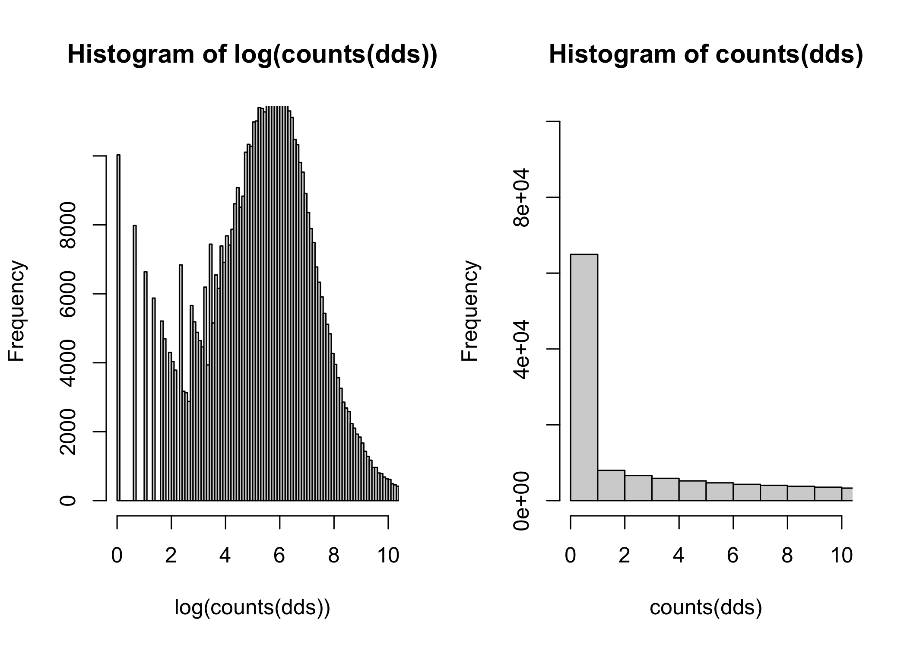
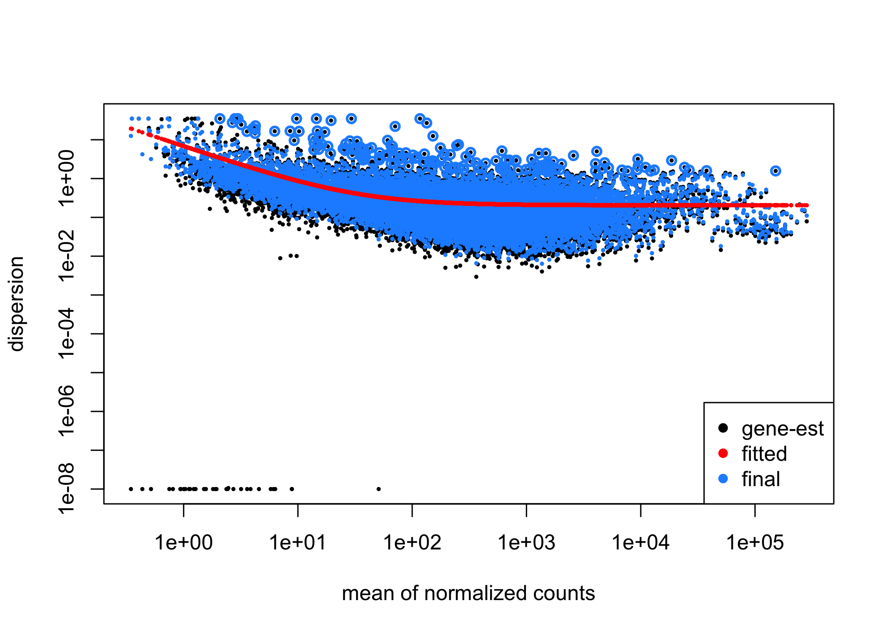
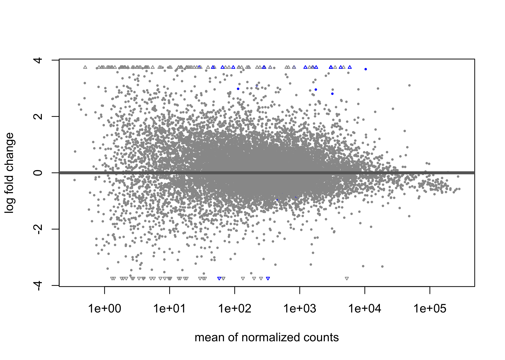
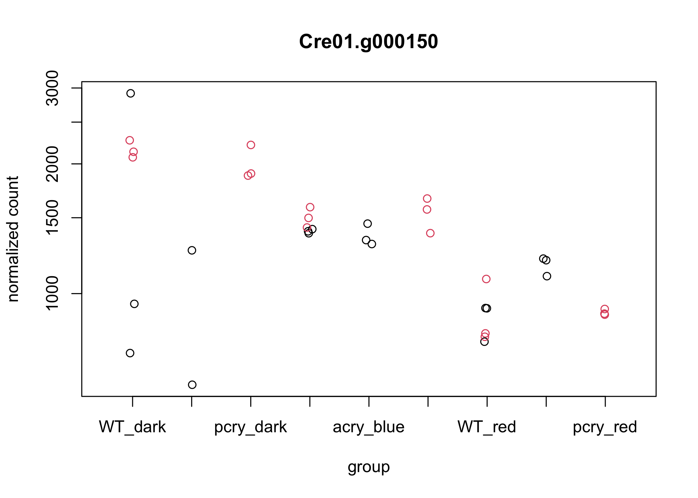
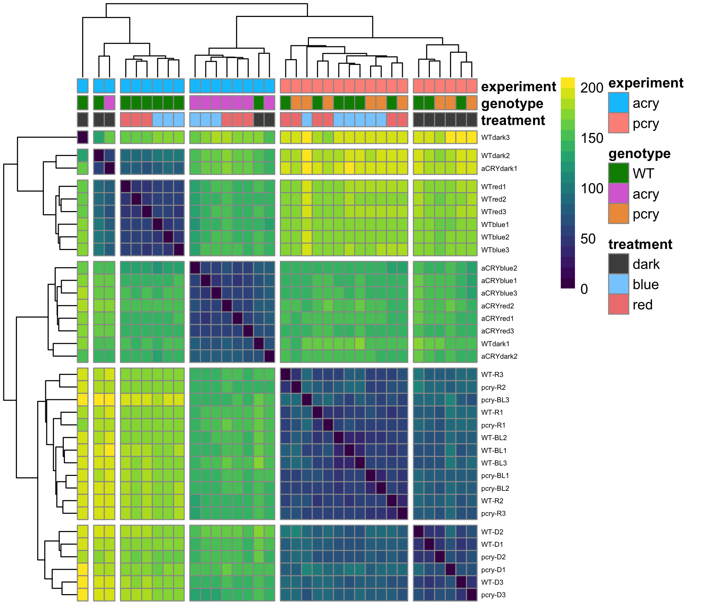
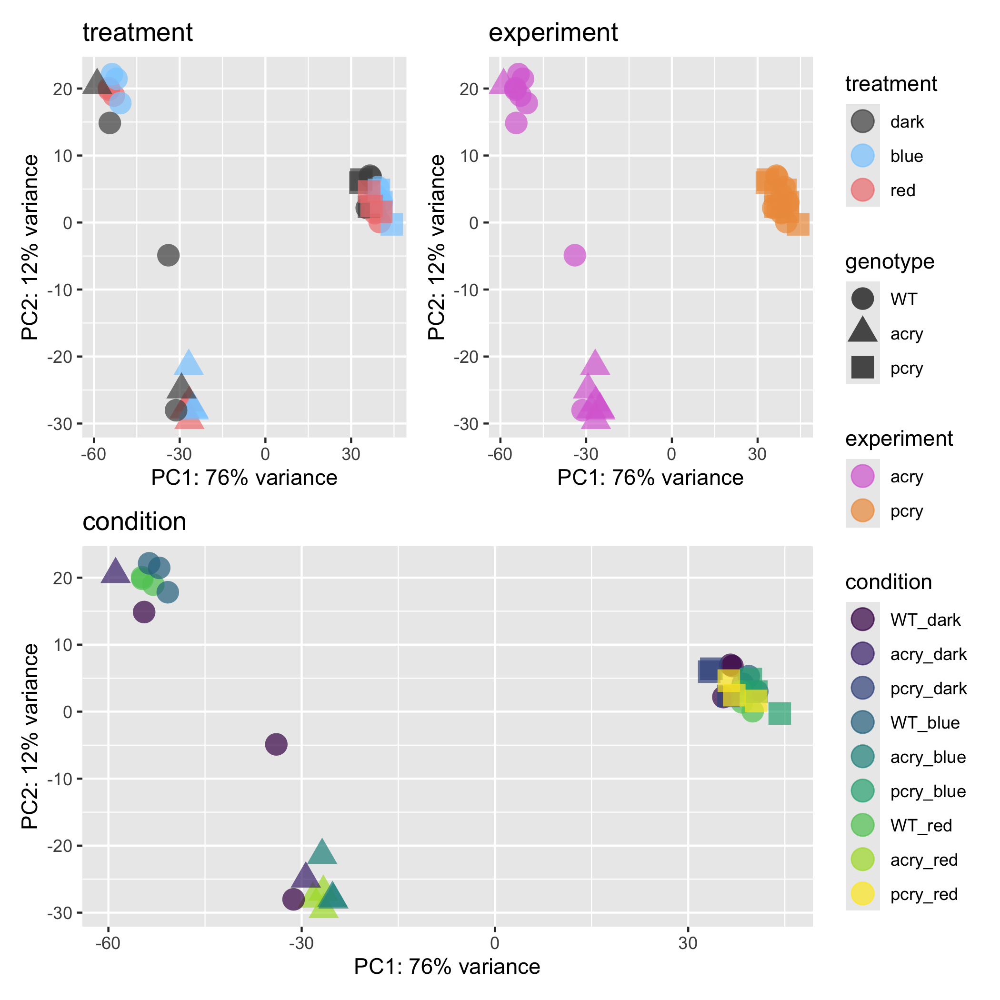
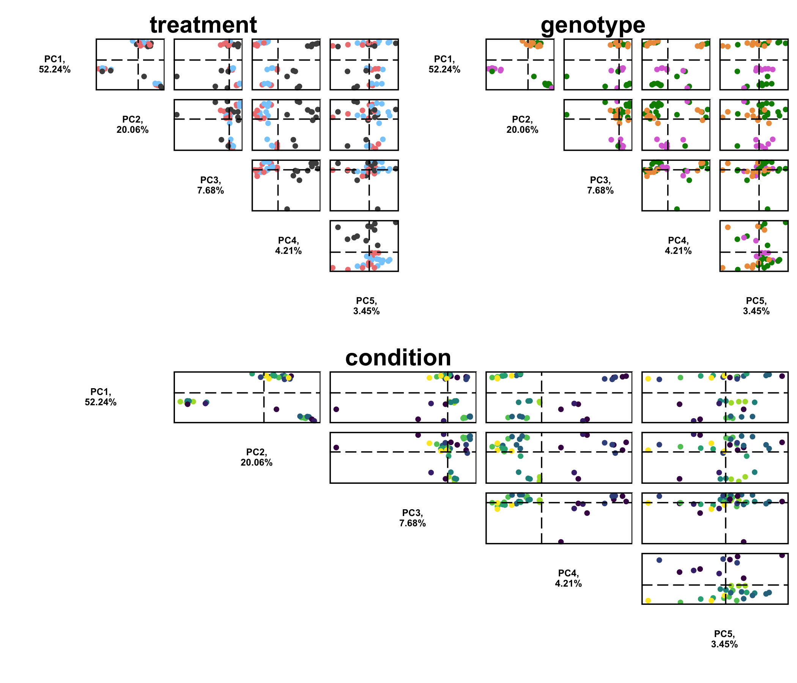
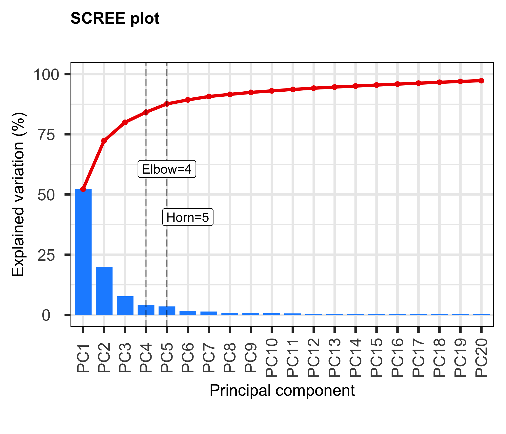
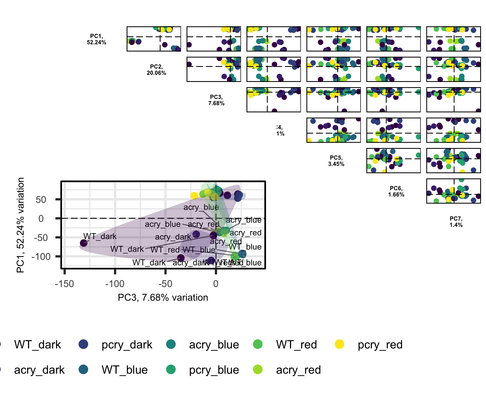
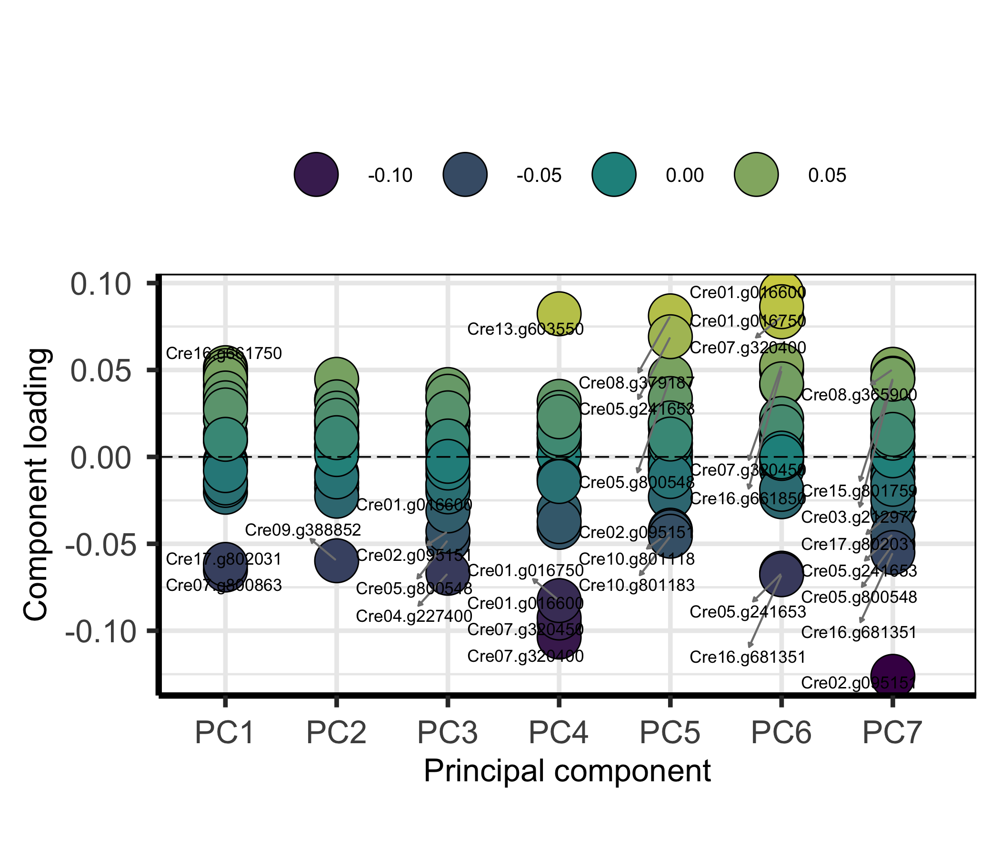

RNAseq aCRY pCRY data dive
================
Kelterborn
2024-04-19

- [Load System](#load-system)
  - [-R_libraries](#-r_libraries)
  - [-R_folders](#-r_folders)
- [1. Load aCRY & pCRY](#1-load-acry--pcry)
  - [- Tximeta files](#--tximeta-files)
  - [Run Deseq2](#run-deseq2)
- [2. Pre-Analysis](#2-pre-analysis)
  - [- Data transformations](#--data-transformations)
  - [- Check sample distance](#--check-sample-distance)
  - [- Perform principal component
    analysis](#--perform-principal-component-analysis)
  - [3. Plot counts](#3-plot-counts)

BiocManager::install(“ggalt”) \# , type=“source”

# Load System

## -R_libraries

``` r
library(PCAtools)
library(stringr)
library(R.utils)
library(RColorBrewer)
library(sessioninfo)
library(data.table)
library(plyr)
library(tidyverse)
library(tximeta)
library(tximport)
library(curl)
library(AnnotationHub)
library(DESeq2)
library(EnhancedVolcano)
library(pheatmap)
library(writexl)
library(biomaRt)
library(ape)
library(kableExtra)
library(knitr)

library(stringr)
library(R.utils)
library(RColorBrewer)

library(sessioninfo)
library(data.table)
library(plyr)
library(tidyverse)
library(tximeta)
library(tximport)
library(curl)
library(DESeq2)

library(SummarizedExperiment)
library(GenomicRanges)
library(ape)

library(viridis)
library(patchwork)
library(ggpubr)
library(vsn)
library(stringr)
library(R.utils)
library(RColorBrewer)


# library(wget)
```

## -R_folders

``` r
# Linux Workstation
ifelse(Sys.info()["sysname"]== "Linux",
       s <- "/mnt/s",
    ifelse(Sys.info()["sysname"]== "Darwin",
       s <- "/mnt/s",
       s <- "S:"))
```

    ##  sysname 
    ## "/mnt/s"

``` r
dir <- paste(s,"AG/AG-Scholz-NGS/Daten/Simon/Chlamy_RNASeq_aCRY",sep="/")
# list.files(dir) %>% head()
gitdir <- paste(dir,"git_Chlamy_RNAseq_aCRY",sep="/")
# list.files(gitdir) %>% head()

# Macbook
scriptdir <- rstudioapi::getSourceEditorContext()$path
gitdir <- scriptdir %>% dirname() %>% dirname()
dir <- gitdir %>% dirname()
```

# 1. Load aCRY & pCRY

## - Tximeta files

``` r
# Annotation file
load(file=paste(dir,"anno.RDS", sep="/"))

# Seq 1
tximeta_pcry_file <- "/Users/simonkelterborn/Library/CloudStorage/OneDrive-Charité-UniversitätsmedizinBerlin/NGS (RNA-Seq & CRISPR)/Chlamy RNA-Seq P3044/tximeta.txm"
load(file=tximeta_pcry_file)
gse_pcry <- gse

# Seq 2 (acry + cia5)
load(file=paste(dir,"tximeta.RDS", sep="/"))
gse_acry <- gse[,colData(gse)$experiment=="acry"]
colData(gse_acry) <- colData(gse_acry) %>% droplevels()
colData(gse_acry)$genotype <- colData(gse_acry)$genotype %>% relevel(ref="WT")

# combine
( mcols(gse_acry) == mcols(gse_pcry) ) %>% summary()
```

    ##    Mode    TRUE 
    ## logical   17616

``` r
# (( colData(gse_acry) %>% names() ) == ( colData(gse_pcry) %>% names() ) ) %>% summary()
names(colData(gse_pcry)) <- c("names","clientId","filename","clientName","genotype","treatment","condition","replicate","lane","RNA_conc","mappingrates")
colData(gse_acry) <- colData(gse_acry)[,c(1:4,7:12)]
colData(gse_pcry)$experiment <- "pcry"
colData(gse_pcry) <- colData(gse_pcry)[,c(1,3,2,4:6,8,12,7,11)]  
# (( colData(gse_acry) %>% names() ) == ( colData(gse_pcry) %>% names() ) ) %>% summary()

# now same metadata
gse <- cbind(gse_acry,gse_pcry)

colData(gse)$genotype
```

    ##  [1] acry acry acry WT   WT   WT   acry acry acry WT   WT   WT   WT   WT   WT  
    ## [16] acry acry WT   WT   WT   WT   WT   WT   WT   WT   WT   pcry pcry pcry pcry
    ## [31] pcry pcry pcry pcry pcry
    ## Levels: WT acry pcry

``` r
colData(gse)$treatment <- colData(gse)$treatment %>% str_replace(pattern="D", replacement = "dark") %>%
  str_replace(pattern="BL", replacement = "blue") %>%
  str_replace(pattern="R", replacement = "red") %>% factor(levels = c("dark","blue","red"))

colData(gse)$condition <- paste(colData(gse)$genotype,colData(gse)$treatment,sep="_") %>% factor(levels=c("WT_dark","acry_dark","pcry_dark","WT_blue","acry_blue","pcry_blue","WT_red","acry_red","pcry_red"))

colData(gse)$experiment
```

    ##  [1] acry acry acry acry acry acry acry acry acry acry acry acry acry acry acry
    ## [16] acry acry pcry pcry pcry pcry pcry pcry pcry pcry pcry pcry pcry pcry pcry
    ## [31] pcry pcry pcry pcry pcry
    ## Levels: acry pcry

## Run Deseq2

``` r
# design <- ~condition
design <- ~genotype+treatment+genotype:treatment

dds <- DESeqDataSet(gse, design=design)
colData(dds) %>% head() %>% kable()
```

|          | names                        | filename               | clientId | clientName | genotype | treatment | replicate | experiment | condition | mappingrates |
|:---------|:-----------------------------|:-----------------------|:---------|:-----------|:---------|:----------|:----------|:-----------|:----------|-------------:|
| aCRYred1 | Unknown_BU327-002T0001_quant | Unknown_BU327-002T0001 | 1.1      | aCRYred1   | acry     | red       | 1         | acry       | acry_red  |        69.74 |
| aCRYred2 | Unknown_BU327-002T0002_quant | Unknown_BU327-002T0002 | 1.2      | aCRYred2   | acry     | red       | 2         | acry       | acry_red  |        67.08 |
| aCRYred3 | Unknown_BU327-002T0003_quant | Unknown_BU327-002T0003 | 1.3      | aCRYred3   | acry     | red       | 3         | acry       | acry_red  |        69.49 |
| WTred1   | Unknown_BU327-002T0004_quant | Unknown_BU327-002T0004 | 2.1      | WTred1     | WT       | red       | 1         | acry       | WT_red    |        73.55 |
| WTred2   | Unknown_BU327-002T0005_quant | Unknown_BU327-002T0005 | 2.2      | WTred2     | WT       | red       | 2         | acry       | WT_red    |        75.63 |
| WTred3   | Unknown_BU327-002T0006_quant | Unknown_BU327-002T0006 | 2.3      | WTred3     | WT       | red       | 3         | acry       | WT_red    |        77.41 |

``` r
##########################################\n
# filter all rows with rowsum = 0 ####
par(mfrow=c(1,2))
hist(log(counts(dds)), breaks=100, ylim = c(0,11000), xlim = c(0,10))
hist(counts(dds), breaks=1000000, ylim = c(0,100000), xlim = c(0,10))
```

<!-- -->

``` r
# -> dip at log(counts(dds)=2-3)
par(mfrow=c(1,1))

# min counts
# at least 5 counts in 3 samples
keep.sn <- rowSums(counts(dds) >= 5) >= 3
keep.sn %>% summary()
```

    ##    Mode   FALSE    TRUE 
    ## logical    1267   16349

``` r
dds <- dds[keep.sn,]

dds <- estimateSizeFactors(dds)
dds
```

    ## class: DESeqDataSet 
    ## dim: 16349 35 
    ## metadata(14): tximetaInfo quantInfo ... txdbInfo version
    ## assays(4): counts abundance avgTxLength normalizationFactors
    ## rownames(16349): Cre01.g000050 Cre01.g000100 ... CreMt.g802343
    ##   CreMt.g802344
    ## rowData names(14): gene_id tx_ids ... Predalgo symbol
    ## colnames(35): aCRYred1 aCRYred2 ... RNA_17_S36 RNA_18_S37
    ## colData names(10): names filename ... condition mappingrates

``` r
head(assays(dds)[["counts"]])[1:5,1:5]
```

    ##               aCRYred1 aCRYred2 aCRYred3 WTred1 WTred2
    ## Cre01.g000050      354      285      333    279    350
    ## Cre01.g000100       26       14       38     37     40
    ## Cre01.g000150      985      978      918    469    626
    ## Cre01.g000200      396      372      273    266    363
    ## Cre01.g000250      727      562      885    259    357

``` r
length(rownames(counts(dds)))
```

    ## [1] 16349

``` r
# colData(dds) %>% head() %>% kable()
# add metadata
# colData(dds)$strain <- factor(colData(dds)$strain)

# ## combine technical replicates #####
# colData(dds)
# dds <- collapseReplicates(dds, dds$sampleid,dds$lane)
# colData(dds)
# dds$runsCollapsed
# colnames(dds)
# matchFirstLevel <- dds$sampleid == levels(factor(dds$sampleid))[1]
# all(rowSums(counts(dds[,matchFirstLevel])) == counts(dds[,1]))

###########
# run DESeq
dds <- DESeq(dds)

plotDispEsts(dds)
```

<!-- -->

``` r
resultsNames(dds)
```

    ## [1] "Intercept"                  "genotype_acry_vs_WT"       
    ## [3] "genotype_pcry_vs_WT"        "treatment_blue_vs_dark"    
    ## [5] "treatment_red_vs_dark"      "genotypeacry.treatmentblue"
    ## [7] "genotypepcry.treatmentblue" "genotypeacry.treatmentred" 
    ## [9] "genotypepcry.treatmentred"

``` r
DESeq2::plotMA(dds)
```

<!-- -->

``` r
plotCounts(dds, gene = "Cre01.g000150", intgroup = "condition", col=colData(dds)$experiment)
```

<!-- -->

``` r
head(mcols(dds)$geneSymbol)
```

    ## [1] "RWP14" ""      "ZRT2"  ""      ""      "CGI58"

``` r
###############
# save dds #####

save(dds, file = paste(dir,"dds_acry_pcry.RDS",sep="/"), compress = FALSE)
# save(dds, file = paste(dir,"dds_acry.RDS",sep="/"), compress = FALSE)
# load(paste(dir,"dds.RDS",sep="/"))
# dds
```

# 2. Pre-Analysis

### - Data transformations

``` r
# load(file=paste(data,"rlog.rld", sep="/"))
meanSdPlot(counts(dds, normalized =TRUE))
meanSdPlot(assay(ntd))
meanSdPlot(assay(vsd))
meanSdPlot(assay(rld))
```


### - Check sample distance

    ##  [1] red  red  red  red  red  red  blue blue blue blue blue blue dark dark dark
    ## [16] dark dark dark dark dark blue blue blue red  red  red  dark dark dark blue
    ## [31] blue blue red  red  red 
    ## Levels: dark blue red



### - Perform principal component analysis



###### – Advanced PCA

    ## PC4 
    ##   4



### 3. Plot counts

#### 

``` r
sessionInfo()
```

    ## R version 4.3.3 (2024-02-29)
    ## Platform: aarch64-apple-darwin20 (64-bit)
    ## Running under: macOS Sonoma 14.4.1
    ## 
    ## Matrix products: default
    ## BLAS:   /Library/Frameworks/R.framework/Versions/4.3-arm64/Resources/lib/libRblas.0.dylib 
    ## LAPACK: /Library/Frameworks/R.framework/Versions/4.3-arm64/Resources/lib/libRlapack.dylib;  LAPACK version 3.11.0
    ## 
    ## locale:
    ## [1] en_US.UTF-8/en_US.UTF-8/en_US.UTF-8/C/en_US.UTF-8/en_US.UTF-8
    ## 
    ## time zone: Europe/Berlin
    ## tzcode source: internal
    ## 
    ## attached base packages:
    ## [1] stats4    stats     graphics  grDevices utils     datasets  methods  
    ## [8] base     
    ## 
    ## other attached packages:
    ##  [1] vsn_3.70.0                  ggpubr_0.6.0               
    ##  [3] patchwork_1.2.0             viridis_0.6.5              
    ##  [5] viridisLite_0.4.2           knitr_1.46                 
    ##  [7] kableExtra_1.4.0            ape_5.8                    
    ##  [9] biomaRt_2.58.2              writexl_1.5.0              
    ## [11] pheatmap_1.0.12             EnhancedVolcano_1.20.0     
    ## [13] DESeq2_1.42.1               SummarizedExperiment_1.32.0
    ## [15] Biobase_2.62.0              MatrixGenerics_1.14.0      
    ## [17] matrixStats_1.3.0           GenomicRanges_1.54.1       
    ## [19] GenomeInfoDb_1.38.8         IRanges_2.36.0             
    ## [21] S4Vectors_0.40.2            AnnotationHub_3.10.1       
    ## [23] BiocFileCache_2.10.2        dbplyr_2.5.0               
    ## [25] BiocGenerics_0.48.1         curl_5.2.1                 
    ## [27] tximport_1.30.0             tximeta_1.20.3             
    ## [29] lubridate_1.9.3             forcats_1.0.0              
    ## [31] dplyr_1.1.4                 purrr_1.0.2                
    ## [33] readr_2.1.5                 tidyr_1.3.1                
    ## [35] tibble_3.2.1                tidyverse_2.0.0            
    ## [37] plyr_1.8.9                  data.table_1.15.4          
    ## [39] sessioninfo_1.2.2           RColorBrewer_1.1-3         
    ## [41] R.utils_2.12.3              R.oo_1.26.0                
    ## [43] R.methodsS3_1.8.2           stringr_1.5.1              
    ## [45] PCAtools_2.14.0             ggrepel_0.9.5              
    ## [47] ggplot2_3.5.0              
    ## 
    ## loaded via a namespace (and not attached):
    ##   [1] later_1.3.2                   BiocIO_1.12.0                
    ##   [3] bitops_1.0-7                  filelock_1.0.3               
    ##   [5] preprocessCore_1.64.0         XML_3.99-0.16.1              
    ##   [7] lifecycle_1.0.4               rstatix_0.7.2                
    ##   [9] MASS_7.3-60.0.1               lattice_0.22-6               
    ##  [11] ensembldb_2.26.1              backports_1.4.1              
    ##  [13] magrittr_2.0.3                limma_3.58.1                 
    ##  [15] rmarkdown_2.26                yaml_2.3.8                   
    ##  [17] httpuv_1.6.15                 cowplot_1.1.3                
    ##  [19] DBI_1.2.2                     maps_3.4.2                   
    ##  [21] abind_1.4-5                   zlibbioc_1.48.2              
    ##  [23] AnnotationFilter_1.26.0       RCurl_1.98-1.14              
    ##  [25] rappdirs_0.3.3                GenomeInfoDbData_1.2.11      
    ##  [27] irlba_2.3.5.1                 dqrng_0.3.2                  
    ##  [29] svglite_2.1.3                 DelayedMatrixStats_1.24.0    
    ##  [31] codetools_0.2-20              DelayedArray_0.28.0          
    ##  [33] xml2_1.3.6                    tidyselect_1.2.1             
    ##  [35] farver_2.1.1                  ScaledMatrix_1.10.0          
    ##  [37] ash_1.0-15                    GenomicAlignments_1.38.2     
    ##  [39] jsonlite_1.8.8                systemfonts_1.0.6            
    ##  [41] tools_4.3.3                   progress_1.2.3               
    ##  [43] Rcpp_1.0.12                   glue_1.7.0                   
    ##  [45] Rttf2pt1_1.3.12               gridExtra_2.3                
    ##  [47] SparseArray_1.2.4             xfun_0.43                    
    ##  [49] withr_3.0.0                   BiocManager_1.30.22          
    ##  [51] fastmap_1.1.1                 fansi_1.0.6                  
    ##  [53] digest_0.6.35                 rsvd_1.0.5                   
    ##  [55] timechange_0.3.0              R6_2.5.1                     
    ##  [57] mime_0.12                     colorspace_2.1-0             
    ##  [59] RSQLite_2.3.6                 hexbin_1.28.3                
    ##  [61] utf8_1.2.4                    generics_0.1.3               
    ##  [63] rtracklayer_1.62.0            prettyunits_1.2.0            
    ##  [65] httr_1.4.7                    S4Arrays_1.2.1               
    ##  [67] pkgconfig_2.0.3               gtable_0.3.4                 
    ##  [69] blob_1.2.4                    XVector_0.42.0               
    ##  [71] htmltools_0.5.8.1             carData_3.0-5                
    ##  [73] ProtGenerics_1.34.0           scales_1.3.0                 
    ##  [75] png_0.1-8                     rstudioapi_0.16.0            
    ##  [77] tzdb_0.4.0                    reshape2_1.4.4               
    ##  [79] rjson_0.2.21                  nlme_3.1-164                 
    ##  [81] cachem_1.0.8                  KernSmooth_2.23-22           
    ##  [83] BiocVersion_3.18.1            parallel_4.3.3               
    ##  [85] extrafont_0.19                AnnotationDbi_1.64.1         
    ##  [87] restfulr_0.0.15               pillar_1.9.0                 
    ##  [89] grid_4.3.3                    vctrs_0.6.5                  
    ##  [91] promises_1.3.0                BiocSingular_1.18.0          
    ##  [93] car_3.1-2                     beachmat_2.18.1              
    ##  [95] xtable_1.8-4                  extrafontdb_1.0              
    ##  [97] evaluate_0.23                 GenomicFeatures_1.54.4       
    ##  [99] cli_3.6.2                     locfit_1.5-9.9               
    ## [101] compiler_4.3.3                Rsamtools_2.18.0             
    ## [103] rlang_1.1.3                   crayon_1.5.2                 
    ## [105] ggsignif_0.6.4                labeling_0.4.3               
    ## [107] affy_1.80.0                   stringi_1.8.3                
    ## [109] BiocParallel_1.36.0           ggalt_0.4.0                  
    ## [111] munsell_0.5.1                 Biostrings_2.70.3            
    ## [113] lazyeval_0.2.2                proj4_1.0-14                 
    ## [115] Matrix_1.6-5                  hms_1.1.3                    
    ## [117] sparseMatrixStats_1.14.0      bit64_4.0.5                  
    ## [119] statmod_1.5.0                 KEGGREST_1.42.0              
    ## [121] shiny_1.8.1.1                 highr_0.10                   
    ## [123] interactiveDisplayBase_1.40.0 broom_1.0.5                  
    ## [125] memoise_2.0.1                 affyio_1.72.0                
    ## [127] bit_4.0.5
