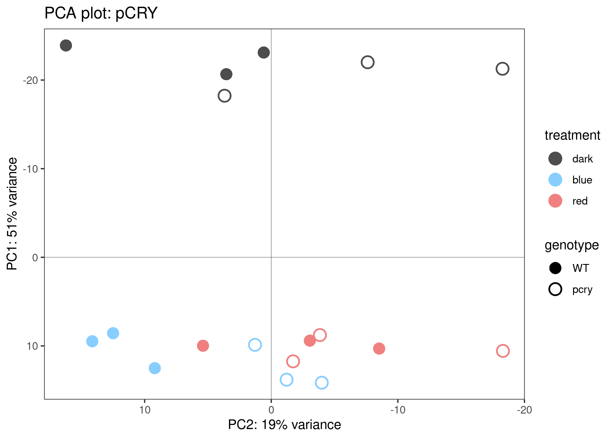
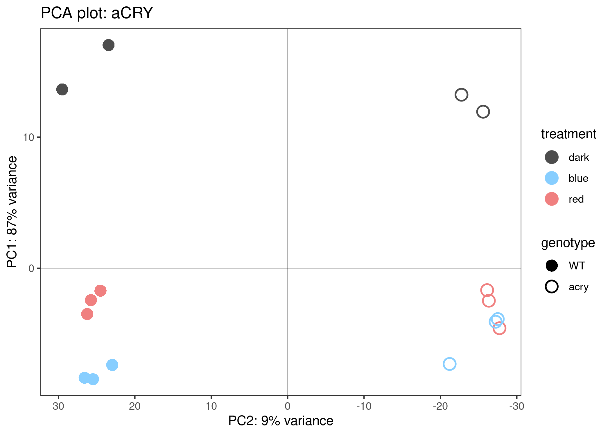
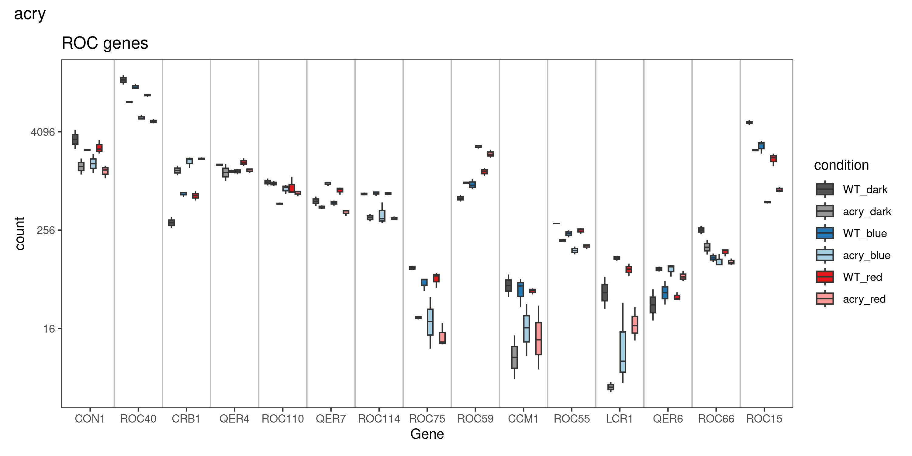
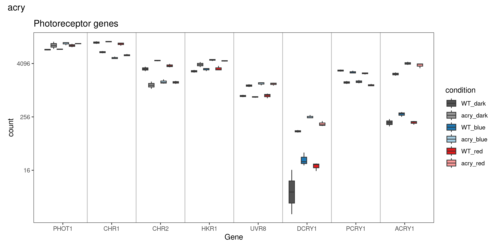
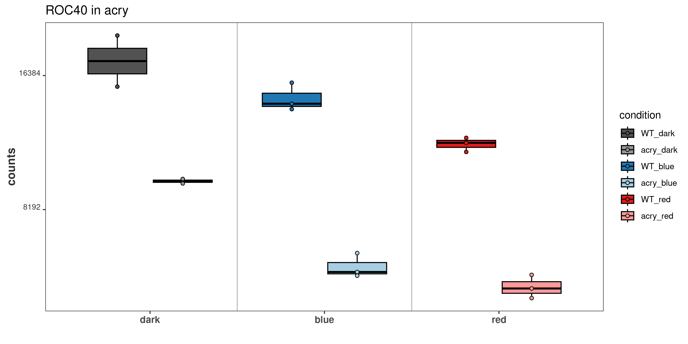
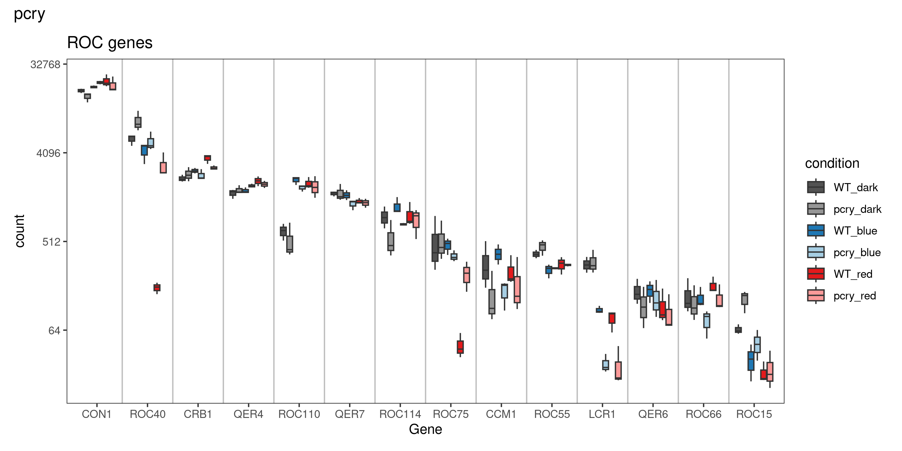
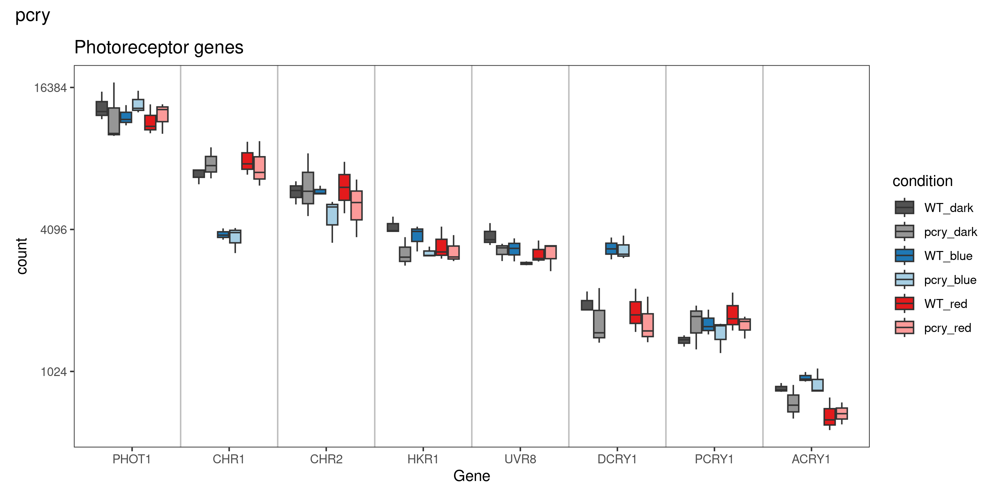
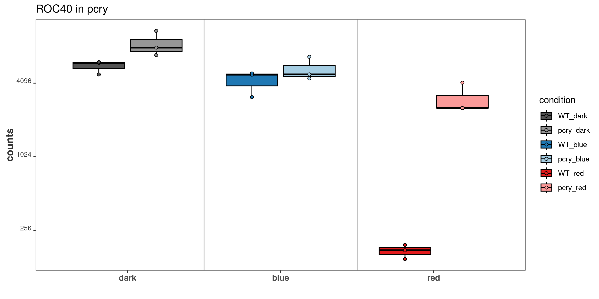
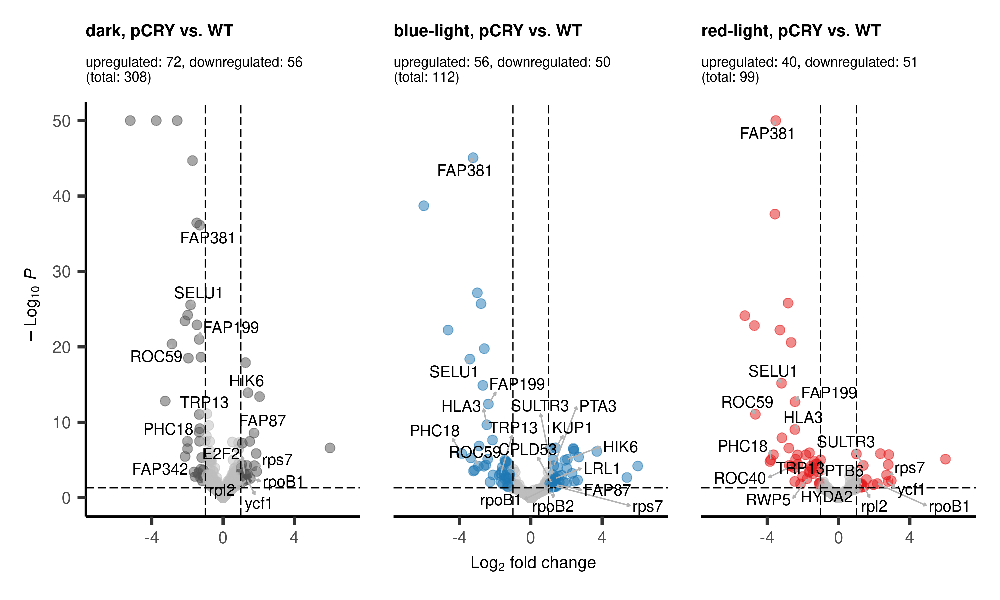

figures_manuscript
================
2024-10-17

- [run prepare_data scripts](#run-prepare_data-scripts)
- [Fig 1: PCA](#fig-1-pca)
- [Fig 2: Counts](#fig-2-counts)
- [Fig 3: Volcanos](#fig-3-volcanos)
- [Fig 4: Overlaps](#fig-4-overlaps)
  - [Fig 4a: Venns](#fig-4a-venns)
  - [Fig 4b: groups](#fig-4b-groups)
- [Fig. 3: Grouping](#fig-3-grouping)

BiocManager::install()

# run prepare_data scripts

# Fig 1: PCA

``` r
fig <- "Fig1"

# group
for (dds in dds_list) {
vsd <- vst(dds, blind=FALSE)
# colData(dds)
### PCA with top 500 genes with highest row variance 
pcaData <- plotPCA(vsd, intgroup=c("treatment", "genotype","condition"), returnData=TRUE,)
percentVar <- round(100 * attr(pcaData, "percentVar"))

g1 <- ggplot(pcaData, aes(PC1, PC2, color=treatment, shape=genotype)) +
  geom_hline(yintercept = 0, linewidth = 0.1) + 
  geom_vline(xintercept = 0, linewidth = 0.1) +
  geom_point(size=4, stroke = 1) +
  scale_shape_manual(values = c(16,21)) + 
  labs(title = "PCA plot") +
  ylab(paste0("PC1: ",percentVar[1],"% variance")) +
  xlab(paste0("PC2: ",percentVar[2],"% variance")) + 
  scale_color_manual(values = anno_colors$treatment) +
  # coord_fixed() +
  scale_x_reverse() +
  theme_bw() +
  removeGrid(x=T, y=T)
}

# pCRY
dds <- dds_list[["pcry"]]
vsd <- vst(dds, blind=FALSE)

pcaData <- plotPCA(vsd, intgroup=c("treatment", "genotype","condition"), returnData=TRUE,)
percentVar <- round(100 * attr(pcaData, "percentVar"))
g1 <- ggplot(pcaData, aes(PC2, PC1, color=treatment, shape=genotype)) +
  geom_hline(yintercept = 0, linewidth = 0.1) + 
  geom_vline(xintercept = 0, linewidth = 0.1) +
  geom_point(size=4, stroke = 1) +
  scale_shape_manual(values = c(16,21)) + 
  labs(title = "PCA plot: pCRY") +
  ylab(paste0("PC1: ",percentVar[1],"% variance")) +
  xlab(paste0("PC2: ",percentVar[2],"% variance")) + 
  scale_color_manual(values = anno_colors$treatment) +
  # coord_fixed() +
  scale_x_reverse() +
  scale_y_reverse() +
  theme_bw() +
  removeGrid(x=T, y=T)
g1

ggsave(paste(fig,"_",colData(dds)$experiment[1],"_PCA.pdf",sep=""), plot = g1,
width = 6,
height = 6)

# aCRY
dds <- dds_list[["acry"]]
vsd <- vst(dds, blind=FALSE)
pcaData <- plotPCA(vsd, intgroup=c("treatment", "genotype","condition"), returnData=TRUE,)
percentVar <- round(100 * attr(pcaData, "percentVar"))
g2 <- ggplot(pcaData, aes(PC1, PC2, color=treatment, shape=genotype)) +
  geom_hline(yintercept = 0, linewidth = 0.1) + 
  geom_vline(xintercept = 0, linewidth = 0.1) +
  geom_point(size=4, stroke = 1) +
  scale_shape_manual(values = c(16,21)) + 
  labs(title = "PCA plot: aCRY") +
  ylab(paste0("PC1: ",percentVar[1],"% variance")) +
  xlab(paste0("PC2: ",percentVar[2],"% variance")) + 
  scale_color_manual(values = anno_colors$treatment) +
  # coord_fixed() +
  scale_x_reverse() +
  theme_bw() +
  removeGrid(x=T, y=T)
g2

ggsave(paste(fig,"_",colData(dds)$experiment[1],"_PCA.pdf",sep=""), plot = g2,
width = 6,
height = 6)
```



# Fig 2: Counts

<!-- --><!-- --><!-- --><!-- --><!-- --><!-- -->

# Fig 3: Volcanos

``` r
fig <- "Fig3"

dds <- dds_list[["pcry"]]

res_ashr_list %>% names()
```

    ## [1] "acry" "pcry"

``` r
res_ashr_list[[1]] %>% names()
```

    ##  [1] "WT_BL.vs.D"           "WT_R.vs.D"            "acry_BL.vs.D"        
    ##  [4] "acry_R.vs.D"          "acry_D.vs.WT_D"       "acry_BL.vs.WT_BL"    
    ##  [7] "acry_R.vs.WT_R"       "acry_BLvD.vs.WT_BLvD" "acry_RvD.vs.WT_RvD"  
    ## [10] "BL+R.vs.D"            "BL.vs.D"              "R.vs.D"              
    ## [13] "acry.vs.WT"

``` r
res <- res_ashr_list$pcry$pcry_R.vs.WT_R
res_n <- res_list$pcry$pcry_R.vs.WT_R

# of shrinked results
total <- subset(res, padj< 0.05) %>% nrow()
up <- subset(res, padj< 0.05 & log2FoldChange > 1) %>% nrow()
down <- subset(res, padj< 0.05 & log2FoldChange < -1) %>% nrow()

# of "true" results
total <- subset(res_n, padj< 0.05) %>% nrow()
up <- subset(res_n, padj< 0.05 & log2FoldChange > 1) %>% nrow()
down <- subset(res_n, padj< 0.05 & log2FoldChange < -1) %>% nrow()

# points outside the grid
subset(res, padj < 10^-50 | log2FoldChange > 6 | log2FoldChange < -6)
```

    ## log2 fold change (MMSE): genotype_pcry_vs_WT vs genotypepcry.treatmentred 
    ## Wald test p-value: genotype_pcry_vs_WT vs genotypepcry.treatmentred 
    ## DataFrame with 2 rows and 5 columns
    ##                baseMean log2FoldChange     lfcSE      pvalue        padj
    ##               <numeric>      <numeric> <numeric>   <numeric>   <numeric>
    ## Cre16.g681750 2907.4406       -3.51641   0.22216 2.99151e-57 4.79270e-53
    ## Cre17.g802135   46.8587       36.40049   7.35075 1.00156e-08 7.64096e-06

``` r
#                 baseMean log2FoldChange     lfcSE      pvalue        padj
#               <numeric>      <numeric> <numeric>   <numeric>   <numeric>
# Cre16.g681750 2907.4406       -3.51641   0.22216 2.99151e-57 4.79270e-53
# Cre17.g802135   46.8587       36.40049   7.35075 1.00156e-08 7.64096e-06

res["Cre16.g681750","padj"] <- 10^-50
res["Cre17.g802135","log2FoldChange"] <- 6

mcols(dds_list[["pcry"]]) %>% nrow()
```

    ## [1] 16025

``` r
res %>% nrow()
```

    ## [1] 16025

``` r
volcano_red <- EnhancedVolcano(res,
    lab = mcols(dds_list[["pcry"]])[["geneSymbol"]],
    x = 'log2FoldChange',
    y = 'padj',
    col=c("grey","grey","grey",group.colors[5]),
    title = "red-light, pCRY vs. WT",
    titleLabSize = 12,
    subtitle = paste0("upregulated: ",up,", downregulated: ",down,"\n(total: ",total,")"),
#    subtitle = {},
    subtitleLabSize = 10,
    caption = NULL,
    xlim = c(-7,7),
    ylim = c(0,50),
    pCutoff = 0.05,
    FCcutoff = 1,
    maxoverlapsConnectors = 40,
    drawConnectors = TRUE,
    widthConnectors = 0.5,
    colConnectors = "grey70",
    legendLabels=c('ns','ns','ns',
      'padj < 0.05 & Log2FC > 1'),
    labSize = 4,
    axisLabSize = 12,
    legendLabSize = 12,
    legendIconSize = 4,
    gridlines.major = FALSE,
    gridlines.minor = FALSE,
    pointSize = 3
)
# volcano_red


# blue

res_ashr_list %>% names()
```

    ## [1] "acry" "pcry"

``` r
res_ashr_list[[1]] %>% names()
```

    ##  [1] "WT_BL.vs.D"           "WT_R.vs.D"            "acry_BL.vs.D"        
    ##  [4] "acry_R.vs.D"          "acry_D.vs.WT_D"       "acry_BL.vs.WT_BL"    
    ##  [7] "acry_R.vs.WT_R"       "acry_BLvD.vs.WT_BLvD" "acry_RvD.vs.WT_RvD"  
    ## [10] "BL+R.vs.D"            "BL.vs.D"              "R.vs.D"              
    ## [13] "acry.vs.WT"

``` r
res <- res_ashr_list$pcry$pcry_BL.vs.WT_BL
res_n <- res_list$pcry$pcry_BL.vs.WT_BL

# of "true" results
total <- subset(res_n, padj< 0.05) %>% nrow()
up <- subset(res_n, padj< 0.05 & log2FoldChange > 1) %>% nrow()
down <- subset(res_n, padj< 0.05 & log2FoldChange < -1) %>% nrow()

# points outside the grid

pmax <- 10^-50
l2FCmax <- 6
subset(res, padj < pmax | log2FoldChange > l2FCmax | log2FoldChange < -l2FCmax)
```

    ## log2 fold change (MMSE): genotype_pcry_vs_WT vs genotypepcry.treatmentblue 
    ## Wald test p-value: genotype_pcry_vs_WT vs genotypepcry.treatmentblue 
    ## DataFrame with 2 rows and 5 columns
    ##                baseMean log2FoldChange     lfcSE      pvalue        padj
    ##               <numeric>      <numeric> <numeric>   <numeric>   <numeric>
    ## Cre16.g681351  832.7918       -7.23829  0.542337 2.45994e-43 1.97053e-39
    ## Cre17.g802135   46.8587       31.46966 10.691240 1.26348e-07 6.32568e-05

``` r
res[res$log2FoldChange > l2FCmax,]$log2FoldChange <- l2FCmax
res[res$log2FoldChange < -l2FCmax,]$log2FoldChange <- -l2FCmax
# res[res$padj < pmax,]$padj <- pmax

subset(res, padj < pmax | log2FoldChange > l2FCmax | log2FoldChange < -l2FCmax)
```

    ## log2 fold change (MMSE): genotype_pcry_vs_WT vs genotypepcry.treatmentblue 
    ## Wald test p-value: genotype_pcry_vs_WT vs genotypepcry.treatmentblue 
    ## DataFrame with 0 rows and 5 columns

``` r
mcols(dds_list[["pcry"]]) %>% nrow()
```

    ## [1] 16025

``` r
res %>% nrow()
```

    ## [1] 16025

``` r
volcano_blue <- EnhancedVolcano(res,
    lab = mcols(dds_list[["pcry"]])[["geneSymbol"]],
    x = 'log2FoldChange',
    y = 'padj',
    col=c("grey","grey","grey",group.colors[3]),
    title = "blue-light, pCRY vs. WT",
    titleLabSize = 12,
    subtitle = paste0("upregulated: ",up,", downregulated: ",down,"\n(total: ",total,")"),
#    subtitle = {},
    subtitleLabSize = 10,
    caption = NULL,
    xlim = c(-7,7),
    ylim = c(0,50),
    pCutoff = 0.05,
    FCcutoff = 1,
    maxoverlapsConnectors = 40,
    drawConnectors = TRUE,
    widthConnectors = 0.5,
    colConnectors = "grey70",
    legendLabels=c('ns','ns','ns',
      'padj < 0.05 & Log2FC > 1'),
    labSize = 4,
    axisLabSize = 12,
    legendLabSize = 12,
    legendIconSize = 4,
    gridlines.major = FALSE,
    gridlines.minor = FALSE,
    pointSize = 3
)
# volcano_blue


# dark

res_ashr_list %>% names()
```

    ## [1] "acry" "pcry"

``` r
res_ashr_list[[2]] %>% names()
```

    ##  [1] "WT_BL.vs.D"           "WT_R.vs.D"            "pcry_BL.vs.D"        
    ##  [4] "pcry_R.vs.D"          "pcry_D.vs.WT_D"       "pcry_BL.vs.WT_BL"    
    ##  [7] "pcry_R.vs.WT_R"       "pcry_BLvD.vs.WT_BLvD" "pcry_RvD.vs.WT_RvD"  
    ## [10] "BL+R.vs.D"            "BL.vs.D"              "R.vs.D"              
    ## [13] "pcry.vs.WT"

``` r
res <- res_ashr_list$pcry$pcry_D.vs.WT_D
res_n <- res_list$pcry$pcry_D.vs.WT_D

# of "true" results
total <- subset(res_n, padj< 0.05) %>% nrow()
up <- subset(res_n, padj< 0.05 & log2FoldChange > 1) %>% nrow()
down <- subset(res_n, padj< 0.05 & log2FoldChange < -1) %>% nrow()

# points outside the grid

pmax <- 10^-50
l2FCmax <- 6
subset(res, padj < pmax | log2FoldChange > l2FCmax | log2FoldChange < -l2FCmax)
```

    ## log2 fold change (MMSE): genotype_pcry_vs_WT effect 
    ## Wald test p-value: genotype_pcry_vs_WT effect 
    ## DataFrame with 5 rows and 5 columns
    ##                baseMean log2FoldChange     lfcSE       pvalue         padj
    ##               <numeric>      <numeric> <numeric>    <numeric>    <numeric>
    ## Cre07.g329750 3682.6278       -2.57541  0.119550 1.19696e-105 9.58823e-102
    ## Cre09.g801064  331.7958      -19.94522  9.784809           NA           NA
    ## Cre12.g486400  256.7333       -3.74956  0.212386  2.51477e-73  1.34297e-69
    ## Cre16.g681351  832.7918       -5.20782  0.226776 3.67114e-119 5.88154e-115
    ## Cre17.g802135   46.8587       18.23852  2.998280  5.37694e-10  2.53365e-07

``` r
res[res$log2FoldChange > l2FCmax,]$log2FoldChange <- l2FCmax
res[res$log2FoldChange < -l2FCmax,]$log2FoldChange <- -l2FCmax
res[subset(res, padj < pmax) %>% rownames(),]$padj <- pmax

subset(res, padj < pmax | log2FoldChange > l2FCmax | log2FoldChange < -l2FCmax)
```

    ## log2 fold change (MMSE): genotype_pcry_vs_WT effect 
    ## Wald test p-value: genotype_pcry_vs_WT effect 
    ## DataFrame with 0 rows and 5 columns

``` r
mcols(dds_list[["pcry"]]) %>% nrow()
```

    ## [1] 16025

``` r
res %>% nrow()
```

    ## [1] 16025

``` r
volcano_dark <- EnhancedVolcano(res,
    lab = mcols(dds_list[["pcry"]])[["geneSymbol"]],
    x = 'log2FoldChange',
    y = 'padj',
    col=c("grey","grey","grey",group.colors[1]),
    title = "dark, pCRY vs. WT",
    titleLabSize = 12,
    subtitle = paste0("upregulated: ",up,", downregulated: ",down,"\n(total: ",total,")"),
#    subtitle = {},
    subtitleLabSize = 10,
    caption = NULL,
    xlim = c(-7,7),
    ylim = c(0,50),
    pCutoff = 0.05,
    FCcutoff = 1,
    maxoverlapsConnectors = 40,
    drawConnectors = TRUE,
    widthConnectors = 0.5,
    colConnectors = "grey70",
    legendLabels=c('ns','ns','ns',
      'padj < 0.05 & Log2FC > 1'),
    labSize = 4,
    axisLabSize = 12,
    legendLabSize = 12,
    legendIconSize = 4,
    gridlines.major = FALSE,
    gridlines.minor = FALSE,
    pointSize = 3
)
# volcano_dark

volcanos_all <- volcano_dark + volcano_blue + volcano_red +
  plot_layout(guides = "collect", axes="collect", axis_titles="collect") & 
  theme(legend.position = 'none', axis.title=element_text(size=12))
volcanos_all
```

<!-- -->

``` r
ggsave(paste(fig,"_",colData(dds)$experiment[1],"_Volcanos.pdf",sep=""), plot = volcanos_all,
width = 10,
height = 6)
```

# Fig 4: Overlaps

## Fig 4a: Venns

``` r
fig <- "Fig4"

res_list[["pcry"]] %>% names()
#  "pcry_D.vs.WT_D"       "pcry_BL.vs.WT_BL"     "pcry_R.vs.WT_R"      
DEGs <- list(dark = res_list$pcry$pcry_D.vs.WT_D %>% subset(padj < 0.05 & (log2FoldChange > 1 | log2FoldChange < -1 )),
             blue = res_list$pcry$pcry_BL.vs.WT_BL %>% subset(padj < 0.05 & (log2FoldChange > 1 | log2FoldChange < -1 )),
             red =res_list$pcry$pcry_R.vs.WT_R %>% subset(padj < 0.05 & (log2FoldChange > 1 | log2FoldChange < -1 )))
DEGs <- lapply(DEGs,data.frame)
DEGs_genes <- lapply(DEGs,rownames)

venn.ol <- calculate.overlap(DEGs_genes)
venn.ol %>% lapply(length)

input_list <- DEGs_genes

plt <- venn.diagram(
    x = input_list,
    inverted=TRUE,
    # total.population = TRUE,
    filename = NULL,
    fontfamily ="Arial",
    lwd = 2,
    lty = 'blank',
    fill = group.colors[c(2,4,6)],
    category.names = paste0(names(input_list),"\n(",lapply(input_list,length),")"),
#    cat.col=cols2d[c(1,2)],
    cat.fontface = "bold",
    cat.fontfamily = "arial",
#    cat.pos = c(+30,-30),
#    cat.dist = c(0.12, 0.12),
    disable.logging = TRUE
)

wrap_elements(plt) + plot_annotation(caption = paste0("pCRY"))
```

## Fig 4b: groups

``` r
res_
DEGs_comb <- bind_cols(DEGs[[1]],DEGs[[2]],DEGs[[3]])
```

# Fig. 3: Grouping

``` r
p_new2 <- ggplot(deg_table, aes(x=XX.log2FC, y=XY.log2FC,color=group, fill=group)) + 
  geom_polygon(data = xyup, aes(x=x,y=y),color=cols2l[2],fill=cols2l[2], alpha=0.2) +
  geom_polygon(data = xydo, aes(x=x,y=y),color=cols2l[2],fill=cols2l[2], alpha=0.8) +
  geom_polygon(data = xxdo, aes(x=x,y=y),color=cols2l[1],fill=cols2l[1], alpha=0.8) +
  geom_polygon(data = xxup, aes(x=x,y=y),color=cols2l[1],fill=cols2l[1], alpha=0.2) +
  annotate("text", x= text$x,y= text$y,label = paste(text$label,text$size,sep="\n"), color=text$color,size=3 , fontface="bold") +
  geom_hline(yintercept = 0, linewidth = 0.1) + 
  geom_vline(xintercept = 0, linewidth = 0.1) +
  geom_point(shape=21) + 
  scale_color_manual(values=alpha(c(cols2d[1],cols2d[1], cols2d[2],cols2d[2],rep(colsp,2),rep(colsap,2)),0.8)) +
  scale_fill_manual(values=alpha(c(cols2d[1],cols2d[1], cols2d[2],cols2d[2],rep(colsp,2),rep(colsap,2)),0.3)) +
#  scale_color_manual(values = text$color) +
  coord_cartesian(xlim=c(-10,10),ylim = c(-10,10)) +
  theme_bw() +
  removeGrid(x=T, y=T)

p_new2 + scale_fill_manual(values=c(cols2d[1],cols2d[1], cols2d[2],cols2d[2],alpha(c(rep(colsp,2),rep(colsap,2)),0.3))) 
```
