figures_manuscript
================
2024-10-17

- [run prepare_data scripts](#run-prepare_data-scripts)
- [Fig 1: PCA](#fig-1-pca)
- [Fig 2: Counts](#fig-2-counts)
  - [TPM](#tpm)
  - [individual counts](#individual-counts)
- [Fig 2x: Explain data](#fig-2x-explain-data)
- [Fig 3: Volcanos](#fig-3-volcanos)
  - [a) Δgenotype per condition (1)](#a-δgenotype-per-condition-1)
  - [b): Δlight = light effect (2)](#b-δlight--light-effect-2)
  - [c): ΔgenotypeΔlight = difference in light effect (interaction term)
    (3)](#c-δgenotypeδlight--difference-in-light-effect-interaction-term-3)
- [Fig 4: Overlaps](#fig-4-overlaps)
  - [Fig 4a: Venns](#fig-4a-venns)
  - [Fig 4b: Groups](#fig-4b-groups)
- [Fig. 5: pCRY interaction partner](#fig-5-pcry-interaction-partner)
  - [load csv](#load-csv)
  - [Plot interaction counts](#plot-interaction-counts)
  - [scatter plot](#scatter-plot)
- [Fig. Y](#fig-y)

BiocManager::install()

# run prepare_data scripts

# Fig 1: PCA

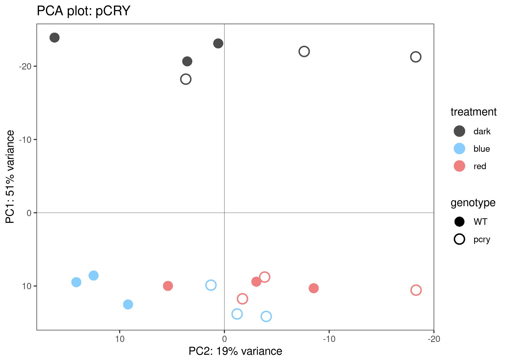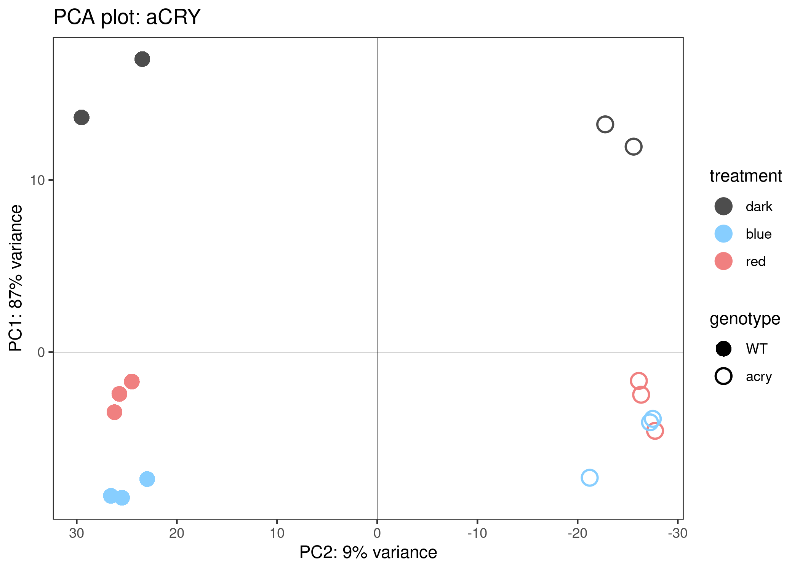

# Fig 2: Counts

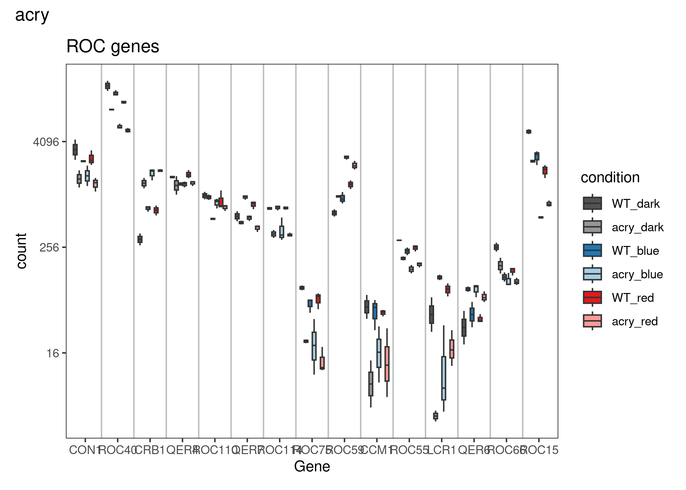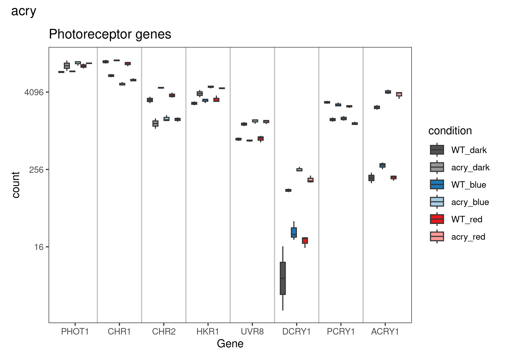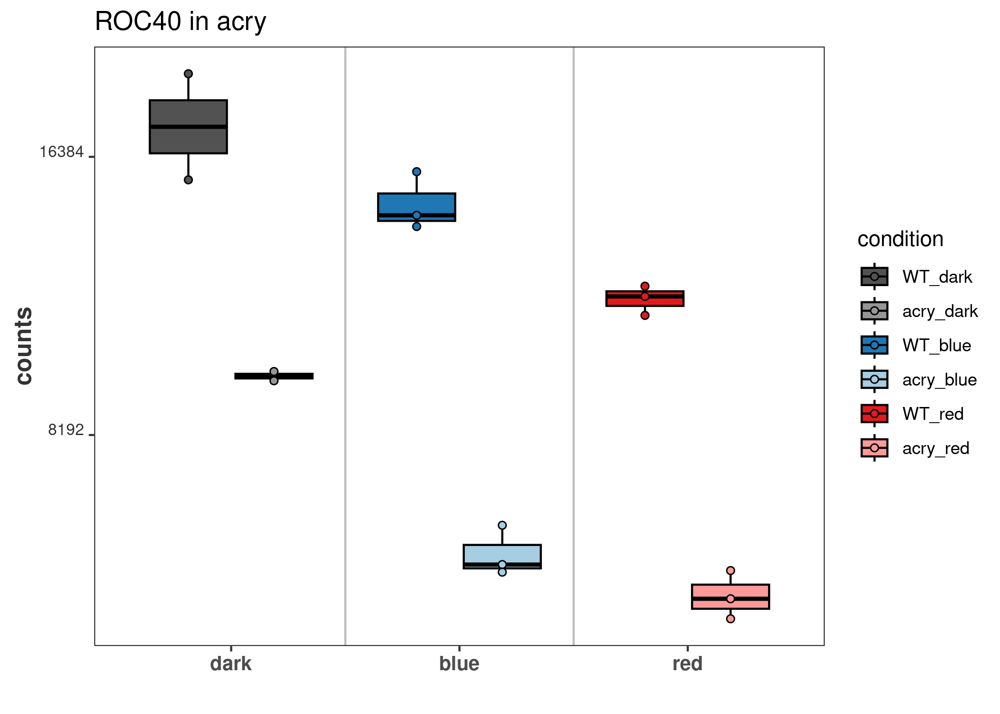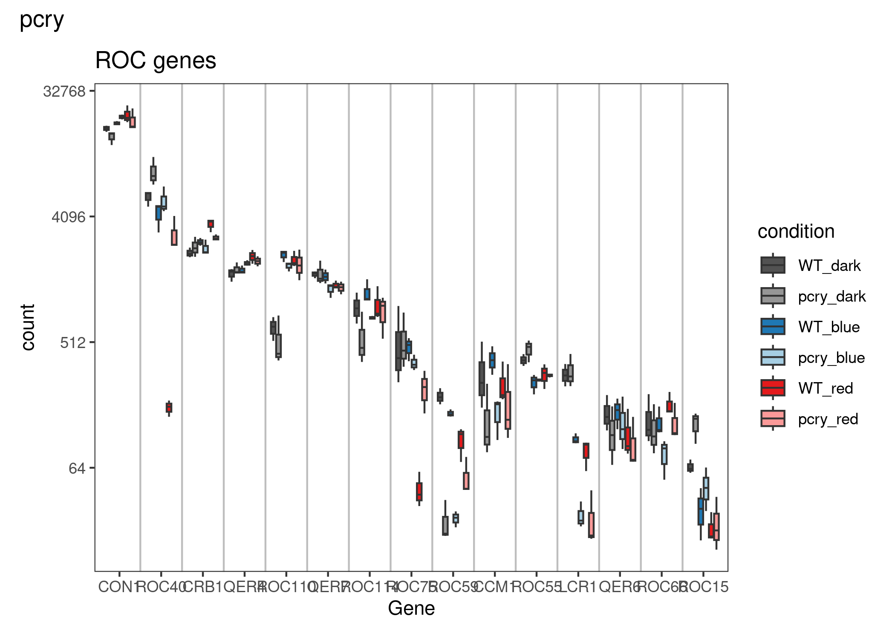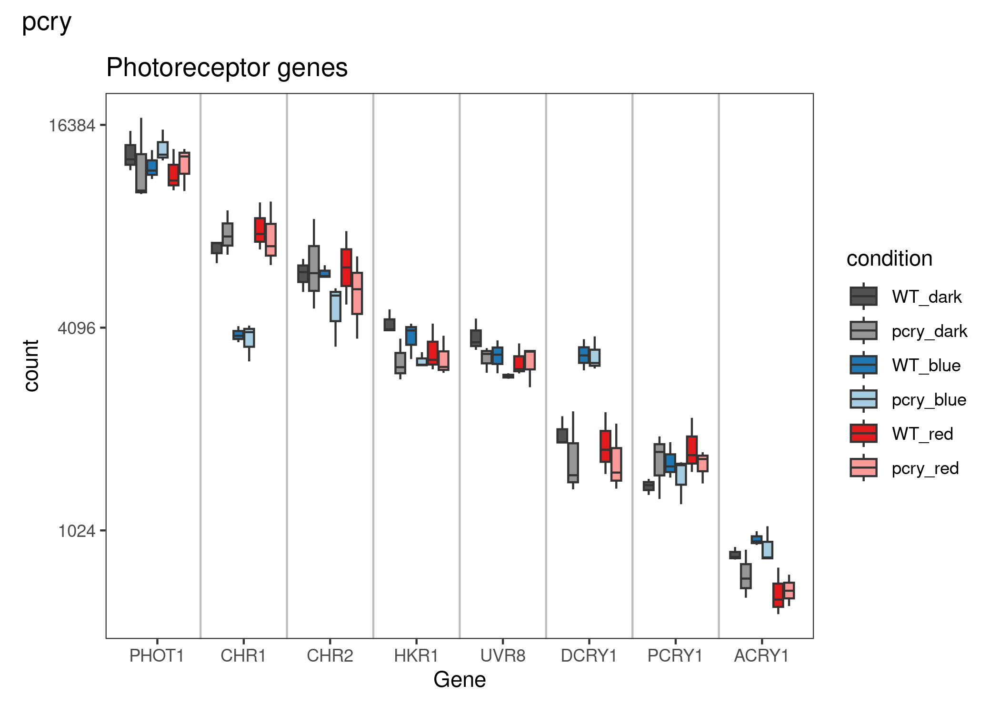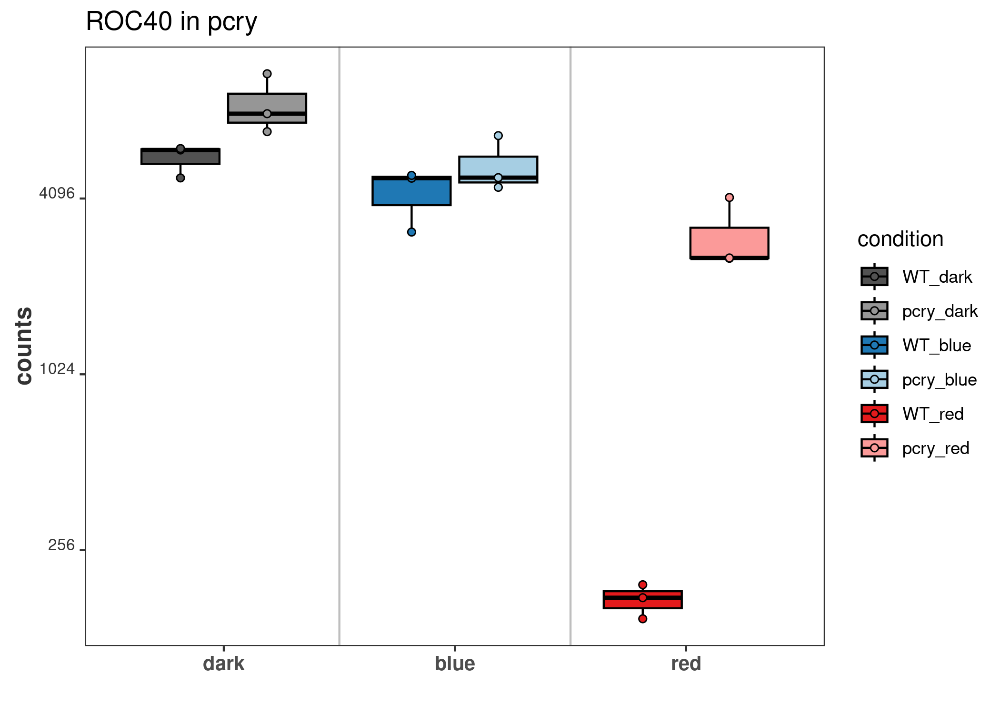

## TPM

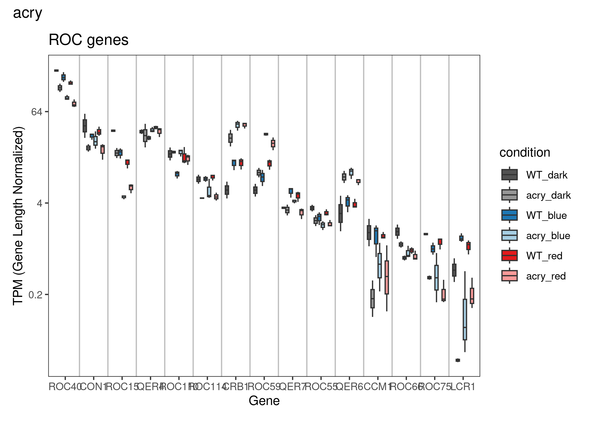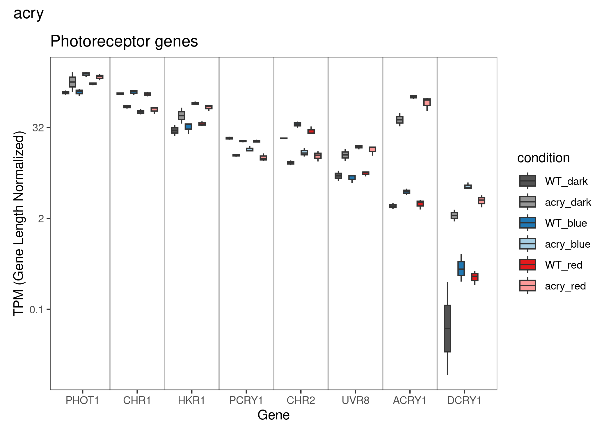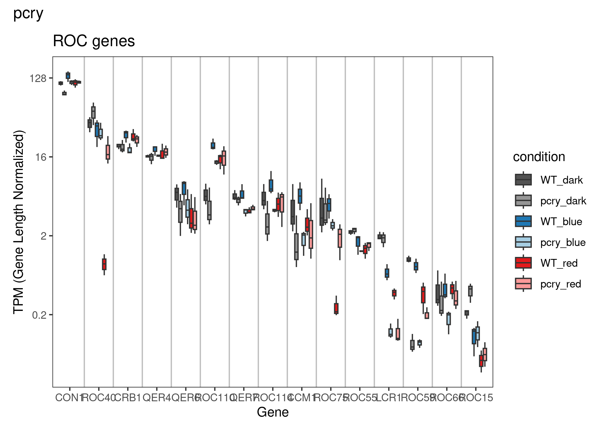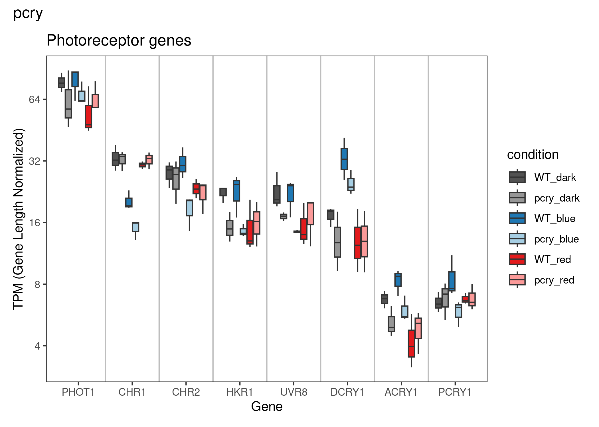

## individual counts

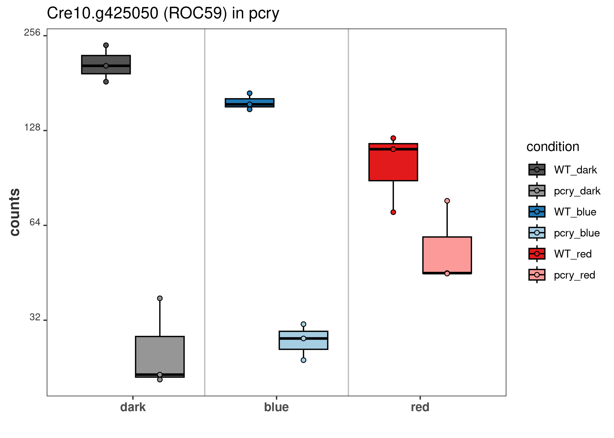

# Fig 2x: Explain data

``` r
c_graphic <- png::readPNG("Contrasts.png", native = TRUE)
patchwork::wrap_elements((c_graphic))
```

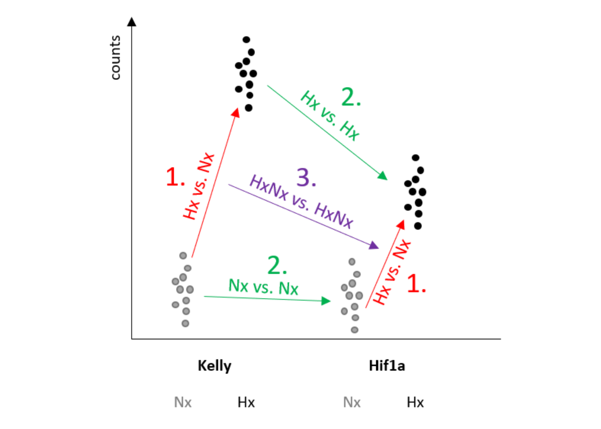<!-- -->

``` r
res_core <- list(dark = res_list$pcry$pcry_D.vs.WT_D,
             blue = res_list$pcry$pcry_BL.vs.WT_BL,
             red =res_list$pcry$pcry_R.vs.WT_R) %>% lapply(data.frame)

DEGs_comb <- bind_cols(res_core[[1]],res_core[[2]][,c(2,6)],res_core[[3]][,c(2,6)])
colnames(DEGs_comb)[c(2,6,8,9,10,11)] <- c("l2FC.dark","padj.dark","l2FC.blue","padj.blue","l2FC.red","padj.red") 


# res_list[["pcry"]] %>% names()

# res_list[["pcry"]][["WT_R.vs.D"]][ROC40,c(2,6)]
# res_list[["pcry"]][["pCRY_R.vs.D"]][ROC40,c(2,6)]

# anno_tf
ROC59 <- "Cre10.g425050"
goi  <- ROC40  # ROC40 ROC59


results <- lapply(res_list[["pcry"]],data.frame)
l2fc <- sapply(results,"[[",goi,c(2)) %>% round(digits=2)
names(l2fc) <- paste0("l2fc.",names(l2fc))
p <- sapply(results,"[[",goi,c(6)) %>% round(digits=3)

goi_lp <- list("l2fc"=l2fc,
               "p"=p)

# l2fc
# gcounts_roc40
gcounts_roc40 + coord_cartesian(ylim = c(1,10000)) + 
  # (1.)
  geom_text(aes(x = 0.5,y = 120),
            label="1.", color="red2") +
  # "pcry_D.vs.WT_D" 
  geom_segment(
        aes(x = 0.7,y = 90, xend = 1.3,yend = 90),
        arrow = arrow(length = unit(0.03,units = "npc")),color ="red2") +
  geom_text(aes(x = 1,y = 120),
            label=goi_lp$l2fc["l2fc.pcry_D.vs.WT_D"], color="red2") +
  
    # "pcry_BL.vs.WT_BL" 
  geom_segment(
        aes(x = 1.7,y = 90, xend = 2.3,yend = 90),
        arrow = arrow(length = unit(0.03,units = "npc")),color ="red2") +
  geom_text(aes(x = 2,y = 120),
            label=goi_lp$l2fc["l2fc.pcry_BL.vs.WT_BL"], color="red2") +
  
    # "pcry_R.vs.WT_R" 
  geom_segment(
        aes(x = 2.7,y = 75, xend = 3.3,yend = 75),
        arrow = arrow(length = unit(0.03,units = "npc")),color ="red2") +
  geom_text(aes(x = 3,y = 100),
            label=goi_lp$l2fc["l2fc.pcry_R.vs.WT_R"], color="red2") +

  # (2.)  
  geom_text(aes(x = 0.5,y = 50),
            label="2.", color="green4") +
  # ""WT_BL.vs.D"" 
    geom_segment(
        aes(x = 0.7,y = 40, xend = 1.7,yend = 40),
        arrow = arrow(length = unit(0.03,units = "npc")),color ="green4") +
  geom_text(aes(x = 1,y = 55),
            label=goi_lp$l2fc["l2fc.WT_BL.vs.D"], color="green4") +
  # 3.
  geom_text(aes(x = 0.5,y = 20),
            label="3.", color="purple3") +
    # "WT_R.vs.D" 
    geom_segment(
        aes(x = 1.3,y = 35, xend = 1.7,yend = 12),
        arrow = arrow(length = unit(0.03,units = "npc")),color ="purple3") +
  geom_text(aes(x = 1.7,y = 25),
            label=goi_lp$l2fc["l2fc.pcry_BLvD.vs.WT_BLvD"], color="purple3") +
  # "pcry_BL.vs.D"
    geom_segment(
        aes(x = 1.2,y = 9, xend = 2.3,yend = 9),
        arrow = arrow(length = unit(0.03,units = "npc")),color ="green3") +
  geom_text(aes(x = 2,y = 12),
            label=goi_lp$l2fc["l2fc.pcry_BL.vs.D"], color="green3") +

    # "WT_R.vs.D" 
    geom_segment(
        aes(x = 0.7,y = 6, xend = 2.7,yend = 6),
        arrow = arrow(length = unit(0.03,units = "npc")),color ="green4") +
  geom_text(aes(x = 0.9,y = 8),
            label=goi_lp$l2fc["l2fc.WT_R.vs.D"], color="green4") +
  # "pcry_BL.vs.D" 
    geom_segment(
        aes(x = 1.2,y = 1, xend = 3.3,yend = 1),
        arrow = arrow(length = unit(0.03,units = "npc")),color ="green3") +
  geom_text(aes(x = 3,y = 1.3),
            label=goi_lp$l2fc["l2fc.pcry_R.vs.D"], color="green3") +

  
  # "pcry_BL.vs.D" 
    geom_segment(
        aes(x = 1.7,y = 5, xend = 2.3,yend = 1.3),
        arrow = arrow(length = unit(0.03,units = "npc")),color ="purple1") +
  geom_text(aes(x = 2.3,y = 2.7),
            label=goi_lp$l2fc["l2fc.pcry_RvD.vs.WT_RvD"], color="purple1") #+
```

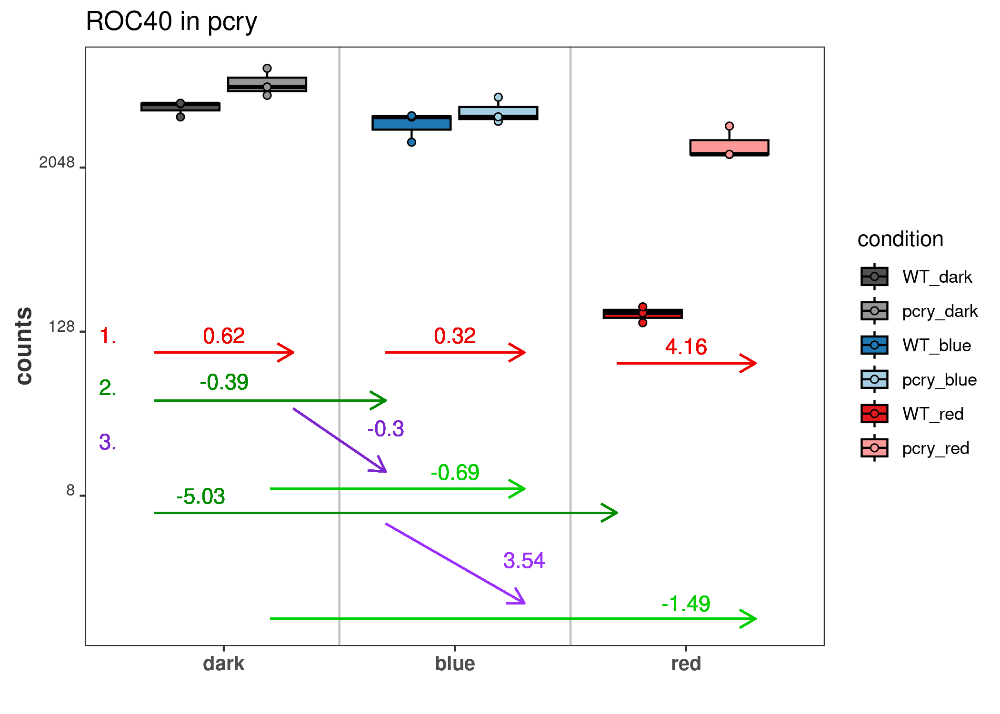<!-- -->

``` r
DEGs_comb[ROC40,]
```

    ##               baseMean l2FC.dark     lfcSE     stat    pvalue padj.dark symbol
    ## Cre06.g275350 4525.436 0.6158121 0.2470149 2.493016 0.0126663 0.2481123  ROC40
    ##               l2FC.blue padj.blue l2FC.red     padj.red
    ## Cre06.g275350  0.317035 0.5033338 4.157389 1.290229e-55

# Fig 3: Volcanos

## a) Δgenotype per condition (1)

``` r
fig <- "Fig3"

dds <- dds_list[["pcry"]]

# res_ashr_list %>% names()
# res_ashr_list[[1]] %>% names()

res <- res_ashr_list$pcry$pcry_R.vs.WT_R
res_n <- res_list$pcry$pcry_R.vs.WT_R

# of shrinked results
total <- subset(res, padj< 0.05 & (log2FoldChange > 1 | log2FoldChange < -1 )) %>% nrow()
up <- subset(res, padj< 0.05 & log2FoldChange > 1) %>% nrow()
down <- subset(res, padj< 0.05 & log2FoldChange < -1) %>% nrow()

# of "true" results
total <- subset(res_n, padj< 0.05 & (log2FoldChange > 1 | log2FoldChange < -1 )) %>% nrow()
up <- subset(res_n, padj< 0.05 & log2FoldChange > 1) %>% nrow()
down <- subset(res_n, padj< 0.05 & log2FoldChange < -1) %>% nrow()

# points outside the grid
# subset(res, padj < 10^-50 | log2FoldChange > 6 | log2FoldChange < -6)
#                 baseMean log2FoldChange     lfcSE      pvalue        padj
#               <numeric>      <numeric> <numeric>   <numeric>   <numeric>
# Cre16.g681750 2907.4406       -3.51641   0.22216 2.99151e-57 4.79270e-53
# Cre17.g802135   46.8587       36.40049   7.35075 1.00156e-08 7.64096e-06

res["Cre16.g681750","padj"] <- 10^-50
res["Cre17.g802135","log2FoldChange"] <- 6

# mcols(dds_list[["pcry"]]) %>% nrow()
# res %>% nrow()

volcano_red <- EnhancedVolcano(res,
    lab = mcols(dds_list[["pcry"]])[["geneSymbol"]],
    x = 'log2FoldChange',
    y = 'padj',
    col=c("grey","grey","grey",group.colors[5]),
    title = "red-light, pCRY vs. WT",
    titleLabSize = 12,
    subtitle = paste0("upregulated: ",up,", downregulated: ",down,"\n(total: ",total,")"),
#    subtitle = {},
    subtitleLabSize = 10,
    caption = NULL,
    xlim = c(-7,7),
    ylim = c(0,50),
    pCutoff = 0.05,
    FCcutoff = 1,
    maxoverlapsConnectors = 40,
    drawConnectors = TRUE,
    widthConnectors = 0.5,
    colConnectors = "grey70",
    legendLabels=c('ns','ns','ns',
      'padj < 0.05 & Log2FC > 1'),
    labSize = 4,
    axisLabSize = 12,
    legendLabSize = 12,
    legendIconSize = 4,
    gridlines.major = FALSE,
    gridlines.minor = FALSE,
    pointSize = 3
)
# volcano_red


# blue

# res_ashr_list %>% names()
# res_ashr_list[[1]] %>% names()

res <- res_ashr_list$pcry$pcry_BL.vs.WT_BL
res_n <- res_list$pcry$pcry_BL.vs.WT_BL

# of "true" results
total <- subset(res_n, padj< 0.05 & (log2FoldChange > 1 | log2FoldChange < -1 )) %>% nrow()
up <- subset(res_n, padj< 0.05 & log2FoldChange > 1) %>% nrow()
down <- subset(res_n, padj< 0.05 & log2FoldChange < -1) %>% nrow()

# points outside the grid

pmax <- 10^-50
l2FCmax <- 6
# subset(res, padj < pmax | log2FoldChange > l2FCmax | log2FoldChange < -l2FCmax)

# res[res$log2FoldChange > l2FCmax,]$log2FoldChange <- l2FCmax
res[res$log2FoldChange < -l2FCmax,]$log2FoldChange <- -l2FCmax

x <- res$padj
res[(x < pmax) & (!is.na(x)),]$padj <- pmax
subset(res, padj < pmax | log2FoldChange > l2FCmax | log2FoldChange < -l2FCmax)
```

    ## log2 fold change (MMSE): genotype_pcry_vs_WT+genotypepcry.treatmentblue effect 
    ## Wald test p-value: genotype_pcry_vs_WT+genotypepcry.treatmentblue effect 
    ## DataFrame with 0 rows and 5 columns

``` r
# mcols(dds_list[["pcry"]]) %>% nrow()
# res %>% nrow()

volcano_blue <- EnhancedVolcano(res,
    lab = mcols(dds_list[["pcry"]])[["geneSymbol"]],
    x = 'log2FoldChange',
    y = 'padj',
    col=c("grey","grey","grey",group.colors[3]),
    title = "blue-light, pCRY vs. WT",
    titleLabSize = 12,
    subtitle = paste0("upregulated: ",up,", downregulated: ",down,"\n(total: ",total,")"),
#    subtitle = {},
    subtitleLabSize = 10,
    caption = NULL,
    xlim = c(-7,7),
    ylim = c(0,50),
    pCutoff = 0.05,
    FCcutoff = 1,
    maxoverlapsConnectors = 40,
    drawConnectors = TRUE,
    widthConnectors = 0.5,
    colConnectors = "grey70",
    legendLabels=c('ns','ns','ns',
      'padj < 0.05 & Log2FC > 1'),
    labSize = 4,
    axisLabSize = 12,
    legendLabSize = 12,
    legendIconSize = 4,
    gridlines.major = FALSE,
    gridlines.minor = FALSE,
    pointSize = 3
)
# volcano_blue


# dark

# res_ashr_list %>% names()
# res_ashr_list[[2]] %>% names()

res <- res_ashr_list$pcry$pcry_D.vs.WT_D
res_n <- res_list$pcry$pcry_D.vs.WT_D

# of "true" results
total <- subset(res_n, padj< 0.05 & (log2FoldChange > 1 | log2FoldChange < -1 )) %>% nrow()
up <- subset(res_n, padj< 0.05 & log2FoldChange > 1) %>% nrow()
down <- subset(res_n, padj< 0.05 & log2FoldChange < -1) %>% nrow()

# points outside the grid

pmax <- 10^-50
l2FCmax <- 6
# subset(res, padj < pmax | log2FoldChange > l2FCmax | log2FoldChange < -l2FCmax)

res[res$log2FoldChange > l2FCmax,]$log2FoldChange <- l2FCmax
res[res$log2FoldChange < -l2FCmax,]$log2FoldChange <- -l2FCmax
res[subset(res, padj < pmax) %>% rownames(),]$padj <- pmax

# subset(res, padj < pmax | log2FoldChange > l2FCmax | log2FoldChange < -l2FCmax)

# mcols(dds_list[["pcry"]]) %>% nrow()
# res %>% nrow()

volcano_dark <- EnhancedVolcano(res,
    lab = mcols(dds_list[["pcry"]])[["geneSymbol"]],
    x = 'log2FoldChange',
    y = 'padj',
    col=c("grey","grey","grey",group.colors[1]),
    title = "dark, pCRY vs. WT",
    titleLabSize = 12,
    subtitle = paste0("upregulated: ",up,", downregulated: ",down,"\n(total: ",total,")"),
#    subtitle = {},
    subtitleLabSize = 10,
    caption = NULL,
    xlim = c(-7,7),
    ylim = c(0,50),
    pCutoff = 0.05,
    FCcutoff = 1,
    maxoverlapsConnectors = 40,
    drawConnectors = TRUE,
    widthConnectors = 0.5,
    colConnectors = "grey70",
    legendLabels=c('ns','ns','ns',
      'padj < 0.05 & Log2FC > 1'),
    labSize = 4,
    axisLabSize = 12,
    legendLabSize = 12,
    legendIconSize = 4,
    gridlines.major = FALSE,
    gridlines.minor = FALSE,
    pointSize = 3
)
# volcano_dark

volcanos_all <- volcano_dark + volcano_blue + volcano_red +
  plot_layout(guides = "collect", axes="collect", axis_titles="collect") & 
  theme(legend.position = 'none', axis.title=element_text(size=12))
volcanos_all
```

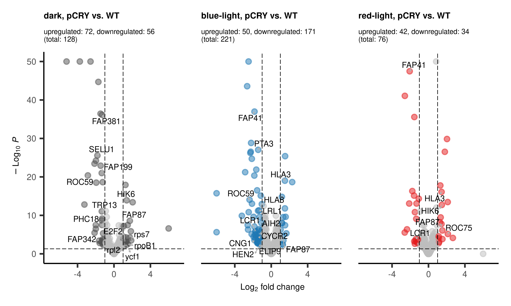<!-- -->

``` r
ggsave(paste(fig,"_",colData(dds)$experiment[1],"_Volcanos1.pdf",sep=""), plot = volcanos_all,
width = 10,
height = 6)
```

## b): Δlight = light effect (2)

``` r
fig <- "Fig3"

dds <- dds_list[["pcry"]]

# res_ashr_list %>% names()
# res_ashr_list[[2]] %>% names()

res <- res_ashr_list$pcry$WT_R.vs.D
res_n <- res_list$pcry$WT_R.vs.D

# of shrinked results
total <- subset(res, padj< 0.05 & (log2FoldChange > 1 | log2FoldChange < -1 )) %>% nrow()
up <- subset(res, padj< 0.05 & log2FoldChange > 1) %>% nrow()
down <- subset(res, padj< 0.05 & log2FoldChange < -1) %>% nrow()

# of "true" results
total <- subset(res_n, padj< 0.05 & (log2FoldChange > 1 | log2FoldChange < -1 )) %>% nrow()
up <- subset(res_n, padj< 0.05 & log2FoldChange > 1) %>% nrow()
down <- subset(res_n, padj< 0.05 & log2FoldChange < -1) %>% nrow()

# points outside the grid
# subset(res, padj < 10^-50 | log2FoldChange > 6 | log2FoldChange < -6)
#                 baseMean log2FoldChange     lfcSE      pvalue        padj
#               <numeric>      <numeric> <numeric>   <numeric>   <numeric>
# Cre16.g681750 2907.4406       -3.51641   0.22216 2.99151e-57 4.79270e-53
# Cre17.g802135   46.8587       36.40049   7.35075 1.00156e-08 7.64096e-06

res["Cre16.g681750","padj"] <- 10^-50
res["Cre17.g802135","log2FoldChange"] <- 6

# mcols(dds_list[["pcry"]]) %>% nrow()
# res %>% nrow()

volcano_WT_red <- EnhancedVolcano(res,
    lab = mcols(dds_list[["pcry"]])[["geneSymbol"]],
    x = 'log2FoldChange',
    y = 'padj',
    col=c("grey","grey","grey",group.colors[5]),
    title = "WT_R.vs.D",
    titleLabSize = 12,
    subtitle = paste0("upregulated: ",up,", downregulated: ",down,"\n(total: ",total,")"),
#    subtitle = {},
    subtitleLabSize = 10,
    caption = NULL,
    xlim = c(-7,7),
    ylim = c(0,100),
    pCutoff = 0.05,
    FCcutoff = 1,
    maxoverlapsConnectors = 40,
    drawConnectors = TRUE,
    widthConnectors = 0.5,
    colConnectors = "grey70",
    legendLabels=c('ns','ns','ns',
      'padj < 0.05 & Log2FC > 1'),
    labSize = 4,
    axisLabSize = 12,
    legendLabSize = 12,
    legendIconSize = 4,
    gridlines.major = FALSE,
    gridlines.minor = FALSE,
    pointSize = 3
)
# volcano_red


# blue

res_ashr_list %>% names()
```

    ## [1] "acry" "pcry"

``` r
res_ashr_list[[1]] %>% names()
```

    ##  [1] "WT_BL.vs.D"           "WT_R.vs.D"            "acry_BL.vs.D"        
    ##  [4] "acry_R.vs.D"          "acry_D.vs.WT_D"       "acry_BL.vs.WT_BL"    
    ##  [7] "acry_R.vs.WT_R"       "acry_BLvD.vs.WT_BLvD" "acry_RvD.vs.WT_RvD"  
    ## [10] "BL+R.vs.D"            "BL.vs.D"              "R.vs.D"              
    ## [13] "acry.vs.WT"

``` r
res <- res_ashr_list$pcry$pcry_R.vs.D
res_n <- res_list$pcry$pcry_R.vs.D

# of "true" results
total <- subset(res_n, padj< 0.05 & (log2FoldChange > 1 | log2FoldChange < -1 )) %>% nrow()
up <- subset(res_n, padj< 0.05 & log2FoldChange > 1) %>% nrow()
down <- subset(res_n, padj< 0.05 & log2FoldChange < -1) %>% nrow()

# points outside the grid

pmax <- 10^-100
l2FCmax <- 6
subset(res, padj < pmax | log2FoldChange > l2FCmax | log2FoldChange < -l2FCmax)
```

    ## log2 fold change (MMSE): treatment_red_vs_dark+genotypepcry.treatmentred effect 
    ## Wald test p-value: treatment_red_vs_dark+genotypepcry.treatmentred effect 
    ## DataFrame with 7 rows and 5 columns
    ##                 baseMean log2FoldChange     lfcSE       pvalue         padj
    ##                <numeric>      <numeric> <numeric>    <numeric>    <numeric>
    ## Cre01.g016600 13730.8707        3.68424 0.1604432 1.54708e-120 6.07617e-117
    ## Cre07.g320400 11927.5346        5.45573 0.1709256 2.66454e-225 1.39533e-221
    ## Cre07.g320450 27547.9153        4.78701 0.1349545 1.17031e-277 1.83856e-273
    ## Cre09.g403367    32.3010      -25.94189 6.8152715  6.78135e-08  1.35369e-06
    ## Cre10.g424550  8582.3054       -1.75316 0.0796985 1.08299e-108 3.40274e-105
    ## Cre13.g603550  3111.9323       -5.26266 0.1498718 6.98677e-272 5.48811e-268
    ## Cre16.g801923    21.0442      -26.79298 6.2230303  3.82198e-08  7.86937e-07

``` r
# res[res$log2FoldChange > l2FCmax,]$log2FoldChange <- l2FCmax
res[res$log2FoldChange < -l2FCmax,]$log2FoldChange <- -l2FCmax
x <- res$padj
res[(x < pmax) & (!is.na(x)),]$padj <- pmax

subset(res, padj < pmax | log2FoldChange > l2FCmax | log2FoldChange < -l2FCmax)
```

    ## log2 fold change (MMSE): treatment_red_vs_dark+genotypepcry.treatmentred effect 
    ## Wald test p-value: treatment_red_vs_dark+genotypepcry.treatmentred effect 
    ## DataFrame with 0 rows and 5 columns

``` r
mcols(dds_list[["pcry"]]) %>% nrow()
```

    ## [1] 16025

``` r
res %>% nrow()
```

    ## [1] 16025

``` r
volcano_pcry_R <- EnhancedVolcano(res,
    lab = mcols(dds_list[["pcry"]])[["geneSymbol"]],
    x = 'log2FoldChange',
    y = 'padj',
    col=c("grey","grey","grey",group.colors[6]),
    title = "pcry_R.vs.D",
    titleLabSize = 12,
    subtitle = paste0("upregulated: ",up,", downregulated: ",down,"\n(total: ",total,")"),
#    subtitle = {},
    subtitleLabSize = 10,
    caption = NULL,
    xlim = c(-7,7),
    ylim = c(0,100),
    pCutoff = 0.05,
    FCcutoff = 1,
    maxoverlapsConnectors = 40,
    drawConnectors = TRUE,
    widthConnectors = 0.5,
    colConnectors = "grey70",
    legendLabels=c('ns','ns','ns',
      'padj < 0.05 & Log2FC > 1'),
    labSize = 4,
    axisLabSize = 12,
    legendLabSize = 12,
    legendIconSize = 4,
    gridlines.major = FALSE,
    gridlines.minor = FALSE,
    pointSize = 3
)
# volcano_blue


# WT BLUE

res_ashr_list %>% names()
```

    ## [1] "acry" "pcry"

``` r
res_ashr_list[[2]] %>% names()
```

    ##  [1] "WT_BL.vs.D"           "WT_R.vs.D"            "pcry_BL.vs.D"        
    ##  [4] "pcry_R.vs.D"          "pcry_D.vs.WT_D"       "pcry_BL.vs.WT_BL"    
    ##  [7] "pcry_R.vs.WT_R"       "pcry_BLvD.vs.WT_BLvD" "pcry_RvD.vs.WT_RvD"  
    ## [10] "BL+R.vs.D"            "BL.vs.D"              "R.vs.D"              
    ## [13] "pcry.vs.WT"

``` r
res <- res_ashr_list$pcry$WT_BL.vs.D
res_n <- res_list$pcry$WT_BL.vs.D

# of "true" results
total <- subset(res_n, padj< 0.05 & (log2FoldChange > 1 | log2FoldChange < -1 )) %>% nrow()
up <- subset(res_n, padj< 0.05 & log2FoldChange > 1) %>% nrow()
down <- subset(res_n, padj< 0.05 & log2FoldChange < -1) %>% nrow()

# points outside the grid

pmax <- 10^-100
l2FCmax <- 6
subset(res, padj < pmax | log2FoldChange > l2FCmax | log2FoldChange < -l2FCmax)
```

    ## log2 fold change (MMSE): treatment_blue_vs_dark effect 
    ## Wald test p-value: treatment_blue_vs_dark effect 
    ## DataFrame with 9 rows and 5 columns
    ##                 baseMean log2FoldChange     lfcSE       pvalue         padj
    ##                <numeric>      <numeric> <numeric>    <numeric>    <numeric>
    ## Cre01.g016600 13730.8707       10.19581 0.1656246  0.00000e+00  0.00000e+00
    ## Cre01.g016750  3828.5743        9.72035 0.3733448 7.75434e-150 1.49261e-146
    ## Cre06.g310500  1368.6234        3.07475 0.1131133 1.43884e-164 3.16525e-161
    ## Cre07.g320400 11927.5346        9.46649 0.1740855  0.00000e+00  0.00000e+00
    ## Cre07.g320450 27547.9153        7.24171 0.1352597  0.00000e+00  0.00000e+00
    ## Cre10.g424550  8582.3054       -2.61367 0.0800032 1.34826e-235 3.46031e-232
    ## Cre13.g603550  3111.9323       -5.03096 0.1475811 1.03085e-260 3.17482e-257
    ## Cre17.g740950 15530.0821        2.59377 0.0753787 5.71219e-261 2.19905e-257
    ## Cre17.g802135    46.8587       16.53408 2.9414978  7.06918e-10  2.37164e-08

``` r
res[res$log2FoldChange > l2FCmax,]$log2FoldChange <- l2FCmax
# res[res$log2FoldChange < -l2FCmax,]$log2FoldChange <- -l2FCmax
res[subset(res, padj < pmax) %>% rownames(),]$padj <- pmax

subset(res, padj < pmax | log2FoldChange > l2FCmax | log2FoldChange < -l2FCmax)
```

    ## log2 fold change (MMSE): treatment_blue_vs_dark effect 
    ## Wald test p-value: treatment_blue_vs_dark effect 
    ## DataFrame with 0 rows and 5 columns

``` r
mcols(dds_list[["pcry"]]) %>% nrow()
```

    ## [1] 16025

``` r
res %>% nrow()
```

    ## [1] 16025

``` r
volcano_WT_BL <- EnhancedVolcano(res,
    lab = mcols(dds_list[["pcry"]])[["geneSymbol"]],
    x = 'log2FoldChange',
    y = 'padj',
    col=c("grey","grey","grey",group.colors[3]),
    title = "WT_BL.vs.D",
    titleLabSize = 12,
    subtitle = paste0("upregulated: ",up,", downregulated: ",down,"\n(total: ",total,")"),
#    subtitle = {},
    subtitleLabSize = 10,
    caption = NULL,
    xlim = c(-7,7),
    ylim = c(0,100),
    pCutoff = 0.05,
    FCcutoff = 1,
    maxoverlapsConnectors = 40,
    drawConnectors = TRUE,
    widthConnectors = 0.5,
    colConnectors = "grey70",
    legendLabels=c('ns','ns','ns',
      'padj < 0.05 & Log2FC > 1'),
    labSize = 4,
    axisLabSize = 12,
    legendLabSize = 12,
    legendIconSize = 4,
    gridlines.major = FALSE,
    gridlines.minor = FALSE,
    pointSize = 3
)


# pcry BLUE

res_ashr_list %>% names()
```

    ## [1] "acry" "pcry"

``` r
res_ashr_list[[2]] %>% names()
```

    ##  [1] "WT_BL.vs.D"           "WT_R.vs.D"            "pcry_BL.vs.D"        
    ##  [4] "pcry_R.vs.D"          "pcry_D.vs.WT_D"       "pcry_BL.vs.WT_BL"    
    ##  [7] "pcry_R.vs.WT_R"       "pcry_BLvD.vs.WT_BLvD" "pcry_RvD.vs.WT_RvD"  
    ## [10] "BL+R.vs.D"            "BL.vs.D"              "R.vs.D"              
    ## [13] "pcry.vs.WT"

``` r
res <- res_ashr_list$pcry$pcry_BL.vs.D
res_n <- res_list$pcry$pcry_BL.vs.D

# of "true" results
total <- subset(res_n, padj< 0.05 & (log2FoldChange > 1 | log2FoldChange < -1 )) %>% nrow()
up <- subset(res_n, padj< 0.05 & log2FoldChange > 1) %>% nrow()
down <- subset(res_n, padj< 0.05 & log2FoldChange < -1) %>% nrow()

# points outside the grid

pmax <- 10^-100
l2FCmax <- 6
subset(res, padj < pmax | log2FoldChange > l2FCmax | log2FoldChange < -l2FCmax)
```

    ## log2 fold change (MMSE): treatment_blue_vs_dark+genotypepcry.treatmentblue effect 
    ## Wald test p-value: treatment_blue_vs_dark+genotypepcry.treatmentblue effect 
    ## DataFrame with 13 rows and 5 columns
    ##                 baseMean log2FoldChange     lfcSE       pvalue         padj
    ##                <numeric>      <numeric> <numeric>    <numeric>    <numeric>
    ## Cre01.g016600 13730.8707        9.55129  0.155823  0.00000e+00  0.00000e+00
    ## Cre01.g016750  3828.5743        9.94452  0.379418 6.24753e-153 1.11213e-149
    ## Cre03.g198975    18.0517      -21.07789  8.442222  6.31458e-07  1.07395e-05
    ## Cre05.g241653   363.4087      -21.77806  5.792811  1.42361e-07  2.71196e-06
    ## Cre06.g310500  1368.6234        3.26500  0.117149 1.74556e-173 3.49571e-170
    ## ...                  ...            ...       ...          ...          ...
    ## Cre10.g424550    8582.31       -2.24821 0.0803812 6.40256e-175 1.46536e-171
    ## Cre13.g603550    3111.93       -5.63190 0.1544875 2.60456e-295 1.04319e-291
    ## Cre16.g678900    1010.84       -4.11795 0.1819241 6.57596e-117 1.05354e-113
    ## Cre16.g681750    2907.44        3.14588 0.0992670 5.37126e-223 1.43422e-219
    ## Cre17.g740950   15530.08        2.43230 0.0756135 6.06259e-230 1.94258e-226

``` r
res[res$log2FoldChange > l2FCmax,]$log2FoldChange <- l2FCmax
res[res$log2FoldChange < -l2FCmax,]$log2FoldChange <- -l2FCmax
res[subset(res, padj < pmax) %>% rownames(),]$padj <- pmax

subset(res, padj < pmax | log2FoldChange > l2FCmax | log2FoldChange < -l2FCmax)
```

    ## log2 fold change (MMSE): treatment_blue_vs_dark+genotypepcry.treatmentblue effect 
    ## Wald test p-value: treatment_blue_vs_dark+genotypepcry.treatmentblue effect 
    ## DataFrame with 0 rows and 5 columns

``` r
mcols(dds_list[["pcry"]]) %>% nrow()
```

    ## [1] 16025

``` r
res %>% nrow()
```

    ## [1] 16025

``` r
volcano_pcry_BL <- EnhancedVolcano(res,
    lab = mcols(dds_list[["pcry"]])[["geneSymbol"]],
    x = 'log2FoldChange',
    y = 'padj',
    col=c("grey","grey","grey",group.colors[4]),
    title = "pcry_BL.vs.D",
    titleLabSize = 12,
    subtitle = paste0("upregulated: ",up,", downregulated: ",down,"\n(total: ",total,")"),
#    subtitle = {},
    subtitleLabSize = 10,
    caption = NULL,
    xlim = c(-7,7),
    ylim = c(0,100),
    pCutoff = 0.05,
    FCcutoff = 1,
    maxoverlapsConnectors = 40,
    drawConnectors = TRUE,
    widthConnectors = 0.5,
    colConnectors = "grey70",
    legendLabels=c('ns','ns','ns',
      'padj < 0.05 & Log2FC > 1'),
    labSize = 4,
    axisLabSize = 12,
    legendLabSize = 12,
    legendIconSize = 4,
    gridlines.major = FALSE,
    gridlines.minor = FALSE,
    pointSize = 3
)


volcanos_2 <- (volcano_WT_BL + volcano_WT_red) /  (volcano_pcry_BL + volcano_pcry_R) +
  plot_layout(guides = "collect", axes="collect", axis_titles="collect") & 
  theme(legend.position = 'none', axis.title=element_text(size=12))
volcanos_2
```

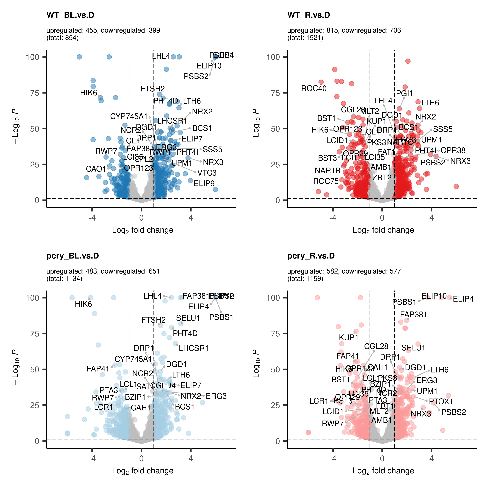<!-- -->

``` r
ggsave(paste(fig,"_",colData(dds)$experiment[1],"_Volcanos2.pdf",sep=""), plot = volcanos_2,
width = 10,
height = 12)
```

## c): ΔgenotypeΔlight = difference in light effect (interaction term) (3)

``` r
fig <- "Fig3"

dds <- dds_list[["pcry"]]

res_ashr_list %>% names()
```

    ## [1] "acry" "pcry"

``` r
res_ashr_list[[2]] %>% names()
```

    ##  [1] "WT_BL.vs.D"           "WT_R.vs.D"            "pcry_BL.vs.D"        
    ##  [4] "pcry_R.vs.D"          "pcry_D.vs.WT_D"       "pcry_BL.vs.WT_BL"    
    ##  [7] "pcry_R.vs.WT_R"       "pcry_BLvD.vs.WT_BLvD" "pcry_RvD.vs.WT_RvD"  
    ## [10] "BL+R.vs.D"            "BL.vs.D"              "R.vs.D"              
    ## [13] "pcry.vs.WT"

``` r
res <- res_ashr_list$pcry$pcry_BLvD.vs.WT_BLvD
res_n <- res_list$pcry$pcry_BLvD.vs.WT_BLvD

# of shrinked results
total <- subset(res, padj< 0.05 & (log2FoldChange > 1 | log2FoldChange < -1 )) %>% nrow()
up <- subset(res, padj< 0.05 & log2FoldChange > 1) %>% nrow()
down <- subset(res, padj< 0.05 & log2FoldChange < -1) %>% nrow()

# of "true" results
total <- subset(res_n, padj< 0.05 & (log2FoldChange > 1 | log2FoldChange < -1 )) %>% nrow()
up <- subset(res_n, padj< 0.05 & log2FoldChange > 1) %>% nrow()
down <- subset(res_n, padj< 0.05 & log2FoldChange < -1) %>% nrow()


# points outside the grid

pmax <- 10^-50
l2FCmax <- 6
# subset(res, padj < pmax | log2FoldChange > l2FCmax | log2FoldChange < -l2FCmax)

# res[res$log2FoldChange > l2FCmax,]$log2FoldChange <- l2FCmax
res[res$log2FoldChange < -l2FCmax,]$log2FoldChange <- -l2FCmax

# subset(res, padj < pmax | log2FoldChange > l2FCmax | log2FoldChange < -l2FCmax)


# mcols(dds_list[["pcry"]]) %>% nrow()
# res %>% nrow()

volcano3_blue <- EnhancedVolcano(res,
    lab = mcols(dds_list[["pcry"]])[["geneSymbol"]],
    x = 'log2FoldChange',
    y = 'padj',
    col=c("grey","grey","grey",group.colors[3]),
    title = "pcry_BLvD.vs.WT_BLvD",
    titleLabSize = 12,
    subtitle = paste0("upregulated: ",up,", downregulated: ",down,"\n(total: ",total,")"),
#    subtitle = {},
    subtitleLabSize = 10,
    caption = NULL,
    xlim = c(-7,7),
    ylim = c(0,50),
    pCutoff = 0.05,
    FCcutoff = 1,
    maxoverlapsConnectors = 50,
    drawConnectors = TRUE,
    widthConnectors = 0.5,
    colConnectors = "grey70",
    legendLabels=c('ns','ns','ns',
      'padj < 0.05 & Log2FC > 1'),
    labSize = 4,
    axisLabSize = 12,
    legendLabSize = 12,
    legendIconSize = 3,
    gridlines.major = FALSE,
    gridlines.minor = FALSE,
    pointSize = 3
)


# volcano_red
res_ashr_list %>% names()
```

    ## [1] "acry" "pcry"

``` r
res_ashr_list[[2]] %>% names()
```

    ##  [1] "WT_BL.vs.D"           "WT_R.vs.D"            "pcry_BL.vs.D"        
    ##  [4] "pcry_R.vs.D"          "pcry_D.vs.WT_D"       "pcry_BL.vs.WT_BL"    
    ##  [7] "pcry_R.vs.WT_R"       "pcry_BLvD.vs.WT_BLvD" "pcry_RvD.vs.WT_RvD"  
    ## [10] "BL+R.vs.D"            "BL.vs.D"              "R.vs.D"              
    ## [13] "pcry.vs.WT"

``` r
res <- res_ashr_list$pcry$pcry_RvD.vs.WT_RvD
res_n <- res_list$pcry$pcry_RvD.vs.WT_RvD

# of "true" results
total <- subset(res_n, padj< 0.05 & (log2FoldChange > 1 | log2FoldChange < -1 )) %>% nrow()
up <- subset(res_n, padj< 0.05 & log2FoldChange > 1) %>% nrow()
down <- subset(res_n, padj< 0.05 & log2FoldChange < -1) %>% nrow()

# points outside the grid

pmax <- 10^-50
l2FCmax <- 6
subset(res, padj < pmax | log2FoldChange > l2FCmax | log2FoldChange < -l2FCmax)
```

    ## log2 fold change (MMSE): 0,0,0,0,0,+1 
    ## Wald test p-value: 0,0,0,0,0,+1 
    ## DataFrame with 3 rows and 5 columns
    ##                baseMean log2FoldChange     lfcSE      pvalue        padj
    ##               <numeric>      <numeric> <numeric>   <numeric>   <numeric>
    ## Cre03.g800380   78.6550       21.95326  3.686128 8.10447e-10 1.15747e-06
    ## Cre16.g681750 2907.4406        2.18416  0.139607 5.99939e-57 9.42505e-53
    ## Cre17.g802135   46.8587       -9.29647  9.641600 2.41332e-06 1.22301e-03

``` r
res[res$log2FoldChange > l2FCmax,]$log2FoldChange <- l2FCmax
res[res$log2FoldChange < -l2FCmax,]$log2FoldChange <- -l2FCmax
x <- res$padj
res[(x < pmax) & (!is.na(x)),]$padj <- pmax

subset(res, padj < pmax | log2FoldChange > l2FCmax | log2FoldChange < -l2FCmax)
```

    ## log2 fold change (MMSE): 0,0,0,0,0,+1 
    ## Wald test p-value: 0,0,0,0,0,+1 
    ## DataFrame with 0 rows and 5 columns

``` r
mcols(dds_list[["pcry"]]) %>% nrow()
```

    ## [1] 16025

``` r
res %>% nrow()
```

    ## [1] 16025

``` r
volcano3_red <- EnhancedVolcano(res,
    lab = mcols(dds_list[["pcry"]])[["geneSymbol"]],
    x = 'log2FoldChange',
    y = 'padj',
    col=c("grey","grey","grey",group.colors[5]),
    title = "pcry_RvD.vs.WT_RvD",
    titleLabSize = 12,
    subtitle = paste0("upregulated: ",up,", downregulated: ",down,"\n(total: ",total,")"),
#    subtitle = {},
    subtitleLabSize = 10,
    caption = NULL,
    xlim = c(-7,7),
    ylim = c(0,50),
    pCutoff = 0.05,
    FCcutoff = 1,
    maxoverlapsConnectors = 50,
    drawConnectors = TRUE,
    widthConnectors = 0.5,
    colConnectors = "grey70",
    legendLabels=c('ns','ns','ns',
      'padj < 0.05 & Log2FC > 1'),
    labSize = 4,
    axisLabSize = 12,
    legendLabSize = 12,
    legendIconSize = 4,
    gridlines.major = FALSE,
    gridlines.minor = FALSE,
    pointSize = 3
)


volcanos_3 <- (volcano3_blue + volcano3_red) +
  plot_layout(guides = "collect", axes="collect", axis_titles="collect") & 
  theme(legend.position = 'none', axis.title=element_text(size=12))
volcanos_3
```

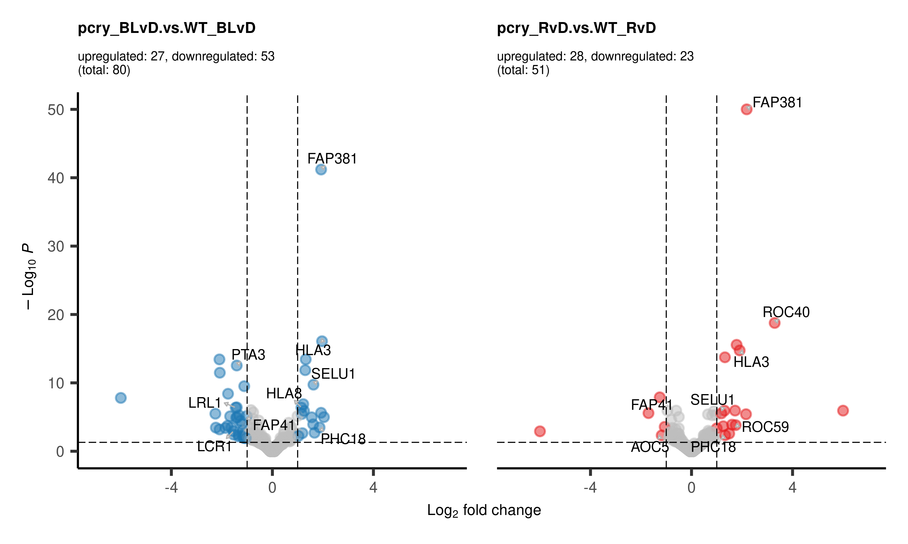<!-- -->

``` r
ggsave(paste(fig,"_",colData(dds)$experiment[1],"_Volcanos3.pdf",sep=""), plot = volcanos_3,
width = 10,
height = 6)

colnames(anno)
```

    ##  [1] "locusName_4532"                       
    ##  [2] "initial_v6_locus_ID"                  
    ##  [3] "action"                               
    ##  [4] "Replacement_v5.v6._model"             
    ##  [5] "geneSymbol"                           
    ##  [6] "strainLocusId"                        
    ##  [7] "PMID"                                 
    ##  [8] "previousIdentifiers"                  
    ##  [9] "Description"                          
    ## [10] "Comments"                             
    ## [11] "Polycistronic"                        
    ## [12] "TMHMM_transmembrane"                  
    ## [13] "TargetP"                              
    ## [14] "Predalgo"                             
    ## [15] "interactions"                         
    ## [16] "experimental_localization"            
    ## [17] "CLiP_library"                         
    ## [18] "mutant_phenotypes"                    
    ## [19] "Plastid.ribosome_pulldown"            
    ## [20] "TF_database..PMID.27067009."          
    ## [21] "Flagellar_Proteome"                   
    ## [22] "Co.expression.cluster..PMID.28710131."
    ## [23] "GEnome.scale.Metabolic.Model"         
    ## [24] "gene_id"                              
    ## [25] "previousIdentifiers_list"             
    ## [26] "prev.symbols"                         
    ## [27] "id.symbol"

``` r
# anno[deg_list$pcry$deg_pcry_RvD.vs.WT_RvD,]
anno[deg_list$pcry$deg_pcry_RvD.vs.WT_RvD,c("geneSymbol","previousIdentifiers","Description","previousIdentifiers","Description","TargetP","Predalgo","Flagellar_Proteome")] %>% kable()
```

|  | geneSymbol | previousIdentifiers | Description | previousIdentifiers.1 | Description.1 | TargetP | Predalgo | Flagellar_Proteome |
|:---|:---|:---|:---|:---|:---|:---|:---|:---|
| Cre06.g275350 | ROC40 | ROC40#g6174.t1 | Rhythm Of Chloroplast 40 | ROC40#g6174.t1 | Rhythm Of Chloroplast 40 | Chloroplast (RC 5 score: 0.574 on \#1 protein) | Mitochondrion (score 1.412 on \#1 protein) |  |
| Cre16.g681750 | FAP381 | g16469.t1 | Flagellar Associated Protein 381 | g16469.t1 | Flagellar Associated Protein 381 | Other (RC 3 on \#1 protein) | Other (score - on \#1 protein) | Total Peptides:3 (Axoneme:0; M+M:0; KCl extract:3; Tergitol:0) |
| Cre16.g661850 |  | g15982.t1 |  | g15982.t1 |  | Secretory_pathway (RC 2 score: 0.801 on \#1 protein) | Secretory_pathway (score 1.611 on \#1 protein) |  |
| Cre16.g677750 |  | \#g16561.t1 |  | \#g16561.t1 |  | Mitochondrion (RC 3 score: 0.627 TPlen: 91 on \#1 protein) | Other (score - on \#1 protein) |  |
| Cre02.g097800 | HLA3 | MRP1#HLA3#g1989.t1 | Bicarbonate ABC transporter | MRP1#HLA3#g1989.t1 | Bicarbonate ABC transporter | Other (RC 2 on \#1 protein) | Other (score - on \#1 protein) |  |
| Cre10.g452250 | FAP41 | g11109.t1 | Flagellar Associated Protein 41 | g11109.t1 | Flagellar Associated Protein 41 | Secretory_pathway (RC 4 score: 0.858 on \#1 protein) | Mitochondrion (score 2.191 on \#1 protein) | Total Peptides:14 (Axoneme:13; M+M:0; KCl extract:0; Tergitol:1) |
| Cre16.g661750 |  | \#g15980.t1 |  | \#g15980.t1 |  | Secretory_pathway (RC 4 score: 0.673 on \#1 protein) | Secretory_pathway (score 1.876 on \#1 protein) |  |
| Cre06.g263550 | SELU1 | LCI7#g5921.t1 | SELU homolog | LCI7#g5921.t1 | SELU homolog | Chloroplast (RC 5 score: 0.274 on \#1 protein) | Chloroplast (score 0.546 on \#1 protein) |  |
| Cre24.g755897 |  | Cre05.g231750.t1.1#g18266.t1 |  | Cre05.g231750.t1.1#g18266.t1 |  | Other (RC 5 on \#1 protein) | Mitochondrion (score 0.494 on \#1 protein) |  |
| Cre24.g755997 | PHC18 | FAP150#Cre05.g231850.t1.1#g18268.t1#PHC18 | Pherophorin-like Flagellar Associated Protein 150 | FAP150#Cre05.g231850.t1.1#g18268.t1#PHC18 | Pherophorin-like Flagellar Associated Protein 150 | Secretory_pathway (RC 2 score: 0.845 on \#1 protein) | Secretory_pathway (score 0.891 on \#1 protein) | Total Peptides:8 (Axoneme:4; M+M:0; KCl extract:3; Tergitol:1) |
| Cre02.g095151 |  | Cre11.g474600.t1.2#Cre11.g474600.t1.1#g1923.t1 |  | Cre11.g474600.t1.2#Cre11.g474600.t1.1#g1923.t1 |  | Other (RC 3 on \#1 protein) | Other (score - on \#1 protein) |  |
| Cre03.g800380 |  | 0 |  | 0 |  | Other (RC 3 on \#1 protein) | Mitochondrion (score 0.932 on \#1 protein) |  |
| Cre09.g410050 |  | g10159.t1# | putative Cation-transporting ATPase | g10159.t1# | putative Cation-transporting ATPase | Chloroplast (RC 4 score: 0.810 on \#1 protein) | Other (score - on \#1 protein) |  |
| Cre06.g800711 |  | 0 |  | 0 |  | Other (RC 4 on \#1 protein) | Secretory_pathway (score 0.808 on \#1 protein) |  |
| Cre01.g004157 |  | g103.t1# |  | g103.t1# |  | Chloroplast (RC 1 score: 0.898 on \#1 protein) | Chloroplast (score 1.365 on \#1 protein) |  |
| Cre09.g399400 | FAP199 | TGL15#g9287.t1 | Lipase-Domain Containing Flagellar Associated Protein 199 | TGL15#g9287.t1 | Lipase-Domain Containing Flagellar Associated Protein 199 | Other (RC 1 on \#1 protein) | Other (score - on \#1 protein) | Total Peptides:5 (Axoneme:4; M+M:0; KCl extract:1; Tergitol:0) |
| Cre07.g329750 |  | \#g7671.t1 |  | \#g7671.t1 |  | Other (RC 2 on \#1 protein) | Other (score - on \#1 protein) |  |
| Cre10.g425050 | ROC59 | ROC28#g10507.t1#ROC59 | Rhythm Of Chloroplast 59 | ROC28#g10507.t1#ROC59 | Rhythm Of Chloroplast 59 | Mitochondrion (RC 4 score: 0.540 TPlen: 31 on \#1 protein) | Mitochondrion (score 0.632 on \#1 protein) |  |
| Cre11.g467664 |  | g11594.t1#Cre18.g745700.t1.1#Cre18.g745700.t1.2 |  | g11594.t1#Cre18.g745700.t1.1#Cre18.g745700.t1.2 |  | Secretory_pathway (RC 1 score: 0.942 on \#1 protein) | Secretory_pathway (score 2.029 on \#1 protein) |  |
| Cre17.g802135 |  | 0 |  | 0 |  | Chloroplast (RC 5 score: 0.594 on \#1 protein) | Other (score - on \#1 protein) |  |
| Cre12.g801353 |  | 0 |  | 0 |  | Mitochondrion (RC 3 score: 0.554 TPlen: 83 on \#1 protein) | Mitochondrion (score 0.818 on \#1 protein) |  |
| Cre09.g413200 |  | STK22#STPK22#g10235.t2 | Serine/threonine protein kinase | STK22#STPK22#g10235.t2 | Serine/threonine protein kinase | Other (RC 3 on \#1 protein) | Other (score - on \#1 protein) |  |
| Cre10.g447700 |  | g11010.t1 |  | g11010.t1 |  | Secretory_pathway (RC 3 score: 0.899 on \#1 protein) | Secretory_pathway (score 1.721 on \#1 protein) | Total Peptides:1 (Axoneme:0; M+M:1; KCl extract:0; Tergitol:0) |
| Cre06.g260700 |  | XUV1#UAPA6#g5858.t1 | Xanthine/uracil/vitamin C permease-like | XUV1#UAPA6#g5858.t1 | Xanthine/uracil/vitamin C permease-like | Other (RC 2 on \#1 protein) | Other (score - on \#1 protein) |  |
| Cre12.g531800 | FAP7 | g13086.t1 | Flagellar Associated Protein 7 | g13086.t1 | Flagellar Associated Protein 7 | Chloroplast (RC 5 score: 0.685 on \#1 protein) | Mitochondrion (score 0.604 on \#1 protein) | Total Peptides:17 (Axoneme:3; M+M:1; KCl extract:4; Tergitol:9) |
| Cre06.g285350 |  | g6633.t1 |  | g6633.t1 |  | Chloroplast (RC 2 score: 0.901 on \#1 protein) | Mitochondrion (score 0.442 on \#1 protein) |  |
| Cre12.g501950 |  | PPP39#g12534.t1 | Phosphoprotein phosphatase 2C-related | PPP39#g12534.t1 | Phosphoprotein phosphatase 2C-related | Other (RC 5 on \#1 protein) | Chloroplast (score 0.854 on \#1 protein) |  |
| Cre07.g329050 | AOC5 | NCD7#g7651.t1#AOC5# | Cationic amino acid transporter | NCD7#g7651.t1#AOC5# | Cationic amino acid transporter | Other (RC 4 on \#1 protein) | Other (score - on \#1 protein) |  |
| Cre16.g687000 | FPN1 | g16352.t1 | Ferroportin 1 | g16352.t1 | Ferroportin 1 | Other (RC 1 on \#1 protein) | Secretory_pathway (score 0.202 on \#1 protein) |  |

# Fig 4: Overlaps

## Fig 4a: Venns

``` r
fig <- "Fig4"

# res_list[["pcry"]] %>% names()
#  "pcry_D.vs.WT_D"       "pcry_BL.vs.WT_BL"     "pcry_R.vs.WT_R"      
DEGs <- list(dark = res_list$pcry$pcry_D.vs.WT_D %>% subset(padj < 0.05 & (log2FoldChange > 1 | log2FoldChange < -1 )),
             blue = res_list$pcry$pcry_BL.vs.WT_BL %>% subset(padj < 0.05 & (log2FoldChange > 1 | log2FoldChange < -1 )),
             red =res_list$pcry$pcry_R.vs.WT_R %>% subset(padj < 0.05 & (log2FoldChange > 1 | log2FoldChange < -1 )))
DEGs <- lapply(DEGs,data.frame)
DEGs_genes <- lapply(DEGs,rownames)

venn.ol <- calculate.overlap(DEGs_genes)
# venn.ol %>% lapply(length)

input_list <- DEGs_genes

plt <- venn.diagram(
    x = input_list,
    inverted=TRUE,
    # total.population = TRUE,
    filename = NULL,
    fontfamily ="Arial",
    lwd = 2,
    lty = 'blank',
    fill = group.colors[c(2,4,6)],
    category.names = paste0(names(input_list),"\n(",lapply(input_list,length),")"),
#    cat.col=cols2d[c(1,2)],
    cat.fontface = "bold",
    cat.fontfamily = "arial",
#    cat.pos = c(+30,-30),
#    cat.dist = c(0.12, 0.12),
    disable.logging = TRUE
)

wrap_elements(plt) # + plot_annotation(caption = paste0("pCRY"))
```

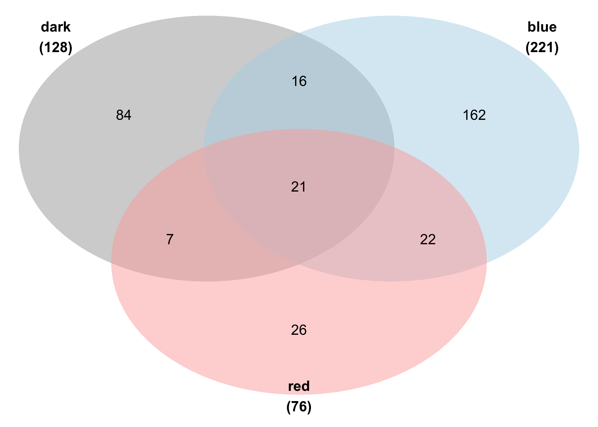<!-- -->

## Fig 4b: Groups

``` r
goi_tf
```

    ##  [1] "CCM1"   "LCR1"   "HY5"    "QER7"   "QER4"   "QER6"   "ROC15"  "ROC40" 
    ##  [9] "ROC66"  "ROC75"  "ROC59"  "ROC114" "ROC55"  "CON1"   "CRB1"

``` r
res_core <- list(WT_blue = res_list$pcry$WT_BL.vs.D,
             WT_red = res_list$pcry$WT_R.vs.D,
             pcry_blue = res_list$pcry$pcry_BL.vs.D,
             pcry_red = res_list$pcry$pcry_R.vs.D,
             dd_blue = res_list$pcry$pcry_BLvD.vs.WT_BLvD,
             dd_red = res_list$pcry$pcry_RvD.vs.WT_RvD) %>% lapply(data.frame)

# plot(res_list$pcry$pcry_BL.vs.D$log2FoldChange~res_list$pcry$pcry_R.vs.D$log2FoldChange)
#res_list$pcry$WT_BL.vs.D$symbol == anno[res_list$pcry$WT_BL.vs.D %>% rownames(),"geneSymbol"]

res_comb <- bind_cols(symbol = anno[res_list$pcry$WT_BL.vs.D %>% rownames(),"geneSymbol"],
                       res_core[[1]][,c(1,2,6)],
                       res_core[[2]][,c(2,6)],
                       res_core[[3]][,c(2,6)],
                       res_core[[4]][,c(2,6)],
                       res_core[[5]][,c(2,6)],
                       res_core[[6]][,c(2,6)])

colnames(res_comb)[c(3,4)] <- c("l2FC.WT_blue","padj.WT_blue")
colnames(res_comb)[c(5,6)] <- c("l2FC.WT_red","padj.WT_red")
colnames(res_comb)[c(7,8)] <- c("l2FC.pcry_blue","padj.pcry_blue")
colnames(res_comb)[c(9,10)] <- c("l2FC.pcry_red","padj.pcry_red")
colnames(res_comb)[c(11,12)] <- c("l2FC.dd_blue","padj.dd_blue")
colnames(res_comb)[c(13,14)] <- c("l2FC.dd_red","padj.dd_red")                                  

res_comb$symbol2 <- anno[res_comb %>% rownames(),"geneSymbol"]
res_comb$id.symbol <- anno[res_comb %>% rownames(),"id.symbol"]

  blue_red_genes <- c(deg_list$pcry$deg_pcry_BLvD.vs.WT_BLvD,
                    deg_list$pcry$deg_pcry_RvD.vs.WT_RvD) %>%
  unique()

non_sig <- data.frame(x = c(-20, 0, 20), y = c(20, 0.5, 20))

df <- res_comb[anno_tf$gene_id,]
df <- res_comb[anno_phot$gene_id,]

gg_phots <- ggplot(df, aes(x=l2FC.WT_blue, y=l2FC.WT_red, label=symbol)) + # color=group, fill=group 
  geom_segment(aes(x = l2FC.WT_blue, y= l2FC.WT_red, xend = l2FC.pcry_blue,yend = l2FC.pcry_red, color = l2FC.dd_red),
    arrow = arrow(length = unit(0.01,units = "npc"))) +
  scale_color_gradient2(mid="grey") +
  geom_point(shape=21, fill="grey", col="grey40") +
  geom_point(aes(x=l2FC.pcry_blue, y=l2FC.pcry_red, fill = "pcry"),shape=21, col="grey40") +
  scale_fill_manual(name="Genotype",values="green3") +
  geom_hline(yintercept = c(-1,1), linewidth = 0.1) + 
  geom_vline(xintercept = c(-1,1), linewidth = 0.1) +
  geom_abline(slope=c(1), intercept = 0, linewidth = 0.1) +
  # coord_cartesian(xlim=c(-5,5),ylim = c(-5,5)) +
  coord_fixed() +
  geom_text_repel(size=4, max.overlaps = 20) +
  theme_bw() +
  removeGrid(x=T, y=T)
gg_phots

# ROCs
df <- res_comb[anno_tf$gene_id,]
gg_rocs <- ggplot(df, aes(x=l2FC.WT_blue, y=l2FC.WT_red, label=symbol)) + # color=group, fill=group 
    geom_segment(aes(x = l2FC.WT_blue, y= l2FC.WT_red, xend = l2FC.pcry_blue,yend = l2FC.pcry_red, color = l2FC.dd_red),
        arrow = arrow(length = unit(0.01,units = "npc"))) +
  scale_color_gradient2(mid="grey") +
  geom_point(shape=21, fill="grey", col="grey40") +
  geom_point(aes(x=l2FC.pcry_blue, y=l2FC.pcry_red),shape=21, fill="green3", col="grey40") +
  geom_hline(yintercept = c(-1,1), linewidth = 0.1) + 
  geom_vline(xintercept = c(-1,1), linewidth = 0.1) +
  geom_abline(slope=c(1), intercept = 0, linewidth = 0.1) +
  # coord_cartesian(xlim=c(-5,5),ylim = c(-5,5)) +
  coord_fixed() +
  geom_text_repel(size=4, max.overlaps = 20) +
  theme_bw() +
  removeGrid(x=T, y=T)
gg_rocs


# TOP
df <- res_comb[blue_red_genes,]
df %>% kable()
```

|  | symbol | baseMean | l2FC.WT_blue | padj.WT_blue | l2FC.WT_red | padj.WT_red | l2FC.pcry_blue | padj.pcry_blue | l2FC.pcry_red | padj.pcry_red | l2FC.dd_blue | padj.dd_blue | l2FC.dd_red | padj.dd_red | symbol2 | id.symbol |
|:---|:---|---:|---:|---:|---:|---:|---:|---:|---:|---:|---:|---:|---:|---:|:---|:---|
| Cre16.g681750 | FAP381 | 2907.44060 | 1.1937921 | 0.0000000 | -0.2354870 | 0.0579729 | 3.1605968 | 0.0000000 | 1.9898814 | 0.0000000 | 1.9668047 | 0.0000000 | 2.2253684 | 0.0000000 | FAP381 | FAP381 |
| Cre16.g661850 |  | 12538.40390 | 0.5590292 | 0.2247740 | -1.1763678 | 0.0008734 | 2.9837730 | 0.0000000 | 1.3675094 | 0.0000954 | 2.4247438 | 0.0000102 | 2.5438772 | 0.0000039 |  | Cre16.g661850 |
| Cre02.g116700 |  | 1036.70519 | 2.2915385 | 0.0000000 | 1.8700997 | 0.0000000 | 0.0465878 | 0.9166465 | 1.0484168 | 0.0000025 | -2.2449507 | 0.0000000 | -0.8216829 | 0.2255780 |  | PTK11 |
| Cre02.g097800 | HLA3 | 801.79432 | -0.5798709 | 0.0021489 | -1.3749874 | 0.0000000 | 1.4830546 | 0.0000000 | 0.6329741 | 0.0006041 | 2.0629255 | 0.0000000 | 2.0079615 | 0.0000000 | HLA3 | HLA3 |
| Cre16.g686750 | PTA3 | 6486.26620 | -0.1492872 | 0.5007108 | -0.4452798 | 0.0022618 | -1.6117259 | 0.0000000 | -1.4187900 | 0.0000000 | -1.4624387 | 0.0000000 | -0.9735102 | 0.0000253 | PTA3 | PTA3 |
| Cre24.g755997 | PHC18 | 30501.96755 | -0.6094306 | 0.2414273 | -0.7711925 | 0.0779316 | 1.7565809 | 0.0000046 | 1.3330580 | 0.0009034 | 2.3660116 | 0.0003303 | 2.1042505 | 0.0045265 | PHC18 | PHC18 |
| Cre06.g263550 | SELU1 | 3566.14159 | 1.5204870 | 0.0000000 | 1.5265702 | 0.0000000 | 3.2407600 | 0.0000000 | 2.9555869 | 0.0000000 | 1.7202730 | 0.0000000 | 1.4290167 | 0.0000011 | SELU1 | SELU1 |
| Cre16.g677750 |  | 11349.47648 | 0.5122534 | 0.0000771 | 0.4578023 | 0.0003669 | 1.8725240 | 0.0000000 | 1.8284833 | 0.0000000 | 1.3602706 | 0.0000000 | 1.3706811 | 0.0000000 |  | Cre16.g677750 |
| Cre12.g501950 |  | 250.78410 | 0.7078341 | 0.0008032 | 0.4134300 | 0.0730692 | -1.5295010 | 0.0000000 | -0.7681230 | 0.0003388 | -2.2373351 | 0.0000000 | -1.1815530 | 0.0020309 |  | PPP39 |
| Cre02.g104450 |  | 1036.55112 | 0.5388459 | 0.0290498 | 0.0209254 | 0.9535675 | -1.3531256 | 0.0000000 | -0.9823133 | 0.0000050 | -1.8919715 | 0.0000000 | -1.0032387 | 0.0398758 |  | Cre02.g104450 |
| Cre09.g801087 |  | 138.44874 | 0.1607797 | 0.9829967 | -2.3778746 | 0.5146915 | -24.1613124 | 0.0000000 | -2.7256059 | 0.5016597 | -24.3220920 | 0.0000000 | -0.3477313 | 0.9983302 |  | Cre09.g801087 |
| Cre16.g681351 |  | 832.79182 | -3.9838068 | 0.0000000 | 0.1955314 | 0.5136958 | -1.7837533 | 0.0000002 | 0.4989267 | 0.1420120 | 2.2000536 | 0.0000024 | 0.3033953 | 0.9983302 |  | Cre16.g681351 |
| Cre16.g661750 |  | 22967.83509 | 0.4300778 | 0.2845117 | -0.7744108 | 0.0129256 | 2.3005055 | 0.0000000 | 1.1279334 | 0.0001449 | 1.8704277 | 0.0001163 | 1.9023441 | 0.0001296 |  | Cre16.g661750 |
| Cre01.g009101 |  | 3303.37288 | 0.3465231 | 0.0198109 | -0.4563152 | 0.0007454 | 1.6904340 | 0.0000000 | 0.5138072 | 0.0001970 | 1.3439108 | 0.0000000 | 0.9701224 | 0.0000056 |  | Cre01.g009101 |
| Cre03.g197100 | LRL1 | 1689.53979 | 0.0161155 | 0.9760041 | 0.4915130 | 0.0226171 | -1.5442957 | 0.0000000 | -0.2715881 | 0.3094146 | -1.5604112 | 0.0000004 | -0.7631011 | 0.1748123 | LRL1 | LRL1 |
| Cre01.g048150 | HLA8 | 5821.18967 | 0.2464299 | 0.2422513 | 1.0638132 | 0.0000000 | 1.4658713 | 0.0000000 | 1.6523784 | 0.0000000 | 1.2194413 | 0.0000004 | 0.5885653 | 0.1876649 | HLA8 | HLA8 |
| Cre09.g410050 |  | 2390.35379 | 0.0994994 | 0.7792814 | -0.0678178 | 0.8011735 | 1.4391171 | 0.0000000 | 1.2527899 | 0.0000000 | 1.3396177 | 0.0000013 | 1.3206077 | 0.0000030 |  | Cre09.g410050 |
| Cre13.g588950 |  | 64.13478 | -0.0928425 | 0.9145962 | 0.3716768 | 0.4321595 | -2.8259787 | 0.0000000 | -1.2551513 | 0.0003507 | -2.7331362 | 0.0000033 | -1.6268281 | 0.0398758 |  | Cre13.g588950 |
| Cre09.g400849 |  | 243.85600 | -0.0059096 | 0.9912044 | -0.0893476 | 0.7532477 | -1.5140535 | 0.0000000 | -0.8365955 | 0.0000089 | -1.5081440 | 0.0000004 | -0.7472479 | 0.1559229 |  | Cre09.g400849 |
| Cre02.g095151 |  | 451.10132 | 0.1467181 | 0.7566426 | 0.2222050 | 0.4948615 | 1.8762707 | 0.0000000 | 2.1346857 | 0.0000000 | 1.7295526 | 0.0000109 | 1.9124807 | 0.0000011 |  | Cre02.g095151 |
| Cre10.g452250 | FAP41 | 5894.35363 | -1.0793767 | 0.0000000 | -0.8925390 | 0.0000000 | -2.1910171 | 0.0000000 | -2.2365151 | 0.0000000 | -1.1116404 | 0.0000072 | -1.3439761 | 0.0000000 | FAP41 | FAP41 |
| Cre13.g576100 |  | 787.30886 | -0.0611995 | 0.8137302 | -0.2944780 | 0.0333620 | -1.2205512 | 0.0000000 | -0.9378698 | 0.0000000 | -1.1593517 | 0.0000000 | -0.6433918 | 0.0118876 |  | Cre13.g576100 |
| Cre02.g093600 |  | 1050.44659 | -1.1871255 | 0.0000000 | -0.7721316 | 0.0000041 | 0.0645633 | 0.8343549 | 0.2189122 | 0.3540083 | 1.2516888 | 0.0000036 | 0.9910438 | 0.0017015 |  | TEH3 |
| Cre13.g567075 |  | 150.04347 | 0.5859887 | 0.2546713 | 0.2032132 | 0.7146876 | -1.7945814 | 0.0000099 | -0.7197617 | 0.1311019 | -2.3805702 | 0.0003989 | -0.9229749 | 0.7625680 |  | Cre13.g567075 |
| Cre09.g399400 | FAP199 | 4018.83190 | -0.7107484 | 0.0000028 | -0.6230517 | 0.0000409 | 0.3781325 | 0.0294008 | 0.4916753 | 0.0023790 | 1.0888809 | 0.0000073 | 1.1147269 | 0.0000050 | FAP199 | FAP199 |
| Cre14.g623125 |  | 371.14941 | 0.4768751 | 0.0341447 | 0.3193556 | 0.1741310 | -0.9526529 | 0.0000018 | -0.4031517 | 0.0864386 | -1.4295280 | 0.0000057 | -0.7225073 | 0.2297691 |  | Cre14.g623125 |
| Cre17.g728550 |  | 353.50470 | 0.4477168 | 0.0819506 | 0.7489792 | 0.0005493 | -1.0797390 | 0.0000008 | 0.1809340 | 0.5885753 | -1.5274559 | 0.0000102 | -0.5680451 | 0.6341481 |  | Cre17.g728550 |
| Cre24.g755897 |  | 304.87524 | -1.1374565 | 0.0000000 | -1.6126219 | 0.0000000 | 0.1538841 | 0.5372404 | 0.2533786 | 0.2333968 | 1.2913406 | 0.0000001 | 1.8660005 | 0.0000000 |  | Cre24.g755897 |
| Cre06.g800711 |  | 124.48846 | 0.2747153 | 0.5052019 | 1.1379331 | 0.0000072 | -1.5999394 | 0.0000000 | -0.7694691 | 0.0043518 | -1.8746547 | 0.0000078 | -1.9074022 | 0.0000027 |  | Cre06.g800711 |
| Cre08.g368850 |  | 169.63135 | 0.6652323 | 0.0058938 | -0.1049888 | 0.7583617 | -0.9102989 | 0.0001087 | -1.1553928 | 0.0000004 | -1.5755311 | 0.0000127 | -1.0504040 | 0.0490918 |  | Cre08.g368850 |
| Cre10.g435750 |  | 56.42748 | 3.3558100 | 0.0000000 | 0.8822331 | 0.2253436 | -0.2525669 | 0.8224295 | 0.3277208 | 0.7663463 | -3.6083769 | 0.0006495 | -0.5545123 | 0.9983302 |  | Cre10.g435750 |
| Cre17.g739650 |  | 18.18458 | 2.4102989 | 0.0000647 | 1.0669515 | 0.1459163 | -1.1971548 | 0.0915355 | -1.5521161 | 0.0220098 | -3.6074537 | 0.0003513 | -2.6190676 | 0.0863541 |  | MFT1 |
| Cre16.g678200 |  | 71.27662 | 0.5254184 | 0.2097014 | 1.2325791 | 0.0000945 | -1.6187021 | 0.0000085 | -0.2973088 | 0.5548296 | -2.1441205 | 0.0001888 | -1.5298879 | 0.0292803 |  | Cre16.g678200 |
| Cre15.g801848 |  | 101.61490 | -0.7971819 | 0.1150307 | -0.2865368 | 0.6117287 | 1.5420561 | 0.0004742 | 1.4653527 | 0.0009462 | 2.3392380 | 0.0019905 | 1.7518895 | 0.0924464 |  | Cre15.g801848 |
| Cre03.g800327 |  | 123.11836 | 1.2448706 | 0.0001149 | 0.9545304 | 0.0041485 | -0.7070271 | 0.0622128 | -0.1672797 | 0.7663048 | -1.9518976 | 0.0003314 | -1.1218101 | 0.2701100 |  | Cre03.g800327 |
| Cre14.g801599 |  | 448.97407 | 0.7647598 | 0.0004193 | 1.2022992 | 0.0000000 | -0.5846841 | 0.0113996 | 0.3593927 | 0.1613715 | -1.3494439 | 0.0001053 | -0.8429065 | 0.1204427 |  | Cre14.g801599 |
| Cre16.g801863 |  | 144.41526 | 2.6568757 | 0.0000000 | 2.4521495 | 0.0000000 | 0.3312222 | 0.6240170 | 1.6116061 | 0.0001937 | -2.3256535 | 0.0037689 | -0.8405434 | 0.9150931 |  | Cre16.g801863 |
| Cre13.g585000 |  | 1399.33861 | -0.3564876 | 0.1007399 | -1.3870713 | 0.0000000 | -1.4864848 | 0.0000000 | -2.2003278 | 0.0000000 | -1.1299972 | 0.0001638 | -0.8132565 | 0.0523224 |  | Cre13.g585000 |
| Cre06.g305350 |  | 1366.90100 | 0.6788986 | 0.0268337 | 0.4173256 | 0.1955002 | -0.7766870 | 0.0079966 | -0.5530117 | 0.0814984 | -1.4555856 | 0.0035122 | -0.9703373 | 0.2422670 |  | Cre06.g305350 |
| Cre09.g399552 | LCR1 | 143.24026 | -1.5418181 | 0.0000011 | -1.8432797 | 0.0000000 | -3.4850347 | 0.0000000 | -3.5668577 | 0.0000000 | -1.9432166 | 0.0011478 | -1.7235779 | 0.0138614 | LCR1 | LCR1 |
| Cre03.g200200 |  | 543.22530 | 0.9199630 | 0.0001374 | 1.0119430 | 0.0000137 | -0.4645725 | 0.1089507 | 0.4613859 | 0.1029298 | -1.3845356 | 0.0008522 | -0.5505571 | 0.7875744 |  | Cre03.g200200 |
| Cre16.g649433 |  | 3697.93428 | -0.2073476 | 0.4960325 | -0.2990109 | 0.1987810 | -1.2855574 | 0.0000000 | -0.8276971 | 0.0000200 | -1.0782098 | 0.0023000 | -0.5286862 | 0.6093842 |  | Cre16.g649433 |
| Cre10.g447700 |  | 122.45117 | 0.6907013 | 0.0023669 | 0.9965494 | 0.0000022 | -0.7053603 | 0.0008815 | -0.3079313 | 0.2246084 | -1.3960616 | 0.0000353 | -1.3044806 | 0.0002721 |  | Cre10.g447700 |
| Cre08.g364351 |  | 99.26345 | -0.5145438 | 0.1005924 | -0.4719931 | 0.1188121 | 0.9762593 | 0.0008061 | 0.9269126 | 0.0015484 | 1.4908032 | 0.0022852 | 1.3989057 | 0.0100037 |  | FAL12 |
| Cre03.g206033 |  | 64.57241 | -0.1810026 | 0.7806489 | 0.5834710 | 0.1164930 | -2.0290617 | 0.0000000 | -0.8066855 | 0.0283381 | -1.8480590 | 0.0041262 | -1.3901565 | 0.0835768 |  | Cre03.g206033 |
| Cre07.g326700 |  | 291.39649 | -0.5810229 | 0.0186609 | -0.4358936 | 0.0852904 | -1.8037882 | 0.0000000 | -1.3187007 | 0.0000000 | -1.2227652 | 0.0030434 | -0.8828071 | 0.1504761 |  | Cre07.g326700 |
| Cre16.g801871 |  | 197.90250 | 0.2100194 | 0.5763564 | 0.8816924 | 0.0000841 | 1.4473220 | 0.0000000 | 1.5608169 | 0.0000000 | 1.2373027 | 0.0023188 | 0.6791245 | 0.4525175 |  | Cre16.g801871 |
| Cre06.g275350 | ROC40 | 4525.43590 | -0.3932456 | 0.3177271 | -5.0270077 | 0.0000000 | -0.6920228 | 0.0285565 | -1.4854313 | 0.0000000 | -0.2987771 | 0.9708832 | 3.5415764 | 0.0000000 | ROC40 | ROC40 |
| Cre03.g800380 |  | 78.65503 | -0.4609850 | 0.9495052 | -21.5374799 | 0.0000000 | 0.9866241 | 0.8466919 | 1.3284298 | 0.7985984 | 1.4476092 | 0.9726881 | 22.8659097 | 0.0000012 |  | Cre03.g800380 |
| Cre01.g004157 |  | 1591.50282 | 0.1308140 | 0.7805465 | -0.3225325 | 0.2648484 | 1.3411890 | 0.0000000 | 1.1806121 | 0.0000003 | 1.2103750 | 0.0070314 | 1.5031446 | 0.0002232 |  | Cre01.g004157 |
| Cre07.g329750 |  | 3682.62780 | -0.3044604 | 0.0512961 | -0.8945490 | 0.0000000 | -0.2174957 | 0.2241317 | 0.1333711 | 0.5174430 | 0.0869647 | 0.9708832 | 1.0279201 | 0.0000014 |  | Cre07.g329750 |
| Cre10.g425050 | ROC59 | 95.74613 | -0.4053095 | 0.3137300 | -1.0431040 | 0.0005524 | 0.0709275 | 0.9232541 | 1.0717159 | 0.0044781 | 0.4762370 | 0.9708832 | 2.1148198 | 0.0001518 | ROC59 | ROC59 |
| Cre11.g467664 |  | 799.36721 | -0.3051966 | 0.0702333 | 0.0851739 | 0.6715178 | -1.2175380 | 0.0000000 | -1.0079113 | 0.0000000 | -0.9123414 | 0.0001318 | -1.0930852 | 0.0000012 |  | Cre11.g467664 |
| Cre17.g802135 |  | 46.85867 | 18.6357849 | 0.0000000 | 20.6222919 | 0.0000000 | 2.2241508 | 0.6604924 | 1.2437070 | 0.8350027 | -16.4116341 | 0.0107624 | -19.3785849 | 0.0012230 |  | Cre17.g802135 |
| Cre12.g801353 |  | 38.33938 | 0.1700847 | 0.7908455 | -0.4914744 | 0.2352436 | 1.8643932 | 0.0000124 | 1.6905382 | 0.0000974 | 1.6943085 | 0.0318976 | 2.1820126 | 0.0025939 |  | Cre12.g801353 |
| Cre09.g413200 |  | 1963.74793 | -1.3180480 | 0.0000000 | -3.3556733 | 0.0000000 | -1.8986165 | 0.0000000 | -2.2686069 | 0.0000000 | -0.5805685 | 0.3768417 | 1.0870664 | 0.0017015 |  | STK22 |
| Cre06.g260700 |  | 181.28117 | -1.0798458 | 0.0000000 | -1.4359254 | 0.0000000 | -1.0494194 | 0.0000007 | -0.1748709 | 0.5798608 | 0.0304264 | 0.9902168 | 1.2610546 | 0.0004460 |  | XUV1 |
| Cre12.g531800 | FAP7 | 480.45292 | 0.8460782 | 0.0005353 | 1.3486722 | 0.0000000 | 0.2316140 | 0.5034274 | 0.0797826 | 0.8589850 | -0.6144642 | 0.6108895 | -1.2688896 | 0.0047699 | FAP7 | FAP7 |
| Cre06.g285350 |  | 950.92924 | 0.0516860 | 0.8993572 | -0.2211321 | 0.3166587 | 0.7423766 | 0.0000240 | 0.7965364 | 0.0000044 | 0.6906906 | 0.1053799 | 1.0176685 | 0.0016248 |  | Cre06.g285350 |
| Cre07.g329050 | AOC5 | 89.09958 | -0.7533875 | 0.0525125 | 0.2085977 | 0.6493559 | -2.0436827 | 0.0000000 | -1.5839405 | 0.0000019 | -1.2902952 | 0.1462976 | -1.7925382 | 0.0047817 | AOC5 | AOC5 |
| Cre16.g687000 | FPN1 | 172.69472 | -0.2216115 | 0.3831199 | 0.0209792 | 0.9419827 | -0.8145136 | 0.0000043 | -1.0343937 | 0.0000000 | -0.5929021 | 0.3041292 | -1.0553728 | 0.0011744 | FPN1 | FPN1 |

``` r
plot(df$l2FC.dd_red ~ df$l2FC.dd_blue)

gg_top <- ggplot(df, aes(x=l2FC.WT_blue, y=l2FC.WT_red, label=symbol)) + # color=group, fill=group 
    geom_segment(aes(x = l2FC.WT_blue, y= l2FC.WT_red, xend = l2FC.pcry_blue,yend = l2FC.pcry_red, color = l2FC.dd_red),
        arrow = arrow(length = unit(0.01,units = "npc"))) +
  scale_color_gradient2(mid="grey") +
  geom_point(shape=21, fill="grey", col="grey40") +
  geom_point(aes(x=l2FC.pcry_blue, y=l2FC.pcry_red),shape=21, fill="green3", col="grey40") +
  geom_hline(yintercept = c(-1,1), linewidth = 0.1) + 
  geom_vline(xintercept = c(-1,1), linewidth = 0.1) +
  geom_abline(slope=c(1), intercept = 0, linewidth = 0.1) +
  coord_cartesian(xlim=c(-5,5),ylim = c(-5,5)) +
  # coord_fixed() +
  geom_text_repel(size=4, max.overlaps = 20) +
  theme_bw() +
  removeGrid(x=T, y=T)
gg_top %>% print()

# scale_colour_manual(name="Error Bars",values=cols)
```

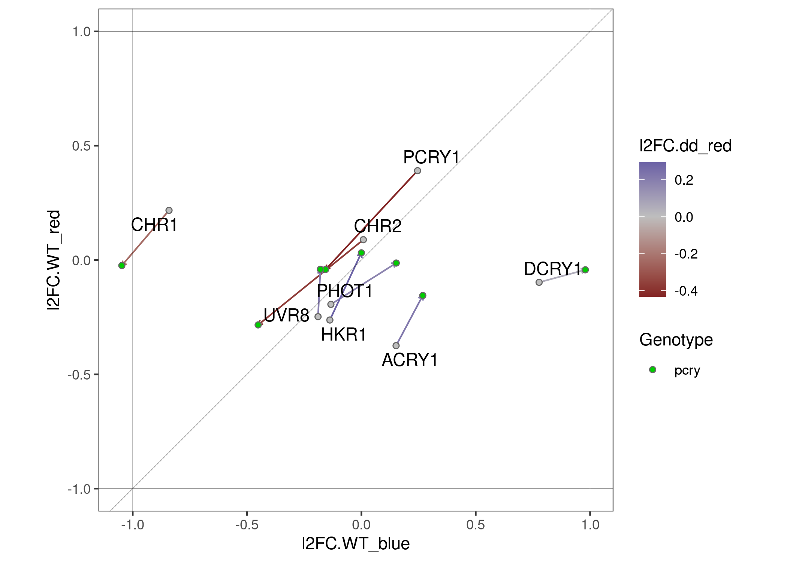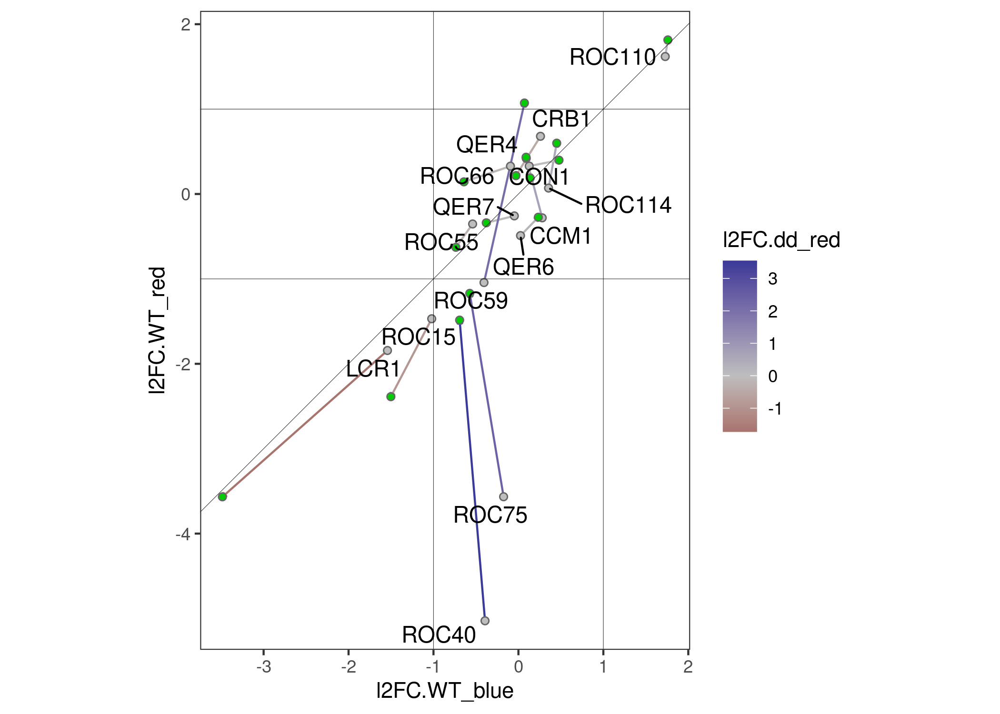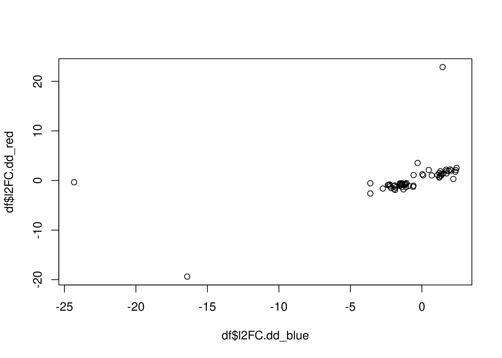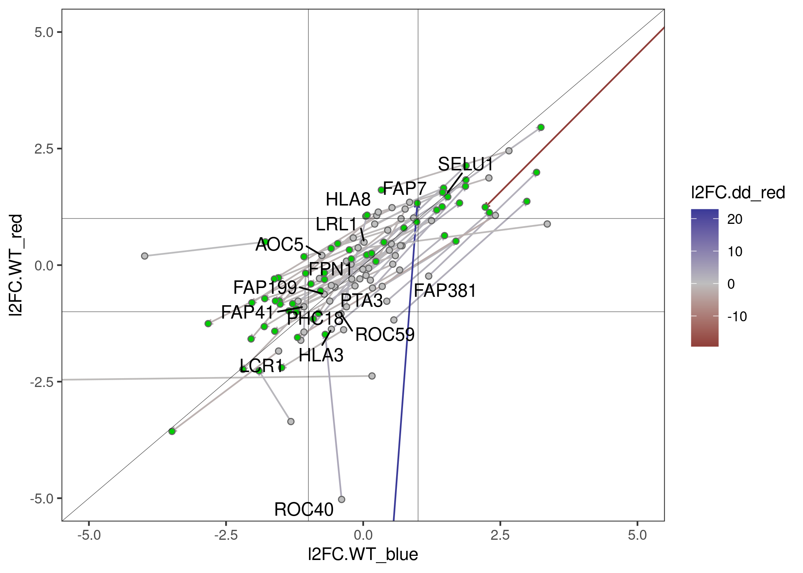

# Fig. 5: pCRY interaction partner

## load csv

``` r
top20 <- read.csv2("../UniProt-and-Cre-ID's.csv")
top20_id <- top20$'Cre.ID' %>% str_remove_all(pattern=" ")
summary(top20_id %in% anno$gene_id)
```

    ##    Mode    TRUE 
    ## logical      32

## Plot interaction counts

``` r
## Interaction genes all-in-one
fig <- "Fig5"
goi_interaction <- top20_id
anno_interaction <- anno[top20_id,]

goi <- anno_interaction
l <- nrow(goi)
all_counts <- {}
for (i in 1:l){
  d <-  plotCounts(dds, gene=goi[i,"gene_id"], intgroup=c("condition","experiment","treatment","genotype"), col=col,main=res$SYMBOL[i],returnData=TRUE)
  d$Gene <- rep(goi[i,"id.symbol"],length(rownames(d)))
  d$sample <- rownames(d)
  rownames(d) <- {}
  all_counts <- bind_rows(all_counts,d)
  }

# all_counts$Gene
levels(all_counts$condition)
```

    ## [1] "WT_dark"   "pcry_dark" "WT_blue"   "pcry_blue" "WT_red"    "pcry_red"

``` r
levels(all_counts$Gene)
```

    ## NULL

``` r
all_counts$Gene <- factor(all_counts$Gene)
all_counts$Gene <- fct_reorder(all_counts$Gene, all_counts$count, .fun = median, .desc = TRUE)
levels(all_counts$Gene)
```

    ##  [1] "PHC15"         "PHC6"          "PRP38A"        "PRP19"        
    ##  [5] "NSG17"         "Cre01.g013600" "CSK4"          "LIP1"         
    ##  [9] "CGL117"        "Cre02.g092400" "Cre06.g290450" "Cre10.g421850"
    ## [13] "FAP71"         "Cre03.g200431" "PCRY1"         "Cre06.g274500"
    ## [17] "Cre16.g676350" "REF1"          "PPP16"         "Cre16.g684700"
    ## [21] "NOM1"          "FAP236"        "GAPC1"         "FAP149"       
    ## [25] "Cre06.g257400" "RFC2"          "Cre08.g378000" "CSL"          
    ## [29] "TEF13"         "Cre06.g278259" "Cre08.g358567" "Cre16.g676402"

``` r
# all_counts$Gene <- factor(all_counts$Gene, levels = c("PHOT1","CHR1","CHR2","HKR1","UVR8","DCRY1","PCRY1","ACRY1")) # "DCRY2", 
# levels(all_counts$Gene)

# Plot
max_val <- 1.0*max(all_counts$count)
gcounts_interaction <- ggplot(all_counts, aes(x = Gene, y = count, fill=condition)) +
  geom_boxplot(fatten = 1) +
  scale_fill_manual(values = group.colors) +
  labs(title = "Interaction partners") + 
  theme_bw() +
  removeGrid(x=T, y=T) +
  geom_vline(xintercept=seq(1,length(levels(all_counts$Gene))-1,1)+.5,color="grey") +
  theme(axis.text.x = element_text(angle = 90, vjust = 0.5, hjust=1)) +
  scale_y_continuous(trans = "log2") & plot_annotation(title = colData(dds)$experiment[1])
gcounts_interaction %>% print()
```

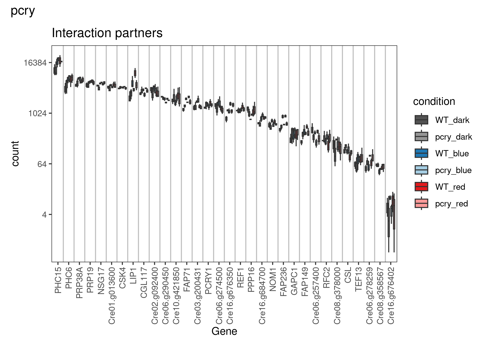<!-- -->

``` r
ggsave(paste(fig,"_",colData(dds)$experiment[1],"_Counts_Interaction.pdf",sep=""), plot = gcounts_interaction,
width = 15,
height = 8)
```

## scatter plot

``` r
# Interaction
df <- res_comb[anno_interaction$gene_id,]

df_final <- df %>%
  mutate(shift = sqrt((l2FC.pcry_blue - l2FC.WT_blue)^2 + (l2FC.pcry_red - l2FC.WT_red)^2)) %>%
  arrange(desc(shift)) %>%
  filter(!str_starts(id.symbol, "Cre")) %>%
  filter((baseMean > 100 & shift > 0.2) | id.symbol == "CSL")

df_final %>% kable()
```

|  | symbol | baseMean | l2FC.WT_blue | padj.WT_blue | l2FC.WT_red | padj.WT_red | l2FC.pcry_blue | padj.pcry_blue | l2FC.pcry_red | padj.pcry_red | l2FC.dd_blue | padj.dd_blue | l2FC.dd_red | padj.dd_red | symbol2 | id.symbol | shift |
|:---|:---|---:|---:|---:|---:|---:|---:|---:|---:|---:|---:|---:|---:|---:|:---|:---|---:|
| Cre09.g390615 | LIP1 | 4851.8528 | 1.1732974 | 0.0011560 | 1.9282801 | 0.0000000 | 0.2845022 | 0.5898124 | 0.6685840 | 0.1033891 | -0.8887952 | 0.6177857 | -1.2596961 | 0.2167585 | LIP1 | LIP1 | 1.5416845 |
| Cre12.g496100 | FAP149 | 350.3482 | 0.8789904 | 0.0031358 | 1.2110136 | 0.0000097 | 0.0920294 | 0.8543290 | 0.1564865 | 0.7470433 | -0.7869610 | 0.5221294 | -1.0545271 | 0.1811171 | FAP149 | FAP149 | 1.3158020 |
| Cre06.g278194 | FAP236 | 625.1249 | 1.0383598 | 0.0000000 | 1.0722404 | 0.0000000 | 0.1640947 | 0.5036048 | 0.2199613 | 0.3250671 | -0.8742650 | 0.0046175 | -0.8522792 | 0.0100465 | FAP236 | FAP236 | 1.2209501 |
| Cre03.g201400 |  | 1073.4484 | -0.8402354 | 0.0126723 | -0.2157703 | 0.6072290 | -0.1121242 | 0.8362425 | 0.3615787 | 0.3949374 | 0.7281112 | 0.7063699 | 0.5773490 | 0.9343979 |  | PPP16 | 0.9292351 |
| Cre06.g261900 | FAP71 | 1879.7996 | 0.8467756 | 0.0000000 | 0.9980327 | 0.0000000 | 0.2848148 | 0.1097479 | 0.3247845 | 0.0550332 | -0.5619608 | 0.1361804 | -0.6732482 | 0.0429412 | FAP71 | FAP71 | 0.8769624 |
| Cre13.g575900 | CGL117 | 3418.9470 | 0.2948828 | 0.2000772 | 0.4202106 | 0.0279918 | -0.3168058 | 0.1460123 | -0.0165034 | 0.9653027 | -0.6116885 | 0.2528255 | -0.4367140 | 0.7138885 | CGL117 | CGL117 | 0.7515863 |
| Cre06.g295200 | PCRY1 | 1598.6347 | 0.2455753 | 0.4471139 | 0.3907966 | 0.1116388 | -0.1568289 | 0.6420444 | -0.0414836 | 0.9271531 | -0.4024042 | 0.9023617 | -0.4322802 | 0.8937865 | PCRY1 | PCRY1 | 0.5905889 |
| Cre12.g485150 | GAPC1 | 328.9929 | 0.3721829 | 0.6449914 | 0.3852239 | 0.5358801 | 0.0792620 | 0.9293605 | 0.0088407 | 0.9927693 | -0.2929210 | 0.9708832 | -0.3763832 | 0.9983302 | GAPC1 | GAPC1 | 0.4769351 |
| Cre14.g620850 | NSG17 | 4977.5780 | 0.1661825 | 0.3944132 | 0.1219927 | 0.4914824 | 0.4439202 | 0.0015036 | 0.4296436 | 0.0021584 | 0.2777376 | 0.8314370 | 0.3076509 | 0.7966261 | NSG17 | NSG17 | 0.4144723 |
| Cre07.g337150 | RFC2 | 247.4703 | -0.0771871 | 0.9378221 | -0.2420410 | 0.6703779 | 0.0958234 | 0.8983936 | 0.0751896 | 0.9294564 | 0.1730105 | 0.9754252 | 0.3172306 | 0.9983302 | RFC2 | RFC2 | 0.3613418 |
| Cre17.g717950 | PHC6 | 6078.9064 | 0.7252230 | 0.0964213 | 0.7165871 | 0.0760207 | 0.5066308 | 0.2900892 | 0.5033631 | 0.2870315 | -0.2185922 | 0.9715373 | -0.2132240 | 0.9983302 | PHC6 | PHC6 | 0.3053638 |
| Cre03.g178300 |  | 5972.3762 | 0.5408206 | 0.0319292 | 0.3022600 | 0.2639807 | 0.2886462 | 0.3389132 | 0.2578521 | 0.4046280 | -0.2521745 | 0.9708832 | -0.0444080 | 0.9983302 |  | PRP38A | 0.2560547 |
| Cre10.g462250 | REF1 | 1253.2101 | -0.0419552 | 0.9306963 | 0.3377597 | 0.1424696 | 0.0656019 | 0.8535260 | 0.1084080 | 0.7545446 | 0.1075570 | 0.9715373 | -0.2293517 | 0.9983302 | REF1 | REF1 | 0.2533194 |
| Cre09.g396100 | PHC15 | 15983.8832 | 0.6264130 | 0.1463066 | 0.7474967 | 0.0472070 | 0.7876369 | 0.0439275 | 0.5735881 | 0.1778943 | 0.1612239 | 0.9734794 | -0.1739086 | 0.9983302 | PHC15 | PHC15 | 0.2371441 |
| Cre16.g666200 |  | 4170.3507 | 0.0919110 | 0.5506179 | 0.1388978 | 0.2264636 | -0.0094418 | 0.9601151 | -0.0693801 | 0.6533956 | -0.1013528 | 0.9708832 | -0.2082779 | 0.8411519 |  | CSK4 | 0.2316292 |
| Cre02.g092150 |  | 129.8465 | -0.0511640 | 0.9466656 | -0.4982285 | 0.1696768 | -0.1972779 | 0.6820730 | -0.4649790 | 0.2251876 | -0.1461139 | 0.9731332 | 0.0332495 | 0.9983302 |  | CSL | 0.1498492 |

``` r
gg_interaction <- ggplot(df_final, aes(x=l2FC.WT_blue, y=l2FC.WT_red, label=id.symbol)) + # color=group, fill=group 
    geom_segment(aes(x = l2FC.WT_blue, y= l2FC.WT_red, xend = l2FC.pcry_blue,yend = l2FC.pcry_red, color = shift), # color = baseMean
        arrow = arrow(length = unit(0.02,units = "npc"))) +
  scale_color_gradient(low = "grey",high = "green3") +
  geom_point(aes(x=l2FC.WT_blue, y=l2FC.WT_red, fill="WT"),shape=21, col="grey40") +
  geom_point(aes(x=l2FC.pcry_blue, y=l2FC.pcry_red, fill = "pcry"),shape=21, col="grey40") +
  scale_fill_manual(name="Genotype",values=c("green3","grey")) + 
  geom_hline(yintercept = c(-1,1), linewidth = 0.1) + 
  geom_vline(xintercept = c(-1,1), linewidth = 0.1) +
  geom_abline(slope=c(1), intercept = 0, linewidth = 0.1) +
  # coord_cartesian(xlim=c(-2,2),ylim = c(-2,2)) +
  # coord_fixed(xlim=c(-1,2),ylim = c(-1,2)) +
  geom_label_repel(fontface = "bold", color = "grey10", fill = "white", label.size = 0.15, label.padding = 0.15, size = 4, max.overlaps = Inf,   force = 2, point.padding = 0.5,    min.segment.length = 0, segment.color = "black", segment.size = 0.1) +
 # geom_text_repel(size=4, max.overlaps = 5, color="grey30", fontface="bold") +
  theme_bw() +
  removeGrid(x=T, y=T)
gg_interaction
```

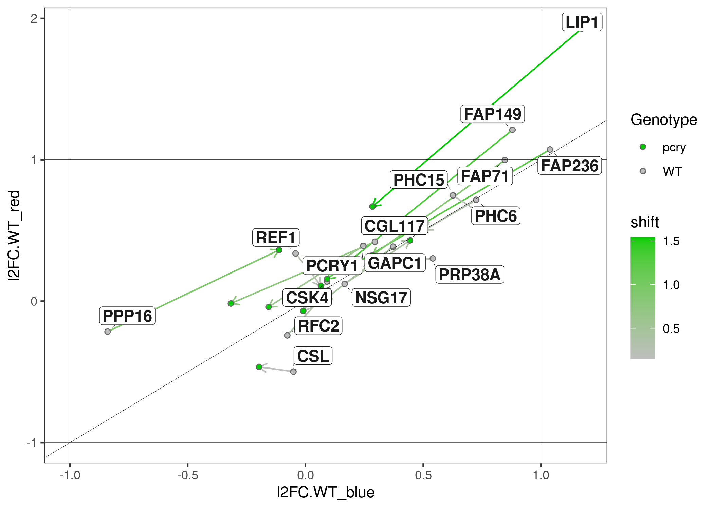<!-- -->

``` r
ggsave(paste(fig,"_",colData(dds)$experiment[1],"_Scatter_Interaction.pdf",sep=""), plot = gg_interaction,
width = 10,
height = 10)

write_xlsx(data.frame(df),"Interaction_results.xlsx")
```

# Fig. Y

``` r
p_new2 <- ggplot(deg_table, aes(x=XX.log2FC, y=XY.log2FC,color=group, fill=group)) + 
  geom_polygon(data = xyup, aes(x=x,y=y),color=cols2l[2],fill=cols2l[2], alpha=0.2) +
  geom_polygon(data = xydo, aes(x=x,y=y),color=cols2l[2],fill=cols2l[2], alpha=0.8) +
  geom_polygon(data = xxdo, aes(x=x,y=y),color=cols2l[1],fill=cols2l[1], alpha=0.8) +
  geom_polygon(data = xxup, aes(x=x,y=y),color=cols2l[1],fill=cols2l[1], alpha=0.2) +
  annotate("text", x= text$x,y= text$y,label = paste(text$label,text$size,sep="\n"), color=text$color,size=3 , fontface="bold") +
  geom_hline(yintercept = 0, linewidth = 0.1) + 
  geom_vline(xintercept = 0, linewidth = 0.1) +
  geom_point(shape=21) + 
  scale_color_manual(values=alpha(c(cols2d[1],cols2d[1], cols2d[2],cols2d[2],rep(colsp,2),rep(colsap,2)),0.8)) +
  scale_fill_manual(values=alpha(c(cols2d[1],cols2d[1], cols2d[2],cols2d[2],rep(colsp,2),rep(colsap,2)),0.3)) +
#  scale_color_manual(values = text$color) +
  coord_cartesian(xlim=c(-10,10),ylim = c(-10,10)) +
  theme_bw() +
  removeGrid(x=T, y=T)

p_new2 + scale_fill_manual(values=c(cols2d[1],cols2d[1], cols2d[2],cols2d[2],alpha(c(rep(colsp,2),rep(colsap,2)),0.3))) 
```
