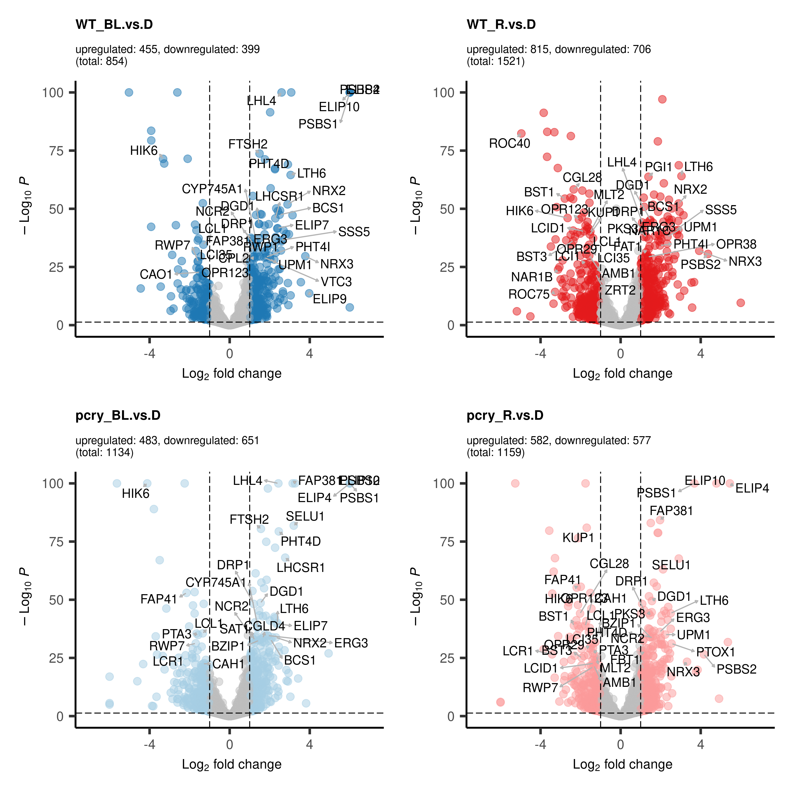
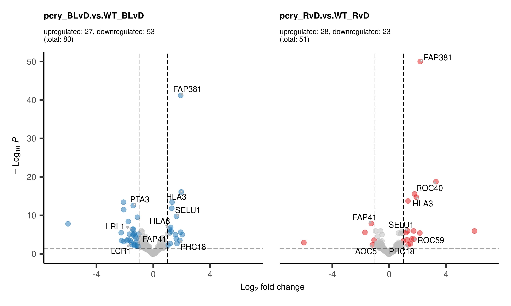
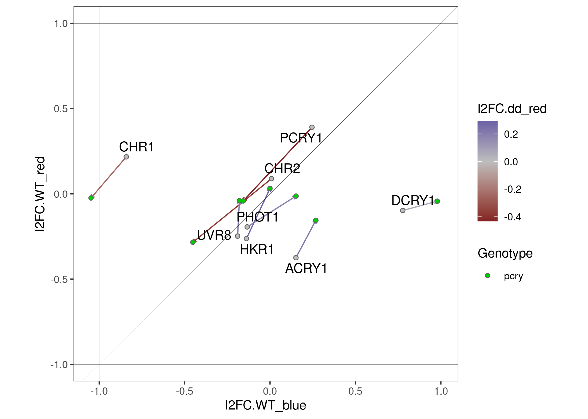

figures_manuscript
================
2024-10-17

- [run prepare_data scripts](#run-prepare_data-scripts)
- [Fig 1: PCA](#fig-1-pca)
- [Fig 2: Counts](#fig-2-counts)
  - [individual counts](#individual-counts)
- [Fig 2x: Explain data](#fig-2x-explain-data)
- [Fig 3: Volcanos](#fig-3-volcanos)
  - [a) Δgenotype per condition (1)](#a-δgenotype-per-condition-1)
  - [b): Δlight = light effect (2)](#b-δlight--light-effect-2)
  - [c): ΔgenotypeΔlight = difference in light effect (interaction term)
    (3)](#c-δgenotypeδlight--difference-in-light-effect-interaction-term-3)
- [Fig 4: Overlaps](#fig-4-overlaps)
  - [Fig 4a: Venns](#fig-4a-venns)
  - [Fig 4b: Groups](#fig-4b-groups)
- [Fig. X](#fig-x)

BiocManager::install()

# run prepare_data scripts

# Fig 1: PCA

``` r
fig <- "Fig1"

# group
for (dds in dds_list) {
vsd <- vst(dds, blind=FALSE)
# colData(dds)
### PCA with top 500 genes with highest row variance 
pcaData <- plotPCA(vsd, intgroup=c("treatment", "genotype","condition"), returnData=TRUE,)
percentVar <- round(100 * attr(pcaData, "percentVar"))

g1 <- ggplot(pcaData, aes(PC1, PC2, color=treatment, shape=genotype)) +
  geom_hline(yintercept = 0, linewidth = 0.1) + 
  geom_vline(xintercept = 0, linewidth = 0.1) +
  geom_point(size=4, stroke = 1) +
  scale_shape_manual(values = c(16,21)) + 
  labs(title = "PCA plot") +
  ylab(paste0("PC1: ",percentVar[1],"% variance")) +
  xlab(paste0("PC2: ",percentVar[2],"% variance")) + 
  scale_color_manual(values = anno_colors$treatment) +
  # coord_fixed() +
  scale_x_reverse() +
  theme_bw() +
  removeGrid(x=T, y=T)
}

# pCRY
dds <- dds_list[["pcry"]]
vsd <- vst(dds, blind=FALSE)

pcaData <- plotPCA(vsd, intgroup=c("treatment", "genotype","condition"), returnData=TRUE,)
percentVar <- round(100 * attr(pcaData, "percentVar"))
g1 <- ggplot(pcaData, aes(PC2, PC1, color=treatment, shape=genotype)) +
  geom_hline(yintercept = 0, linewidth = 0.1) + 
  geom_vline(xintercept = 0, linewidth = 0.1) +
  geom_point(size=4, stroke = 1) +
  scale_shape_manual(values = c(16,21)) + 
  labs(title = "PCA plot: pCRY") +
  ylab(paste0("PC1: ",percentVar[1],"% variance")) +
  xlab(paste0("PC2: ",percentVar[2],"% variance")) + 
  scale_color_manual(values = anno_colors$treatment) +
  # coord_fixed() +
  scale_x_reverse() +
  scale_y_reverse() +
  theme_bw() +
  removeGrid(x=T, y=T)
g1

ggsave(paste(fig,"_",colData(dds)$experiment[1],"_PCA.pdf",sep=""), plot = g1,
width = 6,
height = 6)

# aCRY
dds <- dds_list[["acry"]]
vsd <- vst(dds, blind=FALSE)
pcaData <- plotPCA(vsd, intgroup=c("treatment", "genotype","condition"), returnData=TRUE,)
percentVar <- round(100 * attr(pcaData, "percentVar"))
g2 <- ggplot(pcaData, aes(PC1, PC2, color=treatment, shape=genotype)) +
  geom_hline(yintercept = 0, linewidth = 0.1) + 
  geom_vline(xintercept = 0, linewidth = 0.1) +
  geom_point(size=4, stroke = 1) +
  scale_shape_manual(values = c(16,21)) + 
  labs(title = "PCA plot: aCRY") +
  ylab(paste0("PC1: ",percentVar[1],"% variance")) +
  xlab(paste0("PC2: ",percentVar[2],"% variance")) + 
  scale_color_manual(values = anno_colors$treatment) +
  # coord_fixed() +
  scale_x_reverse() +
  theme_bw() +
  removeGrid(x=T, y=T)
g2

ggsave(paste(fig,"_",colData(dds)$experiment[1],"_PCA.pdf",sep=""), plot = g2,
width = 6,
height = 6)
```


# Fig 2: Counts

<!-- --><!-- --><!-- --><!-- --><!-- --><!-- --><!-- -->

## individual counts

``` r
ROC59 <- "Cre10.g425050"
goi <- ROC59

    d <- plotCounts(dds, gene=goi, intgroup=c("condition","experiment","genotype","treatment","clientName"), main=s,returnData=TRUE)
    colnames(d)[1] <- "counts"

gcounts <- ggplot(d, aes(x = treatment, y = counts, fill=condition, color=condition)) +
    geom_boxplot(color="black") +
    geom_point(shape=21,color="black",aes(fill=condition),position=position_dodge(width=0.75), alpha=1) +
  # geom_text_repel(aes(label=clientName)) +
    scale_fill_manual(values=group.colors) +
    scale_color_manual(values=group.colors) +
    scale_y_continuous(trans = "log2") +
    theme_bw() +
  removeGrid(x=T, y=T) +
    geom_vline(xintercept=seq(1,length(levels(all_counts$treatment))-1,1)+.5,color="grey") +

    labs(title = paste(goi," (",mcols(dds)[goi,"id.symbol"], ")", " in ",colData(dds)$experiment[1],sep = "")) +
 theme(axis.text.x = element_text(size = 10, face = "bold"),
        axis.text.y = element_text(color = "grey20", size = 8, angle = 0, hjust = 1, vjust = 0, face = "plain"),
        axis.title.x = element_text(color = "white", size = 12, angle = 0, hjust = .5, vjust = 0, face = "plain"),
        axis.title.y = element_text(color = "grey20", size = 12, angle = 90, hjust = .5, vjust = .5, face = "bold"))

gcounts
```

<!-- -->

``` r
gcounts_roc59 <- gcounts
```

# Fig 2x: Explain data

``` r
c_graphic <- png::readPNG("Contrasts.png", native = TRUE)
patchwork::wrap_elements((c_graphic))
```

<!-- -->

``` r
res_core <- list(dark = res_list$pcry$pcry_D.vs.WT_D,
             blue = res_list$pcry$pcry_BL.vs.WT_BL,
             red =res_list$pcry$pcry_R.vs.WT_R) %>% lapply(data.frame)

DEGs_comb <- bind_cols(res_core[[1]],res_core[[2]][,c(2,6)],res_core[[3]][,c(2,6)])
colnames(DEGs_comb)[c(2,6,8,9,10,11)] <- c("l2FC.dark","padj.dark","l2FC.blue","padj.blue","l2FC.red","padj.red") 


res_list[["pcry"]] %>% names()
```

    ##  [1] "WT_BL.vs.D"           "WT_R.vs.D"            "pcry_BL.vs.D"        
    ##  [4] "pcry_R.vs.D"          "pcry_D.vs.WT_D"       "pcry_BL.vs.WT_BL"    
    ##  [7] "pcry_R.vs.WT_R"       "pcry_BLvD.vs.WT_BLvD" "pcry_RvD.vs.WT_RvD"  
    ## [10] "BL+R.vs.D"            "BL.vs.D"              "R.vs.D"              
    ## [13] "pcry.vs.WT"

``` r
res_list[["pcry"]][["WT_R.vs.D"]][ROC40,c(2,6)]
```

    ## log2 fold change (MLE): treatment_red_vs_dark effect 
    ##  
    ## DataFrame with 1 row and 2 columns
    ##               log2FoldChange        padj
    ##                    <numeric>   <numeric>
    ## Cre06.g275350       -5.02701 4.30468e-83

``` r
res_list[["pcry"]][["pCRY_R.vs.D"]][ROC40,c(2,6)]
```

    ## NULL

``` r
# anno_tf
ROC59 <- "Cre10.g425050"
goi  <- ROC40  # ROC40 ROC59


results <- lapply(res_list[["pcry"]],data.frame)
l2fc <- sapply(results,"[[",goi,c(2)) %>% round(digits=2)
names(l2fc) <- paste0("l2fc.",names(l2fc))
p <- sapply(results,"[[",goi,c(6)) %>% round(digits=3)

goi_lp <- list("l2fc"=l2fc,
               "p"=p)

l2fc
```

    ##           l2fc.WT_BL.vs.D            l2fc.WT_R.vs.D         l2fc.pcry_BL.vs.D 
    ##                     -0.39                     -5.03                     -0.69 
    ##          l2fc.pcry_R.vs.D       l2fc.pcry_D.vs.WT_D     l2fc.pcry_BL.vs.WT_BL 
    ##                     -1.49                      0.62                      0.32 
    ##       l2fc.pcry_R.vs.WT_R l2fc.pcry_BLvD.vs.WT_BLvD   l2fc.pcry_RvD.vs.WT_RvD 
    ##                      4.16                     -0.30                      3.54 
    ##            l2fc.BL+R.vs.D              l2fc.BL.vs.D               l2fc.R.vs.D 
    ##                     -0.73                     -0.54                     -3.26 
    ##           l2fc.pcry.vs.WT 
    ##                      1.70

``` r
# gcounts_roc40
gcounts_roc40 + coord_cartesian(ylim = c(1,10000)) + 
  # (1.)
  geom_text(aes(x = 0.5,y = 120),
            label="1.", color="red2") +
  # "pcry_D.vs.WT_D" 
  geom_segment(
        aes(x = 0.7,y = 90, xend = 1.3,yend = 90),
        arrow = arrow(length = unit(0.03,units = "npc")),color ="red2") +
  geom_text(aes(x = 1,y = 120),
            label=goi_lp$l2fc["l2fc.pcry_D.vs.WT_D"], color="red2") +
  
    # "pcry_BL.vs.WT_BL" 
  geom_segment(
        aes(x = 1.7,y = 90, xend = 2.3,yend = 90),
        arrow = arrow(length = unit(0.03,units = "npc")),color ="red2") +
  geom_text(aes(x = 2,y = 120),
            label=goi_lp$l2fc["l2fc.pcry_BL.vs.WT_BL"], color="red2") +
  
    # "pcry_R.vs.WT_R" 
  geom_segment(
        aes(x = 2.7,y = 75, xend = 3.3,yend = 75),
        arrow = arrow(length = unit(0.03,units = "npc")),color ="red2") +
  geom_text(aes(x = 3,y = 100),
            label=goi_lp$l2fc["l2fc.pcry_R.vs.WT_R"], color="red2") +

  # (2.)  
  geom_text(aes(x = 0.5,y = 50),
            label="2.", color="green4") +
  # ""WT_BL.vs.D"" 
    geom_segment(
        aes(x = 0.7,y = 40, xend = 1.7,yend = 40),
        arrow = arrow(length = unit(0.03,units = "npc")),color ="green4") +
  geom_text(aes(x = 1,y = 55),
            label=goi_lp$l2fc["l2fc.WT_BL.vs.D"], color="green4") +
  # 3.
  geom_text(aes(x = 0.5,y = 20),
            label="3.", color="purple3") +
    # "WT_R.vs.D" 
    geom_segment(
        aes(x = 1.3,y = 35, xend = 1.7,yend = 12),
        arrow = arrow(length = unit(0.03,units = "npc")),color ="purple3") +
  geom_text(aes(x = 1.7,y = 25),
            label=goi_lp$l2fc["l2fc.pcry_BLvD.vs.WT_BLvD"], color="purple3") +
  # "pcry_BL.vs.D"
    geom_segment(
        aes(x = 1.2,y = 9, xend = 2.3,yend = 9),
        arrow = arrow(length = unit(0.03,units = "npc")),color ="green3") +
  geom_text(aes(x = 2,y = 12),
            label=goi_lp$l2fc["l2fc.pcry_BL.vs.D"], color="green3") +

    # "WT_R.vs.D" 
    geom_segment(
        aes(x = 0.7,y = 6, xend = 2.7,yend = 6),
        arrow = arrow(length = unit(0.03,units = "npc")),color ="green4") +
  geom_text(aes(x = 0.9,y = 8),
            label=goi_lp$l2fc["l2fc.WT_R.vs.D"], color="green4") +
  # "pcry_BL.vs.D" 
    geom_segment(
        aes(x = 1.2,y = 1, xend = 3.3,yend = 1),
        arrow = arrow(length = unit(0.03,units = "npc")),color ="green3") +
  geom_text(aes(x = 3,y = 1.3),
            label=goi_lp$l2fc["l2fc.pcry_R.vs.D"], color="green3") +

  
  # "pcry_BL.vs.D" 
    geom_segment(
        aes(x = 1.7,y = 5, xend = 2.3,yend = 1.3),
        arrow = arrow(length = unit(0.03,units = "npc")),color ="purple1") +
  geom_text(aes(x = 2.3,y = 2.7),
            label=goi_lp$l2fc["l2fc.pcry_RvD.vs.WT_RvD"], color="purple1") #+
```

<!-- -->

``` r
DEGs_comb[ROC40,]
```

    ##               baseMean l2FC.dark     lfcSE     stat    pvalue padj.dark symbol
    ## Cre06.g275350 4525.436 0.6158121 0.2470149 2.493016 0.0126663 0.2481123  ROC40
    ##               l2FC.blue padj.blue l2FC.red     padj.red
    ## Cre06.g275350  0.317035 0.5033338 4.157389 1.290229e-55

# Fig 3: Volcanos

## a) Δgenotype per condition (1)

``` r
fig <- "Fig3"

dds <- dds_list[["pcry"]]

res_ashr_list %>% names()
```

    ## [1] "acry" "pcry"

``` r
res_ashr_list[[1]] %>% names()
```

    ##  [1] "WT_BL.vs.D"           "WT_R.vs.D"            "acry_BL.vs.D"        
    ##  [4] "acry_R.vs.D"          "acry_D.vs.WT_D"       "acry_BL.vs.WT_BL"    
    ##  [7] "acry_R.vs.WT_R"       "acry_BLvD.vs.WT_BLvD" "acry_RvD.vs.WT_RvD"  
    ## [10] "BL+R.vs.D"            "BL.vs.D"              "R.vs.D"              
    ## [13] "acry.vs.WT"

``` r
res <- res_ashr_list$pcry$pcry_R.vs.WT_R
res_n <- res_list$pcry$pcry_R.vs.WT_R

# of shrinked results
total <- subset(res, padj< 0.05) %>% nrow()
up <- subset(res, padj< 0.05 & log2FoldChange > 1) %>% nrow()
down <- subset(res, padj< 0.05 & log2FoldChange < -1) %>% nrow()

# of "true" results
total <- subset(res_n, padj< 0.05) %>% nrow()
up <- subset(res_n, padj< 0.05 & log2FoldChange > 1) %>% nrow()
down <- subset(res_n, padj< 0.05 & log2FoldChange < -1) %>% nrow()

# points outside the grid
subset(res, padj < 10^-50 | log2FoldChange > 6 | log2FoldChange < -6)
```

    ## log2 fold change (MMSE): genotype_pcry_vs_WT+genotypepcry.treatmentred effect 
    ## Wald test p-value: genotype_pcry_vs_WT+genotypepcry.treatmentred effect 
    ## DataFrame with 5 rows and 5 columns
    ##                baseMean log2FoldChange     lfcSE       pvalue         padj
    ##               <numeric>      <numeric> <numeric>    <numeric>    <numeric>
    ## Cre01.g002200   20.2489      -20.40541  9.368334           NA           NA
    ## Cre03.g800380   78.6550       22.00315  2.726709  3.18538e-16  2.61555e-13
    ## Cre06.g275350 4525.4359        4.09928  0.258053  1.74591e-59  1.29023e-55
    ## Cre09.g403367   32.3010      -17.14325 10.815078  1.35041e-06  2.97897e-04
    ## Cre16.g681351  832.7918       -4.90661  0.217733 1.22244e-114 1.80676e-110

``` r
#                 baseMean log2FoldChange     lfcSE      pvalue        padj
#               <numeric>      <numeric> <numeric>   <numeric>   <numeric>
# Cre16.g681750 2907.4406       -3.51641   0.22216 2.99151e-57 4.79270e-53
# Cre17.g802135   46.8587       36.40049   7.35075 1.00156e-08 7.64096e-06

res["Cre16.g681750","padj"] <- 10^-50
res["Cre17.g802135","log2FoldChange"] <- 6

mcols(dds_list[["pcry"]]) %>% nrow()
```

    ## [1] 16025

``` r
res %>% nrow()
```

    ## [1] 16025

``` r
volcano_red <- EnhancedVolcano(res,
    lab = mcols(dds_list[["pcry"]])[["geneSymbol"]],
    x = 'log2FoldChange',
    y = 'padj',
    col=c("grey","grey","grey",group.colors[5]),
    title = "red-light, pCRY vs. WT",
    titleLabSize = 12,
    subtitle = paste0("upregulated: ",up,", downregulated: ",down,"\n(total: ",total,")"),
#    subtitle = {},
    subtitleLabSize = 10,
    caption = NULL,
    xlim = c(-7,7),
    ylim = c(0,50),
    pCutoff = 0.05,
    FCcutoff = 1,
    maxoverlapsConnectors = 40,
    drawConnectors = TRUE,
    widthConnectors = 0.5,
    colConnectors = "grey70",
    legendLabels=c('ns','ns','ns',
      'padj < 0.05 & Log2FC > 1'),
    labSize = 4,
    axisLabSize = 12,
    legendLabSize = 12,
    legendIconSize = 4,
    gridlines.major = FALSE,
    gridlines.minor = FALSE,
    pointSize = 3
)
# volcano_red


# blue

res_ashr_list %>% names()
```

    ## [1] "acry" "pcry"

``` r
res_ashr_list[[1]] %>% names()
```

    ##  [1] "WT_BL.vs.D"           "WT_R.vs.D"            "acry_BL.vs.D"        
    ##  [4] "acry_R.vs.D"          "acry_D.vs.WT_D"       "acry_BL.vs.WT_BL"    
    ##  [7] "acry_R.vs.WT_R"       "acry_BLvD.vs.WT_BLvD" "acry_RvD.vs.WT_RvD"  
    ## [10] "BL+R.vs.D"            "BL.vs.D"              "R.vs.D"              
    ## [13] "acry.vs.WT"

``` r
res <- res_ashr_list$pcry$pcry_BL.vs.WT_BL
res_n <- res_list$pcry$pcry_BL.vs.WT_BL

# of "true" results
total <- subset(res_n, padj< 0.05) %>% nrow()
up <- subset(res_n, padj< 0.05 & log2FoldChange > 1) %>% nrow()
down <- subset(res_n, padj< 0.05 & log2FoldChange < -1) %>% nrow()

# points outside the grid

pmax <- 10^-50
l2FCmax <- 6
subset(res, padj < pmax | log2FoldChange > l2FCmax | log2FoldChange < -l2FCmax)
```

    ## log2 fold change (MMSE): genotype_pcry_vs_WT+genotypepcry.treatmentblue effect 
    ## Wald test p-value: genotype_pcry_vs_WT+genotypepcry.treatmentblue effect 
    ## DataFrame with 4 rows and 5 columns
    ##                baseMean log2FoldChange     lfcSE      pvalue        padj
    ##               <numeric>      <numeric> <numeric>   <numeric>   <numeric>
    ## Cre01.g002200   20.2489      -24.06288  7.771468          NA          NA
    ## Cre05.g241653  363.4087      -25.28452  4.764625 1.10727e-08 2.37181e-06
    ## Cre07.g329750 3682.6278       -2.48683  0.119025 2.84342e-98 4.20258e-94
    ## Cre09.g801087  138.4487      -23.81100  2.655027 1.96659e-19 1.81664e-16

``` r
# res[res$log2FoldChange > l2FCmax,]$log2FoldChange <- l2FCmax
res[res$log2FoldChange < -l2FCmax,]$log2FoldChange <- -l2FCmax

x <- res$padj
res[(x < pmax) & (!is.na(x)),]$padj <- pmax
subset(res, padj < pmax | log2FoldChange > l2FCmax | log2FoldChange < -l2FCmax)
```

    ## log2 fold change (MMSE): genotype_pcry_vs_WT+genotypepcry.treatmentblue effect 
    ## Wald test p-value: genotype_pcry_vs_WT+genotypepcry.treatmentblue effect 
    ## DataFrame with 0 rows and 5 columns

``` r
mcols(dds_list[["pcry"]]) %>% nrow()
```

    ## [1] 16025

``` r
res %>% nrow()
```

    ## [1] 16025

``` r
volcano_blue <- EnhancedVolcano(res,
    lab = mcols(dds_list[["pcry"]])[["geneSymbol"]],
    x = 'log2FoldChange',
    y = 'padj',
    col=c("grey","grey","grey",group.colors[3]),
    title = "blue-light, pCRY vs. WT",
    titleLabSize = 12,
    subtitle = paste0("upregulated: ",up,", downregulated: ",down,"\n(total: ",total,")"),
#    subtitle = {},
    subtitleLabSize = 10,
    caption = NULL,
    xlim = c(-7,7),
    ylim = c(0,50),
    pCutoff = 0.05,
    FCcutoff = 1,
    maxoverlapsConnectors = 40,
    drawConnectors = TRUE,
    widthConnectors = 0.5,
    colConnectors = "grey70",
    legendLabels=c('ns','ns','ns',
      'padj < 0.05 & Log2FC > 1'),
    labSize = 4,
    axisLabSize = 12,
    legendLabSize = 12,
    legendIconSize = 4,
    gridlines.major = FALSE,
    gridlines.minor = FALSE,
    pointSize = 3
)
# volcano_blue


# dark

res_ashr_list %>% names()
```

    ## [1] "acry" "pcry"

``` r
res_ashr_list[[2]] %>% names()
```

    ##  [1] "WT_BL.vs.D"           "WT_R.vs.D"            "pcry_BL.vs.D"        
    ##  [4] "pcry_R.vs.D"          "pcry_D.vs.WT_D"       "pcry_BL.vs.WT_BL"    
    ##  [7] "pcry_R.vs.WT_R"       "pcry_BLvD.vs.WT_BLvD" "pcry_RvD.vs.WT_RvD"  
    ## [10] "BL+R.vs.D"            "BL.vs.D"              "R.vs.D"              
    ## [13] "pcry.vs.WT"

``` r
res <- res_ashr_list$pcry$pcry_D.vs.WT_D
res_n <- res_list$pcry$pcry_D.vs.WT_D

# of "true" results
total <- subset(res_n, padj< 0.05) %>% nrow()
up <- subset(res_n, padj< 0.05 & log2FoldChange > 1) %>% nrow()
down <- subset(res_n, padj< 0.05 & log2FoldChange < -1) %>% nrow()

# points outside the grid

pmax <- 10^-50
l2FCmax <- 6
subset(res, padj < pmax | log2FoldChange > l2FCmax | log2FoldChange < -l2FCmax)
```

    ## log2 fold change (MMSE): genotype_pcry_vs_WT effect 
    ## Wald test p-value: genotype_pcry_vs_WT effect 
    ## DataFrame with 5 rows and 5 columns
    ##                baseMean log2FoldChange     lfcSE       pvalue         padj
    ##               <numeric>      <numeric> <numeric>    <numeric>    <numeric>
    ## Cre07.g329750 3682.6278       -2.57541  0.119550 1.19696e-105 9.58823e-102
    ## Cre09.g801064  331.7958      -19.94522  9.784809           NA           NA
    ## Cre12.g486400  256.7333       -3.74956  0.212386  2.51477e-73  1.34297e-69
    ## Cre16.g681351  832.7918       -5.20782  0.226776 3.67114e-119 5.88154e-115
    ## Cre17.g802135   46.8587       18.23852  2.998280  5.37694e-10  2.53365e-07

``` r
res[res$log2FoldChange > l2FCmax,]$log2FoldChange <- l2FCmax
res[res$log2FoldChange < -l2FCmax,]$log2FoldChange <- -l2FCmax
res[subset(res, padj < pmax) %>% rownames(),]$padj <- pmax

subset(res, padj < pmax | log2FoldChange > l2FCmax | log2FoldChange < -l2FCmax)
```

    ## log2 fold change (MMSE): genotype_pcry_vs_WT effect 
    ## Wald test p-value: genotype_pcry_vs_WT effect 
    ## DataFrame with 0 rows and 5 columns

``` r
mcols(dds_list[["pcry"]]) %>% nrow()
```

    ## [1] 16025

``` r
res %>% nrow()
```

    ## [1] 16025

``` r
volcano_dark <- EnhancedVolcano(res,
    lab = mcols(dds_list[["pcry"]])[["geneSymbol"]],
    x = 'log2FoldChange',
    y = 'padj',
    col=c("grey","grey","grey",group.colors[1]),
    title = "dark, pCRY vs. WT",
    titleLabSize = 12,
    subtitle = paste0("upregulated: ",up,", downregulated: ",down,"\n(total: ",total,")"),
#    subtitle = {},
    subtitleLabSize = 10,
    caption = NULL,
    xlim = c(-7,7),
    ylim = c(0,50),
    pCutoff = 0.05,
    FCcutoff = 1,
    maxoverlapsConnectors = 40,
    drawConnectors = TRUE,
    widthConnectors = 0.5,
    colConnectors = "grey70",
    legendLabels=c('ns','ns','ns',
      'padj < 0.05 & Log2FC > 1'),
    labSize = 4,
    axisLabSize = 12,
    legendLabSize = 12,
    legendIconSize = 4,
    gridlines.major = FALSE,
    gridlines.minor = FALSE,
    pointSize = 3
)
# volcano_dark

volcanos_all <- volcano_dark + volcano_blue + volcano_red +
  plot_layout(guides = "collect", axes="collect", axis_titles="collect") & 
  theme(legend.position = 'none', axis.title=element_text(size=12))
volcanos_all
```

<!-- -->

``` r
ggsave(paste(fig,"_",colData(dds)$experiment[1],"_Volcanos1.pdf",sep=""), plot = volcanos_all,
width = 10,
height = 6)
```

## b): Δlight = light effect (2)

``` r
fig <- "Fig3"

dds <- dds_list[["pcry"]]

res_ashr_list %>% names()
```

    ## [1] "acry" "pcry"

``` r
res_ashr_list[[2]] %>% names()
```

    ##  [1] "WT_BL.vs.D"           "WT_R.vs.D"            "pcry_BL.vs.D"        
    ##  [4] "pcry_R.vs.D"          "pcry_D.vs.WT_D"       "pcry_BL.vs.WT_BL"    
    ##  [7] "pcry_R.vs.WT_R"       "pcry_BLvD.vs.WT_BLvD" "pcry_RvD.vs.WT_RvD"  
    ## [10] "BL+R.vs.D"            "BL.vs.D"              "R.vs.D"              
    ## [13] "pcry.vs.WT"

``` r
res <- res_ashr_list$pcry$WT_R.vs.D
res_n <- res_list$pcry$WT_R.vs.D

# of shrinked results
total <- subset(res, padj< 0.05) %>% nrow()
up <- subset(res, padj< 0.05 & log2FoldChange > 1) %>% nrow()
down <- subset(res, padj< 0.05 & log2FoldChange < -1) %>% nrow()

# of "true" results
total <- subset(res_n, padj< 0.05) %>% nrow()
up <- subset(res_n, padj< 0.05 & log2FoldChange > 1) %>% nrow()
down <- subset(res_n, padj< 0.05 & log2FoldChange < -1) %>% nrow()

# points outside the grid
subset(res, padj < 10^-50 | log2FoldChange > 6 | log2FoldChange < -6)
```

    ## log2 fold change (MMSE): treatment_red_vs_dark effect 
    ## Wald test p-value: treatment_red_vs_dark effect 
    ## DataFrame with 38 rows and 5 columns
    ##                 baseMean log2FoldChange     lfcSE       pvalue         padj
    ##                <numeric>      <numeric> <numeric>    <numeric>    <numeric>
    ## Cre01.g016300    7677.68        1.17714 0.0769910  3.05679e-54  1.42641e-51
    ## Cre01.g016600   13730.87        4.40176 0.1699839 9.90223e-153 3.81211e-149
    ## Cre01.g017500    2433.54        1.62017 0.1060704  3.67753e-55  1.76970e-52
    ## Cre02.g093750    6948.16        2.90015 0.1875823  1.06476e-55  5.28909e-53
    ## Cre02.g095077    8153.90        2.08437 0.0989619 4.07627e-101  8.96722e-98
    ## ...                  ...            ...       ...          ...          ...
    ## Cre16.g662600  6340.3350       -2.78692  0.176655  7.35446e-58  4.19449e-55
    ## Cre17.g707350  1050.4887       -3.67433  0.203043  4.22282e-76  4.64480e-73
    ## Cre17.g726850 10982.6929        2.15827  0.129868  1.40651e-64  1.13994e-61
    ## Cre17.g802135    46.8587       19.82665  2.966077  8.58308e-12  2.57643e-10
    ## Cre26.g756747  1667.3446       -3.13814  0.178305  3.20702e-71  3.08655e-68

``` r
#                 baseMean log2FoldChange     lfcSE      pvalue        padj
#               <numeric>      <numeric> <numeric>   <numeric>   <numeric>
# Cre16.g681750 2907.4406       -3.51641   0.22216 2.99151e-57 4.79270e-53
# Cre17.g802135   46.8587       36.40049   7.35075 1.00156e-08 7.64096e-06

res["Cre16.g681750","padj"] <- 10^-50
res["Cre17.g802135","log2FoldChange"] <- 6

mcols(dds_list[["pcry"]]) %>% nrow()
```

    ## [1] 16025

``` r
res %>% nrow()
```

    ## [1] 16025

``` r
volcano_WT_red <- EnhancedVolcano(res,
    lab = mcols(dds_list[["pcry"]])[["geneSymbol"]],
    x = 'log2FoldChange',
    y = 'padj',
    col=c("grey","grey","grey",group.colors[5]),
    title = "WT_R.vs.D",
    titleLabSize = 12,
    subtitle = paste0("upregulated: ",up,", downregulated: ",down,"\n(total: ",total,")"),
#    subtitle = {},
    subtitleLabSize = 10,
    caption = NULL,
    xlim = c(-7,7),
    ylim = c(0,100),
    pCutoff = 0.05,
    FCcutoff = 1,
    maxoverlapsConnectors = 40,
    drawConnectors = TRUE,
    widthConnectors = 0.5,
    colConnectors = "grey70",
    legendLabels=c('ns','ns','ns',
      'padj < 0.05 & Log2FC > 1'),
    labSize = 4,
    axisLabSize = 12,
    legendLabSize = 12,
    legendIconSize = 4,
    gridlines.major = FALSE,
    gridlines.minor = FALSE,
    pointSize = 3
)
# volcano_red


# blue

res_ashr_list %>% names()
```

    ## [1] "acry" "pcry"

``` r
res_ashr_list[[1]] %>% names()
```

    ##  [1] "WT_BL.vs.D"           "WT_R.vs.D"            "acry_BL.vs.D"        
    ##  [4] "acry_R.vs.D"          "acry_D.vs.WT_D"       "acry_BL.vs.WT_BL"    
    ##  [7] "acry_R.vs.WT_R"       "acry_BLvD.vs.WT_BLvD" "acry_RvD.vs.WT_RvD"  
    ## [10] "BL+R.vs.D"            "BL.vs.D"              "R.vs.D"              
    ## [13] "acry.vs.WT"

``` r
res <- res_ashr_list$pcry$pcry_R.vs.D
res_n <- res_list$pcry$pcry_R.vs.D

# of "true" results
total <- subset(res_n, padj< 0.05) %>% nrow()
up <- subset(res_n, padj< 0.05 & log2FoldChange > 1) %>% nrow()
down <- subset(res_n, padj< 0.05 & log2FoldChange < -1) %>% nrow()

# points outside the grid

pmax <- 10^-100
l2FCmax <- 6
subset(res, padj < pmax | log2FoldChange > l2FCmax | log2FoldChange < -l2FCmax)
```

    ## log2 fold change (MMSE): treatment_red_vs_dark+genotypepcry.treatmentred effect 
    ## Wald test p-value: treatment_red_vs_dark+genotypepcry.treatmentred effect 
    ## DataFrame with 7 rows and 5 columns
    ##                 baseMean log2FoldChange     lfcSE       pvalue         padj
    ##                <numeric>      <numeric> <numeric>    <numeric>    <numeric>
    ## Cre01.g016600 13730.8707        3.68424 0.1604432 1.54708e-120 6.07617e-117
    ## Cre07.g320400 11927.5346        5.45573 0.1709256 2.66454e-225 1.39533e-221
    ## Cre07.g320450 27547.9153        4.78701 0.1349545 1.17031e-277 1.83856e-273
    ## Cre09.g403367    32.3010      -25.94189 6.8152715  6.78135e-08  1.35369e-06
    ## Cre10.g424550  8582.3054       -1.75316 0.0796985 1.08299e-108 3.40274e-105
    ## Cre13.g603550  3111.9323       -5.26266 0.1498718 6.98677e-272 5.48811e-268
    ## Cre16.g801923    21.0442      -26.79298 6.2230303  3.82198e-08  7.86937e-07

``` r
# res[res$log2FoldChange > l2FCmax,]$log2FoldChange <- l2FCmax
res[res$log2FoldChange < -l2FCmax,]$log2FoldChange <- -l2FCmax
x <- res$padj
res[(x < pmax) & (!is.na(x)),]$padj <- pmax

subset(res, padj < pmax | log2FoldChange > l2FCmax | log2FoldChange < -l2FCmax)
```

    ## log2 fold change (MMSE): treatment_red_vs_dark+genotypepcry.treatmentred effect 
    ## Wald test p-value: treatment_red_vs_dark+genotypepcry.treatmentred effect 
    ## DataFrame with 0 rows and 5 columns

``` r
mcols(dds_list[["pcry"]]) %>% nrow()
```

    ## [1] 16025

``` r
res %>% nrow()
```

    ## [1] 16025

``` r
volcano_pcry_R <- EnhancedVolcano(res,
    lab = mcols(dds_list[["pcry"]])[["geneSymbol"]],
    x = 'log2FoldChange',
    y = 'padj',
    col=c("grey","grey","grey",group.colors[6]),
    title = "pcry_R.vs.D",
    titleLabSize = 12,
    subtitle = paste0("upregulated: ",up,", downregulated: ",down,"\n(total: ",total,")"),
#    subtitle = {},
    subtitleLabSize = 10,
    caption = NULL,
    xlim = c(-7,7),
    ylim = c(0,100),
    pCutoff = 0.05,
    FCcutoff = 1,
    maxoverlapsConnectors = 40,
    drawConnectors = TRUE,
    widthConnectors = 0.5,
    colConnectors = "grey70",
    legendLabels=c('ns','ns','ns',
      'padj < 0.05 & Log2FC > 1'),
    labSize = 4,
    axisLabSize = 12,
    legendLabSize = 12,
    legendIconSize = 4,
    gridlines.major = FALSE,
    gridlines.minor = FALSE,
    pointSize = 3
)
# volcano_blue


# WT BLUE

res_ashr_list %>% names()
```

    ## [1] "acry" "pcry"

``` r
res_ashr_list[[2]] %>% names()
```

    ##  [1] "WT_BL.vs.D"           "WT_R.vs.D"            "pcry_BL.vs.D"        
    ##  [4] "pcry_R.vs.D"          "pcry_D.vs.WT_D"       "pcry_BL.vs.WT_BL"    
    ##  [7] "pcry_R.vs.WT_R"       "pcry_BLvD.vs.WT_BLvD" "pcry_RvD.vs.WT_RvD"  
    ## [10] "BL+R.vs.D"            "BL.vs.D"              "R.vs.D"              
    ## [13] "pcry.vs.WT"

``` r
res <- res_ashr_list$pcry$WT_BL.vs.D
res_n <- res_list$pcry$WT_BL.vs.D

# of "true" results
total <- subset(res_n, padj< 0.05) %>% nrow()
up <- subset(res_n, padj< 0.05 & log2FoldChange > 1) %>% nrow()
down <- subset(res_n, padj< 0.05 & log2FoldChange < -1) %>% nrow()

# points outside the grid

pmax <- 10^-100
l2FCmax <- 6
subset(res, padj < pmax | log2FoldChange > l2FCmax | log2FoldChange < -l2FCmax)
```

    ## log2 fold change (MMSE): treatment_blue_vs_dark effect 
    ## Wald test p-value: treatment_blue_vs_dark effect 
    ## DataFrame with 9 rows and 5 columns
    ##                 baseMean log2FoldChange     lfcSE       pvalue         padj
    ##                <numeric>      <numeric> <numeric>    <numeric>    <numeric>
    ## Cre01.g016600 13730.8707       10.19595 0.1656257  0.00000e+00  0.00000e+00
    ## Cre01.g016750  3828.5743        9.72100 0.3733584 7.75434e-150 1.49261e-146
    ## Cre06.g310500  1368.6234        3.07574 0.1131317 1.43884e-164 3.16525e-161
    ## Cre07.g320400 11927.5346        9.46662 0.1740869  0.00000e+00  0.00000e+00
    ## Cre07.g320450 27547.9153        7.24167 0.1352755  0.00000e+00  0.00000e+00
    ## Cre10.g424550  8582.3054       -2.61402 0.0800271 1.34826e-235 3.46031e-232
    ## Cre13.g603550  3111.9323       -5.02962 0.1474800 1.03085e-260 3.17482e-257
    ## Cre17.g740950 15530.0821        2.59406 0.0753998 5.71219e-261 2.19905e-257
    ## Cre17.g802135    46.8587       16.58446 2.9407018  7.06997e-10  2.37190e-08

``` r
res[res$log2FoldChange > l2FCmax,]$log2FoldChange <- l2FCmax
# res[res$log2FoldChange < -l2FCmax,]$log2FoldChange <- -l2FCmax
res[subset(res, padj < pmax) %>% rownames(),]$padj <- pmax

subset(res, padj < pmax | log2FoldChange > l2FCmax | log2FoldChange < -l2FCmax)
```

    ## log2 fold change (MMSE): treatment_blue_vs_dark effect 
    ## Wald test p-value: treatment_blue_vs_dark effect 
    ## DataFrame with 0 rows and 5 columns

``` r
mcols(dds_list[["pcry"]]) %>% nrow()
```

    ## [1] 16025

``` r
res %>% nrow()
```

    ## [1] 16025

``` r
volcano_WT_BL <- EnhancedVolcano(res,
    lab = mcols(dds_list[["pcry"]])[["geneSymbol"]],
    x = 'log2FoldChange',
    y = 'padj',
    col=c("grey","grey","grey",group.colors[3]),
    title = "WT_BL.vs.D",
    titleLabSize = 12,
    subtitle = paste0("upregulated: ",up,", downregulated: ",down,"\n(total: ",total,")"),
#    subtitle = {},
    subtitleLabSize = 10,
    caption = NULL,
    xlim = c(-7,7),
    ylim = c(0,100),
    pCutoff = 0.05,
    FCcutoff = 1,
    maxoverlapsConnectors = 40,
    drawConnectors = TRUE,
    widthConnectors = 0.5,
    colConnectors = "grey70",
    legendLabels=c('ns','ns','ns',
      'padj < 0.05 & Log2FC > 1'),
    labSize = 4,
    axisLabSize = 12,
    legendLabSize = 12,
    legendIconSize = 4,
    gridlines.major = FALSE,
    gridlines.minor = FALSE,
    pointSize = 3
)


# pcry BLUE

res_ashr_list %>% names()
```

    ## [1] "acry" "pcry"

``` r
res_ashr_list[[2]] %>% names()
```

    ##  [1] "WT_BL.vs.D"           "WT_R.vs.D"            "pcry_BL.vs.D"        
    ##  [4] "pcry_R.vs.D"          "pcry_D.vs.WT_D"       "pcry_BL.vs.WT_BL"    
    ##  [7] "pcry_R.vs.WT_R"       "pcry_BLvD.vs.WT_BLvD" "pcry_RvD.vs.WT_RvD"  
    ## [10] "BL+R.vs.D"            "BL.vs.D"              "R.vs.D"              
    ## [13] "pcry.vs.WT"

``` r
res <- res_ashr_list$pcry$pcry_BL.vs.D
res_n <- res_list$pcry$pcry_BL.vs.D

# of "true" results
total <- subset(res_n, padj< 0.05) %>% nrow()
up <- subset(res_n, padj< 0.05 & log2FoldChange > 1) %>% nrow()
down <- subset(res_n, padj< 0.05 & log2FoldChange < -1) %>% nrow()

# points outside the grid

pmax <- 10^-100
l2FCmax <- 6
subset(res, padj < pmax | log2FoldChange > l2FCmax | log2FoldChange < -l2FCmax)
```

    ## log2 fold change (MMSE): treatment_blue_vs_dark+genotypepcry.treatmentblue effect 
    ## Wald test p-value: treatment_blue_vs_dark+genotypepcry.treatmentblue effect 
    ## DataFrame with 13 rows and 5 columns
    ##                 baseMean log2FoldChange     lfcSE       pvalue         padj
    ##                <numeric>      <numeric> <numeric>    <numeric>    <numeric>
    ## Cre01.g016600 13730.8707        9.55129  0.155823  0.00000e+00  0.00000e+00
    ## Cre01.g016750  3828.5743        9.94452  0.379418 6.24753e-153 1.11213e-149
    ## Cre03.g198975    18.0517      -21.07788  8.442224  6.31458e-07  1.07395e-05
    ## Cre05.g241653   363.4087      -21.77797  5.792865  1.42370e-07  2.71214e-06
    ## Cre06.g310500  1368.6234        3.26500  0.117149 1.74556e-173 3.49571e-170
    ## ...                  ...            ...       ...          ...          ...
    ## Cre10.g424550    8582.31       -2.24821 0.0803812 6.40256e-175 1.46536e-171
    ## Cre13.g603550    3111.93       -5.63190 0.1544875 2.60456e-295 1.04319e-291
    ## Cre16.g678900    1010.84       -4.11795 0.1819241 6.57596e-117 1.05354e-113
    ## Cre16.g681750    2907.44        3.14588 0.0992670 5.37126e-223 1.43422e-219
    ## Cre17.g740950   15530.08        2.43230 0.0756135 6.06259e-230 1.94258e-226

``` r
res[res$log2FoldChange > l2FCmax,]$log2FoldChange <- l2FCmax
res[res$log2FoldChange < -l2FCmax,]$log2FoldChange <- -l2FCmax
res[subset(res, padj < pmax) %>% rownames(),]$padj <- pmax

subset(res, padj < pmax | log2FoldChange > l2FCmax | log2FoldChange < -l2FCmax)
```

    ## log2 fold change (MMSE): treatment_blue_vs_dark+genotypepcry.treatmentblue effect 
    ## Wald test p-value: treatment_blue_vs_dark+genotypepcry.treatmentblue effect 
    ## DataFrame with 0 rows and 5 columns

``` r
mcols(dds_list[["pcry"]]) %>% nrow()
```

    ## [1] 16025

``` r
res %>% nrow()
```

    ## [1] 16025

``` r
volcano_pcry_BL <- EnhancedVolcano(res,
    lab = mcols(dds_list[["pcry"]])[["geneSymbol"]],
    x = 'log2FoldChange',
    y = 'padj',
    col=c("grey","grey","grey",group.colors[4]),
    title = "pcry_BL.vs.D",
    titleLabSize = 12,
    subtitle = paste0("upregulated: ",up,", downregulated: ",down,"\n(total: ",total,")"),
#    subtitle = {},
    subtitleLabSize = 10,
    caption = NULL,
    xlim = c(-7,7),
    ylim = c(0,100),
    pCutoff = 0.05,
    FCcutoff = 1,
    maxoverlapsConnectors = 40,
    drawConnectors = TRUE,
    widthConnectors = 0.5,
    colConnectors = "grey70",
    legendLabels=c('ns','ns','ns',
      'padj < 0.05 & Log2FC > 1'),
    labSize = 4,
    axisLabSize = 12,
    legendLabSize = 12,
    legendIconSize = 4,
    gridlines.major = FALSE,
    gridlines.minor = FALSE,
    pointSize = 3
)


volcanos_2 <- (volcano_WT_BL + volcano_WT_red) /  (volcano_pcry_BL + volcano_pcry_R) +
  plot_layout(guides = "collect", axes="collect", axis_titles="collect") & 
  theme(legend.position = 'none', axis.title=element_text(size=12))
volcanos_2
```

<!-- -->

``` r
ggsave(paste(fig,"_",colData(dds)$experiment[1],"_Volcanos2.pdf",sep=""), plot = volcanos_2,
width = 10,
height = 12)
```

## c): ΔgenotypeΔlight = difference in light effect (interaction term) (3)

``` r
fig <- "Fig3"

dds <- dds_list[["pcry"]]

res_ashr_list %>% names()
```

    ## [1] "acry" "pcry"

``` r
res_ashr_list[[2]] %>% names()
```

    ##  [1] "WT_BL.vs.D"           "WT_R.vs.D"            "pcry_BL.vs.D"        
    ##  [4] "pcry_R.vs.D"          "pcry_D.vs.WT_D"       "pcry_BL.vs.WT_BL"    
    ##  [7] "pcry_R.vs.WT_R"       "pcry_BLvD.vs.WT_BLvD" "pcry_RvD.vs.WT_RvD"  
    ## [10] "BL+R.vs.D"            "BL.vs.D"              "R.vs.D"              
    ## [13] "pcry.vs.WT"

``` r
res <- res_ashr_list$pcry$pcry_BLvD.vs.WT_BLvD
res_n <- res_list$pcry$pcry_BLvD.vs.WT_BLvD

# of shrinked results
total <- subset(res, padj< 0.05) %>% nrow()
up <- subset(res, padj< 0.05 & log2FoldChange > 1) %>% nrow()
down <- subset(res, padj< 0.05 & log2FoldChange < -1) %>% nrow()

# of "true" results
total <- subset(res_n, padj< 0.05) %>% nrow()
up <- subset(res_n, padj< 0.05 & log2FoldChange > 1) %>% nrow()
down <- subset(res_n, padj< 0.05 & log2FoldChange < -1) %>% nrow()


# points outside the grid

pmax <- 10^-50
l2FCmax <- 6
subset(res, padj < pmax | log2FoldChange > l2FCmax | log2FoldChange < -l2FCmax)
```

    ## log2 fold change (MMSE): 0,0,0,0,+1,0 
    ## Wald test p-value: 0,0,0,0,+1,0 
    ## DataFrame with 1 row and 5 columns
    ##                baseMean log2FoldChange     lfcSE      pvalue        padj
    ##               <numeric>      <numeric> <numeric>   <numeric>   <numeric>
    ## Cre09.g801087   138.449       -23.7929   3.54841 1.18577e-11 1.59324e-08

``` r
# res[res$log2FoldChange > l2FCmax,]$log2FoldChange <- l2FCmax
res[res$log2FoldChange < -l2FCmax,]$log2FoldChange <- -l2FCmax

subset(res, padj < pmax | log2FoldChange > l2FCmax | log2FoldChange < -l2FCmax)
```

    ## log2 fold change (MMSE): 0,0,0,0,+1,0 
    ## Wald test p-value: 0,0,0,0,+1,0 
    ## DataFrame with 0 rows and 5 columns

``` r
mcols(dds_list[["pcry"]]) %>% nrow()
```

    ## [1] 16025

``` r
res %>% nrow()
```

    ## [1] 16025

``` r
volcano3_blue <- EnhancedVolcano(res,
    lab = mcols(dds_list[["pcry"]])[["geneSymbol"]],
    x = 'log2FoldChange',
    y = 'padj',
    col=c("grey","grey","grey",group.colors[3]),
    title = "pcry_BLvD.vs.WT_BLvD",
    titleLabSize = 12,
    subtitle = paste0("upregulated: ",up,", downregulated: ",down,"\n(total: ",total,")"),
#    subtitle = {},
    subtitleLabSize = 10,
    caption = NULL,
    xlim = c(-7,7),
    ylim = c(0,50),
    pCutoff = 0.05,
    FCcutoff = 1,
    maxoverlapsConnectors = 50,
    drawConnectors = TRUE,
    widthConnectors = 0.5,
    colConnectors = "grey70",
    legendLabels=c('ns','ns','ns',
      'padj < 0.05 & Log2FC > 1'),
    labSize = 4,
    axisLabSize = 12,
    legendLabSize = 12,
    legendIconSize = 3,
    gridlines.major = FALSE,
    gridlines.minor = FALSE,
    pointSize = 3
)


# volcano_red
res_ashr_list %>% names()
```

    ## [1] "acry" "pcry"

``` r
res_ashr_list[[2]] %>% names()
```

    ##  [1] "WT_BL.vs.D"           "WT_R.vs.D"            "pcry_BL.vs.D"        
    ##  [4] "pcry_R.vs.D"          "pcry_D.vs.WT_D"       "pcry_BL.vs.WT_BL"    
    ##  [7] "pcry_R.vs.WT_R"       "pcry_BLvD.vs.WT_BLvD" "pcry_RvD.vs.WT_RvD"  
    ## [10] "BL+R.vs.D"            "BL.vs.D"              "R.vs.D"              
    ## [13] "pcry.vs.WT"

``` r
res <- res_ashr_list$pcry$pcry_RvD.vs.WT_RvD
res_n <- res_list$pcry$pcry_RvD.vs.WT_RvD

# of "true" results
total <- subset(res_n, padj< 0.05) %>% nrow()
up <- subset(res_n, padj< 0.05 & log2FoldChange > 1) %>% nrow()
down <- subset(res_n, padj< 0.05 & log2FoldChange < -1) %>% nrow()

# points outside the grid

pmax <- 10^-50
l2FCmax <- 6
subset(res, padj < pmax | log2FoldChange > l2FCmax | log2FoldChange < -l2FCmax)
```

    ## log2 fold change (MMSE): 0,0,0,0,0,+1 
    ## Wald test p-value: 0,0,0,0,0,+1 
    ## DataFrame with 3 rows and 5 columns
    ##                baseMean log2FoldChange     lfcSE      pvalue        padj
    ##               <numeric>      <numeric> <numeric>   <numeric>   <numeric>
    ## Cre03.g800380   78.6550       21.94716  3.686477 8.19020e-10 1.16971e-06
    ## Cre16.g681750 2907.4406        2.18416  0.139607 5.99939e-57 9.42505e-53
    ## Cre17.g802135   46.8587       -9.29613  9.641565 2.41346e-06 1.22308e-03

``` r
res[res$log2FoldChange > l2FCmax,]$log2FoldChange <- l2FCmax
res[res$log2FoldChange < -l2FCmax,]$log2FoldChange <- -l2FCmax
x <- res$padj
res[(x < pmax) & (!is.na(x)),]$padj <- pmax

subset(res, padj < pmax | log2FoldChange > l2FCmax | log2FoldChange < -l2FCmax)
```

    ## log2 fold change (MMSE): 0,0,0,0,0,+1 
    ## Wald test p-value: 0,0,0,0,0,+1 
    ## DataFrame with 0 rows and 5 columns

``` r
mcols(dds_list[["pcry"]]) %>% nrow()
```

    ## [1] 16025

``` r
res %>% nrow()
```

    ## [1] 16025

``` r
volcano3_red <- EnhancedVolcano(res,
    lab = mcols(dds_list[["pcry"]])[["geneSymbol"]],
    x = 'log2FoldChange',
    y = 'padj',
    col=c("grey","grey","grey",group.colors[5]),
    title = "pcry_RvD.vs.WT_RvD",
    titleLabSize = 12,
    subtitle = paste0("upregulated: ",up,", downregulated: ",down,"\n(total: ",total,")"),
#    subtitle = {},
    subtitleLabSize = 10,
    caption = NULL,
    xlim = c(-7,7),
    ylim = c(0,50),
    pCutoff = 0.05,
    FCcutoff = 1,
    maxoverlapsConnectors = 50,
    drawConnectors = TRUE,
    widthConnectors = 0.5,
    colConnectors = "grey70",
    legendLabels=c('ns','ns','ns',
      'padj < 0.05 & Log2FC > 1'),
    labSize = 4,
    axisLabSize = 12,
    legendLabSize = 12,
    legendIconSize = 4,
    gridlines.major = FALSE,
    gridlines.minor = FALSE,
    pointSize = 3
)


volcanos_3 <- (volcano3_blue + volcano3_red) +
  plot_layout(guides = "collect", axes="collect", axis_titles="collect") & 
  theme(legend.position = 'none', axis.title=element_text(size=12))
volcanos_3
```

<!-- -->

``` r
ggsave(paste(fig,"_",colData(dds)$experiment[1],"_Volcanos3.pdf",sep=""), plot = volcanos_3,
width = 10,
height = 6)

colnames(anno)
```

    ##  [1] "locusName_4532"                       
    ##  [2] "initial_v6_locus_ID"                  
    ##  [3] "action"                               
    ##  [4] "Replacement_v5.v6._model"             
    ##  [5] "geneSymbol"                           
    ##  [6] "strainLocusId"                        
    ##  [7] "PMID"                                 
    ##  [8] "previousIdentifiers"                  
    ##  [9] "Description"                          
    ## [10] "Comments"                             
    ## [11] "Polycistronic"                        
    ## [12] "TMHMM_transmembrane"                  
    ## [13] "TargetP"                              
    ## [14] "Predalgo"                             
    ## [15] "interactions"                         
    ## [16] "experimental_localization"            
    ## [17] "CLiP_library"                         
    ## [18] "mutant_phenotypes"                    
    ## [19] "Plastid.ribosome_pulldown"            
    ## [20] "TF_database..PMID.27067009."          
    ## [21] "Flagellar_Proteome"                   
    ## [22] "Co.expression.cluster..PMID.28710131."
    ## [23] "GEnome.scale.Metabolic.Model"         
    ## [24] "gene_id"                              
    ## [25] "previousIdentifiers_list"             
    ## [26] "prev.symbols"                         
    ## [27] "id.symbol"

``` r
anno[deg_list$pcry$deg_pcry_RvD.vs.WT_RvD,]
```

    ##                   locusName_4532 initial_v6_locus_ID action
    ## Cre06.g275350 Cre06.g275350_4532         Cr_06_27878       
    ## Cre16.g681750 Cre16.g681750_4532         Cr_16_75354       
    ## Cre16.g661850 Cre16.g661850_4532         Cr_16_73209       
    ## Cre16.g677750 Cre16.g677750_4532         Cr_16_75752       
    ## Cre02.g097800 Cre02.g097800_4532         Cr_02_08664       
    ## Cre10.g452250 Cre10.g452250_4532         Cr_10_48969       
    ## Cre16.g661750 Cre16.g661750_4532         Cr_16_73200       
    ## Cre06.g263550 Cre06.g263550_4532         Cr_06_26662       
    ## Cre24.g755897 Cre24.g755897_4532         Cr_05_25007       
    ## Cre24.g755997 Cre24.g755997_4532         Cr_05_25015       
    ## Cre02.g095151 Cre02.g095151_4532         Cr_11_52100       
    ## Cre03.g800380 Cre03.g800380_4532      Cr_03_18734_TE       
    ## Cre09.g410050 Cre09.g410050_4532         Cr_09_44666       
    ## Cre06.g800711 Cre06.g800711_4532         Cr_06_30451       
    ## Cre01.g004157 Cre01.g004157_4532         Cr_01_00414       
    ## Cre09.g399400 Cre09.g399400_4532         Cr_09_41956       
    ## Cre07.g329750 Cre07.g329750_4532         Cr_07_34683       
    ## Cre10.g425050 Cre10.g425050_4532         Cr_10_46166       
    ## Cre11.g467664 Cre11.g467664_4532         Cr_11_51140       
    ## Cre17.g802135 Cre17.g802135_4532      Cr_17_81898_TE       
    ## Cre12.g801353 Cre12.g801353_4532      Cr_12_54231_TE       
    ## Cre09.g413200 Cre09.g413200_4532         Cr_09_44990       
    ## Cre10.g447700 Cre10.g447700_4532         Cr_10_48543       
    ## Cre06.g260700 Cre06.g260700_4532         Cr_06_26397       
    ## Cre12.g531800 Cre12.g531800_4532         Cr_12_58458       
    ## Cre06.g285350 Cre06.g285350_4532         Cr_06_29964       
    ## Cre12.g501950 Cre12.g501950_4532         Cr_12_55975       
    ## Cre07.g329050 Cre07.g329050_4532         Cr_07_34607       
    ## Cre16.g687000 Cre16.g687000_4532         Cr_16_74780       
    ##               Replacement_v5.v6._model geneSymbol    strainLocusId
    ## Cre06.g275350                               ROC40    4532_06_30821
    ## Cre16.g681750                              FAP381    4532_16_83335
    ## Cre16.g661850                                        4532_16_80976
    ## Cre16.g677750                                        4532_16_83781
    ## Cre02.g097800                                HLA3    4532_02_09571
    ## Cre10.g452250                               FAP41    4532_10_54106
    ## Cre16.g661750                                        4532_16_80965
    ## Cre06.g263550                               SELU1    4532_06_29491
    ## Cre24.g755897                                        4532_05_27655
    ## Cre24.g755997                               PHC18    4532_05_27665
    ## Cre02.g095151                                        4532_11_57600
    ## Cre03.g800380                                     4532_03_20671_TE
    ## Cre09.g410050                                        4532_09_49376
    ## Cre06.g800711                                        4532_06_33650
    ## Cre01.g004157                                        4532_01_00461
    ## Cre09.g399400                              FAP199    4532_09_46380
    ## Cre07.g329750                                        4532_07_38316
    ## Cre10.g425050                               ROC59    4532_10_51020
    ## Cre11.g467664                                        4532_11_56535
    ## Cre17.g802135                                     4532_17_90576_TE
    ## Cre12.g801353                                     4532_12_59961_TE
    ## Cre09.g413200                                        4532_09_49730
    ## Cre10.g447700                                        4532_10_53626
    ## Cre06.g260700                                        4532_06_29200
    ## Cre12.g531800                                FAP7    4532_12_64615
    ## Cre06.g285350                                        4532_06_33116
    ## Cre12.g501950                                        4532_12_61880
    ## Cre07.g329050                                AOC5    4532_07_38230
    ## Cre16.g687000                                FPN1    4532_16_82700
    ##                            PMID                             previousIdentifiers
    ## Cre06.g275350 18334618#26920093                                  ROC40#g6174.t1
    ## Cre16.g681750                                                         g16469.t1
    ## Cre16.g661850                                                         g15982.t1
    ## Cre16.g677750                                                        #g16561.t1
    ## Cre02.g097800          12000678                              MRP1#HLA3#g1989.t1
    ## Cre10.g452250          16754958                                       g11109.t1
    ## Cre16.g661750                                                        #g15980.t1
    ## Cre06.g263550                                                     LCI7#g5921.t1
    ## Cre24.g755897                                      Cre05.g231750.t1.1#g18266.t1
    ## Cre24.g755997          15998802       FAP150#Cre05.g231850.t1.1#g18268.t1#PHC18
    ## Cre02.g095151                    Cre11.g474600.t1.2#Cre11.g474600.t1.1#g1923.t1
    ## Cre03.g800380                                                                 0
    ## Cre09.g410050                                                        g10159.t1#
    ## Cre06.g800711                                                                 0
    ## Cre01.g004157          29743196                                        g103.t1#
    ## Cre09.g399400          15998802                                  TGL15#g9287.t1
    ## Cre07.g329750                                                         #g7671.t1
    ## Cre10.g425050          32555650                           ROC28#g10507.t1#ROC59
    ## Cre11.g467664                   g11594.t1#Cre18.g745700.t1.1#Cre18.g745700.t1.2
    ## Cre17.g802135                                                                 0
    ## Cre12.g801353                                                                 0
    ## Cre09.g413200          29743196                          STK22#STPK22#g10235.t2
    ## Cre10.g447700                                                         g11010.t1
    ## Cre06.g260700                                               XUV1#UAPA6#g5858.t1
    ## Cre12.g531800 31092556#15998802                                       g13086.t1
    ## Cre06.g285350                                                          g6633.t1
    ## Cre12.g501950                                                   PPP39#g12534.t1
    ## Cre07.g329050          23512853                             NCD7#g7651.t1#AOC5#
    ## Cre16.g687000          23043051                                       g16352.t1
    ##                                                             Description
    ## Cre06.g275350                                  Rhythm Of Chloroplast 40
    ## Cre16.g681750                          Flagellar Associated Protein 381
    ## Cre16.g661850                                                          
    ## Cre16.g677750                                                          
    ## Cre02.g097800                               Bicarbonate ABC transporter
    ## Cre10.g452250                           Flagellar Associated Protein 41
    ## Cre16.g661750                                                          
    ## Cre06.g263550                                              SELU homolog
    ## Cre24.g755897                                                          
    ## Cre24.g755997         Pherophorin-like Flagellar Associated Protein 150
    ## Cre02.g095151                                                          
    ## Cre03.g800380                                                          
    ## Cre09.g410050                       putative Cation-transporting ATPase
    ## Cre06.g800711                                                          
    ## Cre01.g004157                                                          
    ## Cre09.g399400 Lipase-Domain Containing Flagellar Associated Protein 199
    ## Cre07.g329750                                                          
    ## Cre10.g425050                                  Rhythm Of Chloroplast 59
    ## Cre11.g467664                                                          
    ## Cre17.g802135                                                          
    ## Cre12.g801353                                                          
    ## Cre09.g413200                           Serine/threonine protein kinase
    ## Cre10.g447700                                                          
    ## Cre06.g260700                   Xanthine/uracil/vitamin C permease-like
    ## Cre12.g531800                            Flagellar Associated Protein 7
    ## Cre06.g285350                                                          
    ## Cre12.g501950                     Phosphoprotein phosphatase 2C-related
    ## Cre07.g329050                           Cationic amino acid transporter
    ## Cre16.g687000                                             Ferroportin 1
    ##                                                                                                                                                                                                                                                                                                                                                                       Comments
    ## Cre06.g275350                                                                                                                                                                                    CCA1/LHY-like MYB protein, circadian clock associated transcription factor# Goncalves et al (2016) show that the mutant is impaired in lipid accumulation during N starvation
    ## Cre16.g681750                                                                                                                                                                                                                                                                                                                           Similar to Calcium-Transporting ATPase
    ## Cre16.g661850                                                                                                                                                                                                                                                                                                                                                                 
    ## Cre16.g677750                                                                                                                                                                                                                                                                                                                                                                 
    ## Cre02.g097800 associated with bicarbonate uptake for CO2-cocentrating mechanism [PMID:19321421, 25660294, 26015566]# high light-induced, requiring both high light and low CO2 (ambient) levels for activation [PMID: 12000678]# MRP subfamily of ABC transporters [PMID: 15710683]# HLA3 is regulated by CCM1 [PMID: 15235119]# localized at plasma membrane [PMID: 15710683]
    ## Cre10.g452250                                                                                                                                                                                                                                                                                                                                                  redox sensitive
    ## Cre16.g661750                                                                                                                                                                                                                                                                                                                                                                 
    ## Cre06.g263550                                                                                                          Similar to selenoprotein SELU, but lack selenocysteine residue# R53.5-related# low-CO2-inducible protein 7,  regulated by CCM1 [PMID: 15235119]# identified in the flagellar and basal body proteome [PMID: 15137946] and upregulated by deflagellation
    ## Cre24.g755897                                                                                                                                                                                                                                                                                                                                                                 
    ## Cre24.g755997                                                                                                                                                                                                                                               Belongs to the large pherophorin-family, a family of glycoproteins with a central hydroxyproline-rich (HR) domain#
    ## Cre02.g095151                                                                                                                                                                                                                                                                                                                                                                 
    ## Cre03.g800380                                                                                                                                                                                                                                                                                                                                                                 
    ## Cre09.g410050                                                                                                                                                                                                                                                                                     High homology to bacterial genes# related to Cation-transporting ATPase pma1
    ## Cre06.g800711                                                                                                                                                                                                                                                                                                                                                                 
    ## Cre01.g004157                                                                                                                                                                                                                                                                                                                  null-allele mutant was isolated (PMID 29743196)
    ## Cre09.g399400                                                                                                                                                                                                                                                                                                Found in the flagellar proteome# Putative triacylglycerol lipase#
    ## Cre07.g329750                                                                                                                                                                                                                                                                                                                                                                 
    ## Cre10.g425050                                        WD40- and tetratricopeptide-repeats protein involved in circadian rhythms with possible histone acetyltransferase activity# one of the target genes of the circadian transcription factor ROC75# Matsuo et al.'s (2008) roc28 (rhythm of chloroplast 28)  and roc59 circadian bioluminescence rhythm mutant loci map here
    ## Cre11.g467664                                                                                                                                                                                                                                                                                                                                                                 
    ## Cre17.g802135                                                                                                                                                                                                                                                                                                                                                                 
    ## Cre12.g801353                                                                                                                                                                                                                                                                                                                                                                 
    ## Cre09.g413200                                                                                                                                                                                                                                                        Serine/Threonine Protein Kinase Homolog 22, hypothetical# null-allele mutant was isolated (PMID 29743196)
    ## Cre10.g447700                                                                                                                                                                                                                                                                                                                                                                 
    ## Cre06.g260700                                                                                                                                                                                                                                                                                   related to plants and fungi# also related to bacterial inner membrane proteins
    ## Cre12.g531800                                                                                                                                                                                                                                                                                                   Flagellar Associated Protein, found in the flagellar proteome#
    ## Cre06.g285350                                                                                                                                                                                                                                                                                                                                                                 
    ## Cre12.g501950                                                                                                                                                                                                                                                                                                                                                                 
    ## Cre07.g329050                                            Related to human SLC7A family of solute carriers, involved in cationic amino acid transport (arginine, lysine, ornithine)# this is probably the gene mutated in the L-canavanine resistant mutant can1, which is closely linked to pf17 on Chromosome_07# siRNA silencing of this gene leads to canavanin resistance#
    ## Cre16.g687000                                                                                                                                                                                                                                                                                                   Fe transporter# Orthologous to AtFPN1 in Arabidopsis thaliana#
    ##               Polycistronic
    ## Cre06.g275350              
    ## Cre16.g681750              
    ## Cre16.g661850              
    ## Cre16.g677750              
    ## Cre02.g097800              
    ## Cre10.g452250              
    ## Cre16.g661750              
    ## Cre06.g263550              
    ## Cre24.g755897              
    ## Cre24.g755997              
    ## Cre02.g095151              
    ## Cre03.g800380              
    ## Cre09.g410050              
    ## Cre06.g800711              
    ## Cre01.g004157              
    ## Cre09.g399400              
    ## Cre07.g329750              
    ## Cre10.g425050              
    ## Cre11.g467664              
    ## Cre17.g802135              
    ## Cre12.g801353              
    ## Cre09.g413200              
    ## Cre10.g447700              
    ## Cre06.g260700              
    ## Cre12.g531800              
    ## Cre06.g285350              
    ## Cre12.g501950              
    ## Cre07.g329050              
    ## Cre16.g687000              
    ##                                                                                                                                               TMHMM_transmembrane
    ## Cre06.g275350                                                                                                                                    TMHMM: 0 helices
    ## Cre16.g681750                                           TMHMM: 9 helices Topology: i129-146o156-175i318-340o355-377i774-796o841-863i992-1014o1029-1051i1064-1086o
    ## Cre16.g661850                                                                                                                                    TMHMM: 0 helices
    ## Cre16.g677750                                                                                                                                    TMHMM: 0 helices
    ## Cre02.g097800                TMHMM: 13 helices Topology: i90-112o137-159i217-239o244-263i321-343o353-375i696-718o750-772i793-815o830-852i854-876o937-959i966-988o
    ## Cre10.g452250                                                                                                              TMHMM: 1 helices (SP) Topology: i7-29o
    ## Cre16.g661750                                                                                                                                    TMHMM: 0 helices
    ## Cre06.g263550                                                                                                                                    TMHMM: 0 helices
    ## Cre24.g755897                                                                                                                                    TMHMM: 0 helices
    ## Cre24.g755997                                                                                                                                    TMHMM: 0 helices
    ## Cre02.g095151                                                                                TMHMM: 5 helices Topology: o557-579i600-622o632-654i661-683o738-760i
    ## Cre03.g800380                                                                                                              TMHMM: 1 helices Topology: o1320-1342i
    ## Cre09.g410050                                            TMHMM: 9 helices Topology: i122-139o143-162i305-327o342-364i865-887o892-914i937-959o1012-1034i1046-1064o
    ## Cre06.g800711                                                                                         TMHMM: 4 helices (SP) Topology: i21-43o47-69i76-98o108-130i
    ## Cre01.g004157                     TMHMM: 11 helices Topology: o124-146i213-235o272-294i307-329o344-366i431-453o1757-1779i1958-1980o1990-2007i2214-2236o2433-2455i
    ## Cre09.g399400                                                                                                                                    TMHMM: 0 helices
    ## Cre07.g329750                                                                                                                                    TMHMM: 0 helices
    ## Cre10.g425050                                                                                                                                    TMHMM: 0 helices
    ## Cre11.g467664                                                                                                              TMHMM: 1 helices (SP) Topology: i7-29o
    ## Cre17.g802135                                                                                                                                    TMHMM: 0 helices
    ## Cre12.g801353                                                                                                                                    TMHMM: 0 helices
    ## Cre09.g413200                                                                                                                                    TMHMM: 0 helices
    ## Cre10.g447700                                                                                                    TMHMM: 2 helices Topology: o1207-1229i1270-1292o
    ## Cre06.g260700                 TMHMM: 13 helices Topology: i53-75o118-140i147-169o173-192i199-221o226-245i291-308o312-329i383-405o420-442i463-485o516-538i543-562o
    ## Cre12.g531800                                                                                                                                    TMHMM: 0 helices
    ## Cre06.g285350                                                                                                                                    TMHMM: 0 helices
    ## Cre12.g501950                                                                                                                                    TMHMM: 0 helices
    ## Cre07.g329050 TMHMM: 15 helices Topology: o75-97i104-126o131-150i155-177o197-216i223-245o265-287i299-321o345-367i396-413o418-440i461-483o498-520i527-546o556-575i
    ## Cre16.g687000                                              TMHMM: 9 helices (SP) Topology: o43-65i93-115o125-147i179-201o205-227i448-470o483-505i512-534o614-636i
    ##                                                                 TargetP
    ## Cre06.g275350             Chloroplast (RC 5 score: 0.574 on #1 protein)
    ## Cre16.g681750                                Other (RC 3 on #1 protein)
    ## Cre16.g661850       Secretory_pathway (RC 2 score: 0.801 on #1 protein)
    ## Cre16.g677750 Mitochondrion (RC 3 score: 0.627 TPlen: 91 on #1 protein)
    ## Cre02.g097800                                Other (RC 2 on #1 protein)
    ## Cre10.g452250       Secretory_pathway (RC 4 score: 0.858 on #1 protein)
    ## Cre16.g661750       Secretory_pathway (RC 4 score: 0.673 on #1 protein)
    ## Cre06.g263550             Chloroplast (RC 5 score: 0.274 on #1 protein)
    ## Cre24.g755897                                Other (RC 5 on #1 protein)
    ## Cre24.g755997       Secretory_pathway (RC 2 score: 0.845 on #1 protein)
    ## Cre02.g095151                                Other (RC 3 on #1 protein)
    ## Cre03.g800380                                Other (RC 3 on #1 protein)
    ## Cre09.g410050             Chloroplast (RC 4 score: 0.810 on #1 protein)
    ## Cre06.g800711                                Other (RC 4 on #1 protein)
    ## Cre01.g004157             Chloroplast (RC 1 score: 0.898 on #1 protein)
    ## Cre09.g399400                                Other (RC 1 on #1 protein)
    ## Cre07.g329750                                Other (RC 2 on #1 protein)
    ## Cre10.g425050 Mitochondrion (RC 4 score: 0.540 TPlen: 31 on #1 protein)
    ## Cre11.g467664       Secretory_pathway (RC 1 score: 0.942 on #1 protein)
    ## Cre17.g802135             Chloroplast (RC 5 score: 0.594 on #1 protein)
    ## Cre12.g801353 Mitochondrion (RC 3 score: 0.554 TPlen: 83 on #1 protein)
    ## Cre09.g413200                                Other (RC 3 on #1 protein)
    ## Cre10.g447700       Secretory_pathway (RC 3 score: 0.899 on #1 protein)
    ## Cre06.g260700                                Other (RC 2 on #1 protein)
    ## Cre12.g531800             Chloroplast (RC 5 score: 0.685 on #1 protein)
    ## Cre06.g285350             Chloroplast (RC 2 score: 0.901 on #1 protein)
    ## Cre12.g501950                                Other (RC 5 on #1 protein)
    ## Cre07.g329050                                Other (RC 4 on #1 protein)
    ## Cre16.g687000                                Other (RC 1 on #1 protein)
    ##                                                    Predalgo
    ## Cre06.g275350     Mitochondrion (score 1.412 on #1 protein)
    ## Cre16.g681750                 Other (score - on #1 protein)
    ## Cre16.g661850 Secretory_pathway (score 1.611 on #1 protein)
    ## Cre16.g677750                 Other (score - on #1 protein)
    ## Cre02.g097800                 Other (score - on #1 protein)
    ## Cre10.g452250     Mitochondrion (score 2.191 on #1 protein)
    ## Cre16.g661750 Secretory_pathway (score 1.876 on #1 protein)
    ## Cre06.g263550       Chloroplast (score 0.546 on #1 protein)
    ## Cre24.g755897     Mitochondrion (score 0.494 on #1 protein)
    ## Cre24.g755997 Secretory_pathway (score 0.891 on #1 protein)
    ## Cre02.g095151                 Other (score - on #1 protein)
    ## Cre03.g800380     Mitochondrion (score 0.932 on #1 protein)
    ## Cre09.g410050                 Other (score - on #1 protein)
    ## Cre06.g800711 Secretory_pathway (score 0.808 on #1 protein)
    ## Cre01.g004157       Chloroplast (score 1.365 on #1 protein)
    ## Cre09.g399400                 Other (score - on #1 protein)
    ## Cre07.g329750                 Other (score - on #1 protein)
    ## Cre10.g425050     Mitochondrion (score 0.632 on #1 protein)
    ## Cre11.g467664 Secretory_pathway (score 2.029 on #1 protein)
    ## Cre17.g802135                 Other (score - on #1 protein)
    ## Cre12.g801353     Mitochondrion (score 0.818 on #1 protein)
    ## Cre09.g413200                 Other (score - on #1 protein)
    ## Cre10.g447700 Secretory_pathway (score 1.721 on #1 protein)
    ## Cre06.g260700                 Other (score - on #1 protein)
    ## Cre12.g531800     Mitochondrion (score 0.604 on #1 protein)
    ## Cre06.g285350     Mitochondrion (score 0.442 on #1 protein)
    ## Cre12.g501950       Chloroplast (score 0.854 on #1 protein)
    ## Cre07.g329050                 Other (score - on #1 protein)
    ## Cre16.g687000 Secretory_pathway (score 0.202 on #1 protein)
    ##                                                                         interactions
    ## Cre06.g275350                                                                       
    ## Cre16.g681750                                                                       
    ## Cre16.g661850                                                                       
    ## Cre16.g677750                                                                       
    ## Cre02.g097800 Cre01.g007051, Cre01.g024950, Cre01.g025350, Cre02.g092250, and others
    ## Cre10.g452250                                           Cre02.g120150, Cre04.g223050
    ## Cre16.g661750                                                                       
    ## Cre06.g263550                                                                       
    ## Cre24.g755897                                                                       
    ## Cre24.g755997                                                                       
    ## Cre02.g095151                                                                       
    ## Cre03.g800380                                                                       
    ## Cre09.g410050                                                                       
    ## Cre06.g800711                                                                       
    ## Cre01.g004157                                                                       
    ## Cre09.g399400                                                                       
    ## Cre07.g329750                                                                       
    ## Cre10.g425050                                                                       
    ## Cre11.g467664                                                                       
    ## Cre17.g802135                                                                       
    ## Cre12.g801353                                                                       
    ## Cre09.g413200                                                                       
    ## Cre10.g447700                                                                       
    ## Cre06.g260700                                                                       
    ## Cre12.g531800                                                                       
    ## Cre06.g285350                                                                       
    ## Cre12.g501950                                                                       
    ## Cre07.g329050                                                                       
    ## Cre16.g687000                                                                       
    ##                                experimental_localization
    ## Cre06.g275350                                           
    ## Cre16.g681750                                           
    ## Cre16.g661850                                           
    ## Cre16.g677750                                           
    ## Cre02.g097800 Plasma membrane and late-secretory pathway
    ## Cre10.g452250                                           
    ## Cre16.g661750 Plasma membrane and late-secretory pathway
    ## Cre06.g263550                               Cytosol weak
    ## Cre24.g755897                                           
    ## Cre24.g755997                                           
    ## Cre02.g095151                                           
    ## Cre03.g800380                                           
    ## Cre09.g410050                                           
    ## Cre06.g800711                                           
    ## Cre01.g004157                                           
    ## Cre09.g399400                                           
    ## Cre07.g329750                                           
    ## Cre10.g425050                                           
    ## Cre11.g467664                                           
    ## Cre17.g802135                                           
    ## Cre12.g801353                                           
    ## Cre09.g413200                                           
    ## Cre10.g447700                                           
    ## Cre06.g260700                                           
    ## Cre12.g531800                                           
    ## Cre06.g285350                                           
    ## Cre12.g501950                                           
    ## Cre07.g329050                                           
    ## Cre16.g687000                                           
    ##                                                                      CLiP_library
    ## Cre06.g275350 https://www.chlamylibrary.org/showGene?geneIdentifier=Cre06.g275350
    ## Cre16.g681750 https://www.chlamylibrary.org/showGene?geneIdentifier=Cre16.g681750
    ## Cre16.g661850 https://www.chlamylibrary.org/showGene?geneIdentifier=Cre16.g661850
    ## Cre16.g677750 https://www.chlamylibrary.org/showGene?geneIdentifier=Cre16.g677750
    ## Cre02.g097800 https://www.chlamylibrary.org/showGene?geneIdentifier=Cre02.g097800
    ## Cre10.g452250 https://www.chlamylibrary.org/showGene?geneIdentifier=Cre10.g452250
    ## Cre16.g661750 https://www.chlamylibrary.org/showGene?geneIdentifier=Cre16.g661750
    ## Cre06.g263550 https://www.chlamylibrary.org/showGene?geneIdentifier=Cre06.g263550
    ## Cre24.g755897 https://www.chlamylibrary.org/showGene?geneIdentifier=Cre24.g755897
    ## Cre24.g755997 https://www.chlamylibrary.org/showGene?geneIdentifier=Cre24.g755997
    ## Cre02.g095151 https://www.chlamylibrary.org/showGene?geneIdentifier=Cre02.g095151
    ## Cre03.g800380                                                                    
    ## Cre09.g410050 https://www.chlamylibrary.org/showGene?geneIdentifier=Cre09.g410050
    ## Cre06.g800711                                                                    
    ## Cre01.g004157 https://www.chlamylibrary.org/showGene?geneIdentifier=Cre01.g004157
    ## Cre09.g399400 https://www.chlamylibrary.org/showGene?geneIdentifier=Cre09.g399400
    ## Cre07.g329750 https://www.chlamylibrary.org/showGene?geneIdentifier=Cre07.g329750
    ## Cre10.g425050 https://www.chlamylibrary.org/showGene?geneIdentifier=Cre10.g425050
    ## Cre11.g467664 https://www.chlamylibrary.org/showGene?geneIdentifier=Cre11.g467664
    ## Cre17.g802135                                                                    
    ## Cre12.g801353                                                                    
    ## Cre09.g413200 https://www.chlamylibrary.org/showGene?geneIdentifier=Cre09.g413200
    ## Cre10.g447700 https://www.chlamylibrary.org/showGene?geneIdentifier=Cre10.g447700
    ## Cre06.g260700 https://www.chlamylibrary.org/showGene?geneIdentifier=Cre06.g260700
    ## Cre12.g531800 https://www.chlamylibrary.org/showGene?geneIdentifier=Cre12.g531800
    ## Cre06.g285350 https://www.chlamylibrary.org/showGene?geneIdentifier=Cre06.g285350
    ## Cre12.g501950 https://www.chlamylibrary.org/showGene?geneIdentifier=Cre12.g501950
    ## Cre07.g329050 https://www.chlamylibrary.org/showGene?geneIdentifier=Cre07.g329050
    ## Cre16.g687000 https://www.chlamylibrary.org/showGene?geneIdentifier=Cre16.g687000
    ##                                 mutant_phenotypes Plastid.ribosome_pulldown
    ## Cre06.g275350               no phenotype detected                          
    ## Cre16.g681750               no phenotype detected                          
    ## Cre16.g661850               no phenotype detected                          
    ## Cre16.g677750               no phenotype detected                          
    ## Cre02.g097800               no phenotype detected                          
    ## Cre10.g452250               no phenotype detected                          
    ## Cre16.g661750               no phenotype detected                          
    ## Cre06.g263550               no phenotype detected                          
    ## Cre24.g755897               no phenotype detected                          
    ## Cre24.g755997               no phenotype detected                          
    ## Cre02.g095151               no phenotype detected                          
    ## Cre03.g800380                    no mutant mapped                          
    ## Cre09.g410050 growth defect under High pH, Low pH                          
    ## Cre06.g800711                    no mutant mapped                          
    ## Cre01.g004157               no phenotype detected                          
    ## Cre09.g399400               no phenotype detected                          
    ## Cre07.g329750               no phenotype detected                          
    ## Cre10.g425050     growth defect under Paromomycin                          
    ## Cre11.g467664               no phenotype detected                          
    ## Cre17.g802135                    no mutant mapped                          
    ## Cre12.g801353                    no mutant mapped                          
    ## Cre09.g413200               no phenotype detected                          
    ## Cre10.g447700               no phenotype detected                          
    ## Cre06.g260700               no phenotype detected                          
    ## Cre12.g531800               no phenotype detected                          
    ## Cre06.g285350               no phenotype detected                          
    ## Cre12.g501950               no phenotype detected                          
    ## Cre07.g329050               no phenotype detected                          
    ## Cre16.g687000               no phenotype detected                          
    ##                            TF_database..PMID.27067009.
    ## Cre06.g275350 SBP transcription factor (PMID 27067009)
    ## Cre16.g681750                                         
    ## Cre16.g661850                                         
    ## Cre16.g677750                                         
    ## Cre02.g097800                                         
    ## Cre10.g452250                                         
    ## Cre16.g661750                                         
    ## Cre06.g263550                                         
    ## Cre24.g755897                                         
    ## Cre24.g755997                                         
    ## Cre02.g095151                                         
    ## Cre03.g800380                                         
    ## Cre09.g410050                                         
    ## Cre06.g800711                                         
    ## Cre01.g004157                                         
    ## Cre09.g399400                                         
    ## Cre07.g329750                                         
    ## Cre10.g425050                                         
    ## Cre11.g467664                                         
    ## Cre17.g802135                                         
    ## Cre12.g801353                                         
    ## Cre09.g413200                                         
    ## Cre10.g447700                                         
    ## Cre06.g260700                                         
    ## Cre12.g531800                                         
    ## Cre06.g285350                                         
    ## Cre12.g501950                                         
    ## Cre07.g329050                                         
    ## Cre16.g687000                                         
    ##                                                             Flagellar_Proteome
    ## Cre06.g275350                                                                 
    ## Cre16.g681750   Total Peptides:3 (Axoneme:0; M+M:0; KCl extract:3; Tergitol:0)
    ## Cre16.g661850                                                                 
    ## Cre16.g677750                                                                 
    ## Cre02.g097800                                                                 
    ## Cre10.g452250 Total Peptides:14 (Axoneme:13; M+M:0; KCl extract:0; Tergitol:1)
    ## Cre16.g661750                                                                 
    ## Cre06.g263550                                                                 
    ## Cre24.g755897                                                                 
    ## Cre24.g755997   Total Peptides:8 (Axoneme:4; M+M:0; KCl extract:3; Tergitol:1)
    ## Cre02.g095151                                                                 
    ## Cre03.g800380                                                                 
    ## Cre09.g410050                                                                 
    ## Cre06.g800711                                                                 
    ## Cre01.g004157                                                                 
    ## Cre09.g399400   Total Peptides:5 (Axoneme:4; M+M:0; KCl extract:1; Tergitol:0)
    ## Cre07.g329750                                                                 
    ## Cre10.g425050                                                                 
    ## Cre11.g467664                                                                 
    ## Cre17.g802135                                                                 
    ## Cre12.g801353                                                                 
    ## Cre09.g413200                                                                 
    ## Cre10.g447700   Total Peptides:1 (Axoneme:0; M+M:1; KCl extract:0; Tergitol:0)
    ## Cre06.g260700                                                                 
    ## Cre12.g531800  Total Peptides:17 (Axoneme:3; M+M:1; KCl extract:4; Tergitol:9)
    ## Cre06.g285350                                                                 
    ## Cre12.g501950                                                                 
    ## Cre07.g329050                                                                 
    ## Cre16.g687000                                                                 
    ##                                 Co.expression.cluster..PMID.28710131.
    ## Cre06.g275350                                              cluster 31
    ## Cre16.g681750                       cluster 45 (Plus gamete-specific)
    ## Cre16.g661850                                              cluster 32
    ## Cre16.g677750                 cluster 26 (Mating activation-specific)
    ## Cre02.g097800                                              cluster 39
    ## Cre10.g452250                                              cluster 36
    ## Cre16.g661750                                              cluster 15
    ## Cre06.g263550  cluster 22 (Mating activation-induced in plus gametes)
    ## Cre24.g755897                                                        
    ## Cre24.g755997                                                        
    ## Cre02.g095151                                                        
    ## Cre03.g800380                                                        
    ## Cre09.g410050  cluster 22 (Mating activation-induced in plus gametes)
    ## Cre06.g800711                                                        
    ## Cre01.g004157                                              cluster 28
    ## Cre09.g399400                                              cluster 25
    ## Cre07.g329750 cluster 13 (Mating activation-induced in minus gametes)
    ## Cre10.g425050                                               cluster 5
    ## Cre11.g467664                                                        
    ## Cre17.g802135                                                        
    ## Cre12.g801353                                                        
    ## Cre09.g413200                                                        
    ## Cre10.g447700                       cluster 45 (Plus gamete-specific)
    ## Cre06.g260700                       cluster 45 (Plus gamete-specific)
    ## Cre12.g531800                                              cluster 17
    ## Cre06.g285350                                              cluster 32
    ## Cre12.g501950                                              cluster 46
    ## Cre07.g329050                      cluster 41 (Minus gamete-specific)
    ## Cre16.g687000                                               cluster 6
    ##                                                                                                                                                                                                                                                                                                                                                                                                                                                                                                                                                                                                                                                                                                              GEnome.scale.Metabolic.Model
    ## Cre06.g275350                                                                                                                                                                                                                                                                                                                                                                                                                                                                                                                                                                                                                                                                                                                            
    ## Cre16.g681750                                                                                                                                                                                                                                                                                                                                                                                                                                                                                                                                                                                                                                                                                                                            
    ## Cre16.g661850                                                                                                                                                                                                                                                                                                                                                                                                                                                                                                                                                                                                                                                                                                                            
    ## Cre16.g677750                                                                                                                                                                                                                                                                                                                                                                                                                                                                                                                                                                                                                                                                                                                            
    ## Cre02.g097800                                                                                                                                                                                                                                                                                                                                                                                                                                                                                                                                                                                                                                                                                                                            
    ## Cre10.g452250                                                                                                                                                                                                                                                                                                                                                                                                                                                                                                                                                                                                                                                                                                                            
    ## Cre16.g661750                                                                                                                                                                                                                                                                                                                                                                                                                                                                                                                                                                                                                                                                                                                            
    ## Cre06.g263550                                                                                                                                                                                                                                                                                                                                                                                                                                                                                                                                                                                                                                                                                                                            
    ## Cre24.g755897                                                                                                                                                                                                                                                                                                                                                                                                                                                                                                                                                                                                                                                                                                                            
    ## Cre24.g755997                                                                                                                                                                                                                                                                                                                                                                                                                                                                                                                                                                                                                                                                                                                            
    ## Cre02.g095151                                                                                                                                                                                                                                                                                                                                                                                                                                                                                                                                                                                                                                                                                                                            
    ## Cre03.g800380                                                                                                                                                                                                                                                                                                                                                                                                                                                                                                                                                                                                                                                                                                                            
    ## Cre09.g410050                                                                                                                                                                                                                                                                                                                                                                                                                                                                                                                                                                                                                                                                                                                            
    ## Cre06.g800711                                                                                                                                                                                                                                                                                                                                                                                                                                                                                                                                                                                                                                                                                                                            
    ## Cre01.g004157                                                                                                                                                                                                                                                                                                                                                                                                                                                                                                                                                                                                                                                                                                                            
    ## Cre09.g399400                                                                                                                                                                                                                                                                                                                                                                                                                                                                                                                                                                                                                                                                                                                            
    ## Cre07.g329750                                                                                                                                                                                                                                                                                                                                                                                                                                                                                                                                                                                                                                                                                                                            
    ## Cre10.g425050                                                                                                                                                                                                                                                                                                                                                                                                                                                                                                                                                                                                                                                                                                                            
    ## Cre11.g467664                                                                                                                                                                                                                                                                                                                                                                                                                                                                                                                                                                                                                                                                                                                            
    ## Cre17.g802135                                                                                                                                                                                                                                                                                                                                                                                                                                                                                                                                                                                                                                                                                                                            
    ## Cre12.g801353                                                                                                                                                                                                                                                                                                                                                                                                                                                                                                                                                                                                                                                                                                                            
    ## Cre09.g413200                                                                                                                                                                                                                                                                                                                                                                                                                                                                                                                                                                                                                                                                                                                            
    ## Cre10.g447700                                                                                                                                                                                                                                                                                                                                                                                                                                                                                                                                                                                                                                                                                                                            
    ## Cre06.g260700                                                                                                                                                                                                                                                                                                                                                                                                                                                                                                                                                                                                                                                                                                                            
    ## Cre12.g531800                                                                                                                                                                                                                                                                                                                                                                                                                                                                                                                                                                                                                                                                                                                            
    ## Cre06.g285350                                                                                                                                                                                                                                                                                                                                                                                                                                                                                                                                                                                                                                                                                                                            
    ## Cre12.g501950                                                                                                                                                                                                                                                                                                                                                                                                                                                                                                                                                                                                                                                                                                                            
    ## Cre07.g329050 Name= Amino acid transporter (gly), chloroplast;Amino acid transporter (his-L), chloroplast;Amino acid transporter (ser-L), chloroplast;Amino acid transporter (thr-L), chloroplast;Amino acid transporter (val-L), chloroplast;Amino acid transporter (met), chloroplast;Amino acid transporter (his-L), extracellular;Amino acid transporter (ala-L), glyoxysomal;Amino acid transporter (gly), glyoxysomal;Amino acid transporter (ala-L), mitochondrial;Amino acid transporter (gly), mitochondrial;Amino acid transporter (ser-L), mitochondrial;Amino acid transporter (thr-L), mitochondrial;Amino acid transporter (val-L), mitochondrial# KEGG= # E.C.= 2.A.3.3.3 # [Merchant 2007];[Stern 2009] # (PMID:30202653)
    ## Cre16.g687000                                                                                                                                                                                                                                                                                                                                                                                                                                                                                                                                                                                                                                                                                                                            
    ##                     gene_id previousIdentifiers_list prev.symbols     id.symbol
    ## Cre06.g275350 Cre06.g275350             ROC40, g....        ROC40         ROC40
    ## Cre16.g681750 Cre16.g681750                g16469.t1                     FAP381
    ## Cre16.g661850 Cre16.g661850                g15982.t1              Cre16.g661850
    ## Cre16.g677750 Cre16.g677750              , g16561.t1              Cre16.g677750
    ## Cre02.g097800 Cre02.g097800             MRP1, HL....    MRP1#HLA3          HLA3
    ## Cre10.g452250 Cre10.g452250                g11109.t1                      FAP41
    ## Cre16.g661750 Cre16.g661750              , g15980.t1              Cre16.g661750
    ## Cre06.g263550 Cre06.g263550             LCI7, g5....         LCI7         SELU1
    ## Cre24.g755897 Cre24.g755897             Cre05.g2....              Cre24.g755897
    ## Cre24.g755997 Cre24.g755997             FAP150, .... FAP150#PHC18         PHC18
    ## Cre02.g095151 Cre02.g095151             Cre11.g4....              Cre02.g095151
    ## Cre03.g800380 Cre03.g800380                        0              Cre03.g800380
    ## Cre09.g410050 Cre09.g410050                g10159.t1              Cre09.g410050
    ## Cre06.g800711 Cre06.g800711                        0              Cre06.g800711
    ## Cre01.g004157 Cre01.g004157                  g103.t1              Cre01.g004157
    ## Cre09.g399400 Cre09.g399400             TGL15, g....        TGL15        FAP199
    ## Cre07.g329750 Cre07.g329750               , g7671.t1              Cre07.g329750
    ## Cre10.g425050 Cre10.g425050             ROC28, g....  ROC28#ROC59         ROC59
    ## Cre11.g467664 Cre11.g467664             g11594.t....              Cre11.g467664
    ## Cre17.g802135 Cre17.g802135                        0              Cre17.g802135
    ## Cre12.g801353 Cre12.g801353                        0              Cre12.g801353
    ## Cre09.g413200 Cre09.g413200             STK22, S.... STK22#STPK22         STK22
    ## Cre10.g447700 Cre10.g447700                g11010.t1              Cre10.g447700
    ## Cre06.g260700 Cre06.g260700             XUV1, UA....   XUV1#UAPA6          XUV1
    ## Cre12.g531800 Cre12.g531800                g13086.t1                       FAP7
    ## Cre06.g285350 Cre06.g285350                 g6633.t1              Cre06.g285350
    ## Cre12.g501950 Cre12.g501950             PPP39, g....        PPP39         PPP39
    ## Cre07.g329050 Cre07.g329050             NCD7, g7....    NCD7#AOC5          AOC5
    ## Cre16.g687000 Cre16.g687000                g16352.t1                       FPN1

``` r
anno[deg_list$pcry$deg_pcry_RvD.vs.WT_RvD,c("geneSymbol","previousIdentifiers","Description","previousIdentifiers","Description","Comments","TMHMM_transmembrane","TargetP","Predalgo","Flagellar_Proteome")] %>% kable()
```

|  | geneSymbol | previousIdentifiers | Description | previousIdentifiers.1 | Description.1 | Comments | TMHMM_transmembrane | TargetP | Predalgo | Flagellar_Proteome |
|:---|:---|:---|:---|:---|:---|:---|:---|:---|:---|:---|
| Cre06.g275350 | ROC40 | ROC40#g6174.t1 | Rhythm Of Chloroplast 40 | ROC40#g6174.t1 | Rhythm Of Chloroplast 40 | CCA1/LHY-like MYB protein, circadian clock associated transcription factor# Goncalves et al (2016) show that the mutant is impaired in lipid accumulation during N starvation | TMHMM: 0 helices | Chloroplast (RC 5 score: 0.574 on \#1 protein) | Mitochondrion (score 1.412 on \#1 protein) |  |
| Cre16.g681750 | FAP381 | g16469.t1 | Flagellar Associated Protein 381 | g16469.t1 | Flagellar Associated Protein 381 | Similar to Calcium-Transporting ATPase | TMHMM: 9 helices Topology: i129-146o156-175i318-340o355-377i774-796o841-863i992-1014o1029-1051i1064-1086o | Other (RC 3 on \#1 protein) | Other (score - on \#1 protein) | Total Peptides:3 (Axoneme:0; M+M:0; KCl extract:3; Tergitol:0) |
| Cre16.g661850 |  | g15982.t1 |  | g15982.t1 |  |  | TMHMM: 0 helices | Secretory_pathway (RC 2 score: 0.801 on \#1 protein) | Secretory_pathway (score 1.611 on \#1 protein) |  |
| Cre16.g677750 |  | \#g16561.t1 |  | \#g16561.t1 |  |  | TMHMM: 0 helices | Mitochondrion (RC 3 score: 0.627 TPlen: 91 on \#1 protein) | Other (score - on \#1 protein) |  |
| Cre02.g097800 | HLA3 | MRP1#HLA3#g1989.t1 | Bicarbonate ABC transporter | MRP1#HLA3#g1989.t1 | Bicarbonate ABC transporter | associated with bicarbonate uptake for CO2-cocentrating mechanism \[<PMID:19321421>, 25660294, 26015566\]# high light-induced, requiring both high light and low CO2 (ambient) levels for activation \[PMID: 12000678\]# MRP subfamily of ABC transporters \[PMID: 15710683\]# HLA3 is regulated by CCM1 \[PMID: 15235119\]# localized at plasma membrane \[PMID: 15710683\] | TMHMM: 13 helices Topology: i90-112o137-159i217-239o244-263i321-343o353-375i696-718o750-772i793-815o830-852i854-876o937-959i966-988o | Other (RC 2 on \#1 protein) | Other (score - on \#1 protein) |  |
| Cre10.g452250 | FAP41 | g11109.t1 | Flagellar Associated Protein 41 | g11109.t1 | Flagellar Associated Protein 41 | redox sensitive | TMHMM: 1 helices (SP) Topology: i7-29o | Secretory_pathway (RC 4 score: 0.858 on \#1 protein) | Mitochondrion (score 2.191 on \#1 protein) | Total Peptides:14 (Axoneme:13; M+M:0; KCl extract:0; Tergitol:1) |
| Cre16.g661750 |  | \#g15980.t1 |  | \#g15980.t1 |  |  | TMHMM: 0 helices | Secretory_pathway (RC 4 score: 0.673 on \#1 protein) | Secretory_pathway (score 1.876 on \#1 protein) |  |
| Cre06.g263550 | SELU1 | LCI7#g5921.t1 | SELU homolog | LCI7#g5921.t1 | SELU homolog | Similar to selenoprotein SELU, but lack selenocysteine residue# R53.5-related# low-CO2-inducible protein 7, regulated by CCM1 \[PMID: 15235119\]# identified in the flagellar and basal body proteome \[PMID: 15137946\] and upregulated by deflagellation | TMHMM: 0 helices | Chloroplast (RC 5 score: 0.274 on \#1 protein) | Chloroplast (score 0.546 on \#1 protein) |  |
| Cre24.g755897 |  | Cre05.g231750.t1.1#g18266.t1 |  | Cre05.g231750.t1.1#g18266.t1 |  |  | TMHMM: 0 helices | Other (RC 5 on \#1 protein) | Mitochondrion (score 0.494 on \#1 protein) |  |
| Cre24.g755997 | PHC18 | FAP150#Cre05.g231850.t1.1#g18268.t1#PHC18 | Pherophorin-like Flagellar Associated Protein 150 | FAP150#Cre05.g231850.t1.1#g18268.t1#PHC18 | Pherophorin-like Flagellar Associated Protein 150 | Belongs to the large pherophorin-family, a family of glycoproteins with a central hydroxyproline-rich (HR) domain# | TMHMM: 0 helices | Secretory_pathway (RC 2 score: 0.845 on \#1 protein) | Secretory_pathway (score 0.891 on \#1 protein) | Total Peptides:8 (Axoneme:4; M+M:0; KCl extract:3; Tergitol:1) |
| Cre02.g095151 |  | Cre11.g474600.t1.2#Cre11.g474600.t1.1#g1923.t1 |  | Cre11.g474600.t1.2#Cre11.g474600.t1.1#g1923.t1 |  |  | TMHMM: 5 helices Topology: o557-579i600-622o632-654i661-683o738-760i | Other (RC 3 on \#1 protein) | Other (score - on \#1 protein) |  |
| Cre03.g800380 |  | 0 |  | 0 |  |  | TMHMM: 1 helices Topology: o1320-1342i | Other (RC 3 on \#1 protein) | Mitochondrion (score 0.932 on \#1 protein) |  |
| Cre09.g410050 |  | g10159.t1# | putative Cation-transporting ATPase | g10159.t1# | putative Cation-transporting ATPase | High homology to bacterial genes# related to Cation-transporting ATPase pma1 | TMHMM: 9 helices Topology: i122-139o143-162i305-327o342-364i865-887o892-914i937-959o1012-1034i1046-1064o | Chloroplast (RC 4 score: 0.810 on \#1 protein) | Other (score - on \#1 protein) |  |
| Cre06.g800711 |  | 0 |  | 0 |  |  | TMHMM: 4 helices (SP) Topology: i21-43o47-69i76-98o108-130i | Other (RC 4 on \#1 protein) | Secretory_pathway (score 0.808 on \#1 protein) |  |
| Cre01.g004157 |  | g103.t1# |  | g103.t1# |  | null-allele mutant was isolated (PMID 29743196) | TMHMM: 11 helices Topology: o124-146i213-235o272-294i307-329o344-366i431-453o1757-1779i1958-1980o1990-2007i2214-2236o2433-2455i | Chloroplast (RC 1 score: 0.898 on \#1 protein) | Chloroplast (score 1.365 on \#1 protein) |  |
| Cre09.g399400 | FAP199 | TGL15#g9287.t1 | Lipase-Domain Containing Flagellar Associated Protein 199 | TGL15#g9287.t1 | Lipase-Domain Containing Flagellar Associated Protein 199 | Found in the flagellar proteome# Putative triacylglycerol lipase# | TMHMM: 0 helices | Other (RC 1 on \#1 protein) | Other (score - on \#1 protein) | Total Peptides:5 (Axoneme:4; M+M:0; KCl extract:1; Tergitol:0) |
| Cre07.g329750 |  | \#g7671.t1 |  | \#g7671.t1 |  |  | TMHMM: 0 helices | Other (RC 2 on \#1 protein) | Other (score - on \#1 protein) |  |
| Cre10.g425050 | ROC59 | ROC28#g10507.t1#ROC59 | Rhythm Of Chloroplast 59 | ROC28#g10507.t1#ROC59 | Rhythm Of Chloroplast 59 | WD40- and tetratricopeptide-repeats protein involved in circadian rhythms with possible histone acetyltransferase activity# one of the target genes of the circadian transcription factor ROC75# Matsuo et al.’s (2008) roc28 (rhythm of chloroplast 28) and roc59 circadian bioluminescence rhythm mutant loci map here | TMHMM: 0 helices | Mitochondrion (RC 4 score: 0.540 TPlen: 31 on \#1 protein) | Mitochondrion (score 0.632 on \#1 protein) |  |
| Cre11.g467664 |  | g11594.t1#Cre18.g745700.t1.1#Cre18.g745700.t1.2 |  | g11594.t1#Cre18.g745700.t1.1#Cre18.g745700.t1.2 |  |  | TMHMM: 1 helices (SP) Topology: i7-29o | Secretory_pathway (RC 1 score: 0.942 on \#1 protein) | Secretory_pathway (score 2.029 on \#1 protein) |  |
| Cre17.g802135 |  | 0 |  | 0 |  |  | TMHMM: 0 helices | Chloroplast (RC 5 score: 0.594 on \#1 protein) | Other (score - on \#1 protein) |  |
| Cre12.g801353 |  | 0 |  | 0 |  |  | TMHMM: 0 helices | Mitochondrion (RC 3 score: 0.554 TPlen: 83 on \#1 protein) | Mitochondrion (score 0.818 on \#1 protein) |  |
| Cre09.g413200 |  | STK22#STPK22#g10235.t2 | Serine/threonine protein kinase | STK22#STPK22#g10235.t2 | Serine/threonine protein kinase | Serine/Threonine Protein Kinase Homolog 22, hypothetical# null-allele mutant was isolated (PMID 29743196) | TMHMM: 0 helices | Other (RC 3 on \#1 protein) | Other (score - on \#1 protein) |  |
| Cre10.g447700 |  | g11010.t1 |  | g11010.t1 |  |  | TMHMM: 2 helices Topology: o1207-1229i1270-1292o | Secretory_pathway (RC 3 score: 0.899 on \#1 protein) | Secretory_pathway (score 1.721 on \#1 protein) | Total Peptides:1 (Axoneme:0; M+M:1; KCl extract:0; Tergitol:0) |
| Cre06.g260700 |  | XUV1#UAPA6#g5858.t1 | Xanthine/uracil/vitamin C permease-like | XUV1#UAPA6#g5858.t1 | Xanthine/uracil/vitamin C permease-like | related to plants and fungi# also related to bacterial inner membrane proteins | TMHMM: 13 helices Topology: i53-75o118-140i147-169o173-192i199-221o226-245i291-308o312-329i383-405o420-442i463-485o516-538i543-562o | Other (RC 2 on \#1 protein) | Other (score - on \#1 protein) |  |
| Cre12.g531800 | FAP7 | g13086.t1 | Flagellar Associated Protein 7 | g13086.t1 | Flagellar Associated Protein 7 | Flagellar Associated Protein, found in the flagellar proteome# | TMHMM: 0 helices | Chloroplast (RC 5 score: 0.685 on \#1 protein) | Mitochondrion (score 0.604 on \#1 protein) | Total Peptides:17 (Axoneme:3; M+M:1; KCl extract:4; Tergitol:9) |
| Cre06.g285350 |  | g6633.t1 |  | g6633.t1 |  |  | TMHMM: 0 helices | Chloroplast (RC 2 score: 0.901 on \#1 protein) | Mitochondrion (score 0.442 on \#1 protein) |  |
| Cre12.g501950 |  | PPP39#g12534.t1 | Phosphoprotein phosphatase 2C-related | PPP39#g12534.t1 | Phosphoprotein phosphatase 2C-related |  | TMHMM: 0 helices | Other (RC 5 on \#1 protein) | Chloroplast (score 0.854 on \#1 protein) |  |
| Cre07.g329050 | AOC5 | NCD7#g7651.t1#AOC5# | Cationic amino acid transporter | NCD7#g7651.t1#AOC5# | Cationic amino acid transporter | Related to human SLC7A family of solute carriers, involved in cationic amino acid transport (arginine, lysine, ornithine)# this is probably the gene mutated in the L-canavanine resistant mutant can1, which is closely linked to pf17 on Chromosome_07# siRNA silencing of this gene leads to canavanin resistance# | TMHMM: 15 helices Topology: o75-97i104-126o131-150i155-177o197-216i223-245o265-287i299-321o345-367i396-413o418-440i461-483o498-520i527-546o556-575i | Other (RC 4 on \#1 protein) | Other (score - on \#1 protein) |  |
| Cre16.g687000 | FPN1 | g16352.t1 | Ferroportin 1 | g16352.t1 | Ferroportin 1 | Fe transporter# Orthologous to AtFPN1 in Arabidopsis thaliana# | TMHMM: 9 helices (SP) Topology: o43-65i93-115o125-147i179-201o205-227i448-470o483-505i512-534o614-636i | Other (RC 1 on \#1 protein) | Secretory_pathway (score 0.202 on \#1 protein) |  |

# Fig 4: Overlaps

## Fig 4a: Venns

``` r
fig <- "Fig4"

res_list[["pcry"]] %>% names()
```

    ##  [1] "WT_BL.vs.D"           "WT_R.vs.D"            "pcry_BL.vs.D"        
    ##  [4] "pcry_R.vs.D"          "pcry_D.vs.WT_D"       "pcry_BL.vs.WT_BL"    
    ##  [7] "pcry_R.vs.WT_R"       "pcry_BLvD.vs.WT_BLvD" "pcry_RvD.vs.WT_RvD"  
    ## [10] "BL+R.vs.D"            "BL.vs.D"              "R.vs.D"              
    ## [13] "pcry.vs.WT"

``` r
#  "pcry_D.vs.WT_D"       "pcry_BL.vs.WT_BL"     "pcry_R.vs.WT_R"      
DEGs <- list(dark = res_list$pcry$pcry_D.vs.WT_D %>% subset(padj < 0.05 & (log2FoldChange > 1 | log2FoldChange < -1 )),
             blue = res_list$pcry$pcry_BL.vs.WT_BL %>% subset(padj < 0.05 & (log2FoldChange > 1 | log2FoldChange < -1 )),
             red =res_list$pcry$pcry_R.vs.WT_R %>% subset(padj < 0.05 & (log2FoldChange > 1 | log2FoldChange < -1 )))
DEGs <- lapply(DEGs,data.frame)
DEGs_genes <- lapply(DEGs,rownames)

venn.ol <- calculate.overlap(DEGs_genes)
venn.ol %>% lapply(length)
```

    ## $a5
    ## [1] 21
    ## 
    ## $a2
    ## [1] 16
    ## 
    ## $a4
    ## [1] 7
    ## 
    ## $a6
    ## [1] 22
    ## 
    ## $a1
    ## [1] 84
    ## 
    ## $a3
    ## [1] 162
    ## 
    ## $a7
    ## [1] 26

``` r
input_list <- DEGs_genes

plt <- venn.diagram(
    x = input_list,
    inverted=TRUE,
    # total.population = TRUE,
    filename = NULL,
    fontfamily ="Arial",
    lwd = 2,
    lty = 'blank',
    fill = group.colors[c(2,4,6)],
    category.names = paste0(names(input_list),"\n(",lapply(input_list,length),")"),
#    cat.col=cols2d[c(1,2)],
    cat.fontface = "bold",
    cat.fontfamily = "arial",
#    cat.pos = c(+30,-30),
#    cat.dist = c(0.12, 0.12),
    disable.logging = TRUE
)

wrap_elements(plt) # + plot_annotation(caption = paste0("pCRY"))
```

<!-- -->

## Fig 4b: Groups

``` r
goi_tf
```

    ##  [1] "CCM1"   "LCR1"   "HY5"    "QER7"   "QER4"   "QER6"   "ROC15"  "ROC40" 
    ##  [9] "ROC66"  "ROC75"  "ROC59"  "ROC114" "ROC55"  "CON1"   "CRB1"

``` r
res_core <- list(WT_blue = res_list$pcry$WT_BL.vs.D,
             WT_red = res_list$pcry$WT_R.vs.D,
             pcry_blue = res_list$pcry$pcry_BL.vs.D,
             pcry_red = res_list$pcry$pcry_R.vs.D,
             dd_blue = res_list$pcry$pcry_BLvD.vs.WT_BLvD,
             dd_red = res_list$pcry$pcry_RvD.vs.WT_RvD) %>% lapply(data.frame)

# plot(res_list$pcry$pcry_BL.vs.D$log2FoldChange~res_list$pcry$pcry_R.vs.D$log2FoldChange)
#res_list$pcry$WT_BL.vs.D$symbol == anno[res_list$pcry$WT_BL.vs.D %>% rownames(),"geneSymbol"]

res_comb <- bind_cols(symbol = anno[res_list$pcry$WT_BL.vs.D %>% rownames(),"geneSymbol"],
                       res_core[[1]][,c(1,2,6)],
                       res_core[[2]][,c(2,6)],
                       res_core[[3]][,c(2,6)],
                       res_core[[4]][,c(2,6)],
                       res_core[[5]][,c(2,6)],
                       res_core[[6]][,c(2,6)])

colnames(res_comb)[c(3,4)] <- c("l2FC.WT_blue","padj.WT_blue")
colnames(res_comb)[c(5,6)] <- c("l2FC.WT_red","padj.WT_red")
colnames(res_comb)[c(7,8)] <- c("l2FC.pcry_blue","padj.pcry_blue")
colnames(res_comb)[c(9,10)] <- c("l2FC.pcry_red","padj.pcry_red")
colnames(res_comb)[c(11,12)] <- c("l2FC.dd_blue","padj.dd_blue")
colnames(res_comb)[c(13,14)] <- c("l2FC.dd_red","padj.dd_red")                                  

res_comb$symbol2 <- anno[res_comb %>% rownames(),"geneSymbol"]
  blue_red_genes <- c(deg_list$pcry$deg_pcry_BLvD.vs.WT_BLvD,
                    deg_list$pcry$deg_pcry_RvD.vs.WT_RvD) %>%
  unique()

non_sig <- data.frame(x = c(-20, 0, 20), y = c(20, 0.5, 20))

df <- res_comb[anno_tf$gene_id,]
df <- res_comb[anno_phot$gene_id,]

gg_phots <- ggplot(df, aes(x=l2FC.WT_blue, y=l2FC.WT_red, label=symbol)) + # color=group, fill=group 
    geom_segment(aes(x = l2FC.WT_blue, y= l2FC.WT_red, xend = l2FC.pcry_blue,yend = l2FC.pcry_red, color = l2FC.dd_red),
        arrow = arrow(length = unit(0.01,units = "npc"))) +
  scale_color_gradient2(mid="grey") +
  geom_point(shape=21, fill="grey", col="grey40") +
  geom_point(aes(x=l2FC.pcry_blue, y=l2FC.pcry_red),shape=21, fill="green3", col="grey40") +
  geom_hline(yintercept = c(-1,1), linewidth = 0.1) + 
  geom_vline(xintercept = c(-1,1), linewidth = 0.1) +
  geom_abline(slope=c(1), intercept = 0, linewidth = 0.1) +
  # coord_cartesian(xlim=c(-5,5),ylim = c(-5,5)) +
  coord_fixed() +
  geom_text_repel(size=4, max.overlaps = 20) +
  theme_bw() +
  removeGrid(x=T, y=T)
gg_phots

# ROCs
df <- res_comb[anno_tf$gene_id,]
gg_rocs <- ggplot(df, aes(x=l2FC.WT_blue, y=l2FC.WT_red, label=symbol)) + # color=group, fill=group 
    geom_segment(aes(x = l2FC.WT_blue, y= l2FC.WT_red, xend = l2FC.pcry_blue,yend = l2FC.pcry_red, color = l2FC.dd_red),
        arrow = arrow(length = unit(0.01,units = "npc"))) +
  scale_color_gradient2(mid="grey") +
  geom_point(shape=21, fill="grey", col="grey40") +
  geom_point(aes(x=l2FC.pcry_blue, y=l2FC.pcry_red),shape=21, fill="green3", col="grey40") +
  geom_hline(yintercept = c(-1,1), linewidth = 0.1) + 
  geom_vline(xintercept = c(-1,1), linewidth = 0.1) +
  geom_abline(slope=c(1), intercept = 0, linewidth = 0.1) +
  # coord_cartesian(xlim=c(-5,5),ylim = c(-5,5)) +
  coord_fixed() +
  geom_text_repel(size=4, max.overlaps = 20) +
  theme_bw() +
  removeGrid(x=T, y=T)
gg_rocs


# TOP
df <- res_comb[blue_red_genes,]


gg_top <- ggplot(df, aes(x=l2FC.WT_blue, y=l2FC.WT_red, label=symbol)) + # color=group, fill=group 
    geom_segment(aes(x = l2FC.WT_blue, y= l2FC.WT_red, xend = l2FC.pcry_blue,yend = l2FC.pcry_red, color = l2FC.dd_red),
        arrow = arrow(length = unit(0.01,units = "npc"))) +
  scale_color_gradient2(mid="grey") +
  geom_point(shape=21, fill="grey", col="grey40") +
  geom_point(aes(x=l2FC.pcry_blue, y=l2FC.pcry_red),shape=21, fill="green3", col="grey40") +
  geom_hline(yintercept = c(-1,1), linewidth = 0.1) + 
  geom_vline(xintercept = c(-1,1), linewidth = 0.1) +
  geom_abline(slope=c(1), intercept = 0, linewidth = 0.1) +
  coord_cartesian(xlim=c(-5,5),ylim = c(-5,5)) +
  # coord_fixed() +
  geom_text_repel(size=4, max.overlaps = 20) +
  theme_bw() +
  removeGrid(x=T, y=T)
gg_top
```



# Fig. X

``` r
p_new2 <- ggplot(deg_table, aes(x=XX.log2FC, y=XY.log2FC,color=group, fill=group)) + 
  geom_polygon(data = xyup, aes(x=x,y=y),color=cols2l[2],fill=cols2l[2], alpha=0.2) +
  geom_polygon(data = xydo, aes(x=x,y=y),color=cols2l[2],fill=cols2l[2], alpha=0.8) +
  geom_polygon(data = xxdo, aes(x=x,y=y),color=cols2l[1],fill=cols2l[1], alpha=0.8) +
  geom_polygon(data = xxup, aes(x=x,y=y),color=cols2l[1],fill=cols2l[1], alpha=0.2) +
  annotate("text", x= text$x,y= text$y,label = paste(text$label,text$size,sep="\n"), color=text$color,size=3 , fontface="bold") +
  geom_hline(yintercept = 0, linewidth = 0.1) + 
  geom_vline(xintercept = 0, linewidth = 0.1) +
  geom_point(shape=21) + 
  scale_color_manual(values=alpha(c(cols2d[1],cols2d[1], cols2d[2],cols2d[2],rep(colsp,2),rep(colsap,2)),0.8)) +
  scale_fill_manual(values=alpha(c(cols2d[1],cols2d[1], cols2d[2],cols2d[2],rep(colsp,2),rep(colsap,2)),0.3)) +
#  scale_color_manual(values = text$color) +
  coord_cartesian(xlim=c(-10,10),ylim = c(-10,10)) +
  theme_bw() +
  removeGrid(x=T, y=T)

p_new2 + scale_fill_manual(values=c(cols2d[1],cols2d[1], cols2d[2],cols2d[2],alpha(c(rep(colsp,2),rep(colsap,2)),0.3))) 
```
