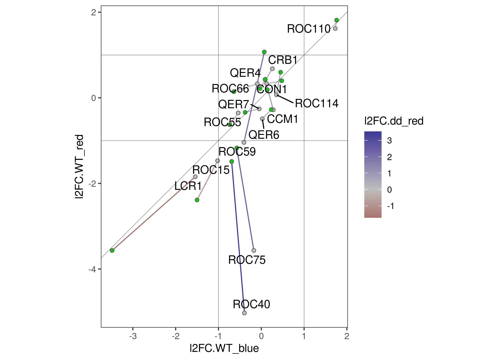

figures_manuscript
================
2024-10-17

- [run prepare_data scripts](#run-prepare_data-scripts)
- [Fig 1: PCA](#fig-1-pca)
- [Fig 2: Counts](#fig-2-counts)
  - [individual counts](#individual-counts)
- [Fig 2x: Explain data](#fig-2x-explain-data)
- [Fig 3: Volcanos](#fig-3-volcanos)
  - [a) Genotype (1)](#a-genotype-1)
  - [b): light effect (2)](#b-light-effect-2)
- [Fig 4: Overlaps](#fig-4-overlaps)
  - [Fig 4a: Venns](#fig-4a-venns)
  - [Fig 4b: Groups](#fig-4b-groups)
- [Fig. X](#fig-x)

BiocManager::install()

# run prepare_data scripts

# Fig 1: PCA

``` r
fig <- "Fig1"

# group
for (dds in dds_list) {
vsd <- vst(dds, blind=FALSE)
# colData(dds)
### PCA with top 500 genes with highest row variance 
pcaData <- plotPCA(vsd, intgroup=c("treatment", "genotype","condition"), returnData=TRUE,)
percentVar <- round(100 * attr(pcaData, "percentVar"))

g1 <- ggplot(pcaData, aes(PC1, PC2, color=treatment, shape=genotype)) +
  geom_hline(yintercept = 0, linewidth = 0.1) + 
  geom_vline(xintercept = 0, linewidth = 0.1) +
  geom_point(size=4, stroke = 1) +
  scale_shape_manual(values = c(16,21)) + 
  labs(title = "PCA plot") +
  ylab(paste0("PC1: ",percentVar[1],"% variance")) +
  xlab(paste0("PC2: ",percentVar[2],"% variance")) + 
  scale_color_manual(values = anno_colors$treatment) +
  # coord_fixed() +
  scale_x_reverse() +
  theme_bw() +
  removeGrid(x=T, y=T)
}

# pCRY
dds <- dds_list[["pcry"]]
vsd <- vst(dds, blind=FALSE)

pcaData <- plotPCA(vsd, intgroup=c("treatment", "genotype","condition"), returnData=TRUE,)
percentVar <- round(100 * attr(pcaData, "percentVar"))
g1 <- ggplot(pcaData, aes(PC2, PC1, color=treatment, shape=genotype)) +
  geom_hline(yintercept = 0, linewidth = 0.1) + 
  geom_vline(xintercept = 0, linewidth = 0.1) +
  geom_point(size=4, stroke = 1) +
  scale_shape_manual(values = c(16,21)) + 
  labs(title = "PCA plot: pCRY") +
  ylab(paste0("PC1: ",percentVar[1],"% variance")) +
  xlab(paste0("PC2: ",percentVar[2],"% variance")) + 
  scale_color_manual(values = anno_colors$treatment) +
  # coord_fixed() +
  scale_x_reverse() +
  scale_y_reverse() +
  theme_bw() +
  removeGrid(x=T, y=T)
g1

ggsave(paste(fig,"_",colData(dds)$experiment[1],"_PCA.pdf",sep=""), plot = g1,
width = 6,
height = 6)

# aCRY
dds <- dds_list[["acry"]]
vsd <- vst(dds, blind=FALSE)
pcaData <- plotPCA(vsd, intgroup=c("treatment", "genotype","condition"), returnData=TRUE,)
percentVar <- round(100 * attr(pcaData, "percentVar"))
g2 <- ggplot(pcaData, aes(PC1, PC2, color=treatment, shape=genotype)) +
  geom_hline(yintercept = 0, linewidth = 0.1) + 
  geom_vline(xintercept = 0, linewidth = 0.1) +
  geom_point(size=4, stroke = 1) +
  scale_shape_manual(values = c(16,21)) + 
  labs(title = "PCA plot: aCRY") +
  ylab(paste0("PC1: ",percentVar[1],"% variance")) +
  xlab(paste0("PC2: ",percentVar[2],"% variance")) + 
  scale_color_manual(values = anno_colors$treatment) +
  # coord_fixed() +
  scale_x_reverse() +
  theme_bw() +
  removeGrid(x=T, y=T)
g2

ggsave(paste(fig,"_",colData(dds)$experiment[1],"_PCA.pdf",sep=""), plot = g2,
width = 6,
height = 6)
```


# Fig 2: Counts

<!-- --><!-- --><!-- --><!-- --><!-- --><!-- --><!-- -->

## individual counts

``` r
ROC59 <- "Cre10.g425050"
goi <- ROC59

    d <- plotCounts(dds, gene=goi, intgroup=c("condition","experiment","genotype","treatment","clientName"), main=s,returnData=TRUE)
    colnames(d)[1] <- "counts"

gcounts <- ggplot(d, aes(x = treatment, y = counts, fill=condition, color=condition)) +
    geom_boxplot(color="black") +
    geom_point(shape=21,color="black",aes(fill=condition),position=position_dodge(width=0.75), alpha=1) +
  # geom_text_repel(aes(label=clientName)) +
    scale_fill_manual(values=group.colors) +
    scale_color_manual(values=group.colors) +
    scale_y_continuous(trans = "log2") +
    theme_bw() +
  removeGrid(x=T, y=T) +
    geom_vline(xintercept=seq(1,length(levels(all_counts$treatment))-1,1)+.5,color="grey") +

    labs(title = paste(goi," (",mcols(dds)[goi,"id.symbol"], ")", " in ",colData(dds)$experiment[1],sep = "")) +
 theme(axis.text.x = element_text(size = 10, face = "bold"),
        axis.text.y = element_text(color = "grey20", size = 8, angle = 0, hjust = 1, vjust = 0, face = "plain"),
        axis.title.x = element_text(color = "white", size = 12, angle = 0, hjust = .5, vjust = 0, face = "plain"),
        axis.title.y = element_text(color = "grey20", size = 12, angle = 90, hjust = .5, vjust = .5, face = "bold"))

gcounts
```

<!-- -->

``` r
gcounts_roc59 <- gcounts
```

# Fig 2x: Explain data

``` r
c_graphic <- png::readPNG("Contrasts.png", native = TRUE)
patchwork::wrap_elements((c_graphic))
```

<!-- -->

``` r
res_core <- list(dark = res_list$pcry$pcry_D.vs.WT_D,
             blue = res_list$pcry$pcry_BL.vs.WT_BL,
             red =res_list$pcry$pcry_R.vs.WT_R) %>% lapply(data.frame)

DEGs_comb <- bind_cols(res_core[[1]],res_core[[2]][,c(2,6)],res_core[[3]][,c(2,6)])
colnames(DEGs_comb)[c(2,6,8,9,10,11)] <- c("l2FC.dark","padj.dark","l2FC.blue","padj.blue","l2FC.red","padj.red") 


res_list[["pcry"]] %>% names()
```

    ##  [1] "WT_BL.vs.D"           "WT_R.vs.D"            "pcry_BL.vs.D"        
    ##  [4] "pcry_R.vs.D"          "pcry_D.vs.WT_D"       "pcry_BL.vs.WT_BL"    
    ##  [7] "pcry_R.vs.WT_R"       "pcry_BLvD.vs.WT_BLvD" "pcry_RvD.vs.WT_RvD"  
    ## [10] "BL+R.vs.D"            "BL.vs.D"              "R.vs.D"              
    ## [13] "pcry.vs.WT"

``` r
res_list[["pcry"]][["WT_R.vs.D"]][ROC40,c(2,6)]
```

    ## log2 fold change (MLE): treatment_red_vs_dark effect 
    ##  
    ## DataFrame with 1 row and 2 columns
    ##               log2FoldChange        padj
    ##                    <numeric>   <numeric>
    ## Cre06.g275350       -5.02701 4.30468e-83

``` r
res_list[["pcry"]][["pCRY_R.vs.D"]][ROC40,c(2,6)]
```

    ## NULL

``` r
# anno_tf
ROC59 <- "Cre10.g425050"
goi  <- ROC40  # ROC40 ROC59


results <- lapply(res_list[["pcry"]],data.frame)
l2fc <- sapply(results,"[[",goi,c(2)) %>% round(digits=2)
names(l2fc) <- paste0("l2fc.",names(l2fc))
p <- sapply(results,"[[",goi,c(6)) %>% round(digits=3)

goi_lp <- list("l2fc"=l2fc,
               "p"=p)

l2fc
```

    ##           l2fc.WT_BL.vs.D            l2fc.WT_R.vs.D         l2fc.pcry_BL.vs.D 
    ##                     -0.39                     -5.03                     -0.69 
    ##          l2fc.pcry_R.vs.D       l2fc.pcry_D.vs.WT_D     l2fc.pcry_BL.vs.WT_BL 
    ##                     -1.49                      0.62                      0.32 
    ##       l2fc.pcry_R.vs.WT_R l2fc.pcry_BLvD.vs.WT_BLvD   l2fc.pcry_RvD.vs.WT_RvD 
    ##                      4.16                     -0.30                      3.54 
    ##            l2fc.BL+R.vs.D              l2fc.BL.vs.D               l2fc.R.vs.D 
    ##                     -0.73                     -0.54                     -3.26 
    ##           l2fc.pcry.vs.WT 
    ##                      1.70

``` r
# gcounts_roc40
gcounts_roc40 + coord_cartesian(ylim = c(1,10000)) + 
  # (1.)
  geom_text(aes(x = 0.5,y = 120),
            label="1.", color="red2") +
  # "pcry_D.vs.WT_D" 
  geom_segment(
        aes(x = 0.7,y = 90, xend = 1.3,yend = 90),
        arrow = arrow(length = unit(0.03,units = "npc")),color ="red2") +
  geom_text(aes(x = 1,y = 120),
            label=goi_lp$l2fc["l2fc.pcry_D.vs.WT_D"], color="red2") +
  
    # "pcry_BL.vs.WT_BL" 
  geom_segment(
        aes(x = 1.7,y = 90, xend = 2.3,yend = 90),
        arrow = arrow(length = unit(0.03,units = "npc")),color ="red2") +
  geom_text(aes(x = 2,y = 120),
            label=goi_lp$l2fc["l2fc.pcry_BL.vs.WT_BL"], color="red2") +
  
    # "pcry_R.vs.WT_R" 
  geom_segment(
        aes(x = 2.7,y = 75, xend = 3.3,yend = 75),
        arrow = arrow(length = unit(0.03,units = "npc")),color ="red2") +
  geom_text(aes(x = 3,y = 100),
            label=goi_lp$l2fc["l2fc.pcry_R.vs.WT_R"], color="red2") +

  # (2.)  
  geom_text(aes(x = 0.5,y = 50),
            label="2.", color="green4") +
  # ""WT_BL.vs.D"" 
    geom_segment(
        aes(x = 0.7,y = 40, xend = 1.7,yend = 40),
        arrow = arrow(length = unit(0.03,units = "npc")),color ="green4") +
  geom_text(aes(x = 1,y = 55),
            label=goi_lp$l2fc["l2fc.WT_BL.vs.D"], color="green4") +
  # 3.
  geom_text(aes(x = 0.5,y = 20),
            label="3.", color="purple3") +
    # "WT_R.vs.D" 
    geom_segment(
        aes(x = 1.3,y = 35, xend = 1.7,yend = 12),
        arrow = arrow(length = unit(0.03,units = "npc")),color ="purple3") +
  geom_text(aes(x = 1.7,y = 25),
            label=goi_lp$l2fc["l2fc.pcry_BLvD.vs.WT_BLvD"], color="purple3") +
  # "pcry_BL.vs.D"
    geom_segment(
        aes(x = 1.2,y = 9, xend = 2.3,yend = 9),
        arrow = arrow(length = unit(0.03,units = "npc")),color ="green3") +
  geom_text(aes(x = 2,y = 12),
            label=goi_lp$l2fc["l2fc.pcry_BL.vs.D"], color="green3") +

    # "WT_R.vs.D" 
    geom_segment(
        aes(x = 0.7,y = 6, xend = 2.7,yend = 6),
        arrow = arrow(length = unit(0.03,units = "npc")),color ="green4") +
  geom_text(aes(x = 0.9,y = 8),
            label=goi_lp$l2fc["l2fc.WT_R.vs.D"], color="green4") +
  # "pcry_BL.vs.D" 
    geom_segment(
        aes(x = 1.2,y = 1, xend = 3.3,yend = 1),
        arrow = arrow(length = unit(0.03,units = "npc")),color ="green3") +
  geom_text(aes(x = 3,y = 1.3),
            label=goi_lp$l2fc["l2fc.pcry_R.vs.D"], color="green3") +

  
  # "pcry_BL.vs.D" 
    geom_segment(
        aes(x = 1.7,y = 5, xend = 2.3,yend = 1.3),
        arrow = arrow(length = unit(0.03,units = "npc")),color ="purple1") +
  geom_text(aes(x = 2.3,y = 2.7),
            label=goi_lp$l2fc["l2fc.pcry_RvD.vs.WT_RvD"], color="purple1") #+
```

<!-- -->

``` r
DEGs_comb[ROC40,]
```

    ##               baseMean l2FC.dark     lfcSE     stat    pvalue padj.dark symbol
    ## Cre06.g275350 4525.436 0.6158121 0.2470149 2.493016 0.0126663 0.2481123  ROC40
    ##               l2FC.blue padj.blue l2FC.red     padj.red
    ## Cre06.g275350  0.317035 0.5033338 4.157389 1.290229e-55

# Fig 3: Volcanos

## a) Genotype (1)

``` r
fig <- "Fig3"

dds <- dds_list[["pcry"]]

res_ashr_list %>% names()
```

    ## [1] "acry" "pcry"

``` r
res_ashr_list[[1]] %>% names()
```

    ##  [1] "WT_BL.vs.D"           "WT_R.vs.D"            "acry_BL.vs.D"        
    ##  [4] "acry_R.vs.D"          "acry_D.vs.WT_D"       "acry_BL.vs.WT_BL"    
    ##  [7] "acry_R.vs.WT_R"       "acry_BLvD.vs.WT_BLvD" "acry_RvD.vs.WT_RvD"  
    ## [10] "BL+R.vs.D"            "BL.vs.D"              "R.vs.D"              
    ## [13] "acry.vs.WT"

``` r
res <- res_ashr_list$pcry$pcry_R.vs.WT_R
res_n <- res_list$pcry$pcry_R.vs.WT_R

# of shrinked results
total <- subset(res, padj< 0.05) %>% nrow()
up <- subset(res, padj< 0.05 & log2FoldChange > 1) %>% nrow()
down <- subset(res, padj< 0.05 & log2FoldChange < -1) %>% nrow()

# of "true" results
total <- subset(res_n, padj< 0.05) %>% nrow()
up <- subset(res_n, padj< 0.05 & log2FoldChange > 1) %>% nrow()
down <- subset(res_n, padj< 0.05 & log2FoldChange < -1) %>% nrow()

# points outside the grid
subset(res, padj < 10^-50 | log2FoldChange > 6 | log2FoldChange < -6)
```

    ## log2 fold change (MMSE): genotype_pcry_vs_WT+genotypepcry.treatmentred effect 
    ## Wald test p-value: genotype_pcry_vs_WT+genotypepcry.treatmentred effect 
    ## DataFrame with 5 rows and 5 columns
    ##                baseMean log2FoldChange     lfcSE       pvalue         padj
    ##               <numeric>      <numeric> <numeric>    <numeric>    <numeric>
    ## Cre01.g002200   20.2489      -20.40541  9.368334           NA           NA
    ## Cre03.g800380   78.6550       22.00315  2.726709  3.18538e-16  2.61555e-13
    ## Cre06.g275350 4525.4359        4.09928  0.258053  1.74591e-59  1.29023e-55
    ## Cre09.g403367   32.3010      -17.14325 10.815078  1.35041e-06  2.97897e-04
    ## Cre16.g681351  832.7918       -4.90661  0.217733 1.22244e-114 1.80676e-110

``` r
#                 baseMean log2FoldChange     lfcSE      pvalue        padj
#               <numeric>      <numeric> <numeric>   <numeric>   <numeric>
# Cre16.g681750 2907.4406       -3.51641   0.22216 2.99151e-57 4.79270e-53
# Cre17.g802135   46.8587       36.40049   7.35075 1.00156e-08 7.64096e-06

res["Cre16.g681750","padj"] <- 10^-50
res["Cre17.g802135","log2FoldChange"] <- 6

mcols(dds_list[["pcry"]]) %>% nrow()
```

    ## [1] 16025

``` r
res %>% nrow()
```

    ## [1] 16025

``` r
volcano_red <- EnhancedVolcano(res,
    lab = mcols(dds_list[["pcry"]])[["geneSymbol"]],
    x = 'log2FoldChange',
    y = 'padj',
    col=c("grey","grey","grey",group.colors[5]),
    title = "red-light, pCRY vs. WT",
    titleLabSize = 12,
    subtitle = paste0("upregulated: ",up,", downregulated: ",down,"\n(total: ",total,")"),
#    subtitle = {},
    subtitleLabSize = 10,
    caption = NULL,
    xlim = c(-7,7),
    ylim = c(0,50),
    pCutoff = 0.05,
    FCcutoff = 1,
    maxoverlapsConnectors = 40,
    drawConnectors = TRUE,
    widthConnectors = 0.5,
    colConnectors = "grey70",
    legendLabels=c('ns','ns','ns',
      'padj < 0.05 & Log2FC > 1'),
    labSize = 4,
    axisLabSize = 12,
    legendLabSize = 12,
    legendIconSize = 4,
    gridlines.major = FALSE,
    gridlines.minor = FALSE,
    pointSize = 3
)
# volcano_red


# blue

res_ashr_list %>% names()
```

    ## [1] "acry" "pcry"

``` r
res_ashr_list[[1]] %>% names()
```

    ##  [1] "WT_BL.vs.D"           "WT_R.vs.D"            "acry_BL.vs.D"        
    ##  [4] "acry_R.vs.D"          "acry_D.vs.WT_D"       "acry_BL.vs.WT_BL"    
    ##  [7] "acry_R.vs.WT_R"       "acry_BLvD.vs.WT_BLvD" "acry_RvD.vs.WT_RvD"  
    ## [10] "BL+R.vs.D"            "BL.vs.D"              "R.vs.D"              
    ## [13] "acry.vs.WT"

``` r
res <- res_ashr_list$pcry$pcry_BL.vs.WT_BL
res_n <- res_list$pcry$pcry_BL.vs.WT_BL

# of "true" results
total <- subset(res_n, padj< 0.05) %>% nrow()
up <- subset(res_n, padj< 0.05 & log2FoldChange > 1) %>% nrow()
down <- subset(res_n, padj< 0.05 & log2FoldChange < -1) %>% nrow()

# points outside the grid

pmax <- 10^-50
l2FCmax <- 6
subset(res, padj < pmax | log2FoldChange > l2FCmax | log2FoldChange < -l2FCmax)
```

    ## log2 fold change (MMSE): genotype_pcry_vs_WT+genotypepcry.treatmentblue effect 
    ## Wald test p-value: genotype_pcry_vs_WT+genotypepcry.treatmentblue effect 
    ## DataFrame with 4 rows and 5 columns
    ##                baseMean log2FoldChange     lfcSE      pvalue        padj
    ##               <numeric>      <numeric> <numeric>   <numeric>   <numeric>
    ## Cre01.g002200   20.2489      -24.06288  7.771468          NA          NA
    ## Cre05.g241653  363.4087      -25.28452  4.764625 1.10727e-08 2.37181e-06
    ## Cre07.g329750 3682.6278       -2.48683  0.119025 2.84342e-98 4.20258e-94
    ## Cre09.g801087  138.4487      -23.81100  2.655027 1.96659e-19 1.81664e-16

``` r
# res[res$log2FoldChange > l2FCmax,]$log2FoldChange <- l2FCmax
res[res$log2FoldChange < -l2FCmax,]$log2FoldChange <- -l2FCmax

x <- res$padj
res[(x < pmax) & (!is.na(x)),]$padj <- pmax
subset(res, padj < pmax | log2FoldChange > l2FCmax | log2FoldChange < -l2FCmax)
```

    ## log2 fold change (MMSE): genotype_pcry_vs_WT+genotypepcry.treatmentblue effect 
    ## Wald test p-value: genotype_pcry_vs_WT+genotypepcry.treatmentblue effect 
    ## DataFrame with 0 rows and 5 columns

``` r
mcols(dds_list[["pcry"]]) %>% nrow()
```

    ## [1] 16025

``` r
res %>% nrow()
```

    ## [1] 16025

``` r
volcano_blue <- EnhancedVolcano(res,
    lab = mcols(dds_list[["pcry"]])[["geneSymbol"]],
    x = 'log2FoldChange',
    y = 'padj',
    col=c("grey","grey","grey",group.colors[3]),
    title = "blue-light, pCRY vs. WT",
    titleLabSize = 12,
    subtitle = paste0("upregulated: ",up,", downregulated: ",down,"\n(total: ",total,")"),
#    subtitle = {},
    subtitleLabSize = 10,
    caption = NULL,
    xlim = c(-7,7),
    ylim = c(0,50),
    pCutoff = 0.05,
    FCcutoff = 1,
    maxoverlapsConnectors = 40,
    drawConnectors = TRUE,
    widthConnectors = 0.5,
    colConnectors = "grey70",
    legendLabels=c('ns','ns','ns',
      'padj < 0.05 & Log2FC > 1'),
    labSize = 4,
    axisLabSize = 12,
    legendLabSize = 12,
    legendIconSize = 4,
    gridlines.major = FALSE,
    gridlines.minor = FALSE,
    pointSize = 3
)
# volcano_blue


# dark

res_ashr_list %>% names()
```

    ## [1] "acry" "pcry"

``` r
res_ashr_list[[2]] %>% names()
```

    ##  [1] "WT_BL.vs.D"           "WT_R.vs.D"            "pcry_BL.vs.D"        
    ##  [4] "pcry_R.vs.D"          "pcry_D.vs.WT_D"       "pcry_BL.vs.WT_BL"    
    ##  [7] "pcry_R.vs.WT_R"       "pcry_BLvD.vs.WT_BLvD" "pcry_RvD.vs.WT_RvD"  
    ## [10] "BL+R.vs.D"            "BL.vs.D"              "R.vs.D"              
    ## [13] "pcry.vs.WT"

``` r
res <- res_ashr_list$pcry$pcry_D.vs.WT_D
res_n <- res_list$pcry$pcry_D.vs.WT_D

# of "true" results
total <- subset(res_n, padj< 0.05) %>% nrow()
up <- subset(res_n, padj< 0.05 & log2FoldChange > 1) %>% nrow()
down <- subset(res_n, padj< 0.05 & log2FoldChange < -1) %>% nrow()

# points outside the grid

pmax <- 10^-50
l2FCmax <- 6
subset(res, padj < pmax | log2FoldChange > l2FCmax | log2FoldChange < -l2FCmax)
```

    ## log2 fold change (MMSE): genotype_pcry_vs_WT effect 
    ## Wald test p-value: genotype_pcry_vs_WT effect 
    ## DataFrame with 5 rows and 5 columns
    ##                baseMean log2FoldChange     lfcSE       pvalue         padj
    ##               <numeric>      <numeric> <numeric>    <numeric>    <numeric>
    ## Cre07.g329750 3682.6278       -2.57541  0.119550 1.19696e-105 9.58823e-102
    ## Cre09.g801064  331.7958      -19.94522  9.784809           NA           NA
    ## Cre12.g486400  256.7333       -3.74956  0.212386  2.51477e-73  1.34297e-69
    ## Cre16.g681351  832.7918       -5.20782  0.226776 3.67114e-119 5.88154e-115
    ## Cre17.g802135   46.8587       18.23852  2.998280  5.37694e-10  2.53365e-07

``` r
res[res$log2FoldChange > l2FCmax,]$log2FoldChange <- l2FCmax
res[res$log2FoldChange < -l2FCmax,]$log2FoldChange <- -l2FCmax
res[subset(res, padj < pmax) %>% rownames(),]$padj <- pmax

subset(res, padj < pmax | log2FoldChange > l2FCmax | log2FoldChange < -l2FCmax)
```

    ## log2 fold change (MMSE): genotype_pcry_vs_WT effect 
    ## Wald test p-value: genotype_pcry_vs_WT effect 
    ## DataFrame with 0 rows and 5 columns

``` r
mcols(dds_list[["pcry"]]) %>% nrow()
```

    ## [1] 16025

``` r
res %>% nrow()
```

    ## [1] 16025

``` r
volcano_dark <- EnhancedVolcano(res,
    lab = mcols(dds_list[["pcry"]])[["geneSymbol"]],
    x = 'log2FoldChange',
    y = 'padj',
    col=c("grey","grey","grey",group.colors[1]),
    title = "dark, pCRY vs. WT",
    titleLabSize = 12,
    subtitle = paste0("upregulated: ",up,", downregulated: ",down,"\n(total: ",total,")"),
#    subtitle = {},
    subtitleLabSize = 10,
    caption = NULL,
    xlim = c(-7,7),
    ylim = c(0,50),
    pCutoff = 0.05,
    FCcutoff = 1,
    maxoverlapsConnectors = 40,
    drawConnectors = TRUE,
    widthConnectors = 0.5,
    colConnectors = "grey70",
    legendLabels=c('ns','ns','ns',
      'padj < 0.05 & Log2FC > 1'),
    labSize = 4,
    axisLabSize = 12,
    legendLabSize = 12,
    legendIconSize = 4,
    gridlines.major = FALSE,
    gridlines.minor = FALSE,
    pointSize = 3
)
# volcano_dark

volcanos_all <- volcano_dark + volcano_blue + volcano_red +
  plot_layout(guides = "collect", axes="collect", axis_titles="collect") & 
  theme(legend.position = 'none', axis.title=element_text(size=12))
volcanos_all
```

<!-- -->

``` r
ggsave(paste(fig,"_",colData(dds)$experiment[1],"_Volcanos.pdf",sep=""), plot = volcanos_all,
width = 10,
height = 6)
```

## b): light effect (2)

``` r
fig <- "Fig3"

dds <- dds_list[["pcry"]]

res_ashr_list %>% names()
```

    ## [1] "acry" "pcry"

``` r
res_ashr_list[[2]] %>% names()
```

    ##  [1] "WT_BL.vs.D"           "WT_R.vs.D"            "pcry_BL.vs.D"        
    ##  [4] "pcry_R.vs.D"          "pcry_D.vs.WT_D"       "pcry_BL.vs.WT_BL"    
    ##  [7] "pcry_R.vs.WT_R"       "pcry_BLvD.vs.WT_BLvD" "pcry_RvD.vs.WT_RvD"  
    ## [10] "BL+R.vs.D"            "BL.vs.D"              "R.vs.D"              
    ## [13] "pcry.vs.WT"

``` r
res <- res_ashr_list$pcry$WT_R.vs.D
res_n <- res_list$pcry$WT_R.vs.D

# of shrinked results
total <- subset(res, padj< 0.05) %>% nrow()
up <- subset(res, padj< 0.05 & log2FoldChange > 1) %>% nrow()
down <- subset(res, padj< 0.05 & log2FoldChange < -1) %>% nrow()

# of "true" results
total <- subset(res_n, padj< 0.05) %>% nrow()
up <- subset(res_n, padj< 0.05 & log2FoldChange > 1) %>% nrow()
down <- subset(res_n, padj< 0.05 & log2FoldChange < -1) %>% nrow()

# points outside the grid
subset(res, padj < 10^-50 | log2FoldChange > 6 | log2FoldChange < -6)
```

    ## log2 fold change (MMSE): treatment_red_vs_dark effect 
    ## Wald test p-value: treatment_red_vs_dark effect 
    ## DataFrame with 38 rows and 5 columns
    ##                 baseMean log2FoldChange     lfcSE       pvalue         padj
    ##                <numeric>      <numeric> <numeric>    <numeric>    <numeric>
    ## Cre01.g016300    7677.68        1.17714 0.0769910  3.05679e-54  1.42641e-51
    ## Cre01.g016600   13730.87        4.40176 0.1699839 9.90223e-153 3.81211e-149
    ## Cre01.g017500    2433.54        1.62017 0.1060704  3.67753e-55  1.76970e-52
    ## Cre02.g093750    6948.16        2.90015 0.1875823  1.06476e-55  5.28909e-53
    ## Cre02.g095077    8153.90        2.08437 0.0989619 4.07627e-101  8.96722e-98
    ## ...                  ...            ...       ...          ...          ...
    ## Cre16.g662600  6340.3350       -2.78692  0.176655  7.35446e-58  4.19449e-55
    ## Cre17.g707350  1050.4887       -3.67433  0.203043  4.22282e-76  4.64480e-73
    ## Cre17.g726850 10982.6929        2.15827  0.129868  1.40651e-64  1.13994e-61
    ## Cre17.g802135    46.8587       19.82665  2.966077  8.58308e-12  2.57643e-10
    ## Cre26.g756747  1667.3446       -3.13814  0.178305  3.20702e-71  3.08655e-68

``` r
#                 baseMean log2FoldChange     lfcSE      pvalue        padj
#               <numeric>      <numeric> <numeric>   <numeric>   <numeric>
# Cre16.g681750 2907.4406       -3.51641   0.22216 2.99151e-57 4.79270e-53
# Cre17.g802135   46.8587       36.40049   7.35075 1.00156e-08 7.64096e-06

res["Cre16.g681750","padj"] <- 10^-50
res["Cre17.g802135","log2FoldChange"] <- 6

mcols(dds_list[["pcry"]]) %>% nrow()
```

    ## [1] 16025

``` r
res %>% nrow()
```

    ## [1] 16025

``` r
volcano_WT_red <- EnhancedVolcano(res,
    lab = mcols(dds_list[["pcry"]])[["geneSymbol"]],
    x = 'log2FoldChange',
    y = 'padj',
    col=c("grey","grey","grey",group.colors[5]),
    title = "WT_R.vs.D",
    titleLabSize = 12,
    subtitle = paste0("upregulated: ",up,", downregulated: ",down,"\n(total: ",total,")"),
#    subtitle = {},
    subtitleLabSize = 10,
    caption = NULL,
    xlim = c(-7,7),
    ylim = c(0,100),
    pCutoff = 0.05,
    FCcutoff = 1,
    maxoverlapsConnectors = 40,
    drawConnectors = TRUE,
    widthConnectors = 0.5,
    colConnectors = "grey70",
    legendLabels=c('ns','ns','ns',
      'padj < 0.05 & Log2FC > 1'),
    labSize = 4,
    axisLabSize = 12,
    legendLabSize = 12,
    legendIconSize = 4,
    gridlines.major = FALSE,
    gridlines.minor = FALSE,
    pointSize = 3
)
# volcano_red


# blue

res_ashr_list %>% names()
```

    ## [1] "acry" "pcry"

``` r
res_ashr_list[[1]] %>% names()
```

    ##  [1] "WT_BL.vs.D"           "WT_R.vs.D"            "acry_BL.vs.D"        
    ##  [4] "acry_R.vs.D"          "acry_D.vs.WT_D"       "acry_BL.vs.WT_BL"    
    ##  [7] "acry_R.vs.WT_R"       "acry_BLvD.vs.WT_BLvD" "acry_RvD.vs.WT_RvD"  
    ## [10] "BL+R.vs.D"            "BL.vs.D"              "R.vs.D"              
    ## [13] "acry.vs.WT"

``` r
res <- res_ashr_list$pcry$pcry_R.vs.D
res_n <- res_list$pcry$pcry_R.vs.D

# of "true" results
total <- subset(res_n, padj< 0.05) %>% nrow()
up <- subset(res_n, padj< 0.05 & log2FoldChange > 1) %>% nrow()
down <- subset(res_n, padj< 0.05 & log2FoldChange < -1) %>% nrow()

# points outside the grid

pmax <- 10^-100
l2FCmax <- 6
subset(res, padj < pmax | log2FoldChange > l2FCmax | log2FoldChange < -l2FCmax)
```

    ## log2 fold change (MMSE): treatment_red_vs_dark+genotypepcry.treatmentred effect 
    ## Wald test p-value: treatment_red_vs_dark+genotypepcry.treatmentred effect 
    ## DataFrame with 7 rows and 5 columns
    ##                 baseMean log2FoldChange     lfcSE       pvalue         padj
    ##                <numeric>      <numeric> <numeric>    <numeric>    <numeric>
    ## Cre01.g016600 13730.8707        3.68424 0.1604432 1.54708e-120 6.07617e-117
    ## Cre07.g320400 11927.5346        5.45573 0.1709256 2.66454e-225 1.39533e-221
    ## Cre07.g320450 27547.9153        4.78701 0.1349545 1.17031e-277 1.83856e-273
    ## Cre09.g403367    32.3010      -25.94189 6.8152715  6.78135e-08  1.35369e-06
    ## Cre10.g424550  8582.3054       -1.75316 0.0796985 1.08299e-108 3.40274e-105
    ## Cre13.g603550  3111.9323       -5.26266 0.1498718 6.98677e-272 5.48811e-268
    ## Cre16.g801923    21.0442      -26.79298 6.2230303  3.82198e-08  7.86937e-07

``` r
# res[res$log2FoldChange > l2FCmax,]$log2FoldChange <- l2FCmax
res[res$log2FoldChange < -l2FCmax,]$log2FoldChange <- -l2FCmax
x <- res$padj
res[(x < pmax) & (!is.na(x)),]$padj <- pmax

subset(res, padj < pmax | log2FoldChange > l2FCmax | log2FoldChange < -l2FCmax)
```

    ## log2 fold change (MMSE): treatment_red_vs_dark+genotypepcry.treatmentred effect 
    ## Wald test p-value: treatment_red_vs_dark+genotypepcry.treatmentred effect 
    ## DataFrame with 0 rows and 5 columns

``` r
mcols(dds_list[["pcry"]]) %>% nrow()
```

    ## [1] 16025

``` r
res %>% nrow()
```

    ## [1] 16025

``` r
volcano_pcry_R <- EnhancedVolcano(res,
    lab = mcols(dds_list[["pcry"]])[["geneSymbol"]],
    x = 'log2FoldChange',
    y = 'padj',
    col=c("grey","grey","grey",group.colors[6]),
    title = "pcry_R.vs.D",
    titleLabSize = 12,
    subtitle = paste0("upregulated: ",up,", downregulated: ",down,"\n(total: ",total,")"),
#    subtitle = {},
    subtitleLabSize = 10,
    caption = NULL,
    xlim = c(-7,7),
    ylim = c(0,100),
    pCutoff = 0.05,
    FCcutoff = 1,
    maxoverlapsConnectors = 40,
    drawConnectors = TRUE,
    widthConnectors = 0.5,
    colConnectors = "grey70",
    legendLabels=c('ns','ns','ns',
      'padj < 0.05 & Log2FC > 1'),
    labSize = 4,
    axisLabSize = 12,
    legendLabSize = 12,
    legendIconSize = 4,
    gridlines.major = FALSE,
    gridlines.minor = FALSE,
    pointSize = 3
)
# volcano_blue


# WT BLUE

res_ashr_list %>% names()
```

    ## [1] "acry" "pcry"

``` r
res_ashr_list[[2]] %>% names()
```

    ##  [1] "WT_BL.vs.D"           "WT_R.vs.D"            "pcry_BL.vs.D"        
    ##  [4] "pcry_R.vs.D"          "pcry_D.vs.WT_D"       "pcry_BL.vs.WT_BL"    
    ##  [7] "pcry_R.vs.WT_R"       "pcry_BLvD.vs.WT_BLvD" "pcry_RvD.vs.WT_RvD"  
    ## [10] "BL+R.vs.D"            "BL.vs.D"              "R.vs.D"              
    ## [13] "pcry.vs.WT"

``` r
res <- res_ashr_list$pcry$WT_BL.vs.D
res_n <- res_list$pcry$WT_BL.vs.D

# of "true" results
total <- subset(res_n, padj< 0.05) %>% nrow()
up <- subset(res_n, padj< 0.05 & log2FoldChange > 1) %>% nrow()
down <- subset(res_n, padj< 0.05 & log2FoldChange < -1) %>% nrow()

# points outside the grid

pmax <- 10^-100
l2FCmax <- 6
subset(res, padj < pmax | log2FoldChange > l2FCmax | log2FoldChange < -l2FCmax)
```

    ## log2 fold change (MMSE): treatment_blue_vs_dark effect 
    ## Wald test p-value: treatment_blue_vs_dark effect 
    ## DataFrame with 9 rows and 5 columns
    ##                 baseMean log2FoldChange     lfcSE       pvalue         padj
    ##                <numeric>      <numeric> <numeric>    <numeric>    <numeric>
    ## Cre01.g016600 13730.8707       10.19595 0.1656257  0.00000e+00  0.00000e+00
    ## Cre01.g016750  3828.5743        9.72100 0.3733584 7.75434e-150 1.49261e-146
    ## Cre06.g310500  1368.6234        3.07574 0.1131317 1.43884e-164 3.16525e-161
    ## Cre07.g320400 11927.5346        9.46662 0.1740869  0.00000e+00  0.00000e+00
    ## Cre07.g320450 27547.9153        7.24167 0.1352755  0.00000e+00  0.00000e+00
    ## Cre10.g424550  8582.3054       -2.61402 0.0800271 1.34826e-235 3.46031e-232
    ## Cre13.g603550  3111.9323       -5.02962 0.1474800 1.03085e-260 3.17482e-257
    ## Cre17.g740950 15530.0821        2.59406 0.0753998 5.71219e-261 2.19905e-257
    ## Cre17.g802135    46.8587       16.58446 2.9407018  7.06997e-10  2.37190e-08

``` r
res[res$log2FoldChange > l2FCmax,]$log2FoldChange <- l2FCmax
# res[res$log2FoldChange < -l2FCmax,]$log2FoldChange <- -l2FCmax
res[subset(res, padj < pmax) %>% rownames(),]$padj <- pmax

subset(res, padj < pmax | log2FoldChange > l2FCmax | log2FoldChange < -l2FCmax)
```

    ## log2 fold change (MMSE): treatment_blue_vs_dark effect 
    ## Wald test p-value: treatment_blue_vs_dark effect 
    ## DataFrame with 0 rows and 5 columns

``` r
mcols(dds_list[["pcry"]]) %>% nrow()
```

    ## [1] 16025

``` r
res %>% nrow()
```

    ## [1] 16025

``` r
volcano_WT_BL <- EnhancedVolcano(res,
    lab = mcols(dds_list[["pcry"]])[["geneSymbol"]],
    x = 'log2FoldChange',
    y = 'padj',
    col=c("grey","grey","grey",group.colors[3]),
    title = "WT_BL.vs.D",
    titleLabSize = 12,
    subtitle = paste0("upregulated: ",up,", downregulated: ",down,"\n(total: ",total,")"),
#    subtitle = {},
    subtitleLabSize = 10,
    caption = NULL,
    xlim = c(-7,7),
    ylim = c(0,100),
    pCutoff = 0.05,
    FCcutoff = 1,
    maxoverlapsConnectors = 40,
    drawConnectors = TRUE,
    widthConnectors = 0.5,
    colConnectors = "grey70",
    legendLabels=c('ns','ns','ns',
      'padj < 0.05 & Log2FC > 1'),
    labSize = 4,
    axisLabSize = 12,
    legendLabSize = 12,
    legendIconSize = 4,
    gridlines.major = FALSE,
    gridlines.minor = FALSE,
    pointSize = 3
)


# pcry BLUE

res_ashr_list %>% names()
```

    ## [1] "acry" "pcry"

``` r
res_ashr_list[[2]] %>% names()
```

    ##  [1] "WT_BL.vs.D"           "WT_R.vs.D"            "pcry_BL.vs.D"        
    ##  [4] "pcry_R.vs.D"          "pcry_D.vs.WT_D"       "pcry_BL.vs.WT_BL"    
    ##  [7] "pcry_R.vs.WT_R"       "pcry_BLvD.vs.WT_BLvD" "pcry_RvD.vs.WT_RvD"  
    ## [10] "BL+R.vs.D"            "BL.vs.D"              "R.vs.D"              
    ## [13] "pcry.vs.WT"

``` r
res <- res_ashr_list$pcry$pcry_BL.vs.D
res_n <- res_list$pcry$pcry_BL.vs.D

# of "true" results
total <- subset(res_n, padj< 0.05) %>% nrow()
up <- subset(res_n, padj< 0.05 & log2FoldChange > 1) %>% nrow()
down <- subset(res_n, padj< 0.05 & log2FoldChange < -1) %>% nrow()

# points outside the grid

pmax <- 10^-100
l2FCmax <- 6
subset(res, padj < pmax | log2FoldChange > l2FCmax | log2FoldChange < -l2FCmax)
```

    ## log2 fold change (MMSE): treatment_blue_vs_dark+genotypepcry.treatmentblue effect 
    ## Wald test p-value: treatment_blue_vs_dark+genotypepcry.treatmentblue effect 
    ## DataFrame with 13 rows and 5 columns
    ##                 baseMean log2FoldChange     lfcSE       pvalue         padj
    ##                <numeric>      <numeric> <numeric>    <numeric>    <numeric>
    ## Cre01.g016600 13730.8707        9.55129  0.155823  0.00000e+00  0.00000e+00
    ## Cre01.g016750  3828.5743        9.94452  0.379418 6.24753e-153 1.11213e-149
    ## Cre03.g198975    18.0517      -21.07788  8.442224  6.31458e-07  1.07395e-05
    ## Cre05.g241653   363.4087      -21.77797  5.792865  1.42370e-07  2.71214e-06
    ## Cre06.g310500  1368.6234        3.26500  0.117149 1.74556e-173 3.49571e-170
    ## ...                  ...            ...       ...          ...          ...
    ## Cre10.g424550    8582.31       -2.24821 0.0803812 6.40256e-175 1.46536e-171
    ## Cre13.g603550    3111.93       -5.63190 0.1544875 2.60456e-295 1.04319e-291
    ## Cre16.g678900    1010.84       -4.11795 0.1819241 6.57596e-117 1.05354e-113
    ## Cre16.g681750    2907.44        3.14588 0.0992670 5.37126e-223 1.43422e-219
    ## Cre17.g740950   15530.08        2.43230 0.0756135 6.06259e-230 1.94258e-226

``` r
res[res$log2FoldChange > l2FCmax,]$log2FoldChange <- l2FCmax
res[res$log2FoldChange < -l2FCmax,]$log2FoldChange <- -l2FCmax
res[subset(res, padj < pmax) %>% rownames(),]$padj <- pmax

subset(res, padj < pmax | log2FoldChange > l2FCmax | log2FoldChange < -l2FCmax)
```

    ## log2 fold change (MMSE): treatment_blue_vs_dark+genotypepcry.treatmentblue effect 
    ## Wald test p-value: treatment_blue_vs_dark+genotypepcry.treatmentblue effect 
    ## DataFrame with 0 rows and 5 columns

``` r
mcols(dds_list[["pcry"]]) %>% nrow()
```

    ## [1] 16025

``` r
res %>% nrow()
```

    ## [1] 16025

``` r
volcano_pcry_BL <- EnhancedVolcano(res,
    lab = mcols(dds_list[["pcry"]])[["geneSymbol"]],
    x = 'log2FoldChange',
    y = 'padj',
    col=c("grey","grey","grey",group.colors[4]),
    title = "pcry_BL.vs.D",
    titleLabSize = 12,
    subtitle = paste0("upregulated: ",up,", downregulated: ",down,"\n(total: ",total,")"),
#    subtitle = {},
    subtitleLabSize = 10,
    caption = NULL,
    xlim = c(-7,7),
    ylim = c(0,100),
    pCutoff = 0.05,
    FCcutoff = 1,
    maxoverlapsConnectors = 40,
    drawConnectors = TRUE,
    widthConnectors = 0.5,
    colConnectors = "grey70",
    legendLabels=c('ns','ns','ns',
      'padj < 0.05 & Log2FC > 1'),
    labSize = 4,
    axisLabSize = 12,
    legendLabSize = 12,
    legendIconSize = 4,
    gridlines.major = FALSE,
    gridlines.minor = FALSE,
    pointSize = 3
)


volcanos_2 <- (volcano_WT_BL + volcano_WT_red) /  (volcano_pcry_BL + volcano_pcry_R) +
  plot_layout(guides = "collect", axes="collect", axis_titles="collect") & 
  theme(legend.position = 'none', axis.title=element_text(size=12))
volcanos_2
```

<!-- -->

``` r
# ggsave(paste(fig,"_",colData(dds)$experiment[1],"_Volcanos.pdf",sep=""), plot = volcanos_all,
# width = 10,
# height = 6)
```

# Fig 4: Overlaps

## Fig 4a: Venns

``` r
fig <- "Fig4"

res_list[["pcry"]] %>% names()
```

    ##  [1] "WT_BL.vs.D"           "WT_R.vs.D"            "pcry_BL.vs.D"        
    ##  [4] "pcry_R.vs.D"          "pcry_D.vs.WT_D"       "pcry_BL.vs.WT_BL"    
    ##  [7] "pcry_R.vs.WT_R"       "pcry_BLvD.vs.WT_BLvD" "pcry_RvD.vs.WT_RvD"  
    ## [10] "BL+R.vs.D"            "BL.vs.D"              "R.vs.D"              
    ## [13] "pcry.vs.WT"

``` r
#  "pcry_D.vs.WT_D"       "pcry_BL.vs.WT_BL"     "pcry_R.vs.WT_R"      
DEGs <- list(dark = res_list$pcry$pcry_D.vs.WT_D %>% subset(padj < 0.05 & (log2FoldChange > 1 | log2FoldChange < -1 )),
             blue = res_list$pcry$pcry_BL.vs.WT_BL %>% subset(padj < 0.05 & (log2FoldChange > 1 | log2FoldChange < -1 )),
             red =res_list$pcry$pcry_R.vs.WT_R %>% subset(padj < 0.05 & (log2FoldChange > 1 | log2FoldChange < -1 )))
DEGs <- lapply(DEGs,data.frame)
DEGs_genes <- lapply(DEGs,rownames)

venn.ol <- calculate.overlap(DEGs_genes)
venn.ol %>% lapply(length)
```

    ## $a5
    ## [1] 21
    ## 
    ## $a2
    ## [1] 16
    ## 
    ## $a4
    ## [1] 7
    ## 
    ## $a6
    ## [1] 22
    ## 
    ## $a1
    ## [1] 84
    ## 
    ## $a3
    ## [1] 162
    ## 
    ## $a7
    ## [1] 26

``` r
input_list <- DEGs_genes

plt <- venn.diagram(
    x = input_list,
    inverted=TRUE,
    # total.population = TRUE,
    filename = NULL,
    fontfamily ="Arial",
    lwd = 2,
    lty = 'blank',
    fill = group.colors[c(2,4,6)],
    category.names = paste0(names(input_list),"\n(",lapply(input_list,length),")"),
#    cat.col=cols2d[c(1,2)],
    cat.fontface = "bold",
    cat.fontfamily = "arial",
#    cat.pos = c(+30,-30),
#    cat.dist = c(0.12, 0.12),
    disable.logging = TRUE
)

wrap_elements(plt) # + plot_annotation(caption = paste0("pCRY"))
```

<!-- -->

## Fig 4b: Groups

``` r
res_core <- list(dark = res_list$pcry$pcry_D.vs.WT_D,
             blue = res_list$pcry$pcry_BL.vs.WT_BL,
             red =res_list$pcry$pcry_R.vs.WT_R) %>% lapply(data.frame)

DEGs_comb <- bind_cols(res_core[[1]],res_core[[2]][,c(2,6)],res_core[[3]][,c(2,6)])
colnames(DEGs_comb)[c(2,6,8,9,10,11)] <- c("l2FC.dark","padj.dark","l2FC.blue","padj.blue","l2FC.red","padj.red") 

DEGs_genes["dark"]
```

    ## $dark
    ##   [1] "Cre01.g001700" "Cre01.g004157" "Cre01.g009050" "Cre01.g009101"
    ##   [5] "Cre01.g026750" "Cre01.g032700" "Cre01.g035350" "Cre01.g042700"
    ##   [9] "Cre01.g052150" "Cre01.g800076" "Cre01.g800077" "Cre01.g800078"
    ##  [13] "Cre02.g093600" "Cre02.g095151" "Cre02.g096250" "Cre02.g105250"
    ##  [17] "Cre02.g108050" "Cre02.g117410" "Cre02.g141695" "Cre02.g141986"
    ##  [21] "Cre02.g143347" "Cre02.g143352" "Cre03.g163150" "Cre03.g175050"
    ##  [25] "Cre03.g175100" "Cre03.g199050" "Cre03.g199800" "Cre03.g205950"
    ##  [29] "Cre04.g214321" "Cre04.g228950" "Cre05.g241202" "Cre05.g246900"
    ##  [33] "Cre05.g247250" "Cre06.g258600" "Cre06.g263550" "Cre06.g269550"
    ##  [37] "Cre06.g269650" "Cre06.g270000" "Cre06.g285001" "Cre06.g293100"
    ##  [41] "Cre06.g295650" "Cre06.g296800" "Cre06.g301750" "Cre06.g800687"
    ##  [45] "Cre06.g800688" "Cre06.g800711" "Cre07.g325718" "Cre07.g329750"
    ##  [49] "Cre07.g337100" "Cre07.g800816" "Cre07.g800821" "Cre08.g364351"
    ##  [53] "Cre09.g398400" "Cre09.g399400" "Cre09.g412700" "Cre09.g800983"
    ##  [57] "Cre10.g425050" "Cre10.g428433" "Cre10.g435400" "Cre10.g447700"
    ##  [61] "Cre10.g447850" "Cre10.g458850" "Cre11.g801242" "Cre11.g801313"
    ##  [65] "Cre12.g486400" "Cre12.g497500" "Cre12.g513650" "Cre12.g514400"
    ##  [69] "Cre12.g517681" "Cre12.g534945" "Cre12.g542150" "Cre12.g801353"
    ##  [73] "Cre12.g801361" "Cre12.g801375" "Cre12.g801412" "Cre12.g801442"
    ##  [77] "Cre13.g572950" "Cre13.g587350" "Cre13.g587400" "Cre13.g588950"
    ##  [81] "Cre13.g603500" "Cre13.g605500" "Cre13.g801516" "Cre13.g801530"
    ##  [85] "Cre14.g615550" "Cre14.g626600" "Cre14.g631900" "Cre15.g801759"
    ##  [89] "Cre15.g801777" "Cre15.g801848" "Cre15.g801853" "Cre16.g657100"
    ##  [93] "Cre16.g661750" "Cre16.g661850" "Cre16.g677750" "Cre16.g678900"
    ##  [97] "Cre16.g681351" "Cre16.g681690" "Cre16.g681750" "Cre16.g686285"
    ## [101] "Cre16.g694250" "Cre17.g696900" "Cre17.g700450" "Cre17.g716350"
    ## [105] "Cre17.g723000" "Cre17.g724650" "Cre17.g725750" "Cre17.g733850"
    ## [109] "Cre17.g738300" "Cre17.g802106" "Cre17.g802135" "Cre18.g748097"
    ## [113] "Cre24.g755897" "Cre24.g755997" "CreCp.g802273" "CreCp.g802274"
    ## [117] "CreCp.g802288" "CreCp.g802299" "CreCp.g802305" "CreCp.g802306"
    ## [121] "CreCp.g802310" "CreCp.g802311" "CreCp.g802313" "CreCp.g802317"
    ## [125] "CreCp.g802321" "CreCp.g802323" "CreCp.g802324" "CreCp.g802330"

``` r
blue_red_genes <- unlist(DEGs_genes[c("blue","red")]) %>% unique()

non_sig <- data.frame(x = c(-9, 0, 9), y = c(20, 0.5, 20))

DEGs_comb$sig
```

    ## NULL

``` r
gg_all <- ggplot(DEGs_comb, aes(x=l2FC.blue, y=l2FC.red, label=symbol)) + # color=group, fill=group 
  geom_point(shape=21) +
  geom_hline(yintercept = c(-1,1), linewidth = 0.1) + 
  geom_vline(xintercept = c(-1,1), linewidth = 0.1) +
  coord_cartesian(xlim=c(-10,10),ylim = c(-10,10)) +
  geom_text_repel(size=2, max.overlaps = 20) +
  theme_bw() +
  removeGrid(x=T, y=T)
gg_all

gg_br <- ggplot(DEGs_comb[blue_red_genes,], aes(x=l2FC.blue, y=l2FC.red, label=symbol)) + # color=group, fill=group 
  geom_point(shape=21) +
  geom_text_repel(size=3) +
  coord_cartesian(xlim=c(-10,10),ylim = c(-10,10)) +
  theme_bw() +
  removeGrid(x=T, y=T)
gg_br

red_specific <- DEGs_comb %>% subset(l2FC.blue < 1 & l2FC.blue > -1 & (l2FC.red > 0.5 | l2FC.red < -0.5) & padj.red < 0.05) %>% arrange(l2FC.red)

goi <- "Cre03.g192050"


# single gene
d <- plotCounts(dds, gene=goi, intgroup=c("condition","experiment","genotype","treatment"), main=s,returnData=TRUE)
colnames(d)[1] <- "counts"

gcounts <- ggplot(d, aes(x = treatment, y = counts, fill=condition, color=condition)) +
    geom_boxplot(color="black") +
    geom_point(shape=21,color="black",aes(fill=condition),position=position_dodge(width=0.75), alpha=1) +
  # geom_text_repel(aes(label=clientName)) +
    scale_fill_manual(values=group.colors) +
    scale_color_manual(values=group.colors) +
    scale_y_continuous(trans = "log2") +
    theme_bw() +
    removeGrid(x=T, y=T) +
    geom_vline(xintercept=seq(1,length(levels(all_counts$treatment))-1,1)+.5,color="grey") +
    labs(title = paste(mcols(dds)[goi,]$symbol," in ",colData(dds)$experiment[1],sep = "")) +
    theme(axis.text.x = element_text(size = 10, face = "bold"),
    axis.text.y = element_text(color = "grey20", size = 8, angle = 0, hjust = 1, vjust = 0, face = "plain"),
    axis.title.x = element_text(color = "white", size = 12, angle = 0, hjust = .5, vjust = 0, face = "plain"),
    axis.title.y = element_text(color = "grey20", size = 12, angle = 90, hjust = .5, vjust = .5, face = "bold"))
gcounts
```



# Fig. X

``` r
p_new2 <- ggplot(deg_table, aes(x=XX.log2FC, y=XY.log2FC,color=group, fill=group)) + 
  geom_polygon(data = xyup, aes(x=x,y=y),color=cols2l[2],fill=cols2l[2], alpha=0.2) +
  geom_polygon(data = xydo, aes(x=x,y=y),color=cols2l[2],fill=cols2l[2], alpha=0.8) +
  geom_polygon(data = xxdo, aes(x=x,y=y),color=cols2l[1],fill=cols2l[1], alpha=0.8) +
  geom_polygon(data = xxup, aes(x=x,y=y),color=cols2l[1],fill=cols2l[1], alpha=0.2) +
  annotate("text", x= text$x,y= text$y,label = paste(text$label,text$size,sep="\n"), color=text$color,size=3 , fontface="bold") +
  geom_hline(yintercept = 0, linewidth = 0.1) + 
  geom_vline(xintercept = 0, linewidth = 0.1) +
  geom_point(shape=21) + 
  scale_color_manual(values=alpha(c(cols2d[1],cols2d[1], cols2d[2],cols2d[2],rep(colsp,2),rep(colsap,2)),0.8)) +
  scale_fill_manual(values=alpha(c(cols2d[1],cols2d[1], cols2d[2],cols2d[2],rep(colsp,2),rep(colsap,2)),0.3)) +
#  scale_color_manual(values = text$color) +
  coord_cartesian(xlim=c(-10,10),ylim = c(-10,10)) +
  theme_bw() +
  removeGrid(x=T, y=T)

p_new2 + scale_fill_manual(values=c(cols2d[1],cols2d[1], cols2d[2],cols2d[2],alpha(c(rep(colsp,2),rep(colsap,2)),0.3))) 
```
